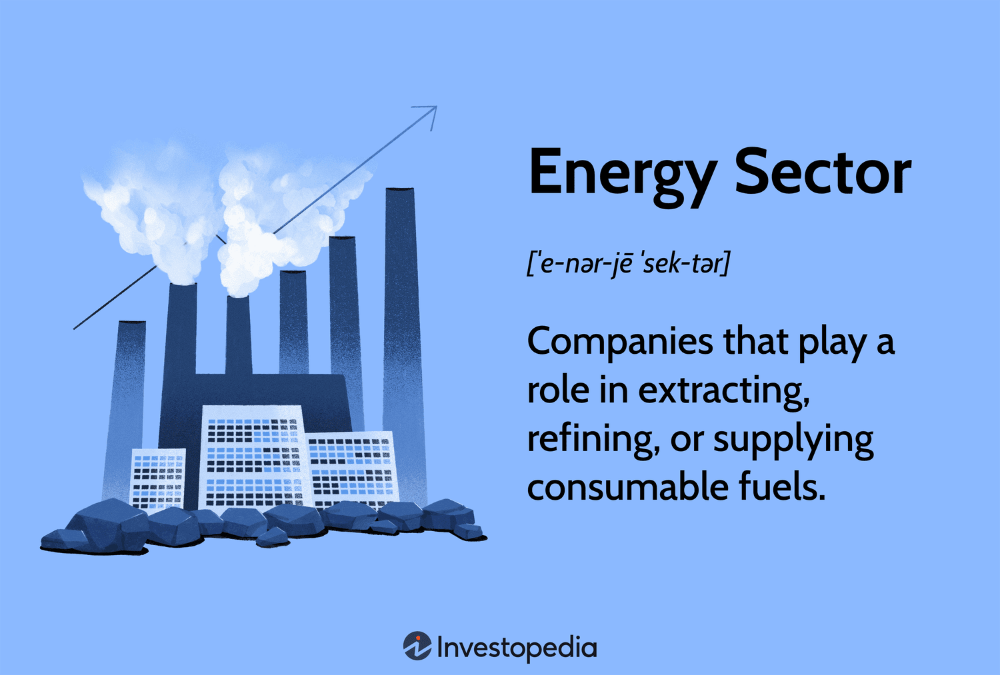

## Table of Contents

## What is the energy sector and why is it important?

The energy sector includes all the industries and activities involved in producing, distributing, and selling energy. This includes things like oil, gas, coal, nuclear power, and renewable energy sources like wind and solar. The energy sector is very important because it provides the power that we need for our daily lives. From lighting our homes and cooking our food to running our cars and factories, energy is essential for everything we do.

The importance of the energy sector goes beyond just meeting our daily needs. It also plays a big role in the economy. Many jobs are created in the energy sector, and it drives economic growth. Countries with strong energy sectors often have stronger economies. Additionally, the energy sector is crucial for national security. Having a reliable supply of energy helps a country stay stable and secure. As we move towards more sustainable energy sources, the energy sector will continue to evolve and remain a key part of our society.

## What are the main types of companies in the energy sector?

The energy sector has many different types of companies. Some companies focus on finding and getting oil and gas out of the ground. These are called exploration and production companies. They look for new places to drill and then set up the equipment to bring the oil and gas to the surface. Other companies, called refining companies, take the oil and turn it into things like gasoline and diesel that we use in our cars.

There are also companies that move the energy from where it's produced to where it's used. These are called midstream companies. They build and run pipelines and storage facilities to transport oil, gas, and other energy products. Finally, there are utility companies that deliver energy directly to homes and businesses. They manage the power lines and gas pipelines that bring electricity and natural gas to where they're needed. Each type of company plays an important role in making sure we have the energy we need.

## How do oil and gas companies operate and what are their primary functions?

Oil and gas companies work to find, get, and sell oil and gas. They start by looking for places where oil and gas might be underground. They use special tools and machines to study the earth and find these spots. Once they find a good place, they drill into the ground to reach the oil and gas. This part of their work is called exploration and production. It's a big job that needs a lot of money and special skills.

After they get the oil and gas out of the ground, oil and gas companies need to get it ready to use. They send the oil to refineries, which are big factories that turn the oil into things like gasoline and diesel. The gas can be cleaned and sent through pipelines to homes and businesses. Some companies also sell the oil and gas to other companies that will use it or sell it to people. This part of their work is called refining and marketing. It's important because it makes sure the oil and gas can be used in our cars, homes, and factories.

## What role do renewable energy companies play in the energy sector?

Renewable energy companies are important in the energy sector because they make and sell energy from sources that don't run out, like the sun, wind, and water. These companies build big projects like solar farms, wind turbines, and hydroelectric dams. They use these projects to make electricity that can be used by homes and businesses. By doing this, they help reduce our need for oil, gas, and coal, which can harm the environment.

These companies also help fight climate change. When we use renewable energy, we put less pollution into the air. This is good for the planet and for people's health. Renewable energy companies are growing fast because more and more people want to use clean energy. Governments and businesses are also starting to use more renewable energy to meet their goals for a cleaner future.

## How do utility companies differ from other energy sector companies?

Utility companies are different from other energy sector companies because they focus on delivering energy directly to homes and businesses. They manage the power lines and gas pipelines that bring electricity and natural gas to where they are needed. Unlike exploration and production companies that find and extract oil and gas, or refining companies that turn oil into products like gasoline, utility companies are all about getting the energy to the end user. They make sure that when you flip a switch or turn on your stove, the energy is there.

Utility companies also have a special role because they are often regulated by the government. This means they have to follow certain rules about how much they can charge for their services and how they operate. This is different from other energy companies, which might not have as many rules to follow. Because of this, utility companies need to balance providing reliable service with keeping costs fair for everyone. They play a crucial part in making sure that energy is available and affordable for everyone who needs it.

## What are the key differences between public and private energy companies?

Public energy companies are owned by the government. This means they are run to serve the public's needs, not just to make money. They often have to follow strict rules set by the government. These rules can be about how much they can charge for energy or how they treat the environment. Because they are public, they might focus more on making sure everyone has access to energy, even if it means they don't make as much profit. People who use their services might feel more secure because the government is in charge.

Private energy companies are owned by people or groups who want to make money. They are run like businesses and their main goal is to make a profit. They have more freedom to decide how to run their business and can often react faster to changes in the market. But, they might charge more for their services because they need to make money. People who use their services might worry about prices going up or the company not caring as much about the environment or public needs.

## How do energy service companies (ESCOs) contribute to the energy sector?

Energy service companies, or ESCOs, help people and businesses use energy better. They do this by looking at how energy is used in a building or a factory. Then, they suggest ways to save energy, like using better lights or fixing old machines. ESCOs can also put in new equipment that uses less energy. They often work with their customers to make a plan that saves energy and money over time.

ESCOs are important because they help make the energy sector more efficient. When people and businesses use less energy, it means we don't need to make as much energy from oil, gas, or coal. This is good for the environment because it reduces pollution. ESCOs also help people save money on their energy bills. By making buildings and factories use energy better, ESCOs play a big role in making the whole energy sector work better and be more sustainable.

## What are the challenges faced by nuclear energy companies?

Nuclear energy companies face many challenges. One big challenge is safety. Nuclear power plants need to be very safe because if something goes wrong, it can be very dangerous. There have been accidents in the past, like in Chernobyl and Fukushima, that made people very worried about nuclear power. So, nuclear companies have to spend a lot of money to make sure their plants are safe. They also have to follow strict rules set by the government to keep everyone safe.

Another challenge is what to do with nuclear waste. Nuclear power plants make waste that is radioactive and can be harmful for a very long time. Finding a safe place to store this waste is hard and expensive. People often don't want nuclear waste stored near where they live, so it can be hard to find a place to put it. This makes it more difficult and costly for nuclear energy companies to operate.

Lastly, nuclear energy companies face challenges because of public opinion and competition. Many people are scared of nuclear power because of the accidents and the waste. This can make it hard for nuclear companies to get support from the public and the government. Also, other types of energy, like wind and solar, are getting cheaper and more popular. This means nuclear companies have to compete with these other energy sources, which can be tough.

## How do energy trading and marketing companies function within the sector?

Energy trading and marketing companies buy and sell energy like oil, gas, and electricity. They work like middlemen, helping to move energy from where it's made to where it's needed. These companies look at the prices of energy all over the world and try to buy it when it's cheap and sell it when it's expensive. They use special tools and information to guess what the prices will do next. This helps them make money by trading energy.

These companies also help balance the supply and demand of energy. Sometimes, there might be too much energy in one place and not enough in another. Energy trading and marketing companies can move the energy around to fix this. They also make deals with other companies to buy and sell energy over time. This helps make sure that there's always enough energy for everyone, even when things change. By doing all this, they play a big role in keeping the energy sector running smoothly.

## What is the impact of government policies on different types of energy companies?

Government policies have a big impact on all kinds of energy companies. For public energy companies, which are owned by the government, policies can set rules about how much they can charge for energy and how they need to treat the environment. These rules can make it harder for public companies to make money, but they help make sure that everyone can afford energy and that the environment is protected. Private energy companies, on the other hand, might have more freedom to make their own choices, but they still have to follow many government rules. These rules can affect how much they can charge, what kind of energy they can produce, and how they need to take care of the environment.

Renewable energy companies are often helped by government policies that give them money or other benefits to make more clean energy. These policies can help renewable energy companies grow and compete with other types of energy. On the other hand, nuclear energy companies face strict government rules about safety and waste, which can make it harder and more expensive for them to operate. Oil and gas companies also have to follow many rules about how they can drill for oil and gas and how they need to protect the environment. All these policies shape how energy companies work and what kind of energy we use.

## How do technological advancements influence the operations of energy sector companies?

Technological advancements have a big impact on how energy sector companies work. New technology helps oil and gas companies find and get oil and gas out of the ground more easily. They use special machines and computers to look deep into the earth and find the best places to drill. This makes their work faster and cheaper. Also, new technology helps them make less waste and be kinder to the environment. For example, they can use better ways to clean the oil and gas before they sell it.

Renewable energy companies also benefit a lot from new technology. They can make solar panels and wind turbines that work better and cost less. This means they can make more clean energy and sell it to more people. Technology also helps them store energy better, so they can use it when the sun isn't shining or the wind isn't blowing. Utility companies use new technology to make their power lines and gas pipelines work better and be safer. This helps them give people more reliable energy and fix problems faster when they happen.

## What are the future trends and potential shifts in the types of companies dominating the energy sector?

In the future, we might see more renewable energy companies becoming important in the energy sector. This is because people are more worried about climate change and want to use energy that doesn't harm the environment. Governments are also making rules to help renewable energy companies grow. They might give them money or other benefits to make more clean energy. This could mean that companies making solar, wind, and other clean energy will become bigger and more important than oil and gas companies.

Another trend could be more use of technology in the energy sector. Companies might use new tools and computers to find and get energy more easily and cheaply. They could also use technology to make their work kinder to the environment. For example, they might use better ways to store energy or make less waste. This could change how all kinds of energy companies work, from oil and gas to renewable energy and utility companies.

## References & Further Reading

[1]: Burton, B. (2020). ["Energy Trading and Risk Management."](https://link.springer.com/book/10.1007/978-981-19-5603-4) John Wiley & Sons.

[2]: Lopez de Prado, M. (2018). ["Advances in Financial Machine Learning."](https://www.amazon.com/Advances-Financial-Machine-Learning-Marcos/dp/1119482089) John Wiley & Sons.

[3]: Kaminski, V. (2016). ["Energy Markets."](https://www.goodreads.com/book/show/19767245-energy-markets) Risk Books.

[4]: Narang, R. (2013). ["Inside the Black Box: A Simple Guide to Quantitative and High-Frequency Trading."](https://onlinelibrary.wiley.com/doi/book/10.1002/9781118662717) John Wiley & Sons.

[5]: Chan, E. P. (2008). ["Quantitative Trading: How to Build Your Own Algorithmic Trading Business."](https://github.com/ftvision/quant_trading_echan_book) John Wiley & Sons.

[6]: MacKenzie, D., & Spears, T. (Eds.). (2012). ["Do Economists Make Markets?: On the Performativity of Economics."](https://www.jstor.org/stable/j.ctv10vm29m) Princeton University Press.

[7]: Turner, C. (2017). ["Algorithmic Trading and DMA: An Introduction to Direct Access Trading Strategies."](https://www.semanticscholar.org/paper/Algorithmic-trading-%26-DMA-%3A-an-introduction-to-Johnson/aa5de1ab883d5e23b6651faa7c1807586d688e4b) Global Securities Research.