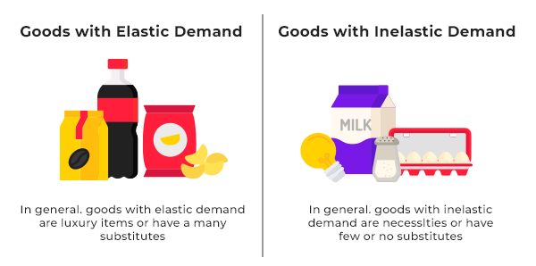

## Table of Contents

## What is price elasticity of demand?

Price elasticity of demand is a measure that shows how much the quantity demanded of a product changes when its price changes. It helps businesses and economists understand how sensitive people are to price changes. If the price of a product goes up, will people still buy it, or will they buy less? If the price goes down, will more people buy it? The answer to these questions depends on the price elasticity of demand.

The formula to calculate price elasticity of demand is the percentage change in quantity demanded divided by the percentage change in price. If the result is greater than 1, the demand is considered elastic, meaning people are very sensitive to price changes. For example, if the price of a luxury item goes up, people might stop buying it. If the result is less than 1, the demand is inelastic, meaning people will keep buying the product even if the price changes. For example, if the price of a necessary medicine goes up, people will still buy it because they need it.

## How do consumer goods relate to price elasticity of demand?

Consumer goods are things that people buy for their own use, like food, clothes, and electronics. These goods can be split into two types: necessities and luxuries. Necessities are things people need to live, like food and medicine. Luxuries are things people want but don't need, like fancy clothes or the latest phone. The type of good affects how much its price can change without affecting how much people buy it.

When we talk about price elasticity of demand, it means how much the amount people buy changes when the price changes. For necessities, the demand is usually inelastic. This means if the price goes up, people will still buy them because they need them. For example, if the price of bread goes up, people will still buy it because they need to eat. On the other hand, for luxuries, the demand is usually elastic. This means if the price goes up, people might stop buying them because they don't need them. For example, if the price of a fancy watch goes up, people might decide not to buy it because it's not something they need.

## What are the different types of consumer goods?

Consumer goods are things that people buy to use every day. They can be split into three main types: durable goods, non-durable goods, and services. Durable goods are things that last a long time, like a car or a refrigerator. People don't buy these things often because they don't wear out quickly. Non-durable goods are things that don't last long, like food or soap. People need to buy these things more often because they get used up quickly.

Services are another type of consumer good. These are things that people do for you, like getting a haircut or eating at a restaurant. Services are different from goods because you can't touch them, but they still meet people's needs or wants. All these types of consumer goods play a big role in our daily lives and how we spend our money.

## Can you explain the concept of elastic and inelastic demand?

Elastic demand means that people are very sensitive to changes in the price of a product. If the price goes up even a little, people will buy a lot less of it. If the price goes down, people will buy a lot more. This usually happens with things that people don't need, like luxury items. For example, if the price of a fancy watch goes up, people might decide not to buy it because it's not something they need. They can easily choose not to buy it or find something else that's cheaper.

Inelastic demand is the opposite. It means that people are not very sensitive to changes in the price of a product. If the price goes up, people will still buy about the same amount because they need it. If the price goes down, people won't buy much more because they already buy what they need. This usually happens with things that people have to have, like medicine or basic food. For example, if the price of bread goes up, people will still buy it because they need to eat. They can't easily stop buying it or find a cheaper substitute.

## How does the price elasticity of demand affect consumer behavior?

Price elasticity of demand tells us how much people change what they buy when the price changes. If a product has elastic demand, it means people are very sensitive to price changes. When the price goes up, they buy a lot less of it. When the price goes down, they buy a lot more. This often happens with things people don't really need, like fancy clothes or the latest gadgets. If these things get too expensive, people might decide to save their money or buy something else instead.

On the other hand, if a product has inelastic demand, people are not very sensitive to price changes. They will keep buying about the same amount even if the price goes up. This is common with things people need, like medicine or basic food. For example, if the price of bread goes up, people will still buy it because they need to eat. Understanding whether a product has elastic or inelastic demand helps businesses decide how to set their prices and helps people understand how their buying habits might change when prices change.

## What factors influence the price elasticity of demand for consumer goods?

Several things can affect how much the amount people buy changes when the price of a consumer good changes. One big factor is whether the good is a necessity or a luxury. Things people need, like food or medicine, usually have inelastic demand. This means if the price goes up, people will still buy them because they can't do without them. On the other hand, things people want but don't need, like fancy clothes or the latest phone, usually have elastic demand. If the price of these items goes up, people might stop buying them because they can choose not to buy them or find something cheaper.

Another factor is how many other choices people have. If there are lots of similar products to choose from, the demand for any one product is likely to be more elastic. For example, if the price of one brand of cereal goes up, people can easily switch to another brand. But if there aren't many choices, like with a special medicine, the demand is more inelastic because people don't have many other options. Time also plays a role. In the short term, people might not change their buying habits much even if the price goes up. But over time, they might find cheaper alternatives or change their habits, making the demand more elastic.

## Can you provide examples of consumer goods with elastic demand?

Consumer goods with elastic demand are things that people can easily stop buying or switch to something else if the price goes up. A good example is luxury items like designer clothes. If the price of a fancy dress goes up, people might decide not to buy it because it's not something they need. They can choose to buy a cheaper dress or save their money for something else. Another example is electronics, like the latest smartphone. If the price of a new phone goes up, people might wait for the price to go down or buy an older model instead.

Another type of consumer good with elastic demand is non-essential food items, like gourmet chocolates. If the price of these chocolates goes up, people might stop buying them and choose regular chocolates instead. They don't need gourmet chocolates to live, so they can easily switch to something cheaper. Also, things like movie tickets can have elastic demand. If the price of a movie ticket goes up, people might decide to wait for the movie to come out on streaming services or do something else with their time and money.

## What are some examples of consumer goods with inelastic demand?

Consumer goods with inelastic demand are things that people will keep buying even if the price goes up. A good example is medicine. If the price of a necessary medicine goes up, people will still buy it because they need it to stay healthy. They can't easily stop taking their medicine or find a cheaper substitute, so the demand stays the same even if the price changes.

Another example is basic food items like bread or rice. If the price of bread goes up, people will still buy it because they need to eat. They can't just stop eating, so they'll keep buying bread even if it costs more. Gasoline is also a good example. If the price of gas goes up, people still need to fill up their cars to get to work or run errands. They might not like the higher price, but they'll keep buying gas because they need it.

## How do businesses use price elasticity of demand to set prices?

Businesses use price elasticity of demand to figure out how much they can change the price of their products without losing too many customers. If a product has elastic demand, like a luxury item, businesses know that raising the price might make people stop buying it. So, they might keep the price low to sell more or use sales and discounts to attract more buyers. On the other hand, if a product has inelastic demand, like medicine, businesses know that people will still buy it even if the price goes up. This means they might raise the price a bit to make more money without losing many customers.

Understanding price elasticity also helps businesses decide on strategies like bundling products or offering different versions of a product at different prices. For example, if a company sells both a basic and a deluxe version of a product, they might price the basic version lower to attract more customers because it has more elastic demand. The deluxe version, which might have more inelastic demand, could be priced higher. This way, businesses can maximize their profits by catering to different levels of price sensitivity among their customers.

## What are the challenges in measuring price elasticity of demand for different consumer goods?

Measuring price elasticity of demand can be tricky because there are many things that can affect how much people buy when the price changes. One big challenge is figuring out all the other things that might change at the same time as the price. For example, if a business raises the price of a product, they might also change how they advertise it or where it's sold. These changes can make it hard to know if people are buying less because of the higher price or because of something else.

Another challenge is getting good data. To measure price elasticity, businesses need to know how much people bought before and after a price change. But sometimes, it's hard to get this information, especially if the product is sold in many different places or if people buy it in different ways. Also, people's buying habits can change over time, so what was true last year might not be true this year. This makes it even harder to measure price elasticity accurately.

## How has the understanding of price elasticity evolved with digital marketplaces?

The way we understand price elasticity of demand has changed a lot because of digital marketplaces. In the past, businesses could only guess how people would react to price changes based on what they saw in stores. Now, with digital marketplaces like Amazon or eBay, businesses can see exactly how many people buy something when the price changes. They can use computer programs to watch these changes in real time and adjust prices quickly. This means businesses can be more precise about setting prices to make the most money without losing customers.

Digital marketplaces also give businesses a lot more data to work with. They can see not just how many people buy something, but also who is buying it, where they are, and what other things they look at before buying. This helps businesses understand how different groups of people react to price changes. For example, they might find that younger people are more sensitive to price changes than older people. With this information, businesses can set different prices for different people or offer special deals to keep customers happy and coming back.

## What advanced statistical methods are used to analyze price elasticity of demand in consumer goods?

Businesses use advanced statistical methods to figure out how much people will change their buying habits when the price of a product changes. One common method is regression analysis. This is a way to look at a lot of data and see how different things, like price, affect how much people buy. Businesses can use this to see if raising the price of a product makes people buy less of it, and by how much. They can also look at other things that might affect buying habits, like how much people are paid or what the weather is like, to make sure they're getting a good picture of what's going on.

Another method businesses use is time series analysis. This method looks at how the amount people buy changes over time. It can help businesses see patterns and predict how people will react to price changes in the future. For example, if a business sees that people buy less of a product every time the price goes up in the summer, they might decide to keep the price the same during that time. These advanced methods help businesses make better decisions about pricing and understand their customers better.

## What is the understanding of Price Elasticity of Demand?

Price elasticity of demand (PED) is a measure of the responsiveness of the quantity demanded of a good to changes in its price. It is a crucial concept in economics used to understand consumer behavior, pricing strategies, and market dynamics. PED is defined mathematically as the percentage change in quantity demanded resulting from a one percent change in price. The formula for calculating price elasticity of demand is:

$$
\text{PED} = \frac{\%\text{ Change in Quantity Demanded}}{\%\text{ Change in Price}}
$$

PED is considered elastic when the absolute value is greater than one, indicating that consumers are highly responsive to price changes. Inelastic demand occurs when the absolute value is less than one, suggesting that consumers are less responsive to price shifts. Unitary elasticity is when the absolute value is equal to one, implying proportional responsiveness of quantity demanded to price changes. Perfectly elastic demand implies an infinite responsiveness, where any small change in price leads to an infinite change in quantity demanded, depicted on a graph as a horizontal line. Perfectly inelastic demand, on the other hand, is where quantity demanded remains constant regardless of price changes, typically shown as a vertical line.

The responsiveness of consumers to price changes varies across different goods and services, heavily influenced by availability of substitutes, necessity of the product, consumer income levels, and time period considered. A product with readily available substitutes, like brand-name goods, is likely to experience more elastic demand. Conversely, essential goods such as medications tend to have inelastic demand because consumers need them regardless of price fluctuations. Understanding these distinctions allows businesses and policymakers to make informed decisions about pricing, taxation, and regulation, ultimately affecting supply and demand equilibrium in the market.

## What are the factors influencing price elasticity of demand?

Price elasticity of demand measures how sensitive the quantity demanded of a good is to a change in its price. Various factors significantly influence this elasticity, including the availability of substitutes, the necessity of the product, consumer income levels, and time. Understanding these factors helps businesses and policymakers predict how changes in prices will affect demand, guiding both pricing strategies and market interventions.

**Substitutes**

The availability of substitutes directly impacts the price elasticity of demand. When a product has close substitutes, consumers can easily switch to an alternative if the price rises, leading to higher elasticity. For instance, if the price of one brand of cereal increases, consumers might switch to another brand or type of cereal. Conversely, if a product lacks substitutes, such as life-saving medications, demand tends to be inelastic since consumers have few alternatives, regardless of price changes.

Mathematically, the cross-price elasticity of demand, which measures the responsiveness of the demand for one good when the price of another good changes, can quantify the substitutability effect. It is given by:

$$
E_{xy} = \frac{\% \Delta Q_x}{\% \Delta P_y}
$$

where $E_{xy}$ is the cross-price elasticity, $\% \Delta Q_x$ is the percentage change in demand for good $x$, and $\% \Delta P_y$ is the percentage change in price of good $y$.

**Necessity of the Product**

The necessity of a product affects its demand elasticity. Necessities—goods essential for daily life—tend to be price inelastic because consumers will buy them regardless of price changes. Examples include utilities like electricity and water. In contrast, luxury items, which consumers consider non-essential, often exhibit elastic demand. A price increase for luxury items may lead to a significant drop in quantity demanded as consumers decide they can forego these non-essential expenditures.

**Consumer Income Levels and Budget Allocation**

Consumer income levels also play a critical role in determining price elasticity. Generally, the elasticity of demand declines as consumer income increases, as individuals are less constrained by price when making purchasing decisions. For lower-income consumers, however, the proportion of their income spent on a particular good can make their demand more elastic, as any price change can significantly affect their budget.

The income elasticity of demand, which measures how demand changes as consumer income changes, is a useful tool for understanding this [factor](/wiki/factor-investing):

$$
E_i = \frac{\% \Delta Q}{\% \Delta I}
$$

where $E_i$ is the income elasticity, $\% \Delta Q$ is the percentage change in quantity demanded, and $\% \Delta I$ is the percentage change in income.

**Time**

The factor of time influences price elasticity as well. In the short term, demand is often less elastic because consumers need time to adjust their behavior and find substitutes. However, in the long term, demand tends to become more elastic as consumers have more time to change habits, find alternatives, and explore market options. For example, a sudden rise in gasoline prices might not immediately decrease demand significantly, but over time, consumers may switch to more fuel-efficient vehicles or public transportation, increasing demand elasticity.

In summary, while the price elasticity of demand is influenced by various factors including substitutes, necessity, consumer income, and time, understanding these elements allows businesses and policymakers to anticipate consumer reactions to price changes more accurately. This understanding is crucial for optimizing pricing strategies, maximizing revenue, and ensuring competitive market positioning.

## What are the challenges and considerations?

Modeling price elasticity of demand and predicting price changes present significant challenges due to the inherent complexity and dynamics of markets. A key difficulty lies in accurately capturing how consumers react to price fluctuations, which is influenced by a myriad of factors beyond just price. These factors include consumer preferences, income levels, and the availability of substitutes, each of which introduces variability that complicates the creation of reliable models.

Market [volatility](/wiki/volatility-trading-strategies) is another critical consideration. Financial markets are often subject to rapid and unpredictable changes due to economic indicators, geopolitical events, or sudden shifts in consumer sentiment. Such volatility can distort elasticity estimates and undermine trading strategies that rely on these metrics. The constant ebb and flow of these external factors can lead to situations where a product or asset that was previously considered to have inelastic demand suddenly becomes elastic, or vice versa. 

Economic models, while useful, often fail to capture the full scope of real-market conditions. These models typically rely on a set of assumptions—such as rational behavior, perfect information, and static preferences—that do not hold true in practice. For instance, the standard formula for price elasticity of demand is:

$$
E_d = \frac{\% \Delta Q}{\% \Delta P}
$$

where $E_d$ is the price elasticity of demand, $\% \Delta Q$ is the percentage change in quantity demanded, and $\% \Delta P$ is the percentage change in price. Though this formula provides a basic measure of elasticity, it oversimplifies consumer behavior by not accounting for factors such as brand loyalty or psychological biases, which can skew demand responses.

Given these challenges, continuous learning and adaptation are crucial for developers and users of algorithmic trading models. Machine learning algorithms can offer a solution by identifying patterns and correlations in vast amounts of historical data. However, the efficacy of these models is dependent on their ability to learn from and adapt to new data, ensuring they remain robust against evolving market conditions. Consider a Python implementation employing a simple linear regression to model demand elasticity:

```python
import numpy as np
from sklearn.linear_model import LinearRegression

# Example data
prices = np.array([10, 12, 15, 20]).reshape(-1, 1)
quantities = np.array([300, 280, 250, 200])

# Fit the model
model = LinearRegression().fit(prices, quantities)

# Calculate elasticity
elasticity = model.coef_[0] * (np.mean(prices) / np.mean(quantities))
```

This code demonstrates a basic approach to calculating elasticity through a linear regression model. However, it's important for traders to continuously refine such models and update their algorithms with new data to account for unforeseen market shifts.

Essentially, the successful implementation of price elasticity in algorithmic trading requires a balance between robust modeling and flexibility. This consists of integrating advanced statistical methods, machine learning, and a nuanced understanding of market dynamics. Only through ongoing research and adaptation can traders hope to effectively leverage price elasticity in their decision-making processes, paving the way for future integration of economic insights and trading technology.

## References & Further Reading

[1]: ["Economics"](https://en.wikipedia.org/wiki/Economics) by Paul Samuelson and William Nordhaus - A comprehensive introduction to economics, covering fundamental concepts like price elasticity of demand.

[2]: ["Advances in Financial Machine Learning"](https://www.amazon.com/Advances-Financial-Machine-Learning-Marcos/dp/1119482089) by Marcos Lopez de Prado - Discusses machine learning applications in finance, including algorithmic trading models.

[3]: ["Machine Learning for Algorithmic Trading"](https://github.com/stefan-jansen/machine-learning-for-trading) by Stefan Jansen - Offers insights into using machine learning techniques to improve trading algorithms.

[4]: ["Quantitative Trading: How to Build Your Own Algorithmic Trading Business"](https://www.amazon.com/Quantitative-Trading-Build-Algorithmic-Business/dp/1119800064) by Ernest P. Chan - Provides practical advice on implementing quantitative models within trading strategies.

[5]: ["Algorithmic Trading and DMA: An introduction to direct access trading strategies"](https://www.semanticscholar.org/paper/Algorithmic-trading-%26-DMA-%3A-an-introduction-to-Johnson/aa5de1ab883d5e23b6651faa7c1807586d688e4b) by Barry Johnson - Covers the fundamentals of algorithmic trading, including strategy development and market dynamics.

[6]: Bergstra, J., Bardenet, R., Bengio, Y., & Kégl, B. (2011). ["Algorithms for Hyper-Parameter Optimization."](https://dl.acm.org/doi/10.5555/2986459.2986743) Advances in Neural Information Processing Systems 24 - Discusses hyper-parameter optimization techniques which can be applied to algorithmic trading models.