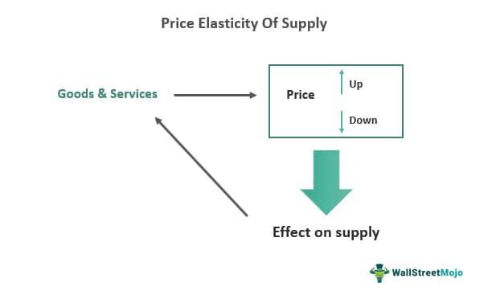

Price elasticity of demand and algorithmic trading represent fundamental principles within economics and finance, each playing a critical role in shaping market dynamics and investment strategies. At their intersection lies the understanding of how consumer behavior informs both pricing strategies and algorithmic trading decisions.

Price elasticity of demand measures the responsiveness of the quantity demanded of a good to changes in its price. It is a core concept in economic analysis because it helps businesses and policymakers understand how changes in price can influence consumer purchasing behavior. The formula for calculating price elasticity of demand is given by:



$$
\text{Price Elasticity of Demand (PED)} = \frac{\% \text{ change in quantity demanded}}{\% \text{ change in price}}
$$

This measure is significant as it informs pricing strategies. For instance, if a product is highly elastic, a small decrease in price could lead to a significant increase in quantity demanded, potentially boosting overall revenue. Conversely, inelastic demand suggests that price changes have little effect on sales volume, allowing firms to increase prices without losing customers.

Algorithmic trading, another pivotal development, relies on using data-driven algorithms to automate trading decisions. Algorithms analyze vast datasets to predict market movements and execute trades at optimal times. Incorporating elasticity into such algorithms enhances their effectiveness by aligning trading decisions with consumer behavior and market conditions.

Understanding price elasticity is crucial for investment strategies, as it provides insights into consumer confidence and economic stability. High elasticity indicates a competitive market where consumers are sensitive to price changes, while low elasticity suggests fewer alternatives and a captive market. Investment strategies that account for elasticity can better anticipate market trends and react accordingly, optimizing trade execution and improving returns.

In the convergence of economics and technology, embracing elasticity concepts within algorithmic trading models empowers investors to refine their strategies, making informed decisions grounded in comprehensive economic analysis. This integration represents a valuable step forward in blending economic theory with practical, technology-driven applications for enhanced market performance.

## Table of Contents

## Understanding Price Elasticity of Demand

Price elasticity of demand (PED) is a measure of the responsiveness of the quantity demanded of a good to changes in its price. It is a crucial concept in economics used to understand consumer behavior, pricing strategies, and market dynamics. PED is defined mathematically as the percentage change in quantity demanded resulting from a one percent change in price. The formula for calculating price elasticity of demand is:

$$
\text{PED} = \frac{\%\text{ Change in Quantity Demanded}}{\%\text{ Change in Price}}
$$

PED is considered elastic when the absolute value is greater than one, indicating that consumers are highly responsive to price changes. Inelastic demand occurs when the absolute value is less than one, suggesting that consumers are less responsive to price shifts. Unitary elasticity is when the absolute value is equal to one, implying proportional responsiveness of quantity demanded to price changes. Perfectly elastic demand implies an infinite responsiveness, where any small change in price leads to an infinite change in quantity demanded, depicted on a graph as a horizontal line. Perfectly inelastic demand, on the other hand, is where quantity demanded remains constant regardless of price changes, typically shown as a vertical line.

The responsiveness of consumers to price changes varies across different goods and services, heavily influenced by availability of substitutes, necessity of the product, consumer income levels, and time period considered. A product with readily available substitutes, like brand-name goods, is likely to experience more elastic demand. Conversely, essential goods such as medications tend to have inelastic demand because consumers need them regardless of price fluctuations. Understanding these distinctions allows businesses and policymakers to make informed decisions about pricing, taxation, and regulation, ultimately affecting supply and demand equilibrium in the market.

## Factors Influencing Price Elasticity of Demand

Price elasticity of demand measures how sensitive the quantity demanded of a good is to a change in its price. Various factors significantly influence this elasticity, including the availability of substitutes, the necessity of the product, consumer income levels, and time. Understanding these factors helps businesses and policymakers predict how changes in prices will affect demand, guiding both pricing strategies and market interventions.

**Substitutes**

The availability of substitutes directly impacts the price elasticity of demand. When a product has close substitutes, consumers can easily switch to an alternative if the price rises, leading to higher elasticity. For instance, if the price of one brand of cereal increases, consumers might switch to another brand or type of cereal. Conversely, if a product lacks substitutes, such as life-saving medications, demand tends to be inelastic since consumers have few alternatives, regardless of price changes.

Mathematically, the cross-price elasticity of demand, which measures the responsiveness of the demand for one good when the price of another good changes, can quantify the substitutability effect. It is given by:

$$
E_{xy} = \frac{\% \Delta Q_x}{\% \Delta P_y}
$$

where $E_{xy}$ is the cross-price elasticity, $\% \Delta Q_x$ is the percentage change in demand for good $x$, and $\% \Delta P_y$ is the percentage change in price of good $y$.

**Necessity of the Product**

The necessity of a product affects its demand elasticity. Necessities—goods essential for daily life—tend to be price inelastic because consumers will buy them regardless of price changes. Examples include utilities like electricity and water. In contrast, luxury items, which consumers consider non-essential, often exhibit elastic demand. A price increase for luxury items may lead to a significant drop in quantity demanded as consumers decide they can forego these non-essential expenditures.

**Consumer Income Levels and Budget Allocation**

Consumer income levels also play a critical role in determining price elasticity. Generally, the elasticity of demand declines as consumer income increases, as individuals are less constrained by price when making purchasing decisions. For lower-income consumers, however, the proportion of their income spent on a particular good can make their demand more elastic, as any price change can significantly affect their budget.

The income elasticity of demand, which measures how demand changes as consumer income changes, is a useful tool for understanding this [factor](/wiki/factor-investing):

$$
E_i = \frac{\% \Delta Q}{\% \Delta I}
$$

where $E_i$ is the income elasticity, $\% \Delta Q$ is the percentage change in quantity demanded, and $\% \Delta I$ is the percentage change in income.

**Time**

The factor of time influences price elasticity as well. In the short term, demand is often less elastic because consumers need time to adjust their behavior and find substitutes. However, in the long term, demand tends to become more elastic as consumers have more time to change habits, find alternatives, and explore market options. For example, a sudden rise in gasoline prices might not immediately decrease demand significantly, but over time, consumers may switch to more fuel-efficient vehicles or public transportation, increasing demand elasticity.

In summary, while the price elasticity of demand is influenced by various factors including substitutes, necessity, consumer income, and time, understanding these elements allows businesses and policymakers to anticipate consumer reactions to price changes more accurately. This understanding is crucial for optimizing pricing strategies, maximizing revenue, and ensuring competitive market positioning.

## Algorithmic Trading and Elasticity

Algorithmic trading refers to the use of computer algorithms to execute trading decisions with minimal human intervention. These algorithms are designed to analyze vast amounts of market data and execute trades at speeds and frequencies that are beyond human capabilities. The primary reliance of [algorithmic trading](/wiki/algorithmic-trading) is on data and market predictions, using quantitative models that forecast price movements or identify trading opportunities based on historical and real-time data.

Price elasticity of demand, the responsiveness of quantity demanded to changes in price, can be a valuable concept integrated into algorithmic models. Understanding the elasticity of a product or asset enables traders to predict how price changes might influence demand levels, thereby anticipating potential market movements.

Incorporating elasticity into algorithmic models can refine trading strategies by allowing algorithms to adjust pricing decisions dynamically based on predicted consumer reactions. For example, a trading algorithm might use elasticity metrics to adjust the order size. If elasticity indicates that demand is highly sensitive to price changes, the algorithm might opt for smaller trades to avoid significant price impacts.

Moreover, elasticity metrics can assist in market analysis by identifying times when the market is likely to be less volatile. Knowing that a market or asset has inelastic demand allows traders to be more aggressive, as price changes are less likely to result in substantial changes in trading volumes. Conversely, in markets with high elasticity, traders might prioritize risk management and use strategies that minimize exposure to adverse price movements.

An example of elasticity integration is using regression models that incorporate elasticity metrics to identify potential price points that maximize profit. This could involve using a dataset that includes price and demand levels across different times, enabling a [machine learning](/wiki/machine-learning) algorithm to predict price elasticity and optimize trading strategies accordingly.

The understanding of price elasticity thus becomes a key factor in algorithmic trading, optimizing decision-making and enhancing market performance by leveraging predictable patterns in consumer behavior. This approach not only provides a competitive edge but also adds a layer of sophistication to algorithmic trading models, blending classical economic principles with modern technological strategies.

## Applications of Elasticity in Trading Strategies

Price elasticity of demand is a critical consideration in the development and optimization of trading strategies, particularly in high-frequency and automated trading environments. Understanding and incorporating elasticity insights can enhance the adaptability and responsiveness of trading algorithms, thereby improving performance in dynamic market conditions.

In high-frequency trading ([HFT](/wiki/high-frequency-trading-strategies)), where transactions are executed at unprecedented speeds, the ability to predict consumer or market behavior in response to price changes is essential. High-frequency traders can leverage elasticity by adjusting their strategies based on the observed or expected elasticity of a market. For example, in markets where demand is highly elastic, small price changes can lead to significant changes in trade volumes. Traders can capitalize on this by implementing strategies that rapidly adjust to these price changes, capturing profits from short-term price movements.

Strategies involving the identification of varying elasticity levels in different markets or sectors can enable traders to allocate resources more efficiently. For instance, markets with inelastic demand might be less sensitive to price changes, thereby offering more stable trading opportunities, while highly elastic markets might present more volatile, but potentially lucrative, opportunities.

Estimating elasticity using historical data is a crucial step in integrating elasticity insights into trading strategies. Machine learning models can be utilized to analyze vast datasets and uncover patterns indicating the elasticity of demand for different assets or sectors. Techniques such as regression analysis can be applied to estimate the price elasticity of demand. For instance, the formula for price elasticity, $E_d = \frac{\% \text{ change in quantity demanded}}{\% \text{ change in price}}$, can be computed using historical price and [volume](/wiki/volume-trading-strategy) data to determine the sensitivity of an asset.

```python
import numpy as np
from sklearn.linear_model import LinearRegression

# Sample historical price and demand data
price = np.array([100, 110, 90, 95])  # Example prices
demand = np.array([10, 9, 12, 11])    # Corresponding demand

# Calculate percentage change
price_change = np.diff(price) / price[:-1]
demand_change = np.diff(demand) / demand[:-1]

# Linear regression to estimate elasticity
model = LinearRegression()
model.fit(price_change.reshape(-1, 1), demand_change)
elasticity = model.coef_[0]

print("Estimated Price Elasticity of Demand:", elasticity)
```

Such elasticity metrics can be integrated into predictive models to inform trading strategies. For example, if a particular asset is expected to react with greater elasticity to certain economic events, traders can prepare to adjust their holding strategies accordingly. Successful case studies demonstrate that firms employing elasticity-informed strategies outperform peers by anticipating and responding to market shifts more effectively.

In summary, the incorporation of price elasticity of demand into trading strategies allows for more nuanced and responsive approaches, particularly in automated and high-frequency trading systems. By leveraging historical data and advanced analytics, traders can better navigate varying market conditions and enhance the precision and outcomes of their strategies.

## Challenges and Considerations

Modeling price elasticity of demand and predicting price changes present significant challenges due to the inherent complexity and dynamics of markets. A key difficulty lies in accurately capturing how consumers react to price fluctuations, which is influenced by a myriad of factors beyond just price. These factors include consumer preferences, income levels, and the availability of substitutes, each of which introduces variability that complicates the creation of reliable models.

Market [volatility](/wiki/volatility-trading-strategies) is another critical consideration. Financial markets are often subject to rapid and unpredictable changes due to economic indicators, geopolitical events, or sudden shifts in consumer sentiment. Such volatility can distort elasticity estimates and undermine trading strategies that rely on these metrics. The constant ebb and flow of these external factors can lead to situations where a product or asset that was previously considered to have inelastic demand suddenly becomes elastic, or vice versa. 

Economic models, while useful, often fail to capture the full scope of real-market conditions. These models typically rely on a set of assumptions—such as rational behavior, perfect information, and static preferences—that do not hold true in practice. For instance, the standard formula for price elasticity of demand is:

$$
E_d = \frac{\% \Delta Q}{\% \Delta P}
$$

where $E_d$ is the price elasticity of demand, $\% \Delta Q$ is the percentage change in quantity demanded, and $\% \Delta P$ is the percentage change in price. Though this formula provides a basic measure of elasticity, it oversimplifies consumer behavior by not accounting for factors such as brand loyalty or psychological biases, which can skew demand responses.

Given these challenges, continuous learning and adaptation are crucial for developers and users of algorithmic trading models. Machine learning algorithms can offer a solution by identifying patterns and correlations in vast amounts of historical data. However, the efficacy of these models is dependent on their ability to learn from and adapt to new data, ensuring they remain robust against evolving market conditions. Consider a Python implementation employing a simple linear regression to model demand elasticity:

```python
import numpy as np
from sklearn.linear_model import LinearRegression

# Example data
prices = np.array([10, 12, 15, 20]).reshape(-1, 1)
quantities = np.array([300, 280, 250, 200])

# Fit the model
model = LinearRegression().fit(prices, quantities)

# Calculate elasticity
elasticity = model.coef_[0] * (np.mean(prices) / np.mean(quantities))
```

This code demonstrates a basic approach to calculating elasticity through a linear regression model. However, it's important for traders to continuously refine such models and update their algorithms with new data to account for unforeseen market shifts.

Essentially, the successful implementation of price elasticity in algorithmic trading requires a balance between robust modeling and flexibility. This consists of integrating advanced statistical methods, machine learning, and a nuanced understanding of market dynamics. Only through ongoing research and adaptation can traders hope to effectively leverage price elasticity in their decision-making processes, paving the way for future integration of economic insights and trading technology.

## Conclusion

In the context of algorithmic trading, the price elasticity of demand emerges as a significant economic measure, offering critical insights into consumer behavior and market dynamics. By understanding and quantifying how sensitive demand for a product is to changes in its price, traders can enhance their decision-making processes and refine strategies to optimize financial outcomes. Incorporating elasticity into trading models can lead to more accurate predictions of market movements, thus enabling the design of algorithms that can more effectively respond to shifts in demand and pricing structures.

The integration of price elasticity into algorithmic trading models presents multiple benefits. It allows traders to anticipate potential market reactions to price changes, optimize pricing strategies to maximize revenue, and identify opportunities for [arbitrage](/wiki/arbitrage). These models benefit from incorporating historical data on consumer behavior and price changes, enabling a better understanding of market elasticity, which can be particularly useful in volatile markets or when trading in products with diverse elasticity levels.

Continuous research and adaptation are necessary to advance the understanding and application of economic principles like demand elasticity in trading. As markets evolve, so too must the algorithms and models used to navigate them. This involves a commitment to integrating new data, developing more sophisticated analysis techniques, and refining strategies based on empirical observations. These efforts can lead to the development of more robust trading systems capable of adapting to changing economic conditions and consumer preferences.

Looking forward, the synergy between economic principles and technological advancements promises to reshape the landscape of trading. The integration of machine learning and [artificial intelligence](/wiki/ai-artificial-intelligence) with economic insights, such as price elasticity, can facilitate the creation of adaptive, self-improving algorithms. These systems are poised to provide a competitive edge in increasingly complex and data-driven financial markets. The future of trading is likely to see a closer alignment between economic theory and technological application, paving the way for innovations that leverage the full potential of both domains.

## References & Further Reading

[1]: ["Economics"](https://en.wikipedia.org/wiki/Economics) by Paul Samuelson and William Nordhaus - A comprehensive introduction to economics, covering fundamental concepts like price elasticity of demand.

[2]: ["Advances in Financial Machine Learning"](https://www.amazon.com/Advances-Financial-Machine-Learning-Marcos/dp/1119482089) by Marcos Lopez de Prado - Discusses machine learning applications in finance, including algorithmic trading models.

[3]: ["Machine Learning for Algorithmic Trading"](https://github.com/stefan-jansen/machine-learning-for-trading) by Stefan Jansen - Offers insights into using machine learning techniques to improve trading algorithms.

[4]: ["Quantitative Trading: How to Build Your Own Algorithmic Trading Business"](https://www.amazon.com/Quantitative-Trading-Build-Algorithmic-Business/dp/1119800064) by Ernest P. Chan - Provides practical advice on implementing quantitative models within trading strategies.

[5]: ["Algorithmic Trading and DMA: An introduction to direct access trading strategies"](https://www.semanticscholar.org/paper/Algorithmic-trading-%26-DMA-%3A-an-introduction-to-Johnson/aa5de1ab883d5e23b6651faa7c1807586d688e4b) by Barry Johnson - Covers the fundamentals of algorithmic trading, including strategy development and market dynamics.

[6]: Bergstra, J., Bardenet, R., Bengio, Y., & Kégl, B. (2011). ["Algorithms for Hyper-Parameter Optimization."](https://dl.acm.org/doi/10.5555/2986459.2986743) Advances in Neural Information Processing Systems 24 - Discusses hyper-parameter optimization techniques which can be applied to algorithmic trading models.