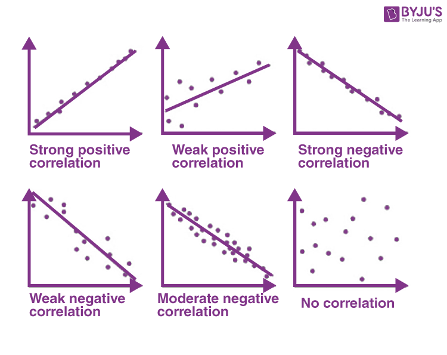

Algorithmic trading integrates complex statistical tools designed to enhance decision-making and improve financial outcomes. Among these tools, correlation coefficients stand out as essential metrics, providing insights into the movement relationships between different securities. Understanding these correlations is crucial, as they can help traders identify dependencies, predict price movements, and manage risks effectively.

Correlation coefficients quantify the relationship between two variables, showing how one may change when the other does. These coefficients are expressed in a range from -1 to 1, where 1 indicates a perfect positive correlation, -1 signifies a perfect negative correlation, and 0 denotes no correlation at all. In financial markets, these values are integral to assessing relationships between assets, guiding predictions about how securities might behave relative to one another.



This article examines the role of correlation coefficients in statistical analysis and their practical application in algorithmic trading. We will look at the different types of correlation, how to calculate these coefficients, and methods to apply them for developing robust trading strategies. By leveraging correlation coefficients, traders can gain critical insights into market dynamics, optimize portfolio construction, and enhance risk management practices. Exploring these tools allows traders to make data-driven decisions that align with market trends and movements.

## Table of Contents

## Understanding Correlation Coefficients

Correlation coefficients are statistical measures that quantify the degree to which two variables move in relation to each other. They play a crucial role in assessing financial markets by providing a numerical value that indicates the strength and direction of the relationship between asset returns or price movements.

The most commonly used correlation coefficient is the Pearson correlation coefficient, denoted as $r$. It is calculated as follows:

$$

r = \frac{\sum (X_i - \bar{X})(Y_i - \bar{Y})}{\sqrt{\sum (X_i - \bar{X})^2 \sum (Y_i - \bar{Y})^2}} 
$$

In this formula, $X_i$ and $Y_i$ are the individual sample points, while $\bar{X}$ and $\bar{Y}$ represent their respective means. The numerator reflects the covariance between the variables, and the denominator is the product of their standard deviations, which normalizes the covariance.

The Pearson correlation coefficient ranges from -1 to 1. A value of 1 implies a perfect positive correlation, where the variables move in the same direction with proportional changes. Conversely, a value of -1 indicates a perfect negative correlation, implying that as one variable increases, the other decreases equivalently. A coefficient of 0 suggests no linear relationship between the variables.

These coefficients are vital in financial markets for understanding how securities might behave relative to one another. For example, a high positive correlation between two stocks may imply that they are impacted by similar market or economic factors. Consequently, this knowledge can assist traders in constructing hedging strategies or managing portfolio risk by considering diversifying into assets with low or negative correlations to reduce [volatility](/wiki/volatility-trading-strategies).

Here's an example of how to compute Pearson correlation using Python:

```python
import numpy as np

# Sample data
returns_X = np.array([0.05, 0.1, 0.15, 0.03])  # Returns for security X
returns_Y = np.array([0.02, 0.08, 0.12, 0.01])  # Returns for security Y

# Calculate correlation coefficient
correlation_coefficient = np.corrcoef(returns_X, returns_Y)[0, 1]
print("Pearson correlation coefficient:", correlation_coefficient)
```

These coefficients offer insights that can inform decision-making, potentially leading to more informed and strategic trades. By quantifying relationships, traders can develop models and strategies that reflect the dynamic interactions of market elements.

## Methods of Calculating Correlation Coefficients

Several methods exist for calculating correlation coefficients, each offering unique insights into the relationship between variables. The choice of method depends on the nature of the data and the specific relationship being investigated.

**Pearson’s Correlation**

Pearson’s correlation coefficient is a measure of the linear relationship between two continuous variables. This coefficient is perhaps the most commonly used due to its simplicity and efficacy in cases where a linear relationship is expected. The Pearson correlation coefficient, denoted as $r$, is calculated using the formula:

$$
r = \frac{\sum (X_i - \overline{X})(Y_i - \overline{Y})}{\sqrt{\sum (X_i - \overline{X})^2 \sum (Y_i - \overline{Y})^2}}
$$

Where:
- $X_i$ and $Y_i$ are the data points,
- $\overline{X}$ and $\overline{Y}$ are the means of the data points.

This coefficient ranges from -1 to 1, where 1 indicates a perfect positive linear relationship, -1 a perfect negative linear relationship, and 0 signifies no linear relationship.

**Spearman’s Rank Correlation**

Spearman’s rank correlation coefficient is a non-parametric measure that assesses how well the relationship between two variables can be described using a monotonic function. It is suitable for both continuous and ordinal data and is particularly useful when the data does not meet the assumptions necessary for Pearson’s correlation. The Spearman rank correlation is calculated using ranked values of data, described by:

$$
\rho = 1 - \frac{6 \sum d_i^2}{n(n^2 - 1)}
$$

Where:
- $d_i$ is the difference between the ranks of corresponding variables,
- $n$ is the number of data points.

This coefficient also ranges from -1 to 1, with the same interpretation as Pearson’s correlation.

**Kendall’s Tau**

Kendall’s tau is another non-parametric correlation measure suitable for analyzing ordinal data or datasets with non-linear relationships. It evaluates the strength and direction of association between two ranked variables. Kendall’s tau ($\tau$) is calculated by considering the concordant and discordant pairs of observations:

$$
\tau = \frac{(C - D)}{\frac{1}{2}n(n-1)}
$$

Where:
- $C$ is the number of concordant pairs,
- $D$ is the number of discordant pairs,
- $n$ is the number of observations.

Kendall’s tau is preferable in datasets with many tied ranks, providing a more robust measure than Spearman's in such cases.

In trading, the choice among these methods depends on the specific nature of the data and the type of relationship being analyzed. Pearson’s is best for linear relationships, while Spearman’s and Kendall’s tau are more suitable for non-linear and ordinal associations. Implementing these calculations can be efficiently done using Python libraries such as SciPy and pandas. For example, calculating Pearson’s correlation in Python can be performed with:

```python
import numpy as np

# Example data
x = np.array([1, 2, 3, 4])
y = np.array([2, 4, 6, 8])

# Pearson Correlation
pearson_corr = np.corrcoef(x, y)[0, 1]
print("Pearson Correlation: ", pearson_corr)
```

This script demonstrates the practical application of correlation calculation, essential for developing effective [algorithmic trading](/wiki/algorithmic-trading) strategies.

## Interpreting Correlation in Algorithmic Trading

Algorithmic traders use correlation coefficients to understand the directional relationships between financial instruments. By examining these coefficients, traders can gauge how one security's movement is related to another, allowing them to make more informed trading decisions. A strong positive correlation between two instruments indicates that they tend to move in the same direction. Conversely, a strong negative correlation suggests that the instruments usually move in opposite directions. 

These relationships can be exploited through strategies such as [pair trading](/wiki/pair-trading). Pair trading, or statistical [arbitrage](/wiki/arbitrage), involves selecting two correlated securities, buying the underperforming one and selling the outperforming one, with the expectation that their relative pricing will eventually converge. The underlying assumption is that the securities will revert to their historical correlation relationship.

On the other hand, when no significant correlation is observed between securities, this might suggest opportunities for diversification. Diversification through uncorrelated assets is a well-established risk mitigation strategy. By holding a diversified portfolio, traders can reduce unsystematic risk, as the performance of uncorrelated assets tends to offset each other, leading to potentially lower portfolio volatility. 

To illustrate these concepts practically, consider an example using Python's NumPy library to calculate correlation coefficients:

```python
import numpy as np

# Sample price data for two securities
security_a = np.array([100, 102, 101, 105, 107])
security_b = np.array([50, 49, 51, 50, 52])

# Calculate correlation coefficient
correlation_coefficient = np.corrcoef(security_a, security_b)[0, 1]
print("Correlation Coefficient:", correlation_coefficient)
```

In this example, the `np.corrcoef()` function calculates the Pearson correlation coefficient for two sets of security price data. The result helps traders understand how the price movements of these securities are related, guiding their decisions on whether to engage in pair trading or pursue diversification strategies. Thus, interpreting correlation coefficients is crucial for developing systematic and risk-adjusted algorithmic trading strategies.

## Applications of Correlation Coefficients in Algo Trading

Correlation coefficients are invaluable for algorithmic trading, primarily serving as a tool for risk management. These coefficients help traders assess how changes in various securities might collectively affect portfolio volatility under different market conditions. By analyzing these statistical relationships, traders can make informed decisions to optimize the balance between risk and return.

Constructing diversified portfolios is one of the key applications of correlation coefficients in trading. Diversification aims to minimize risk by spreading investments across various assets, ideally those that do not move in tandem. Correlation coefficients make it feasible to select assets with divergent correlation profiles. For instance, a portfolio could be constructed to include assets with low or negative correlations with one another, which helps mitigate the impact of volatility and extreme market movements.

In algorithmic trading, systematic strategies often rely on the precise calculation of correlations to inform trading decisions. These strategies can range from simple to sophisticated. For example, pair trading, a strategy that exploits the relationship between two correlated securities, is rooted in identifying pairs with significant correlations. By predicting mean-reversion patterns, traders can execute trades based on the belief that the relationship between the securities will persist or return to historical norms.

One approach to measure correlation is through the Pearson correlation coefficient, which evaluates the linear relationship between two variables. It can be calculated with Python using the NumPy library:

```python
import numpy as np

# Sample data
returns_A = np.array([0.01, 0.02, 0.015, 0.03])
returns_B = np.array([0.02, 0.025, 0.01, 0.035])

# Calculate Pearson correlation coefficient
correlation_coefficient = np.corrcoef(returns_A, returns_B)[0, 1]
print(correlation_coefficient)
```

This coefficient provides a quantitative measure that can guide the development of trading algorithms. By integrating this and other coefficients, algorithmic traders can devise strategies that automatically adjust positions based on statistical evidence from historical data.

Overall, correlation coefficients enable traders to incorporate statistical dependencies into their trading models effectively, enhancing the capacity for dynamic and data-driven trade executions. Through rigorous analysis, traders can leverage these coefficients to align their strategies with prevailing market conditions, improving their risk management frameworks.

## Tools and Software for Correlation Analysis

Algorithmic traders employ a range of sophisticated software tools to conduct detailed correlation analysis, an essential component of algorithmic trading strategies. These tools facilitate precise calculations and offer functionalities that support the development of data-driven trading strategies.

### QuantLib

QuantLib is an open-source library designed for handling quantitative finance problems. It provides comprehensive tools for modeling, trading, and risk management. In the context of correlation analysis, QuantLib offers robust capabilities to model and analyze financial data, allowing traders to assess relationships between different securities accurately. This is particularly useful in developing pricing models and risk management strategies, as QuantLib supports complex financial engineering operations [QuantLib](https://www.quantlib.org).

### MATLAB

MATLAB is a numerical computing environment favored for its flexibility and extensive toolkit, which includes the Financial Toolbox for quantitative analysis. MATLAB's statistical functions allow for the calculation of both linear and non-linear correlation coefficients, facilitating a broad range of analyses from basic Pearson correlations to more complex techniques. The environment supports algorithmic traders in developing custom scripts and models that can be directly integrated into their trading systems, supporting real-time data analysis and decision-making [MATLAB](https://www.mathworks.com/products/matlab.html).

### Python Libraries: NumPy and pandas

Python has become a popular language for financial market analysis due to its simplicity and powerful libraries. NumPy provides fundamental capabilities for handling arrays and performing high-performance mathematical computations. In correlation analysis, NumPy's `corrcoef` function is often used to calculate Pearson correlation coefficients with ease. For example:

```python
import numpy as np

data1 = np.array([1, 2, 3, 4, 5])
data2 = np.array([5, 4, 3, 2, 1])
correlation_matrix = np.corrcoef(data1, data2)
```

Pandas, another Python library, is instrumental in managing and analyzing time series data. It includes methods for computing Spearman and Kendall correlations, giving traders the flexibility to explore non-linear relationships. With pandas, traders can efficiently handle large datasets and perform intricate analyses:

```python
import pandas as pd

df = pd.DataFrame({'A': [1, 2, 3, 4, 5], 'B': [5, 4, 3, 2, 1]})
correlation_spearman = df.corr(method='spearman')
```

### Conclusion

Tools like QuantLib, MATLAB, NumPy, and pandas are crucial for conducting in-depth correlation analysis, enabling traders to build and refine algorithmic trading strategies. By leveraging these tools, traders can extract significant insights from financial data, supporting the development of sophisticated, data-driven strategies that enhance decision-making and manage risk effectively.

## Challenges and Considerations

While correlation coefficients offer valuable insights into the relationships between financial instruments, their application in algorithmic trading comes with significant challenges and considerations. One major challenge is the ever-changing nature of market dynamics. Markets are influenced by a myriad of factors such as economic policies, geopolitical events, and technological changes, which can alter correlations between securities unexpectedly.

A key limitation of correlation coefficients is their reliance on historical data, which may be non-stationary. Non-stationary data, where statistical properties like mean and variance change over time, can lead to misinterpretation of the strength and direction of relationships. This makes predictions based solely on historical correlations potentially unreliable. Spurious correlations, where apparent relationships do not have a meaningful causal connection, can also mislead traders, resulting in strategies that may not perform as expected when market conditions shift.

Algorithmic traders must continuously monitor and adjust their models and strategies to account for these issues. This requires ongoing evaluation and adaptation to ensure that the correlations being used still hold and are relevant to the current market environment. Implementing a process for regular data analysis and strategy reassessment is crucial for maintaining the effectiveness of trading systems.

For example, traders can employ rolling windows to recalculate correlations periodically, updating models to reflect the latest market data. In Python, this can be done using libraries like pandas:

```python
import pandas as pd

# Assuming 'data' is a DataFrame with timeseries of different assets
rolling_window_size = 60  # e.g., 60 days
rolling_correlation = data['asset1'].rolling(window=rolling_window_size).corr(data['asset2'])

# Evaluate and adjust models based on new correlations
```

This type of ongoing analysis helps traders avoid overreliance on potentially outdated or spurious correlations and enables more adaptive and responsive trading strategies. Understanding the limitations and actively managing these challenges can lead to more robust algorithmic trading practices, better equipped to handle the complexities of financial markets.

## Conclusion

Correlation coefficients are instrumental for algorithmic trading, providing crucial insights into the relationships between different financial instruments. By quantifying the degree of correlation between assets, traders can discern patterns and predict market behaviors more accurately. This understanding allows for the design of more informed and effective trading strategies.

The application of correlation analysis in constructing trading strategies and improving risk management is significant. Through identifying correlations, traders can anticipate potential market movements, optimize resource allocation, and diversify portfolios to mitigate risk. For instance, selecting assets with low or negative correlations can stabilize a portfolio against market volatility.

Despite their utility, correlation coefficients must be used judiciously, acknowledging the inherent limitations and potential for statistical anomalies. Continuous monitoring and analysis are essential to adapting strategies to ever-changing market conditions. Traders should strike a balance between theoretical statistical models and practical real-world application to optimize the advantages of algorithmic trading.

In conclusion, correlation coefficients bolster the analytical capabilities of traders, enabling them to leverage statistical relationships for strategic decision-making. As these tools and methodologies evolve, sustained success will hinge on the ability to integrate rigorous analysis with pragmatic trading tactics.

## References & Further Reading

[1]: [Pearson, K. (1901). "On Lines and Planes of Closest Fit to Systems of Points in Space"](https://www.tandfonline.com/doi/abs/10.1080/14786440109462720). Philosophical Magazine.

[2]: ["Quantitative Trading: How to Build Your Own Algorithmic Trading Business"](https://www.amazon.com/Quantitative-Trading-Build-Algorithmic-Business/dp/1119800064) by Ernest P. Chan

[3]: ["Advances in Financial Machine Learning"](https://www.amazon.com/Advances-Financial-Machine-Learning-Marcos/dp/1119482089) by Marcos Lopez de Prado

[4]: ["Statistical Methods for Ranking Data"](https://link.springer.com/book/10.1007/978-1-4939-1471-5) by Mayer Alvo and Philip L. H. Yu

[5]: ["Introduction to Modern Portfolio Optimization with NuOPTTM, S-PLUS®, and S+BayesTM"](https://archive.org/details/introductiontomo0000sche) by Bernd Scherer and Douglas Martin

[6]: ["Machine Learning for Algorithmic Trading"](https://github.com/stefan-jansen/machine-learning-for-trading) by Stefan Jansen

[7]: ["Evidence-Based Technical Analysis: Applying the Scientific Method and Statistical Inference to Trading Signals"](https://www.amazon.com/Evidence-Based-Technical-Analysis-Scientific-Statistical/dp/0470008741) by David Aronson

[8]: Spearman, C. (1904). ["The Proof and Measurement of Association between Two Things."](https://www.jstor.org/stable/1412159) The American Journal of Psychology.

[9]: Kendall, M. G. (1938). ["A New Measure of Rank Correlation"](https://www.jstor.org/stable/2332226). Biometrika.