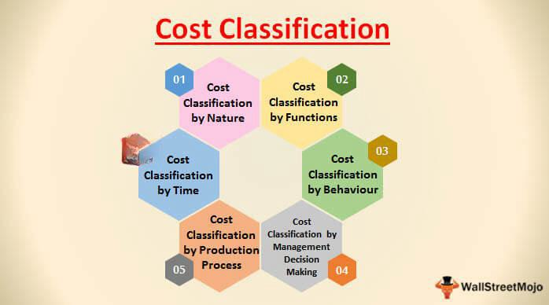

## Table of Contents

## What is cost accounting and why is it important?

Cost accounting is a type of accounting that helps businesses figure out how much it costs to make their products or provide their services. It looks at all the expenses involved, like materials, labor, and overhead costs. By understanding these costs, a business can set the right prices for their products and make sure they are making a profit.

Cost accounting is important because it helps businesses make smart decisions. When a company knows exactly how much it costs to make something, they can find ways to save money and be more efficient. This can lead to lower prices for customers, higher profits for the business, and a better understanding of which products or services are the most successful. Overall, cost accounting is a key tool for managing a business well.

## What are the basic types of costs in cost accounting?

In cost accounting, there are three basic types of costs: direct costs, indirect costs, and overhead costs. Direct costs are expenses that can be directly linked to making a specific product or providing a service. For example, if you are making a cake, the cost of the flour and sugar would be direct costs because they are used directly in the cake.

Indirect costs are expenses that are not directly tied to a specific product but are still necessary for the business to operate. These might include things like the salary of the manager who oversees the whole operation or the cost of utilities like electricity and water. Overhead costs are a type of indirect cost that includes expenses needed to keep the business running, like rent for the building or the cost of maintaining equipment. Understanding these different types of costs helps businesses keep track of their spending and make better decisions.

## How do direct costs differ from indirect costs?

Direct costs are the expenses that you can easily connect to making a specific product or providing a service. For example, if you are making a pizza, the cost of the dough, sauce, and cheese are direct costs because they are used directly in the pizza. These costs are straightforward because you can see exactly how much of them goes into each product.

Indirect costs, on the other hand, are expenses that are not tied directly to a specific product but are still important for the business to run. These might include things like the salary of the manager who oversees the whole operation or the cost of utilities like electricity and water. Indirect costs are trickier to track because they help the business as a whole, not just one product.

Understanding the difference between direct and indirect costs is important for businesses. It helps them figure out how much it really costs to make their products and where they can save money. By keeping track of both types of costs, a business can make smarter decisions about pricing and spending.

## What is the difference between fixed costs and variable costs?

Fixed costs are expenses that stay the same no matter how much you produce. For example, if you rent a space for your business, you pay the same rent every month, whether you make one product or a thousand. These costs are predictable because they don't change with your level of production. Knowing your fixed costs helps you plan your budget because you can count on them staying steady.

Variable costs, on the other hand, go up or down depending on how much you produce. If you make more pizzas, you'll need more dough, sauce, and cheese, so your variable costs will be higher. These costs change with your level of production, which can make them harder to predict. Understanding variable costs is important because it helps you figure out how much it costs to make each additional product, which can affect your pricing and profit.

## Can you explain what semi-variable costs are and give examples?

Semi-variable costs are a mix of fixed and variable costs. They have a part that stays the same no matter how much you produce, and another part that changes depending on how much you make. This type of cost can be tricky to understand because it has both a predictable part and a part that can go up or down.

For example, think about your phone bill. You might have a basic plan that costs the same every month, no matter how many calls you make. That's the fixed part. But if you go over your minutes or use a lot of data, you'll have to pay extra. That's the variable part. Another example is the electricity bill for a factory. There's a basic charge that stays the same, but if the factory runs more machines, the electricity cost will go up. Understanding semi-variable costs helps businesses plan better because they need to account for both the steady and changing parts of these expenses.

## What are step costs and how do they affect cost management?

Step costs are expenses that stay the same for a while but then suddenly jump up when your business grows a bit more. Imagine you're running a small bakery and you can handle all the baking yourself. But if you start getting more orders, you might need to hire another baker. The cost of that new baker is a step cost because it stays at zero until you reach a point where you need more help, then it jumps up to the cost of their salary.

Understanding step costs is important for cost management because they can affect how you plan your business growth. If you know that hiring another person or buying more equipment will cause a sudden increase in costs, you can plan ahead. You might decide to wait until you have enough orders to make it worth the extra expense, or you might start saving up for that step cost so it doesn't surprise you. Knowing about step costs helps you make smarter decisions about when to expand your business.

## How do opportunity costs factor into cost accounting?

Opportunity costs are important in cost accounting because they help you see the value of the choices you make. When you decide to spend money on one thing, you are giving up the chance to spend that money on something else. For example, if you use your money to buy new equipment for your business, you can't use that same money to hire more workers. The opportunity cost is the value of the next best thing you could have done with that money.

In cost accounting, thinking about opportunity costs helps you make better decisions. It's not just about the money you spend, but also about what you could have done with that money instead. By understanding opportunity costs, you can choose the option that will help your business the most. This way, you're not just looking at what you're spending now, but also what you might be missing out on in the future.

## What are sunk costs and why are they important to consider?

Sunk costs are expenses that you've already spent and can't get back. Imagine you bought a bunch of materials for a project, but then decided not to go through with it. The money you spent on those materials is a sunk cost because you can't undo that spending. It's important to know about sunk costs because they can trick you into making bad decisions. People sometimes keep going with a project just because they've already spent money on it, even if it's not going to work out.

Understanding sunk costs helps you make smarter choices. When you're deciding what to do next, you should focus on what will happen in the future, not on what you've already spent. For example, if you're thinking about whether to keep a business going, you shouldn't let the money you've already put into it make your decision for you. Instead, think about whether the business will make money from now on. By ignoring sunk costs, you can make decisions that are better for your business in the long run.

## Can you describe what marginal costs are and their role in decision making?

Marginal costs are the extra costs you have to pay to make one more item or provide one more service. For example, if you're making cookies and you decide to bake one more batch, the cost of the extra flour, sugar, and electricity you use is the marginal cost. It's important because it helps you figure out if making that extra item will make you more money or cost you more than it's worth.

Understanding marginal costs is really helpful when you're making decisions about your business. If the price you can sell your product for is higher than the marginal cost, then it makes sense to make more because you'll make a profit. But if the marginal cost is higher than what you can sell it for, then you're losing money on each extra item you make. By keeping an eye on marginal costs, you can decide when to keep producing more and when to stop, helping your business run more efficiently and make more profit.

## How do joint costs impact the allocation of costs in multi-product scenarios?

Joint costs are the costs you have when you make more than one product from the same process. For example, if you're a farmer and you get both meat and leather from a cow, the cost of raising that cow is a joint cost. When you have joint costs, you need to figure out how to split them up between the different products you make. This can be tricky because you want to be fair and accurate about how much each product costs to make.

To deal with joint costs, businesses use different methods to divide them up. One way is to split the costs based on how much of each product you get. If you get more meat than leather from a cow, you might say that meat should [carry](/wiki/carry-trading) more of the cost. Another way is to look at how much money each product makes and divide the costs based on that. No matter which method you use, the goal is to make sure you know the true cost of each product so you can set the right prices and make good business decisions.

## What are the challenges in allocating overhead costs and how can they be addressed?

Allocating overhead costs can be tough because these costs are not tied directly to making a specific product. Overhead costs include things like rent, utilities, and the salaries of managers. It's hard to figure out how much of these costs should be added to the price of each product you make. If you don't split them up right, you might end up charging too much for some products and too little for others, which can hurt your business.

One way to deal with this is to use a cost driver, which is something that helps you figure out how to split up the overhead costs. For example, if you use more electricity to make one product than another, you might decide to add more of the electricity cost to that product's price. Another way is to use a simpler method, like dividing the overhead costs evenly among all the products you make. While this isn't as accurate, it can be easier to do. The key is to find a method that works well for your business and helps you set fair prices for your products.

## How does activity-based costing improve the accuracy of cost allocation compared to traditional methods?

Activity-based costing (ABC) helps businesses figure out their costs more accurately than traditional methods. Traditional methods often just split up costs evenly across all products, which can be unfair because some products might use more resources than others. ABC looks at the specific activities that go into making each product and assigns costs based on how much each product uses those activities. For example, if one product needs a lot of machine time and another doesn't, ABC will add more of the machine cost to the first product. This way, the costs are more closely matched to what each product actually uses.

Using ABC can help businesses make better decisions. When you know the true cost of each product, you can set prices that are fair and make sure you're not losing money on any product. It also helps you see where you might be able to save money by making your processes more efficient. For example, if you find out that one activity is really expensive, you might look for ways to do it cheaper or find out if you can skip it for some products. Overall, ABC gives you a clearer picture of your costs, which can lead to smarter business choices.

## What are the different types of cost accounting?

Cost accounting encompasses several methods that businesses use to analyze and allocate costs effectively. These methods are crucial for enhancing cost transparency and facilitating better decision-making. Here are some of the prevalent types of cost accounting practices:

### Standard Costing

Standard costing involves assigning a pre-determined or standard cost to each unit of product or service. This method is particularly useful for variance analysis, which measures the performance by comparing the standard costs to actual costs. The variances help in identifying discrepancies that require management intervention. Standard costing simplifies budgeting and cost control by establishing cost expectations.

### Activity-Based Costing (ABC)

Activity-Based Costing (ABC) provides a more accurate method of cost allocation by linking costs to activities based on their consumption. Unlike traditional cost allocation methods that might assign costs based on machine hours or direct labor, ABC traces overhead costs to specific activities, such as purchasing or machine setups. This allows for a more precise understanding of product and customer profitability. ABC helps identify inefficient activities and high-cost processes, promoting better resource allocation.

### Lean Accounting

Lean accounting supports lean manufacturing principles by focusing on value creation and cost efficiency. It emphasizes minimizing waste, whether it be in material, time, or human resources. Lean accounting methods often replace traditional financial measurements with metrics that reflect lean practices. These can include tracking the value stream, which is the sequence of processes through which a product or service flows. By reducing unnecessary processes and stressing value-driving activities, lean accounting aids in achieving cost savings and enhancing profitability.

### Marginal Costing

Marginal costing, also known as variable costing, involves analyzing costs associated with producing one more unit of product. It only considers variable costs as part of the product's cost, with fixed costs treated as period costs that do not affect production [volume](/wiki/volume-trading-strategy) decisions. This approach is particularly useful in pricing and production decisions. The principle of marginal cost can be mathematically represented as:

$$
\text{Marginal Cost (MC)} = \frac{\Delta \text{Total Cost}}{\Delta \text{Quantity}}
$$

Where $\Delta \text{Total Cost}$ is the change in total cost and $\Delta \text{Quantity}$ is the change in quantity produced. Marginal costing helps businesses to decide on the optimal production level and assess the impact of changes in output on profitability.

These cost accounting methods enable businesses to tailor their cost management strategies to better suit their operational models and strategic goals, leading to improved financial performance and competitiveness.

## References & Further Reading

[1]: Horngren, C. T., Datar, S. M., & Rajan, M. V. (2014). ["Cost Accounting: A Managerial Emphasis."](https://www.semanticscholar.org/paper/Cost-Accounting%3A-A-Managerial-Emphasis-Horngren-Datar/0a40f19b3c7611bb798e8fc8641cd15bfc5eeaeb) Pearson.

[2]: Kaplan, R. S., & Anderson, S. R. (2007). ["Time-Driven Activity-Based Costing: A Simpler and More Powerful Path to Higher Profits."](https://www.hbs.edu/ris/Publication%20Files/04-045_d62528d4-7931-4ea1-a205-d9683c639d6e.pdf) Harvard Business Review Press.

[3]: Taleb, N. N. (2010). ["The Black Swan: The Impact of the Highly Improbable,"](https://www.jstor.org/stable/23045073) Random House Trade Paperbacks.

[4]: ["Cost Management: A Strategic Emphasis"](https://www.mheducation.com/highered/product/Cost-Management-A-Strategic-Emphasis-Blocher.html) by Edward J. Blocher, David E. Stout, and Paul E. Juras

[5]: Arnaboldi, M., & Lapsley, I. (2005). ["Activity-Based Costing in Healthcare: A UK Case Study."](https://www.research.ed.ac.uk/en/publications/activity-based-costing-in-healthcare-a-uk-case-study) Research in Healthcare Financial Management.