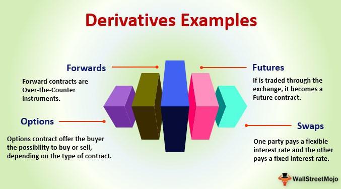

Contingent claims, fundamental to modern financial markets, are financial instruments whose value or payoff is contingent upon the occurrence of certain future events. Predominantly manifested as derivatives, these instruments include options, futures, and swaps. They serve as crucial tools in risk management and speculative strategies, allowing investors to hedge against potential adverse price movements or to capitalize on market expectations.

In financial markets, derivatives like options grant the holder the right, but not the obligation, to buy or sell an underlying asset at a predetermined price before a specified expiration date. This optionality introduces a layer of flexibility not present in other financial instruments. Futures contracts, by contrast, oblige participants to transact at a future date, offering a way to lock in prices and hedge against volatility in commodity and securities markets. Swaps facilitate the exchange of cash flows or financial instruments, allowing parties to manage risks associated with fluctuating interest rates or currencies.

Algorithmic trading has revolutionized the trading of derivatives and other financial instruments. By automating trading strategies through sophisticated algorithms, it enables rapid execution of trades, often in milliseconds, exploiting even minor market inefficiencies. This technological advancement has enhanced the overall efficiency of markets, reduced transaction costs, and provided precise mechanisms for risk management. However, the increased speed and complexity of automated trading systems also present new challenges, such as the potential for flash crashes and amplified market volatility.

This article aims to examine the relationship between contingent claims, financial derivatives, and algorithmic trading, offering insights into how these elements interact within the modern financial landscape. By understanding contingent claims and their integral role, market participants can better navigate the complexities of today's financial markets.

## Table of Contents

## Basics of Contingent Claims Financial Instruments

Contingent claims are financial derivatives whose value is determined by the occurrence of an uncertain future event, making them a pivotal component in sophisticated trading strategies. Predominantly, these instruments encompass options, futures (often in swapped versions), and similar derivatives, serving a wide array of functions, including hedging, speculation, and arbitrage.

A key characteristic of contingent claims is their ability to provide rights to investors without obligating them, thus offering a form of financial assurance against potential market fluctuations. For instance, options grant the holder the right, but not the obligation, to buy or sell an underlying asset at a predetermined price within a specific timeframe. This flexibility is advantageous for investors looking to hedge against adverse price movements while also opening opportunities for speculative profit.

The [liquidity](/wiki/liquidity-risk-premium) and [volatility](/wiki/volatility-trading-strategies) of these instruments play crucial roles in crafting successful trading strategies. Liquidity refers to the ease with which a derivative can be bought or sold in the market without impacting its price. High liquidity is desirable as it allows for quick entry and [exit](/wiki/exit-strategy) in trading positions, minimizing the cost associated with the transaction. Conversely, volatility pertains to the degree of variation in the price of the underlying asset, reflecting the risk associated with the derivative. Higher volatility often translates to greater potential gains or losses, influencing the pricing and attractiveness of the contingent claim.

Investors frequently utilize contingent claims for hedging purposes, aiming to offset potential losses in other investments. For example, a portfolio manager holding a diverse portfolio of stocks might purchase put options to protect against potential declines in stock prices. These instruments also facilitate speculation, enabling traders to profit from anticipated market movements with relatively limited capital exposure, given the leveraged nature of derivatives. Additionally, [arbitrage](/wiki/arbitrage) opportunities arise when discrepancies in pricing occur across different markets, allowing traders to exploit these inefficiencies for potential gains.

Overall, the strategic use of contingent claims in financial markets underscores their significance, providing investors with tools to manage risk, seek profits, and ensure a balanced approach in complex financial environments. These instruments are integral to the development of dynamic trading strategies, aiding in the stabilization and efficiency of modern financial markets.

## Types of Financial Derivatives

Derivatives are financial instruments whose value depends on an underlying asset or group of assets. They play a critical role in risk management and speculative strategies. There are several types of derivatives, each with unique characteristics and functions.

Options are perhaps the most well-known type of derivative. They provide the holder the right, but not the obligation, to buy (call option) or sell (put option) an asset at a predetermined price, known as the strike price, before a certain expiration date. Options are versatile instruments used for hedging and leveraging purposes. The flexibility they offer in risk management and profit potential makes them essential tools for traders and investors. A mathematical model, such as the Black-Scholes model, is often used to price options, taking into account factors like the volatility of the underlying asset, time to expiration, and the risk-free [interest rate](/wiki/interest-rate-trading-strategies).

Swaps are another category of derivatives where two parties agree to exchange cash flows or financial instruments. The most common swap is the interest rate swap, where one party swaps a fixed interest rate payment for a floating rate payment, or vice versa. Swaps are used to manage interest rate exposure and currency risk, allowing companies and investors to achieve more stable and predictable financial outcomes.

Futures contracts are standardized agreements to buy or sell an asset at a future date for a predefined price. Unlike options, futures contracts impose an obligation on both parties to complete the transaction as specified. These contracts are widely used for hedging purposes, especially in commodities markets, to protect against price fluctuations. The futures market provides liquidity and price discovery, which are vital for producers and consumers alike.

Forward contracts are similar to futures but differ mainly in terms of standardization and trading venues. While futures are traded on exchanges and have standardized terms, forward contracts are private agreements between two parties, allowing for customized terms. They are commonly used in foreign exchange markets to hedge against currency risk.

Understanding the various types of derivatives and their applications is crucial for developing effective trading strategies. These instruments offer a combination of risk management, speculation opportunities, and flexibility tailored to specific market needs, playing a significant role in modern financial practices.

## Principles of Contingent Claim Valuation

Valuation of contingent claims is fundamental to modern finance, as it provides the tools and methods necessary to price derivatives whose payouts depend on uncertain future events. These valuations rely on predictive models that simulate future scenarios and assign probabilities to different outcomes, ultimately enabling traders and investors to make informed decisions regarding potential profit and loss.

Among the most influential models is the Black-Scholes model, which revolutionized options pricing. Developed by Fischer Black, Myron Scholes, and Robert Merton, this model calculates the theoretical price of European-style options based on factors such as the underlying asset's current price ($S$), the option's strike price ($K$), the time to expiration ($T$), the volatility of the underlying asset ($\sigma$), and the risk-free interest rate ($r$). The Black-Scholes formula is expressed as:

$$
C = S_0 N(d_1) - X e^{-rT} N(d_2)
$$

where:

$$
d_1 = \frac{\ln(S_0/X) + (r + \sigma^2/2)T}{\sigma\sqrt{T}}
$$
$$
d_2 = d_1 - \sigma\sqrt{T}
$$

In this formula, $N(\cdot)$ represents the cumulative distribution function of the standard normal distribution.

Monte Carlo simulations are another critical method used for the valuation of more complex derivatives and contingent claims. This technique involves generating a large number of random price paths for the underlying asset, computing the payoff for each path, and then averaging these payoffs to obtain an estimated value of the derivative. The flexibility of Monte Carlo simulations makes them suitable for valuing derivatives with path-dependent features, like Asian options or other exotic options.

The real-world application of these models requires appreciation for contingencies that impact market conditions. Variables such as economic indicators, geopolitical events, and shifts in market sentiment can influence asset volatility and, consequently, derivative pricing. Incorporating these real-world factors into valuation processes helps ensure that financial models represent actual market conditions, thus improving accuracy.

Advanced valuation techniques, like stochastic volatility models or local volatility models, further refine the predictive accuracy by addressing limitations in simpler models like Black-Scholes. These sophisticated techniques provide insights into potential profit and loss scenarios, allowing traders to better evaluate risks and optimize trading strategies.

By understanding market mechanisms and leveraging appropriate valuation models, traders and investors can gain a strategic advantage, enabling them to navigate and capitalize on the complexities and anomalies of financial markets. This understanding is crucial as it allows for the alignment of investment strategies with anticipated market movements and the efficient management of associated risks.

## Algorithmic Trading and Its Impact on Derivatives

Algorithmic trading leverages advanced algorithms to automate the execution of trades in financial markets, particularly the derivatives market. These algorithms, constructed from mathematical models and quantitative analysis, allow for rapid execution, often within milliseconds, which is essential in high-frequency trading ([HFT](/wiki/high-frequency-trading-strategies)). This speed and automation substantially enhance market efficiency by narrowing bid-ask spreads and increasing liquidity, thereby reducing transaction costs for market participants.

The core functionality of [algorithmic trading](/wiki/algorithmic-trading) involves the analysis of large datasets to identify trading opportunities based on predetermined criteria such as price movements, [volume](/wiki/volume-trading-strategy), or other market signals. By continuously scanning the market, algorithms can execute trades at optimal moments to maximize returns. For instance, algorithms may exploit arbitrage opportunities, where slight disequilibria in price exist across different markets, to generate profits.

Furthermore, algorithmic trading enables more precise risk management by allowing traders to deploy complex strategies that dynamically adjust to market conditions. This precision helps in managing the risks associated with derivatives, whose values are contingent on underlying asset movements.

The rapid nature of algorithmic trading, though beneficial, introduces specific risks. One significant risk is the potential for flash crashes, which occur when algorithmic orders exacerbate market volatility, leading to rapid and significant price declines. Such events highlight the amplification effect algorithms can have on market volatility, necessitating stringent risk controls and regulatory oversight.

Algorithmic trading also depends heavily on technology infrastructure, where latency plays a critical role. Systems must be robust and fail-proof to prevent errors that could lead to substantial financial damage. Traders and institutions often employ risk management procedures, including [backtesting](/wiki/backtesting) of algorithms, stress testing under various market scenarios, and implementing kill-switches to manually halt trading activity in case of erratic behavior.

Overall, while algorithmic trading has transformed derivatives markets by increasing efficiency and reducing costs, it requires continuous innovation and vigilant risk management to mitigate the inherent challenges it poses.

## Risks and Challenges in Trading Contingent Claims

The trading of contingent claims involves significant risks due to their intricate nature and the multiple factors influencing their pricing and execution. Central to these risks are market, credit, and liquidity issues, each of which can significantly affect trading outcomes.

Market risk arises from the possibility of an adverse change in asset prices, leading to potential losses. Given that contingent claims are dependent on specific market conditions, unexpected price movements can result in rapid, substantial financial detriment. Similarly, credit risk is associated with the potential that a counterparty could default on contractual obligations, affecting the expected payout of derivative contracts. Consequently, understanding creditworthiness is paramount.

Liquidity risk pertains to the difficulty of executing positions without causing substantial price impacts, a common concern when dealing with derivatives that may have low trading volumes. If liquidity is insufficient, traders might be unable to liquidate positions swiftly at reasonable prices, increasing potential losses.

Pricing accuracy is another critical facet. Given the complexity of these instruments, precise pricing models are essential to mitigate financial losses. Inaccurate pricing could lead to inefficient hedging strategies or unattractive speculation opportunities. Traders often employ models like the Black-Scholes for options pricing, though simplifications within these models can sometimes lead to substantial deviations from actual market behavior.

Regulatory and compliance concerns also play a significant role, as varying global financial regulations might affect the implementation of trading strategies. Compliance ensures that trading activities adhere to legal standards, while also providing frameworks that can help mitigate risk.

Algorithmic trading further introduces risks, particularly systemic risks and susceptibility to errors within algorithms. For instance, algorithms operating on flawed logic can result in erroneous trades, amplifying market volatility and potentially leading to events such as flash crashes. Systemic risks could materialize when several interconnected entities face declines simultaneously, triggered by algorithm-driven sell-offs.

Mitigating these risks involves employing advanced technology to monitor and adjust algorithms in real-time to prevent errors. Additionally, robust risk management frameworks are essential to balance exposures effectively. Regular compliance checks ensure adherence to regulatory norms, reducing potential legal repercussions.

In conclusion, a comprehensive understanding of these risks and the implementation of strategic management techniques are vital to address the inherent challenges in trading contingent claims.

## Conclusion

Contingent claim financial instruments and derivatives are critical components of modern financial markets. These instruments, which include options, futures, swaps, and forward contracts, are designed to manage risk and exploit market opportunities by deriving their value from underlying assets or indices. Understanding their valuation methods, such as the Black-Scholes model for options pricing or Monte Carlo simulations for complex derivatives, is indispensable for effective market participation. These models aid in predicting potential profit and loss scenarios, thus enabling informed decision-making.

Algorithmic trading has revolutionized how these instruments are traded by utilizing advanced algorithms to automate and optimize trading strategies. This approach significantly enhances market efficiency, reduces transaction costs, and improves risk management precision by leveraging large data sets to identify trading opportunities and execute trades at opportune moments. Despite its benefits, algorithmic trading introduces certain risks, such as increased market volatility and the possibility of flash crashes. As a result, robust risk management frameworks are necessary to mitigate these risks.

A thorough understanding of contingent claims, derivatives, and the impact of algorithmic trading presents a strategic advantage in navigating the complexities of financial markets. This knowledge not only aids in crafting effective trading strategies but also enhances the ability to anticipate and manage associated risks. As financial markets continue to evolve, ongoing innovation and changing market dynamics will present new opportunities and challenges, necessitating continuous adaptation and learning.

## References & Further Reading

[1]: Black, F., & Scholes, M. (1973). ["The Pricing of Options and Corporate Liabilities."](https://www.cs.princeton.edu/courses/archive/fall09/cos323/papers/black_scholes73.pdf) Journal of Political Economy, 81(3), 637-654.

[2]: Hull, J. (2018). ["Options, Futures, and Other Derivatives."](https://www.amazon.com/Options-Futures-Other-Derivatives-9th/dp/0133456315) Pearson Education, 10th Edition.

[3]: Merton, R. C. (1973). ["Theory of Rational Option Pricing."](https://www.jstor.org/stable/3003143) The Bell Journal of Economics and Management Science, 4(1), 141-183.

[4]: Glasserman, P. (2004). ["Monte Carlo Methods in Financial Engineering."](https://link.springer.com/book/10.1007/978-0-387-21617-1) Springer.

[5]: Chan, E. (2009). ["Quantitative Trading: How to Build Your Own Algorithmic Trading Business."](https://github.com/ftvision/quant_trading_echan_book) Wiley Trading Series.

[6]: Lopez de Prado, M. (2018). ["Advances in Financial Machine Learning."](https://www.amazon.com/Advances-Financial-Machine-Learning-Marcos/dp/1119482089) Wiley.

[7]: Jansen, S. (2018). ["Machine Learning for Algorithmic Trading."](https://github.com/stefan-jansen/machine-learning-for-trading) Packt Publishing.

[8]: Aronson, D. R. (2007). ["Evidence-Based Technical Analysis: Applying the Scientific Method and Statistical Inference to Trading Signals."](https://onlinelibrary.wiley.com/doi/book/10.1002/9781118268315) Wiley Trading Series.