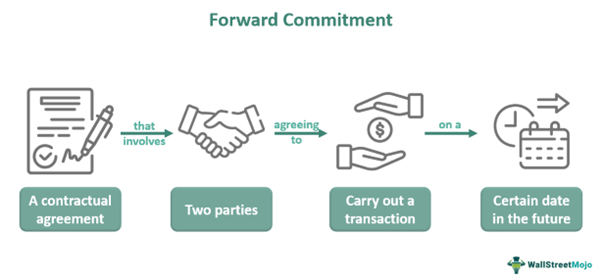

## Table of Contents

## What are derivatives and how do they function as forward commitments?

Derivatives are financial instruments whose value depends on the value of an underlying asset, like stocks, bonds, commodities, or currencies. They are called derivatives because their value is derived from something else. Common types of derivatives include futures, options, and swaps. These instruments allow investors to hedge against risks or speculate on the future price movements of the underlying asset without actually owning it.

As forward commitments, derivatives function by setting terms for a transaction that will occur at a future date. For example, a futures contract is a type of derivative where two parties agree to buy or sell an asset at a specific price on a specific future date. This agreement locks in the price today, which can protect the buyer or seller from price fluctuations in the future. By using derivatives as forward commitments, investors can manage their exposure to risk and potentially profit from changes in the market, even if they do not own the underlying asset.

## Can you explain the basic types of derivatives used as forward commitments?

The first basic type of derivative used as forward commitment is a futures contract. A futures contract is an agreement between two parties to buy or sell an asset at a set price on a future date. For example, a farmer might use a futures contract to lock in a price for their crops before they are harvested. This helps the farmer know how much money they will get, even if the market price changes later. People who trade futures don't have to own the actual asset; they just agree on a price for it in the future.

The second type is a forward contract. A forward contract is similar to a futures contract, but it is not traded on an exchange. Instead, it is a private agreement between two parties. For example, a company might enter into a forward contract to buy a certain amount of foreign currency at a set rate in the future. This can help the company plan its budget better, knowing exactly how much it will cost to buy the currency later. Like futures, forward contracts help manage risk by setting a price today for a transaction that will happen later.

The third type is an option. An option gives the buyer the right, but not the obligation, to buy or sell an asset at a set price before a certain date. There are two kinds of options: a call option, which gives the right to buy, and a put option, which gives the right to sell. For example, if you think the price of a stock will go up, you might buy a call option. This lets you buy the stock at today's price even if it goes up later. Options can be used to hedge against risk or to speculate on price movements, giving more flexibility than futures or forwards.

## How do forward contracts work and what are their key features?

Forward contracts are agreements between two people to buy or sell something at a set price on a future date. They are not traded on a public exchange like stocks, so they are private deals. For example, a company might want to buy oil in six months. They can make a forward contract with an oil seller to buy the oil at today's price, even if the price changes in the future. This helps the company plan its costs and avoid surprises.

A key feature of forward contracts is that they are customized. This means the people making the deal can decide on the amount, the price, and the date that works best for them. Another important feature is that forward contracts are not as regulated as other types of derivatives. This can make them riskier, but also more flexible. Finally, forward contracts are settled at the end of the contract term. This means that the buyer and seller must complete the transaction on the agreed date, or they might have to pay a penalty.

## What are futures contracts and how do they differ from forward contracts?

Futures contracts are agreements between two people to buy or sell something at a set price on a future date, just like forward contracts. The big difference is that futures contracts are traded on public exchanges, like the stock market. This means they are more standardized and regulated. For example, if you want to buy wheat in the future, you can go to a futures exchange and buy a futures contract for wheat. This helps farmers and buyers know what price they will get or pay, even if the market changes later.

The main difference between futures and forward contracts is how they are traded and settled. Futures contracts are traded on exchanges, which means they are more transparent and less risky. They also have daily settlements, where the value of the contract is adjusted every day based on the market price. This helps manage risk but can also mean you need to put up more money if the price goes against you. Forward contracts, on the other hand, are private deals that are not traded on exchanges. They are more flexible and customized but can be riskier because they are not as regulated and are settled only at the end of the contract term.

## What role do options play as forward commitments and how are they structured?

Options are another type of derivative that act as forward commitments. They give the buyer the right, but not the obligation, to buy or sell an asset at a set price before a certain date. This means you can choose to do the deal if it's good for you, or walk away if it's not. There are two types of options: call options, which let you buy something, and put options, which let you sell something. For example, if you think the price of a stock will go up, you might buy a call option. This lets you buy the stock at today's price, even if it goes up later.

Options are structured with a few key parts. First, there's the strike price, which is the price at which you can buy or sell the asset. Then, there's the expiration date, which is when the option stops working. If you don't use the option by this date, it's gone. Options also have a premium, which is the price you pay to buy the option. This is like the cost of having the choice to buy or sell later. Options can be used to hedge against risk or to speculate on price movements, giving more flexibility than futures or forwards.

## How do swaps function as derivatives and what types of swaps exist?

Swaps are another kind of derivative where two people agree to exchange cash flows or other financial things over time. They are used to manage risk or to get a better deal on money. For example, a company might want to change a loan from one that has a changing interest rate to one with a fixed rate. They can do this by making a swap with another company that wants the opposite. This way, both companies can get what they want without changing their original loans.

There are different types of swaps, but the most common ones are interest rate swaps and currency swaps. Interest rate swaps are when two people exchange interest payments. One might pay a fixed rate while the other pays a changing rate. This helps them manage the risk of interest rates going up or down. Currency swaps are when two people exchange payments in different currencies. This can help companies that do business in different countries manage the risk of currency values changing. Both types of swaps help companies plan better and protect themselves from surprises in the market.

## What are the main differences between exchange-traded and over-the-counter derivatives?

Exchange-traded derivatives are bought and sold on public exchanges, like the stock market. This makes them easy to find and trade. They are standardized, which means everyone knows exactly what they are getting. They are also regulated, which makes them safer but less flexible. For example, if you want to buy a futures contract for corn, you can go to a futures exchange and see all the different contracts available. This helps farmers and buyers know what price they will get or pay, even if the market changes later.

Over-the-counter (OTC) derivatives are different because they are not traded on public exchanges. Instead, they are private deals between two people. This makes them more flexible because the people making the deal can decide on the terms that work best for them. But they are also riskier because they are not as regulated. For example, a company might make an OTC forward contract to buy oil at a set price in the future. This helps them plan their costs, but if the other person can't pay, it could be a problem.

## How do valuation and pricing models for forward commitments work?

Valuation and pricing models for forward commitments help figure out what they are worth and how much they should cost. For a forward contract, the price is based on the difference between the forward price and the spot price of the asset. The forward price is what the asset will cost on the future date, and the spot price is what it costs now. To find the forward price, you need to think about things like interest rates, the cost of storing the asset, and any benefits you get from owning it, like dividends. If the forward price is higher than the spot price, you might have to pay more to make the forward contract. If it's lower, you might get paid to make the contract.

For options, the pricing is more complicated because they give you a choice. The most common model used is the Black-Scholes model. This model looks at things like the current price of the asset, the strike price of the option, how long until the option expires, the expected ups and downs in the asset's price, and interest rates. The model calculates a number called the option's premium, which is what you pay to buy the option. If you think the asset's price will move a lot, the option will be more expensive because there's a bigger chance it will be worth using. If the asset's price is expected to stay the same, the option will be cheaper because there's less chance it will be worth using.

## What are the risks associated with using derivatives as forward commitments?

Using derivatives as forward commitments can be risky because the value of the derivative depends on the value of something else, like a stock or a commodity. If the price of that thing changes a lot, the value of the derivative can go up or down quickly. This can be good if the price moves in your favor, but it can also mean you lose a lot of money if it moves against you. For example, if you buy a futures contract to buy oil at a set price and the price of oil goes down a lot, you will have to buy the oil at the higher price you agreed to, which could cost you a lot of money.

Another risk is that the other person in the deal might not be able to pay. This is called counterparty risk. If you make a private deal, like a forward contract, and the other person can't pay when it's time to settle the deal, you could lose money. Also, derivatives can be complicated and hard to understand. If you don't know how they work, you might make a bad deal or not know how much risk you are taking. It's important to understand these risks and maybe talk to someone who knows about derivatives before you use them.

## How can derivatives be used for hedging versus speculation?

Derivatives can be used for hedging to protect against risks. Imagine you own a farm and you're worried that the price of wheat might go down by the time you harvest your crop. You can use a futures contract to sell your wheat at today's price, even if the price drops later. This way, you know how much money you will get, no matter what happens to the market. Companies also use derivatives to hedge against changes in interest rates or currency values. By locking in prices or rates now, they can plan their budgets better and avoid surprises.

On the other hand, derivatives can be used for speculation to try and make money from price changes. If you think the price of a stock will go up, you can buy a call option. This gives you the right to buy the stock at today's price, even if it goes up later. If you're right and the price does go up, you can make a profit by buying the stock at the lower price and then selling it at the higher price. But speculation is risky because if you're wrong and the price goes down, you could lose the money you paid for the option. Speculators are willing to take this risk in hopes of making a big profit.

## What regulatory considerations should be taken into account when dealing with derivatives as forward commitments?

When dealing with derivatives as forward commitments, there are important rules and regulations to consider. These rules are set by governments and financial watchdogs to make sure that trading is fair and safe. For example, in the United States, the Commodity Futures Trading Commission (CFTC) and the Securities and Exchange Commission (SEC) oversee derivatives markets. They make sure that people trading derivatives follow the rules, like reporting their trades and not doing anything that could harm the market. These rules are important because they help prevent big problems, like the financial crisis that happened in 2008, which was partly caused by risky derivatives trading.

Another important thing to think about is the difference between exchange-traded and over-the-counter (OTC) derivatives. Exchange-traded derivatives, like futures contracts, have stricter rules because they are traded on public exchanges. These rules help make sure that everyone knows what they are buying and selling, and that the trades are fair. On the other hand, OTC derivatives, like forward contracts, have fewer rules because they are private deals. This can make them riskier, so it's important to be careful and maybe talk to a lawyer or a financial advisor to make sure you are following all the rules and understanding the risks.

## Can you discuss advanced strategies involving multiple types of derivatives used as forward commitments?

Advanced strategies involving multiple types of derivatives can help investors manage risk and increase their chances of making money. One common strategy is called a "straddle," where you buy both a call option and a put option on the same asset at the same time. This can be useful if you think the price of the asset will move a lot but you're not sure which way. If the price goes up a lot, you can use the call option to buy the asset at a lower price and then sell it at the higher price. If the price goes down a lot, you can use the put option to sell the asset at a higher price than it's worth now. This way, you can make money no matter which way the price moves, as long as it moves enough to cover the cost of both options.

Another strategy is called a "spread," where you buy and sell different options or futures contracts on the same asset but with different prices or dates. For example, you might buy a call option with a low strike price and sell a call option with a higher strike price. This is called a "bull call spread" and it can help you make money if the price of the asset goes up, but it limits how much you can lose if the price goes down. Spreads can also be used with futures contracts. For instance, you might buy a futures contract for oil that expires in six months and sell a futures contract for oil that expires in three months. This can help you make money from the difference in prices between the two contracts, without having to worry about the overall price of oil going up or down.

## What are some references and further reading materials?

Hull, J. C. "Options, Futures, and Other Derivatives" 9th Edition. Pearson. This comprehensive text presents a foundational understanding of derivative instruments, elucidating the principles and applications of options, futures, and other derivatives. It serves as an essential guide for anyone looking to grasp the complexities of these financial instruments and their usage in risk management. Hull's work is often cited for its clarity in explaining the mechanics of the derivatives market and their valuation.

Black, F., & Scholes, M. "The Pricing of Options and Corporate Liabilities." Journal of Political Economy. The seminal paper by Black and Scholes introduced the Black-Scholes model, a breakthrough in the pricing of options. This model provides a mathematical framework to determine the fair price of options, incorporating factors such as the underlying asset's price, the option's strike price, time to expiration, risk-free interest rate, and the asset's volatility. The formula introduced is:

$$
C = S_0 N(d_1) - X e^{-rT} N(d_2)
$$

where:
- $C$ is the option price
- $S_0$ is the current price of the stock
- $X$ is the strike price of the option
- $r$ is the risk-free interest rate
- $T$ is the time to maturity
- $N$ represents the cumulative distribution function of the standard normal distribution
- $d_1$ and $d_2$ are intermediary variables used in the calculation.

Chincarini, L. B., & Kim, D. "Quantitative Equity Portfolio Management: An Active Approach to Portfolio Construction and Management." McGraw-Hill. This book offers an in-depth approach to quantitative techniques in equity portfolio management. It combines theory with practical strategies to construct and manage equity portfolios, focusing on quantitative analysis methods to enhance investment performance. The authors blend traditional financial theory with modern quantitative strategies to provide a holistic view of active equity management.

Aldridge, I. "High-Frequency Trading: A Practical Guide to Algorithmic Strategies and Trading Systems." Wiley. Aldridge's work demystifies high-frequency trading ([HFT](/wiki/high-frequency-trading-strategies)) by providing practical insights into algorithmic strategies and trading system constructions. This text explores the technological and strategic underpinnings of HFT and offers guidance on building robust trading algorithms. Aldridge emphasizes the importance of speed and efficiency in executing transactions in modern financial markets, underscoring algorithmic trading's critical role.

## References & Further Reading

Hull, J. C. "Options, Futures, and Other Derivatives" 9th Edition. Pearson. This comprehensive text presents a foundational understanding of derivative instruments, elucidating the principles and applications of options, futures, and other derivatives. It serves as an essential guide for anyone looking to grasp the complexities of these financial instruments and their usage in risk management. Hull's work is often cited for its clarity in explaining the mechanics of the derivatives market and their valuation.

Black, F., & Scholes, M. "The Pricing of Options and Corporate Liabilities." Journal of Political Economy. The seminal paper by Black and Scholes introduced the Black-Scholes model, a breakthrough in the pricing of options. This model provides a mathematical framework to determine the fair price of options, incorporating factors such as the underlying asset's price, the option's strike price, time to expiration, risk-free interest rate, and the asset's volatility. The formula introduced is:

$$
C = S_0 N(d_1) - X e^{-rT} N(d_2)
$$

where:
- $C$ is the option price
- $S_0$ is the current price of the stock
- $X$ is the strike price of the option
- $r$ is the risk-free interest rate
- $T$ is the time to maturity
- $N$ represents the cumulative distribution function of the standard normal distribution
- $d_1$ and $d_2$ are intermediary variables used in the calculation.

Chincarini, L. B., & Kim, D. "Quantitative Equity Portfolio Management: An Active Approach to Portfolio Construction and Management." McGraw-Hill. This book offers an in-depth approach to quantitative techniques in equity portfolio management. It combines theory with practical strategies to construct and manage equity portfolios, focusing on quantitative analysis methods to enhance investment performance. The authors blend traditional financial theory with modern quantitative strategies to provide a holistic view of active equity management.

Aldridge, I. "High-Frequency Trading: A Practical Guide to Algorithmic Strategies and Trading Systems." Wiley. Aldridge's work demystifies high-frequency trading ([HFT](/wiki/high-frequency-trading-strategies)) by providing practical insights into algorithmic strategies and trading system constructions. This text explores the technological and strategic underpinnings of HFT and offers guidance on building robust trading algorithms. Aldridge emphasizes the importance of speed and efficiency in executing transactions in modern financial markets, underscoring algorithmic trading's critical role.

