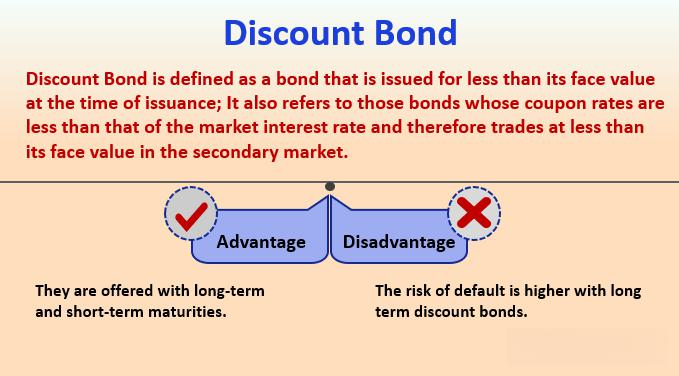

Discounts and pricing strategies are pivotal elements in modern trading, serving as tools to optimize financial performance and achieve competitive advantage. These strategies include a wide range of approaches such as volume-based pricing, time-limited offers, and customer-specific terms, primarily aimed at enhancing sales volume, customer loyalty, and market penetration.

The integration of discounts in algorithmic trading has revolutionized how these pricing strategies are employed. Algorithmic trading systems, or "algos," automatically execute trades based on pre-set rules, which can incorporate complex pricing strategies like discounts and rebates. These systems leverage large datasets and real-time market analytics to identify optimal trading opportunities, often executing high-frequency transactions that are sensitive to small price differences. The inclusion of discounts as variables in these algorithms can lead to significant cumulative savings and profitability. For instance, if a trader can program an algorithm to buy securities when a specific discount threshold is met, it might effectively capitalize on short-term price inefficiencies and generate returns.



Financial dynamics in trading have become more complex with the inclusion of discounts and rebates. These tools not only affect immediate transactional decisions but also influence broader trading strategies and outcomes. Discounts alter the perceived value of securities, potentially affecting investor behavior and market trends. They act as incentives for buyers, encouraging market participation and liquidity. Meanwhile, rebates, often used in high-frequency trading, serve as an enticing factor reducing transaction costs and enhancing the attractiveness of specific exchanges or platforms. This, in turn, fosters an environment conducive to increased trading activity and competition.

Modern trading strategies must therefore carefully assess the applicability and potential impact of discounts and rebates. As technological advancements in trading systems continue to evolve, the ability to integrate sophisticated pricing models into algorithmic trading represents both a challenge and an opportunity. Successfully leveraging these dynamics requires not only advanced technological capabilities but also a deep understanding of market conditions and consumer behavior.

## Table of Contents

## The Concept of Discounts in Trading

A discount in securities trading refers to the situation where a security is purchased for less than its face value or intrinsic worth. This concept is crucial in understanding pricing dynamics within various markets and arises from factors such as interest rate changes, credit risk assessments, and market demand fluctuations.

In the bond market, discounts commonly occur when bonds are traded below their face (par) value. This usually happens when the bond's coupon rate is lower than the prevailing market interest rates. For example, if a bond with a face value of $1,000 offers a 3% coupon rate while the market rates rise to 5%, investors will likely only purchase this bond if it is sold at a discount, making its effective yield competitive with the market rate. The discount on bonds can be calculated using the formula:

$$
\text{Discount} = \text{Face Value} - \text{Market Price}
$$

In equity markets, discounts may arise during initial public offerings (IPOs) when shares are intentionally underpriced to stimulate investor interest and ensure successful sales.

Conversely, the concept of premiums describes securities that are priced above their face value. Premiums typically occur when a bond's coupon rate is higher than the current market interest rates, attracting investors to pay more for higher returns. Distinguishing between discounts and premiums is vital for investors making informed purchasing decisions.

Additionally, the term "discount rate" differs from a straight discount. In economic contexts, the discount rate is the [interest rate](/wiki/interest-rate-trading-strategies) used to determine the present value of future cash flows. It reflects the time value of money, risk factors, and opportunity costs, guiding investors on the appropriate price to pay for anticipated future returns.

In summary, the difference between discounts, premiums, and discount rates lies in their application to pricing strategies and valuation assessments within financial markets. Understanding these concepts allows participants to evaluate investment opportunities, considering market conditions and personal financial goals.

## Types of Discount Pricing Strategies

Discount pricing strategies are pivotal in modern trading, influencing both consumer behavior and investor decision-making. These strategies can significantly alter market dynamics, trader profitability, and consumer choices. The primary forms of discount pricing strategies include [volume](/wiki/volume-trading-strategy) discounts, cash discounts, and seasonal discounts, each with distinct applications and impacts.

### Volume Discounts

Volume discounts are reductions in price given to buyers purchasing goods in large quantities. This strategy is prevalent in wholesale markets and institutional trading where bulk transactions are common. In electronic trading platforms, volume discounts might be incorporated into fee structures where larger orders incur lower per-unit trading fees. For instance, exchanges might reduce commission fees for high-frequency traders executing large volumes, thereby incentivizing greater trading activity.

Volume discounts can affect investor behavior by encouraging buyers to consolidate their trades to benefit from lower costs. This aggregation can lead to increased [liquidity](/wiki/liquidity-risk-premium) and tighter bid-ask spreads, impacting market efficiency positively. The formula for calculating the effective price per unit after a volume discount can be represented as:

$$
\text{Effective Price} = \frac{\text{Total Cost} - \text{Discount}}{\text{Quantity}}
$$

### Cash Discounts

Cash discounts offer price reductions for payments made promptly. In trading, these can manifest as lower fees for transactions settled within a shorter period or for utilizing certain payment methods. Although less common in real-time trading due to the instantaneous nature of electronic payments, cash discounts are more frequent in over-the-counter (OTC) markets and longer-term contractual agreements.

For investors, cash discounts serve as an incentive to select faster payment options or prompt settlement systems, enhancing cash flow and reducing counterparty risk. This strategy can enhance a trader's creditworthiness and operational efficiency, especially in turbulent markets where liquidity is crucial.

### Seasonal Discounts

Seasonal discounts are price reductions aligned with specific times of the year, typically when the demand for certain securities or commodities fluctuates due to seasonal trends. In trading, these discounts can be observed in agricultural commodities or energy products, which have cyclical demand patterns. For instance, natural gas may have different pricing elements factored in during winter months when demand surges.

Seasonal discounts impact investor behavior by encouraging them to time their market entries and exits strategically. Investors might increase their positioning to capitalize on lower prices ahead of anticipated demand spikes. Consequently, market sentiment and trading volumes can become more predictable, driven by these calendar-based pricing considerations.

Several trading contexts demonstrate the effectiveness of these discount strategies. For example, in futures markets, hedgers might utilize volume discounts to lower the cost of large futures contracts used for risk management. In equity markets, institutional investors can benefit from cash discounts when executing substantial trades to rebalance portfolios. Meanwhile, commodity traders keenly observe seasonal discounts, optimizing their trades to align with predictable demand cycles.

Each discount strategy shapes market participants' decision-making processes uniquely. While volume discounts drive economies of scale, cash discounts enhance cash management, and seasonal discounts optimize timing decisions. Traders and investors adept at leveraging these strategies can achieve significant competitive advantages, adapting to varied market conditions with agility and precision.

## Rebates and Their Role in Trading

Rebates are payments returned to buyers after a transaction is completed, differing from traditional discounts that are applied at the point of sale. While discounts reduce the price upfront, rebates require an initial full payment, with a portion returned later. This distinction affects how both incentives are used strategically, particularly in financial trading and sales environments.

Rebates can be categorized into several types, each with distinct characteristics. Conditional rebates are contingent upon specific criteria being met. For example, a rebate may be issued only if a customer makes subsequent purchases within a designated period. This type incentivizes continued engagement and can enhance customer loyalty.

Flat-rate rebates offer a fixed return irrespective of the total spending. These are simple to administer and understand, making them attractive to both vendors and consumers. Flat-rate rebates often attract new customers by providing a predictable financial incentive for purchase.

Vendor and customer rebates differ based on their point of origin. Vendor rebates are offered by manufacturers or producers, intended to stimulate demand for their products through retailers. Conversely, customer rebates are often tied directly to the end consumer, motivating them to make the initial purchase decision by promising a future financial return.

In high-frequency trading ([HFT](/wiki/high-frequency-trading-strategies)) and [algorithmic trading](/wiki/algorithmic-trading), rebates play a pivotal role by influencing order flow and execution strategies. Exchanges may provide liquidity rebates to market participants who add liquidity, with traders using sophisticated algorithms to optimize the receipt of these rebates. This dynamic can be expressed mathematically as traders aim to maximize:

$$
P_{\text{net}} = P_{\text{gross}} + R - C
$$

Where:
- $P_{\text{net}}$ is the net profit considering the rebates and costs.
- $P_{\text{gross}}$ represents the gross profit.
- $R$ signifies the rebate received.
- $C$ denotes the costs involved, such as transaction and operational costs.

The strategy to capture rebates requires precise timing and execution, achievable through algorithmic trading that leverages technologies for swift decision-making and minimal latency. Algorithms are calibrated to identify opportunities where rebates can offset trading costs, potentially turning low-margin trades profitable. This type of trading employs conditional logic and probabilistic models to determine optimal entry and [exit](/wiki/exit-strategy) points, thereby maximizing rebate benefits while managing risk.

In conclusion, rebates serve as powerful tools in trading strategy, often utilized for their ability to enhance liquidity and improve trading cost structures. Through algorithmic approaches, traders can harness the full potential of rebates, optimizing their strategies to offset costs and achieve favorable trading outcomes.

## Rebates vs. Discounts: A Comparative Analysis

Rebates and discounts, while often perceived as similar price reduction mechanisms, have distinct applications and implications in trading. Understanding these differences is crucial for stakeholders aiming to optimize their trading strategies.

**Differences in Applications**

Discounts are typically applied upfront, providing an immediate reduction in the purchase price of a financial instrument. This mechanism is straightforward and involves adjusting the price at the point of transaction. For instance, a volume discount might be applied when an investor purchases a large quantity of shares, thereby encouraging the buy-in of larger volumes through a direct price reduction.

Rebates, conversely, function as post-purchase incentives. They are contingent upon certain conditions being met after the initial transaction. These might include achieving specific trading volumes over a period or maintaining a particular order flow. Rebates are common in high-frequency and algorithmic trading, where they incentivize market participants to engage in desired trading behaviors such as providing liquidity.

**Long-term Value and Consumer Perception**

From a psychological perspective, discounts are often perceived by consumers and investors as more tangible and immediate benefits, potentially influencing their purchasing decisions quickly. The immediate price reduction can enhance the perceived value of a transaction, making it an attractive option for cost-sensitive investors.

Rebates, however, might be seen as more complex due to their conditional nature. They can influence long-term trading behavior by offering deferred monetary benefits. This deferred nature can align traders' strategies with the long-term objectives of exchanges or brokers, such as maintaining market stability or ensuring liquidity. However, the complexity and delay in receiving rebates may lead to a less favorable perception compared to the simplicity and immediacy of discounts.

**Case Studies Illustrating Effectiveness**

1. **Case Study 1: High-Frequency Trading (HFT)**

   In high-frequency trading, rebates are often preferred over discounts because they reward traders for providing liquidity, which is essential for maintaining efficient markets. For instance, electronic communication networks (ECNs) might offer market makers a rebate for every transaction executed that adds liquidity to their platforms. This strategic application has shown that such rebate schemes can significantly increase trading volumes and market depth, illustrating the effectiveness of rebates in fostering an active trading environment.

2. **Case Study 2: Retail Investor Discounts**

   On the flip side, a study involving retail investors in the bond market highlighted the effectiveness of discounts. Retail brokers offered upfront discounts for bulk purchases of corporate bonds, which led to an immediate spike in trading volumes. Investors, motivated by the instant reduction in purchase cost, were more likely to commit to substantial investments, demonstrating how discounts can effectively drive short-term trading activities.

In summary, while both rebates and discounts serve to reduce costs in trading, they do so in fundamentally different ways, each with unique strategic advantages and consumer perceptions. The choice between rebates and discounts is often dictated by the specific trading context and the objectives of the market participants involved.

## Algorithmic Trading and Discount Strategies

Algorithmic trading, often known as algo trading, involves using computer programs and systems to execute trades at speeds and frequencies impossible for human traders. The integration of discounts and rebates in these systems has become pivotal in optimizing trading strategies, effectively enhancing profitability and overall market efficiency.

Discounts and rebates can be seamlessly integrated into algorithmic trading systems due to their ability to be quantified and computed in real-time. These systems are often structured using advanced mathematical models and data inputs to identify and leverage available price reductions. For instance, an algorithm might be designed to [factor](/wiki/factor-investing) in volume discounts, which are reductions on large transactions. The algorithm can analyze current order sizes and estimate whether a higher cumulative order would result in lower transaction costs due to a volume discount.

Additionally, algo trading systems frequently capitalize on rebates offered by exchanges for adding liquidity to the market. When a trade is executed that provides liquidity, the trader might receive a rebate from the exchange. Algorithms can be programmed to prioritize trades that would earn such rebates, thus minimizing costs. Python, a popular language in algorithmic trading due to its extensive libraries and ease of use, can be employed to implement these strategies. For example, an algorithm could use historical trade data to predict which trades are more likely to qualify for rebates and adjust its execution strategy accordingly:

```python
def analyze_trade_opportunities(trade_data, volume_discount_threshold, rebate_qualifying_order):
    qualifying_trades = []
    for trade in trade_data:
        if trade['volume'] > volume_discount_threshold:
            trade['effective_cost'] -= trade['discount']
        if trade['type'] == 'limit' and trade['order_size'] >= rebate_qualifying_order:
            trade['effective_cost'] -= trade['rebate']
            qualifying_trades.append(trade)
    return qualifying_trades

trade_data = [{'volume': 1000, 'discount': 0.01, 'type': 'limit', 'order_size': 500, 'rebate': 0.02}]
result = analyze_trade_opportunities(trade_data, 900, 100)
print(result)
```

This simple function evaluates trades to determine which qualify for volume discounts and rebates based on thresholds, ultimately pointing to trades that optimize cost reductions.

The advantages of automated trading strategies incorporating pricing incentives are manifold. Firstly, they allow for instant reaction to market conditions, including potential pricing incentives, thus reducing latency and maximizing the capture of available discounts. Secondly, they enable the continuous monitoring of market prices across multiple exchanges, optimizing trades that earn rebates while ensuring competitive pricing. Thirdly, these strategies contribute to a significant reduction in operational costs since they are devoid of the errors and limitations inherent in manual trading.

Incorporating discounts and rebates into algorithmic trading not only enhances the financial returns for traders but also contributes to a more efficient and liquid financial market. By capitalizing on pricing incentives, algo traders help narrow bid-ask spreads and increase market volume, ultimately benefiting all participants in the trading ecosystem.

## Future Trends in Discount Strategies and Algo Trading

Predicting future trends in discounts and rebates within the context of algorithmic trading involves evaluating technological advancements and potential regulatory changes. As technology continues to evolve, [machine learning](/wiki/machine-learning) (ML) and [artificial intelligence](/wiki/ai-artificial-intelligence) (AI) stand poised to revolutionize pricing strategies further. These technologies offer nuanced ways to optimize discount strategies by analyzing vast datasets to detect patterns and forecast trends with higher precision.

### Role of Technology, ML, and AI

**Machine Learning Models:** Machine learning algorithms can process large amounts of historical trading data to identify patterns in discount and rebate applicability. By employing regression models or neural networks, trading systems can predict when securities are likely to be undervalued. For instance, a supervised learning algorithm might learn from past transactions to forecast future price declines, facilitating timely discount offers.

Python code snippet:
```python
from sklearn.linear_model import LinearRegression
import numpy as np

# Sample data: past discounts and corresponding trading volumes
discounts = np.array([[0.05], [0.10], [0.15], [0.20]])
volumes = np.array([1000, 1500, 1700, 2100])

# Create linear regression model
model = LinearRegression()
model.fit(discounts, volumes)

# Predict trading volume for a new discount rate
new_discount = np.array([[0.12]])
predicted_volume = model.predict(new_discount)
print(f"Predicted trading volume for 12% discount: {predicted_volume[0]}")
```

**AI and Automation:** AI can automate decision-making processes in algorithmic trading, thereby enhancing efficiency. Deep learning models could provide algorithms with the ability to appraise complex interactions between various factors, such as discount rates, market volatility, and investor behavior, optimizing discount offers dynamically.

**Blockchain Technology:** Blockchain can introduce transparency and security in trading transactions. Smart contracts could automate and securely execute rebate agreements, ensuring that conditions are met before rebates are applied. This technology also aids in the verification and validation of discounts, reducing the risk of fraud and errors.

### Regulatory Changes 

As algorithmic trading intertwined with discounts and pricing strategies becomes more prevalent, regulatory scrutiny is likely to increase. Potential regulatory changes could influence discount strategies in several ways:

**Enhanced Disclosure Requirements:** Regulators may mandate detailed disclosures regarding discount and rebate structures to prevent market manipulation and ensure fair trading practices. This could involve outlining the conditions under which discounts are applicable or how rebates are calculated and executed.

**Risk Management Protocols:** Regulatory focus on risk management might require firms to adhere to stricter guidelines when using automated systems for trading. Companies might need to demonstrate that their algorithms are not only financially sound but also ethically aligned with industry standards.

**Incentive Structures:** Regulations might address the fairness of incentives provided by discounts, ensuring that they do not unfairly favor certain participants over others. This could lead to limitations on the kinds of rebates allowed, such as conditional or vendor/customer rebates, to maintain market balance.

### Conclusion

Emerging trends will likely see further integration of advanced technologies to optimize discount and rebate strategies in algorithmic trading. However, these advancements will also prompt regulatory bodies to step in and safeguard market integrity. The balance between innovation and regulation will shape the future landscape, potentially redefining how discounts and rebates serve the trading community.

## Conclusion

Discounts and pricing strategies hold significant strategic importance in trading, influencing market dynamics and participant behavior. As financial markets advance, the integration of discounts offers both opportunities and challenges, especially when incorporated into algorithmic trading systems.

Discounts can provide traders a competitive edge by reducing transaction costs and improving financial efficiency. For instance, volume discounts incentivize traders to increase their trading volume, thereby benefiting from reduced per-unit costs. In algorithmic trading, where trades are executed rapidly, even minor cost reductions through discounts can result in substantial profit margins. The complexity arises in designing algorithms that can effectively identify and leverage these discounts. Algorithms must be sophisticated enough to adjust trading strategies dynamically in response to changing market conditions and discount availability. The integration of these discounts mandates a profound understanding of both market mechanics and computational techniques.

Rebates further enhance trading strategies by offering financial incentives post-transaction. In high-frequency trading (HFT), where the speed of execution is paramount, integrating rebate strategies can significantly enhance profit margins. However, this integration requires algorithms capable of assessing not only immediate pricing advantages but also long-term rebate implications.

The strategic use of discounts and rebates also necessitates careful consideration of regulatory environments. As regulations evolve to keep pace with technological advancements, trading strategies must be adaptable to maintain compliance and optimize benefits.

Encouraging the exploration of discount strategies is crucial to enhancing trading outcomes. Traders and institutions should continuously innovate to refine their algorithms, ensuring they remain competitive. This involves leveraging technologies such as machine learning and artificial intelligence, which can optimize the use of discounts by analyzing vast datasets to predict market behavior and discount trends.

In conclusion, discounts and pricing strategies are vital tools in modern trading, offering avenues for cost reduction and competitive advantage. As markets become increasingly automated, the intelligent integration of these strategies holds the key to unlocking superior trading performance. Embracing ongoing exploration and technological advancement in discount strategies will be instrumental in shaping future trading landscapes.

## References & Further Reading

[1]: Schumaker, R. P., Chen, H., & Johnson, J. (2012). ["Textual analysis of stock market prediction using breaking financial news: The AZFinText system"](https://dl.acm.org/doi/10.1145/1462198.1462204). Expert Systems with Applications.

[2]: Tomasini, E., & Jaekle, U. (2011). ["Trading Systems 2nd Edition: A New Approach to System Development and Portfolio Optimisation"](https://www.amazon.com/Trading-Systems-2nd-development-optimisation/dp/085719755X).

[3]: Aldridge, I. (2013). ["High-Frequency Trading: A Practical Guide to Algorithmic Strategies and Trading Systems"](https://www.amazon.com/High-Frequency-Trading-Practical-Algorithmic-Strategies/dp/1118343506). Wiley Trading.

[4]: Hasbrouck, J. (2003). ["Intraday Price Formation in U.S. Equity Index Markets"](https://onlinelibrary.wiley.com/doi/10.1046/j.1540-6261.2003.00609.x). The Journal of Finance.

[5]: Narang, R. K. (2013). ["Inside the Black Box: A Simple Guide to Quantitative and High-Frequency Trading"](https://onlinelibrary.wiley.com/doi/book/10.1002/9781118662717).