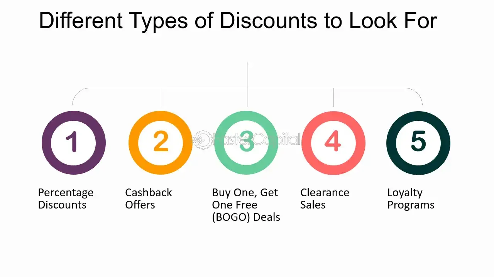

## Table of Contents

## What is a discount?

A discount is when you pay less for something than the usual price. Stores and businesses give discounts to make people want to buy their things. It's like a special offer that makes the price lower for a short time.

Discounts can happen in many ways. Sometimes you get a percentage off, like 10% or 20% less. Other times, it might be a fixed amount off, like $5 or $10 less. Discounts can be for everyone or just for some people, like students or members of a club.

## What are the most common types of discounts?

The most common types of discounts are percentage discounts and fixed amount discounts. A percentage discount means you get a certain percent off the original price, like 15% or 25% off. This type of discount is easy to understand because it shows how much less you pay compared to the full price. A fixed amount discount is when you get a specific dollar amount off, like $10 or $20 off. This type is straightforward because you know exactly how much money you save.

Another common type of discount is the seasonal discount. These discounts happen during certain times of the year, like holidays or the end of a season. For example, you might see big discounts during Black Friday or at the end of summer. Seasonal discounts help stores sell more items when people are more likely to buy.

There are also special discounts for certain groups of people, like students, seniors, or military members. These are called group discounts. Stores give these discounts to thank certain groups or to attract more customers from those groups. For example, a store might offer a student discount to get more young people to shop there.

## How do percentage discounts work?

Percentage discounts are when you get a certain part of the price taken off. For example, if something costs $100 and you get a 20% discount, you pay 20% less. To find out how much you save, you multiply the original price by the percentage. So, $100 times 20% (which is the same as 0.20) equals $20. That means you save $20, and you only pay $80 for the item.

These discounts are common because they are easy to understand and apply to all kinds of prices. Stores might offer different percentage discounts, like 10%, 15%, or even 50% off. The bigger the percentage, the more money you save. For example, a 50% discount on a $50 item means you only pay $25. Percentage discounts can be used for sales, special events, or to reward loyal customers.

## What is a fixed amount discount and how is it applied?

A fixed amount discount is when you get a specific amount of money off the price of something. For example, if an item costs $50 and you get a $10 discount, you pay $10 less. So, instead of paying $50, you only pay $40. This type of discount is easy to understand because you know exactly how much money you save.

Fixed amount discounts are often used for special promotions or to clear out old stock. Stores might offer a $5 discount on all items over $25, or a $20 discount on a specific product to make it sell faster. These discounts can be applied at the checkout, either automatically or by using a coupon or promo code.

## Can you explain buy-one-get-one-free (BOGO) discounts?

Buy-one-get-one-free, or BOGO, discounts are when you buy one item and get another one for free. It's a special deal that stores use to make people buy more. When you see a BOGO offer, you pay for one thing, but you take home two. For example, if you want to buy a pair of shoes that are on a BOGO deal, you pay for one pair and get another pair for free.

Stores like BOGO deals because they help sell more products. People often buy things they might not have bought if it wasn't for the free item. BOGO discounts can be for the same item, like two shirts, or for different items, like buy a shirt and get a free pair of socks. These deals make customers feel like they are getting a lot of value for their money.

## What are seasonal discounts and when are they typically offered?

Seasonal discounts are special price cuts that stores offer during certain times of the year. These times are often linked to holidays, changes in seasons, or big shopping events. For example, you might see big discounts around Christmas, during back-to-school time, or on Black Friday. Stores use seasonal discounts to sell more products when people are more likely to buy things.

These discounts can be really big, sometimes even up to 50% or more off the regular price. Stores want to get rid of old stock to make room for new items. For example, at the end of summer, you might find big discounts on swimsuits and summer clothes because stores want to sell them before fall and winter items come in. Seasonal discounts are a great way for shoppers to save money and for stores to keep their shelves fresh with new products.

## How do volume discounts benefit both the buyer and the seller?

Volume discounts help buyers save money when they buy a lot of something. If you need to buy many items, like pens for your office or food for a party, you can get a lower price per item if you buy them in bulk. This means you spend less money overall. For example, if you buy 100 pens, you might get each pen for less than if you bought just 10. This makes it easier for buyers to get what they need without spending too much.

Sellers also benefit from volume discounts because they can sell more products at once. When people buy in large amounts, the store moves more stock quickly. This is good for the seller because it helps them clear out inventory and make room for new products. Plus, selling more items at a slightly lower price per item can still be profitable for the seller because they make up for it with the higher total sales volume.

## What are loyalty discounts and how do they encourage customer retention?

Loyalty discounts are special price cuts that stores give to people who keep coming back to shop with them. When you buy things often from the same store, they might give you a discount to say thank you. This can be a percentage off your total, like 10% off, or a fixed amount, like $5 off. Stores keep track of your purchases with a loyalty card or an account, so they know how much you've spent and can give you the right discount.

These discounts help keep customers coming back because they feel like they are getting a good deal. When people know they can save money by shopping at the same store, they are more likely to choose that store over others. This helps the store keep its customers happy and loyal, which is good for business because it means more regular sales. Loyalty discounts make customers feel valued and encourage them to keep shopping there instead of going somewhere else.

## Can you describe the mechanics of tiered pricing discounts?

Tiered pricing discounts work by giving you bigger discounts the more you buy. Imagine you want to buy some books. If you buy one book, you might not get any discount. But if you buy two books, you could get a small discount, like 5% off. If you buy four books, the discount might go up to 10% off. The more books you buy, the bigger the discount you get. This is called tiered pricing because the discounts are in different levels or "tiers."

Stores use tiered pricing discounts to encourage people to buy more. When customers see that they can save more money by buying more items, they are more likely to spend more money at once. This helps the store sell more products quickly. For example, a store might say, "Buy 3 items and get 10% off, buy 5 items and get 20% off." This way, the store can move a lot of stock and the customer feels like they are getting a better deal the more they buy.

## How do promotional codes work as a form of discount?

Promotional codes, or promo codes, are special codes that you can use to get a discount when you shop. When you're buying something online or in a store, you can enter the code during checkout. The code might give you a percentage off, like 15% off your total, or a fixed amount off, like $10 off. Sometimes, promo codes are for free shipping or a free gift with your purchase. You can find these codes on the store's website, in emails, or on special websites that collect promo codes.

Stores use promo codes to attract more customers and to get people to buy more. When you see a promo code that saves you money, you might decide to buy something you were thinking about. It's like a special offer that makes the price lower for a short time. This helps the store sell more products and makes customers happy because they feel like they are getting a good deal.

## What are the tax implications of different types of discounts?

When you get a discount, it can change how much tax you pay. The tax you pay is usually based on the price you actually pay after the discount. So, if you get a $10 discount on something that costs $50, you only pay tax on the $40 you actually spend. This means discounts can help you save money on taxes too. For example, if the tax rate is 10%, you would pay $5 in tax instead of $5.50 if you didn't get the discount.

Different types of discounts might affect taxes in different ways. For example, with a percentage discount, the tax is calculated on the reduced price. If you get 20% off a $100 item, you pay tax on $80. With a fixed amount discount, like $10 off, the tax is calculated on the final price after the discount. BOGO discounts can be a bit more complicated because you might pay tax on the full price of the item you buy, but not on the free item. It's always good to check with the store or look at your receipt to see how the tax was calculated with your discount.

## How can businesses strategically use discounts to optimize profit margins?

Businesses can use discounts to boost their profits by getting more people to buy their stuff. When they offer discounts, more customers come to the store because they want to save money. This can help the business sell more products, even if they are selling each item for a little less. For example, if a store has a lot of old stock that they want to get rid of, they can use discounts to sell it quickly and make room for new items. This way, the business can keep their inventory fresh and keep making money.

Another way businesses use discounts is to make customers come back more often. By giving loyalty discounts, they can make people feel special and want to keep shopping there. This can lead to more regular sales, which is good for the business's profit margins over time. Also, discounts like volume discounts can encourage people to buy more at once, which helps the business sell a lot of products quickly. This can be more profitable than selling a few items at a time at full price.

## What is the Concept of Discounts in Trading?

A discount in securities trading refers to the situation where a security is purchased for less than its face value or intrinsic worth. This concept is crucial in understanding pricing dynamics within various markets and arises from factors such as interest rate changes, credit risk assessments, and market demand fluctuations.

In the bond market, discounts commonly occur when bonds are traded below their face (par) value. This usually happens when the bond's coupon rate is lower than the prevailing market interest rates. For example, if a bond with a face value of $1,000 offers a 3% coupon rate while the market rates rise to 5%, investors will likely only purchase this bond if it is sold at a discount, making its effective yield competitive with the market rate. The discount on bonds can be calculated using the formula:

$$
\text{Discount} = \text{Face Value} - \text{Market Price}
$$

In equity markets, discounts may arise during initial public offerings (IPOs) when shares are intentionally underpriced to stimulate investor interest and ensure successful sales.

Conversely, the concept of premiums describes securities that are priced above their face value. Premiums typically occur when a bond's coupon rate is higher than the current market interest rates, attracting investors to pay more for higher returns. Distinguishing between discounts and premiums is vital for investors making informed purchasing decisions.

Additionally, the term "discount rate" differs from a straight discount. In economic contexts, the discount rate is the [interest rate](/wiki/interest-rate-trading-strategies) used to determine the present value of future cash flows. It reflects the time value of money, risk factors, and opportunity costs, guiding investors on the appropriate price to pay for anticipated future returns.

In summary, the difference between discounts, premiums, and discount rates lies in their application to pricing strategies and valuation assessments within financial markets. Understanding these concepts allows participants to evaluate investment opportunities, considering market conditions and personal financial goals.

## What are the types of discount pricing strategies?

Discount pricing strategies are pivotal in modern trading, influencing both consumer behavior and investor decision-making. These strategies can significantly alter market dynamics, trader profitability, and consumer choices. The primary forms of discount pricing strategies include [volume](/wiki/volume-trading-strategy) discounts, cash discounts, and seasonal discounts, each with distinct applications and impacts.

### Volume Discounts

Volume discounts are reductions in price given to buyers purchasing goods in large quantities. This strategy is prevalent in wholesale markets and institutional trading where bulk transactions are common. In electronic trading platforms, volume discounts might be incorporated into fee structures where larger orders incur lower per-unit trading fees. For instance, exchanges might reduce commission fees for high-frequency traders executing large volumes, thereby incentivizing greater trading activity.

Volume discounts can affect investor behavior by encouraging buyers to consolidate their trades to benefit from lower costs. This aggregation can lead to increased [liquidity](/wiki/liquidity-risk-premium) and tighter bid-ask spreads, impacting market efficiency positively. The formula for calculating the effective price per unit after a volume discount can be represented as:

$$
\text{Effective Price} = \frac{\text{Total Cost} - \text{Discount}}{\text{Quantity}}
$$

### Cash Discounts

Cash discounts offer price reductions for payments made promptly. In trading, these can manifest as lower fees for transactions settled within a shorter period or for utilizing certain payment methods. Although less common in real-time trading due to the instantaneous nature of electronic payments, cash discounts are more frequent in over-the-counter (OTC) markets and longer-term contractual agreements.

For investors, cash discounts serve as an incentive to select faster payment options or prompt settlement systems, enhancing cash flow and reducing counterparty risk. This strategy can enhance a trader's creditworthiness and operational efficiency, especially in turbulent markets where liquidity is crucial.

### Seasonal Discounts

Seasonal discounts are price reductions aligned with specific times of the year, typically when the demand for certain securities or commodities fluctuates due to seasonal trends. In trading, these discounts can be observed in agricultural commodities or energy products, which have cyclical demand patterns. For instance, natural gas may have different pricing elements factored in during winter months when demand surges.

Seasonal discounts impact investor behavior by encouraging them to time their market entries and exits strategically. Investors might increase their positioning to capitalize on lower prices ahead of anticipated demand spikes. Consequently, market sentiment and trading volumes can become more predictable, driven by these calendar-based pricing considerations.

Several trading contexts demonstrate the effectiveness of these discount strategies. For example, in futures markets, hedgers might utilize volume discounts to lower the cost of large futures contracts used for risk management. In equity markets, institutional investors can benefit from cash discounts when executing substantial trades to rebalance portfolios. Meanwhile, commodity traders keenly observe seasonal discounts, optimizing their trades to align with predictable demand cycles.

Each discount strategy shapes market participants' decision-making processes uniquely. While volume discounts drive economies of scale, cash discounts enhance cash management, and seasonal discounts optimize timing decisions. Traders and investors adept at leveraging these strategies can achieve significant competitive advantages, adapting to varied market conditions with agility and precision.

## What role do rebates play in trading?

Rebates are payments returned to buyers after a transaction is completed, differing from traditional discounts that are applied at the point of sale. While discounts reduce the price upfront, rebates require an initial full payment, with a portion returned later. This distinction affects how both incentives are used strategically, particularly in financial trading and sales environments.

Rebates can be categorized into several types, each with distinct characteristics. Conditional rebates are contingent upon specific criteria being met. For example, a rebate may be issued only if a customer makes subsequent purchases within a designated period. This type incentivizes continued engagement and can enhance customer loyalty.

Flat-rate rebates offer a fixed return irrespective of the total spending. These are simple to administer and understand, making them attractive to both vendors and consumers. Flat-rate rebates often attract new customers by providing a predictable financial incentive for purchase.

Vendor and customer rebates differ based on their point of origin. Vendor rebates are offered by manufacturers or producers, intended to stimulate demand for their products through retailers. Conversely, customer rebates are often tied directly to the end consumer, motivating them to make the initial purchase decision by promising a future financial return.

In high-frequency trading ([HFT](/wiki/high-frequency-trading-strategies)) and [algorithmic trading](/wiki/algorithmic-trading), rebates play a pivotal role by influencing order flow and execution strategies. Exchanges may provide liquidity rebates to market participants who add liquidity, with traders using sophisticated algorithms to optimize the receipt of these rebates. This dynamic can be expressed mathematically as traders aim to maximize:

$$
P_{\text{net}} = P_{\text{gross}} + R - C
$$

Where:
- $P_{\text{net}}$ is the net profit considering the rebates and costs.
- $P_{\text{gross}}$ represents the gross profit.
- $R$ signifies the rebate received.
- $C$ denotes the costs involved, such as transaction and operational costs.

The strategy to capture rebates requires precise timing and execution, achievable through algorithmic trading that leverages technologies for swift decision-making and minimal latency. Algorithms are calibrated to identify opportunities where rebates can offset trading costs, potentially turning low-margin trades profitable. This type of trading employs conditional logic and probabilistic models to determine optimal entry and [exit](/wiki/exit-strategy) points, thereby maximizing rebate benefits while managing risk.

In conclusion, rebates serve as powerful tools in trading strategy, often utilized for their ability to enhance liquidity and improve trading cost structures. Through algorithmic approaches, traders can harness the full potential of rebates, optimizing their strategies to offset costs and achieve favorable trading outcomes.

## References & Further Reading

[1]: Schumaker, R. P., Chen, H., & Johnson, J. (2012). ["Textual analysis of stock market prediction using breaking financial news: The AZFinText system"](https://dl.acm.org/doi/10.1145/1462198.1462204). Expert Systems with Applications.

[2]: Tomasini, E., & Jaekle, U. (2011). ["Trading Systems 2nd Edition: A New Approach to System Development and Portfolio Optimisation"](https://www.amazon.com/Trading-Systems-2nd-development-optimisation/dp/085719755X).

[3]: Aldridge, I. (2013). ["High-Frequency Trading: A Practical Guide to Algorithmic Strategies and Trading Systems"](https://www.amazon.com/High-Frequency-Trading-Practical-Algorithmic-Strategies/dp/1118343506). Wiley Trading.

[4]: Hasbrouck, J. (2003). ["Intraday Price Formation in U.S. Equity Index Markets"](https://onlinelibrary.wiley.com/doi/10.1046/j.1540-6261.2003.00609.x). The Journal of Finance.

[5]: Narang, R. K. (2013). ["Inside the Black Box: A Simple Guide to Quantitative and High-Frequency Trading"](https://onlinelibrary.wiley.com/doi/book/10.1002/9781118662717).