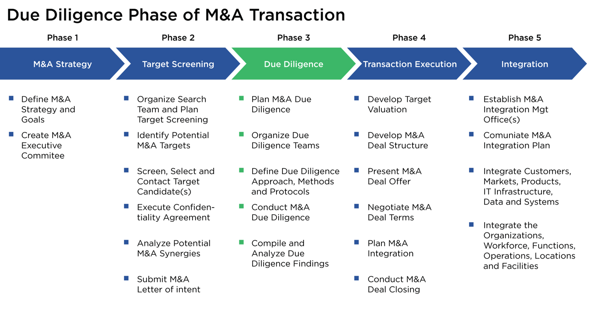

## Table of Contents

## What is due diligence and why is it important?

Due diligence is the careful checking and research that someone does before making a decision, especially in business. It's like doing your homework before buying something big, like a house or a company. You look at all the details to make sure everything is okay and there are no surprises later.

It's important because it helps you make smart choices. By doing due diligence, you can find out if there are any problems or risks with what you're thinking about buying or investing in. This can save you from making a big mistake and losing money. It also helps build trust because people know you've done your homework and are making a thoughtful decision.

## What are the main types of due diligence?

There are several main types of due diligence, but the most common ones are financial, legal, and operational. Financial due diligence looks at the money side of things. It checks the financial statements, like how much money the company makes and spends, to see if everything adds up and if the company is doing well financially. Legal due diligence makes sure the company is following all the laws and rules. It looks at contracts, licenses, and any lawsuits to make sure there are no legal problems that could cause trouble later.

Operational due diligence focuses on how the company runs day-to-day. It looks at things like the company's processes, its employees, and its suppliers to see if everything is working smoothly. This helps to understand if the company can keep doing what it's doing after you buy it or invest in it. Each type of due diligence is important because it helps you see the whole picture and make a better decision.

## Can you explain financial due diligence and its key components?

Financial due diligence is like checking the money health of a company before you decide to buy it or invest in it. It's all about looking at the company's financial statements to see if they are making money, spending money wisely, and if their numbers make sense. This helps you figure out if the company is a good investment or if there might be financial problems you need to worry about.

The key parts of financial due diligence include looking at the company's income statement, which shows how much money they are making and spending. You also look at the balance sheet, which tells you about the company's assets, like money and things they own, and their liabilities, like debts they owe. Another important part is the cash flow statement, which shows how money moves in and out of the company. By checking all these, you can see if the company is financially strong and if their money story adds up.

## What is legal due diligence and what does it typically cover?

Legal due diligence is like checking the legal health of a company before you decide to buy it or invest in it. It's all about making sure the company is following all the laws and rules. You look at things like contracts, licenses, and any lawsuits to make sure there are no legal problems that could cause trouble later. This helps you understand if the company is doing things the right way and if there are any legal risks you need to know about.

When you do legal due diligence, you typically look at the company's contracts with customers, suppliers, and employees. You check if these contracts are valid and if they have any clauses that could be risky. You also look at any licenses the company needs to operate and make sure they are up to date. Another big part is checking for any past or current lawsuits. This helps you see if the company has been in legal trouble before and if there are any ongoing issues that could affect your decision. By doing all this, you can get a clear picture of the company's legal standing and make a smarter choice.

## How does operational due diligence differ from other types?

Operational due diligence is different from other types because it focuses on how a company runs every day. It's like looking under the hood of a car to see if everything is working smoothly. While financial due diligence checks the money side and legal due diligence looks at the laws and rules, operational due diligence is all about the company's processes, employees, and suppliers. It helps you understand if the company can keep doing what it's doing after you buy it or invest in it.

This type of due diligence looks at things like how the company makes its products or provides its services, how well its employees are doing their jobs, and if the company has good relationships with its suppliers. It's important because even if a company looks good on paper financially and legally, if its day-to-day operations are a mess, it could still be a bad investment. By checking the operational side, you get a full picture of how the company works and if it can keep running well in the future.

## What role does commercial due diligence play in business transactions?

Commercial due diligence is like checking if a business can make money in the future. It looks at things like the market the business is in, who its customers are, and what its competitors are doing. This helps you see if the business has a good chance of growing and making more money down the road. It's different from financial due diligence, which looks at the money the business has made in the past, because commercial due diligence is all about what might happen next.

When you're thinking about buying a business or investing in it, commercial due diligence is really important. It helps you understand if the business can keep its customers happy and if it can beat its competitors. By doing this kind of check, you can make a smarter decision about whether the business is a good investment. It's like looking into a crystal ball to see if the business has a bright future ahead.

## What are some common methods used to perform due diligence?

Due diligence can be done in many ways, but some common methods include looking at documents, talking to people, and using special tools. When you look at documents, you check things like financial statements, contracts, and legal papers to see if everything is okay. Talking to people means having meetings with the company's managers, employees, and sometimes even customers to get a better understanding of how the company works. Special tools, like software, can help you analyze data and find patterns that might be hard to see just by looking at numbers.

Another method is doing site visits. This means going to the company's offices or factories to see how things are done in real life. It helps you see if what you read in the documents matches what you see on the ground. Sometimes, you might also hire experts, like lawyers or accountants, to help you with the due diligence. They can look at things more closely and give you advice on what they find. All these methods together help you get a full picture of the company and make a smart decision.

## How can technology enhance the due diligence process?

Technology can make due diligence a lot easier and faster. Special software can help you look at a lot of information quickly. For example, it can find patterns in numbers or help you see if the financial statements make sense. This means you don't have to spend as much time going through papers by hand. Technology also lets you work together with other people, even if they are far away. You can share documents and talk about what you find without having to meet in person.

Another way technology helps is by making it easier to keep track of everything. You can use tools to organize all the information you gather and see it all in one place. This makes it simpler to spot any problems or risks. Also, technology can help you check if the company is following the rules and laws. There are programs that can look at contracts and other legal papers to make sure everything is okay. By using technology, you can do a better job at due diligence and make smarter decisions.

## What are the best practices for conducting due diligence effectively?

The best way to do due diligence well is to start by making a clear plan. Decide what you need to check, like the company's money, legal stuff, and how it runs every day. Then, gather all the information you need. Look at documents, talk to people who work at the company, and maybe even visit their offices or factories. It's important to be thorough and not miss anything important. Using special software can help you organize all the information and find patterns or problems faster.

Another good practice is to work with experts. Lawyers, accountants, and other professionals can help you understand things better and spot any risks you might miss on your own. It's also a good idea to keep good records of everything you find. This way, you can go back and check things if you need to. Finally, always take your time. Due diligence is important, so don't rush it. Make sure you understand everything before you make a decision.

## How do you assess the risks involved in due diligence?

Assessing risks in due diligence means looking at all the things that could go wrong when you buy or invest in a company. You need to check the company's money, legal stuff, and how it runs every day. For example, if the company has a lot of debt, that's a financial risk. If they are in a lawsuit, that's a legal risk. And if their way of doing things is not working well, that's an operational risk. You have to look at all these areas to see what could cause problems later.

To do this, you gather a lot of information and look at it carefully. You read documents, talk to people who work at the company, and maybe even visit their offices or factories. It's important to be thorough and not miss anything. Sometimes, you might need help from experts like lawyers or accountants to understand everything better. By taking your time and looking at all the details, you can figure out what risks are out there and decide if they are worth taking.

## What advanced techniques can be used to deepen due diligence analysis?

One advanced technique to deepen due diligence analysis is using data analytics. This means using special software to look at a lot of information quickly and find patterns or problems that might be hard to see just by looking at numbers. For example, you can use data analytics to check if the company's financial statements make sense or to see if there are any strange things happening with their money. This can help you understand the company better and spot risks that you might miss if you just look at the documents by hand.

Another technique is doing scenario analysis. This means thinking about different things that could happen in the future and seeing how they might affect the company. For example, you can think about what would happen if the market changes or if a new law comes out. By doing this, you can see if the company can handle different situations and if it's a good investment no matter what happens. This helps you make a smarter decision because you're not just looking at what's happening now, but also what could happen later.

## How can due diligence findings influence strategic decision-making?

Due diligence findings can really change how you make big decisions in business. When you do due diligence, you find out a lot about the company's money, legal stuff, and how it runs every day. If you see that the company has a lot of debt or is in a lawsuit, you might decide not to buy it because it's too risky. Or, if you find out that the company is doing really well and has a bright future, you might decide to go ahead and invest in it. The information you get from due diligence helps you see the whole picture and make a smart choice.

Sometimes, due diligence can also show you new ways to make the company better. For example, if you find out that the company's way of doing things is not working well, you might decide to change it after you buy the company. Or, if you see that the company could make more money by selling its products in a new market, you might decide to do that. By using the information from due diligence, you can make plans that help the company grow and do better in the future.

## References & Further Reading

[1]: Bergstra, J., Bardenet, R., Bengio, Y., & Kégl, B. (2011). ["Algorithms for Hyper-Parameter Optimization."](https://dl.acm.org/doi/10.5555/2986459.2986743) Advances in Neural Information Processing Systems 24.

[2]: ["Advances in Financial Machine Learning"](https://www.amazon.com/Advances-Financial-Machine-Learning-Marcos/dp/1119482089) by Marcos Lopez de Prado

[3]: ["Evidence-Based Technical Analysis: Applying the Scientific Method and Statistical Inference to Trading Signals"](https://www.amazon.com/Evidence-Based-Technical-Analysis-Scientific-Statistical/dp/0470008741) by David Aronson

[4]: ["Machine Learning for Algorithmic Trading"](https://github.com/stefan-jansen/machine-learning-for-trading) by Stefan Jansen

[5]: ["Quantitative Trading: How to Build Your Own Algorithmic Trading Business"](https://books.google.com/books/about/Quantitative_Trading.html?id=j70yEAAAQBAJ) by Ernest P. Chan