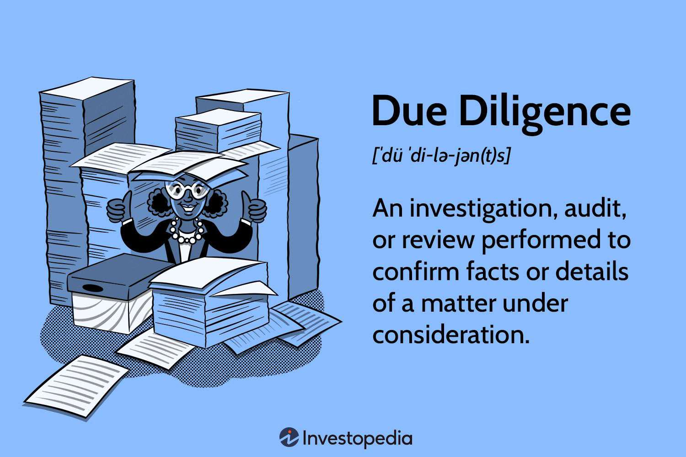

In the fast-paced world of investing and trading, due diligence plays a pivotal role, particularly when considering algorithmic trading strategies. The rapid technological advancements and increased complexity of trading algorithms necessitate a meticulous approach to evaluating and validating potential investments. This article focuses on various types of due diligence, their performance methods, and their importance in the context of algorithmic trading.

Investors, traders, and those interested in algorithmic trading will find a detailed overview of the critical components and practices essential for conducting effective due diligence. Since trading decisions increasingly rely on sophisticated algorithms and automated systems, thorough analysis and risk assessment have become indispensable elements in safeguarding against financial exposure and ensuring regulatory compliance.



The reliability and robustness of trading algorithms are fundamental to successful investment outcomes. As such, risk management strategies and meticulous investigation into the operational, financial, and technical aspects of algorithmic trading must be carried out diligently. This comprehensive examination not only minimizes potential risks but also offers assurance to investors regarding the integrity and viability of the trading strategies employed.

In this article, we aim to provide a clear understanding of the intricacies involved in due diligence within the algorithmic trading industry. As technology continues to evolve, staying informed about the latest practices in due diligence is more important than ever for making sound investment decisions in this dynamic field.

## Table of Contents

## Understanding Due Diligence

Due diligence is the comprehensive process of conducting a detailed and methodical investigation to confirm the facts related to a business or investment opportunity. This critical process is essential in mitigating risks for investors and traders. It involves the assessment of several key factors, including the potential for growth, the financial health of the entity in question, and its competitive positioning within the market.

The concept of due diligence is historically rooted in the Securities Act of 1933, which was introduced to protect investors by improving the accuracy and reliability of corporate disclosures in the wake of the 1929 stock market crash. This foundation established a legal obligation for information verification, ensuring that all material facts related to securities offerings are disclosed and validated.

Over time, due diligence has evolved significantly, extending beyond its original legal framework to encompass various sectors, including [algorithmic trading](/wiki/algorithmic-trading). In this context, due diligence is not limited to traditional evaluations but also involves rigorous technical scrutiny due to the advanced technologies utilized. It requires a robust understanding of technology infrastructure, algorithms, and data analytics, ensuring that all trading strategies adhere to regulatory standards and are capable of achieving expected financial outcomes.

Risk assessment through due diligence involves a multifaceted approach, where investors analyze financial statements, scrutinize historical performance data, and evaluate market conditions. It serves to identify potential red flags or inconsistencies that may pose a risk to the investment. Additionally, due diligence activities ensure that a company or strategy possesses a sound business model, has a transparent operational framework, and is well-positioned relative to its competitors.

As technological advancements continue, the role of due diligence becomes increasingly complex. In algorithmic trading, where large volumes of data and sophisticated algorithms are employed to automate trading, due diligence ensures the robustness and efficacy of the systems. This ensures not only compliance with regulations but also enhances investor confidence in the strategic use of technology for profit generation.

In conclusion, due diligence remains an indispensable practice, deeply ingrained in the investment process. By encompassing financial, technological, and competitive analyses, it provides a comprehensive risk assessment, ultimately aiding in informed decision-making and safeguarding the interests of investors and stakeholders alike.

## Types of Due Diligence

Due diligence encompasses several distinct categories, each tailored to address specific facets of an investment or business context. These categories are fundamental in providing a comprehensive risk assessment and ensuring informed decision-making.

**Commercial Due Diligence**

Commercial due diligence focuses on evaluating the market position and future growth potential of a company or investment opportunity. This involves analyzing market trends, competitive landscapes, and customer perceptions. Key considerations include the size of the market, growth rates, and competitive dynamics. By understanding these elements, investors can better predict the sustainable growth of a business or strategy in the prevailing market conditions.

**Legal Due Diligence**

Legal due diligence involves a thorough examination of all aspects related to regulatory and legal compliance. This type of due diligence ensures that a company adheres to current legal standards and regulations. It includes reviewing contracts, liabilities, litigation risks, and intellectual property rights. By ensuring legal compliance, businesses mitigate the risk of legal disputes and financial penalties.

**Financial Due Diligence**

Financial due diligence is centered around the critical analysis of financial statements to identify irregularities and verify the financial health of a business. This involves scrutinizing balance sheets, income statements, and cash flow statements to assess the financial viability of the investment. Key metrics to analyze might include [liquidity](/wiki/liquidity-risk-premium) ratios, leverage ratios, and profitability margins, which provide insights into the company's financial stability and operational efficiency.

**Tax Due Diligence**

Tax due diligence is the process of examining a company's tax liabilities and opportunities for tax optimization. This involves reviewing previous tax filings, understanding tax obligations, assessing compliance with tax laws, and identifying any contingent tax liabilities. Effective tax due diligence ensures that tax risks are minimized and potential savings are optimized.

**Technical, Regulatory, Operational, and Quantitative Due Diligence in Algorithmic Trading**

In algorithmic trading, several specialized forms of due diligence are crucial:

- **Technical Due Diligence**: This includes the examination of the technological infrastructure, such as the robustness of trading systems and algorithms. It involves code reviews, system architecture evaluations, and backtesting of algorithms to ensure their effectiveness and reliability.

- **Regulatory Due Diligence**: Algorithmic traders must comply with global financial regulations, such as MiFID II in Europe. Regulatory due diligence involves verifying that all trading activities and practices comply with pertinent regulations, thereby reducing the risk of non-compliance penalties.

- **Operational Due Diligence**: This involves assessing an algorithmic trading firm’s operational practices, including risk management strategies and cybersecurity protocols. Ensuring robust operational practices minimizes the risk of operational failures and enhances the overall efficiency of trading operations.

- **Quantitative Due Diligence**: This type focuses on the quantitative models used in algorithmic trading, ensuring they are statistically sound and capable of delivering projected returns. It involves validating the assumptions, inputs, and outputs of quantitative models used in trading strategies.

Each type of due diligence serves its purpose by addressing distinct aspects of a business or investment opportunity, providing a multi-faceted approach to risk assessment and strategic planning.

## Performance Methods for Due Diligence in Algorithmic Trading

Algorithmic trading is a highly competitive and technologically intensive segment of the financial market, necessitating a meticulous and multi-faceted due diligence approach. This involves several performance methods that ensure the robustness, efficiency, and compliance of trading systems and methodologies.

**Technical Due Diligence**

Technical due diligence is fundamental in verifying the integrity of algorithmic trading systems. It involves thorough code reviews and [backtesting](/wiki/backtesting). Code reviews help identify logical errors, inefficiencies, or security vulnerabilities within the algorithm. By examining the code line-by-line, experts can ensure that the trading strategy is implemented correctly and optimally.

Backtesting is another critical component. This method involves running historical market data through the trading algorithm to evaluate its performance. By simulating trades in past market conditions, investors can assess how the algorithm might perform in similar future conditions. This process can be implemented in Python, a popular language for quantitative analysis, as follows:

```python
import pandas as pd

def backtest(strategy, historical_data):
    portfolio_return = pd.Series(dtype=float)
    for index, current_data in historical_data.iterrows():
        portfolio_return.at[index] = strategy.execute(current_data)
    return portfolio_return.cumsum()

# Example usage:
# strategy -> Instance of a trading strategy with an 'execute' method
# historical_data -> DataFrame with historical market prices
```

**Financial Due Diligence**

In the context of algorithmic trading, financial due diligence focuses on analyzing a firm’s past trading performances and financial models. This involves examining historical trade data to identify patterns of success or areas of concern, evaluating performance metrics such as the Sharpe ratio, and understanding the capital allocation within the trading strategy. This analysis provides insights into the financial soundness and potential risks associated with a trading algorithm.

**Regulatory Due Diligence**

Given the global nature of financial markets, algorithmic trading firms must comply with international regulations such as MiFID II (Markets in Financial Instruments Directive II). Regulatory due diligence ensures that the trading algorithms adhere to these rules, focusing on transparency, proper recording of trades, and accuracy in financial reporting. This involves reviewing the system's ability to handle regulatory reporting requirements and ensuring compliance through regular audits.

**Operational Examination**

Operational due diligence examines the risk management techniques and cybersecurity protocols employed by an algorithmic trading firm. Effective risk management is crucial in minimizing potential losses due to market [volatility](/wiki/volatility-trading-strategies) or erroneous trades. This involves strategies such as setting stop-loss limits and stress testing algorithms under various market scenarios.

Cybersecurity is equally important in protecting the integrity of trading systems. This involves ensuring robust security measures are in place to protect against external threats, such as DDoS (Distributed Denial of Service) attacks, and internal threats, like unauthorized access. Regular security audits and updates to security protocols help in maintaining a secure trading environment.

In summary, performance methods for due diligence in algorithmic trading are comprehensive, addressing technical, financial, regulatory, and operational aspects to ensure robust, compliant, and secure trading practices.

## Role of Due Diligence in Algorithmic Trading

In algorithmic trading, due diligence is crucial for ensuring the reliability and efficiency of trading algorithms. The process of due diligence involves a thorough assessment of various aspects of algorithmic strategies to minimize risks and enhance performance.

One of the primary objectives of due diligence in this context is to validate the trading algorithms. This involves rigorous testing processes such as backtesting, where historical data is used to assess how a trading algorithm would have performed in the past. Comprehensive validation ensures the algorithms operate as intended under different market conditions, reducing the likelihood of unexpected behaviors that could lead to financial losses.

Furthermore, thorough due diligence reduces operational risks by examining risk management techniques and cybersecurity measures. Given the automated nature of algorithmic trading, robust cybersecurity protocols are essential to protect trading systems from potential threats and unauthorized access. Operational due diligence ensures that these aspects are well-addressed, contributing to the overall stability of the trading operations.

Compliance with market regulations is another critical area addressed by due diligence. As algorithmic trading operates in highly regulated environments, it is vital to ensure all trading activities comply with relevant laws and standards. Regulatory due diligence involves checking adherence to global regulations such as MiFID II (Markets in Financial Instruments Directive II), which governs trading transparency and investor protection in the European Union.

Additionally, due diligence enhances transparency for investors. By thoroughly investigating and validating algorithmic strategies, investors can gain confidence in the integrity and potential returns of the trading systems. Transparency is key to building trust and ensuring that investors have a clear understanding of the risks and expected outcomes associated with their investments.

Overall, due diligence plays an integral role in safeguarding the interests of investors and promoting sustainable trading practices within the algorithmic trading sector. Its comprehensive approach to evaluating trading algorithms, managing operational risks, ensuring regulatory compliance, and enhancing transparency contributes significantly to the success and accountability of algorithmic trading strategies.

## Conclusion

Due diligence serves as the backbone of sound investment decisions, particularly within the algorithmic trading sector. It encompasses a suite of investigative processes—commercial, legal, financial, tax, technical, regulatory, operational, and quantitative—that collectively shield investor interests and foster sustainable trading practices. Each type of due diligence plays a pivotal role in meticulously assessing various aspects of a trading strategy, from its regulatory compliance to its financial viability.

As the landscape of algorithmic trading continues to evolve, driven by technological advancements and increased market participation, the necessity for ongoing due diligence intensifies. The complexity and rapid pace of this market segment demand that both investors and trading entities undertake thorough evaluations regularly. Regular due diligence not only mitigates potential risks but also provides transparency, enabling confidence that trading algorithms operate efficiently and align with regulatory frameworks. By continuously applying these comprehensive assessments, stakeholders ensure the integrity and efficacy of their algorithmic trading strategies, positioning themselves for sustained success in a competitive environment.

## References & Further Reading

[1]: Bergstra, J., Bardenet, R., Bengio, Y., & Kégl, B. (2011). ["Algorithms for Hyper-Parameter Optimization."](https://dl.acm.org/doi/10.5555/2986459.2986743) Advances in Neural Information Processing Systems 24.

[2]: ["Advances in Financial Machine Learning"](https://www.amazon.com/Advances-Financial-Machine-Learning-Marcos/dp/1119482089) by Marcos Lopez de Prado

[3]: ["Evidence-Based Technical Analysis: Applying the Scientific Method and Statistical Inference to Trading Signals"](https://www.amazon.com/Evidence-Based-Technical-Analysis-Scientific-Statistical/dp/0470008741) by David Aronson

[4]: ["Machine Learning for Algorithmic Trading"](https://github.com/stefan-jansen/machine-learning-for-trading) by Stefan Jansen

[5]: ["Quantitative Trading: How to Build Your Own Algorithmic Trading Business"](https://books.google.com/books/about/Quantitative_Trading.html?id=j70yEAAAQBAJ) by Ernest P. Chan