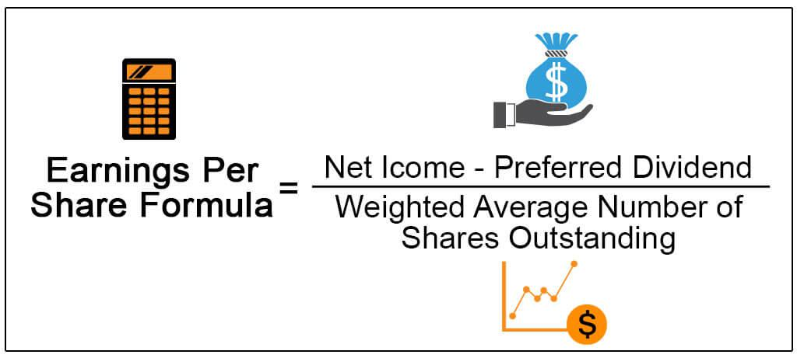

## Table of Contents

## What is Earnings per Share (EPS)?

Earnings per Share (EPS) is a way to figure out how much money a company makes for each share of its stock. It's like dividing the total profit of the company by the number of shares people own. If a company made $100 and there are 10 shares, the EPS would be $10 per share. This number helps investors see how well a company is doing and if it's making more money over time.

There are two main types of EPS: basic and diluted. Basic EPS uses the number of shares that are currently out there. Diluted EPS takes into account other things that could turn into shares, like stock options or convertible bonds. This gives a more complete picture of what the earnings might look like if all those extra shares were included. Both types are important for understanding a company's financial health.

## Why is EPS important for investors?

EPS is important for investors because it shows how much profit a company makes for each share of stock. This helps investors see if a company is doing well and making money. When EPS goes up over time, it can mean the company is growing and becoming more profitable. Investors like to see this because it could mean their investment will be worth more in the future.

Another reason EPS is important is that it helps investors compare different companies. If two companies are in the same industry, investors can look at their EPS to see which one is making more money per share. This can help them decide which company might be a better investment. Also, EPS is used in other important calculations, like the price-to-earnings ratio, which helps investors figure out if a stock is a good buy.

## What is the basic formula for calculating EPS?

The basic formula for calculating EPS is pretty simple. You take the company's total earnings, or profit, and divide it by the number of shares that are out there. For example, if a company made $1 million in profit and has 1 million shares, the EPS would be $1 per share.

There's also something called diluted EPS, which is a bit more complicated. It takes into account things that could turn into shares, like stock options or convertible bonds. So, you might have to add these potential shares to the total number of shares before you do the division. This gives you a more complete picture of what the earnings might look like if all those extra shares were included.

## What is the difference between basic EPS and diluted EPS?

Basic EPS is a way to find out how much money a company makes for each share of its stock. You take the company's total profit and divide it by the number of shares that are out there. For example, if a company made $100 and has 10 shares, the basic EPS would be $10 per share. It's a simple way to see how well a company is doing.

Diluted EPS is a bit more complicated. It takes into account things that could turn into more shares, like stock options or convertible bonds. So, you might have to add these potential shares to the total number of shares before you do the division. This gives you a more complete picture of what the earnings might look like if all those extra shares were included. It's important because it shows a more realistic view of the company's earnings per share.

## How do stock splits affect EPS?

When a company does a stock split, it increases the number of shares but doesn't change the total value of the company. For example, if a company has 10 shares worth $100 each, and they do a 2-for-1 split, they'll have 20 shares worth $50 each. The total value stays the same, but the number of shares doubles. This means the earnings per share (EPS) will go down because you're dividing the same amount of profit by more shares.

Let's say a company made $100 in profit and had 10 shares before the split. The EPS would be $10 per share. After a 2-for-1 split, the company still made $100, but now there are 20 shares. So, the new EPS would be $5 per share. Even though the EPS goes down, the total value of the company and the total profit haven't changed. It's just spread out over more shares.

## What are the common types of EPS reported by companies?

Companies usually report two main types of EPS: basic EPS and diluted EPS. Basic EPS is the simplest way to figure out how much money a company makes for each share of its stock. You take the company's total profit and divide it by the number of shares that are out there. For example, if a company made $100 and has 10 shares, the basic EPS would be $10 per share. It's a straightforward way to see how well a company is doing.

Diluted EPS is a bit more complicated because it takes into account things that could turn into more shares, like stock options or convertible bonds. So, you might have to add these potential shares to the total number of shares before you do the division. This gives you a more complete picture of what the earnings might look like if all those extra shares were included. It's important because it shows a more realistic view of the company's earnings per share, which can help investors make better decisions.

## How can EPS be used to compare companies within the same industry?

EPS is a useful tool for comparing companies within the same industry because it shows how much profit each company makes for each share of its stock. If two companies in the same industry have different EPS, it can tell investors which company is making more money per share. For example, if Company A has an EPS of $5 and Company B has an EPS of $3, Company A is making more money for each share. This can help investors decide which company might be a better investment.

However, it's important to look at more than just EPS when comparing companies. Other factors like the company's size, growth potential, and overall financial health should also be considered. EPS is just one piece of the puzzle, but it's a valuable one because it gives a clear picture of a company's profitability per share. By looking at EPS along with other financial metrics, investors can make more informed decisions about which companies to invest in.

## What are the limitations of using EPS as a performance metric?

EPS can be a helpful way to see how much money a company makes for each share of its stock, but it has some limitations. One big problem is that EPS doesn't tell you the whole story about a company's financial health. For example, a company might have a high EPS but also a lot of debt. This means the company might be making money, but it's also spending a lot to pay off loans. So, just looking at EPS might make the company look better than it really is.

Another issue with EPS is that it can be affected by things like stock splits or buybacks. When a company does a stock split, the EPS goes down even though the company's total profit hasn't changed. On the other hand, if a company buys back its own shares, the EPS can go up because there are fewer shares to divide the profit by. These changes can make it hard to compare EPS over time or between different companies. So, while EPS is useful, it's important to look at other financial metrics too to get a full picture of a company's performance.

## How do non-recurring items impact the calculation of EPS?

Non-recurring items are one-time gains or losses that a company might have. They can affect the calculation of EPS because they change the total profit for the period. For example, if a company sells a piece of property and makes a big profit, that profit is a non-recurring item. When you add this profit to the company's regular earnings, the total profit goes up. So, when you divide this new, higher total profit by the number of shares, the EPS will be higher too. But this higher EPS might not show the company's usual performance because the profit from selling the property won't happen again.

To get a better idea of a company's regular performance, investors often look at adjusted EPS. Adjusted EPS takes out these non-recurring items from the calculation. So, if the company made a one-time profit from selling property, that profit would be removed from the total earnings before calculating EPS. This gives a clearer picture of what the company earns from its normal business activities. It's important for investors to look at both the regular EPS and the adjusted EPS to understand how non-recurring items impact the company's earnings per share.

## What is adjusted EPS and why is it used?

Adjusted EPS is a way to calculate earnings per share that leaves out one-time gains or losses. These one-time items, called non-recurring items, can make the regular EPS look different from what the company usually earns. For example, if a company sells a piece of land and makes a big profit, that profit is added to the total earnings. This makes the EPS higher, but it doesn't show what the company earns from its normal business. So, adjusted EPS takes out these one-time items to give a clearer picture of the company's regular earnings.

Investors use adjusted EPS because it helps them see how well a company is doing without being confused by one-time events. If a company has a lot of non-recurring items, looking at the regular EPS might make it seem like the company is doing better or worse than it really is. By looking at adjusted EPS, investors can get a better idea of the company's true earnings from its ongoing operations. This can help them make smarter decisions about whether to invest in the company.

## How do analysts forecast future EPS?

Analysts forecast future EPS by looking at a company's past earnings and trying to guess what will happen in the future. They use a lot of information like how the company has grown in the past, what the economy is doing, and what the company says about its future plans. They also look at things like how much the company is spending on new projects or if they are planning to buy back their own shares. All of this helps them make a guess about how much profit the company will make in the future.

Another way analysts forecast future EPS is by using models and formulas. They might use something called a discounted cash flow model, which tries to figure out how much money the company will make over time and what that money is worth today. They also look at what other people are saying about the company, like other analysts' predictions and what news articles are saying. By putting all this information together, analysts can come up with a number for what they think the company's future EPS will be.

## What advanced ratios incorporate EPS, and how are they interpreted?

One important ratio that uses EPS is the Price-to-Earnings (P/E) ratio. It's calculated by taking the current stock price and dividing it by the EPS. This ratio helps investors see if a stock is a good buy. If the P/E ratio is low, it might mean the stock is cheap compared to how much money the company is making. If it's high, the stock might be expensive. But, it's important to compare the P/E ratio with other companies in the same industry to see if it's a good deal.

Another ratio that uses EPS is the Earnings Yield, which is the opposite of the P/E ratio. You find it by dividing the EPS by the stock price and then multiplying by 100 to get a percentage. Earnings Yield shows how much profit you're getting for each dollar you spend on the stock. A higher Earnings Yield means you're getting more earnings for your money, which can be a good sign. Investors often use this ratio to compare the return from a stock with the return from other investments like bonds.

Lastly, the PEG (Price/Earnings to Growth) ratio combines EPS with the company's expected growth rate. You calculate it by dividing the P/E ratio by the expected growth rate of the company's earnings. The PEG ratio helps investors see if a stock's price is fair when you think about how fast the company is growing. A PEG ratio below 1 might mean the stock is undervalued, while a PEG ratio above 1 could mean it's overvalued. But like other ratios, it's best to compare the PEG ratio with other companies in the same industry to make a smart decision.

## What is Understanding Earnings Per Share (EPS)?

Earnings Per Share (EPS) is a key financial metric used to gauge the profitability of a company on a per-share basis. It is calculated by taking the net earnings available to common shareholders and dividing it by the average number of outstanding shares. The formula can be represented as:

$$
\text{EPS} = \frac{\text{Net Income} - \text{Preferred Dividends}}{\text{Weighted Average Shares Outstanding}}
$$

EPS is a vital indicator of a company's profitability, as it shows how much of the net income is attributable to each share of common stock. Generally, a higher EPS indicates greater profitability, which can make a company more attractive to investors.

The significance of EPS extends to its influence on stock prices and investment decisions. A robust EPS often leads to increased investor confidence, possibly resulting in a rise in the company's stock price. Conversely, a declining EPS might signal financial difficulties, leading investors to reconsider their positions in the company's stock.

There are several terms related to EPS that investors need to understand: 

1. **Basic EPS**: This is the simplest form of EPS calculation. It considers only the current outstanding shares without factoring in any potential dilutions. It provides a straightforward view of earnings attributable to each share, assuming no changes in share structure.

2. **Diluted EPS**: This version of EPS takes into account all possible conversions of convertible securities such as stock options, warrants, and convertible bonds that could potentially dilute the earnings per share. It is a more conservative and comprehensive measure that indicates the 'worst-case' scenario in terms of earnings distribution:

   \[ \text{Diluted EPS} = \frac{\text{Net Income} - \text{Preferred Dividends}}{\text{Weighted Average Shares Outstanding} + \text{Convertible Securities}}
$$

EPS figures are also crucial for valuation metrics like the Price-to-Earnings (P/E) ratio, aiding investors in comparing the per-share earnings with the company's current share price to evaluate its market valuation. This underscores the importance of EPS as a tangible measure of corporate performance and a significant driver of investment strategies.

## What are the types of Earnings Per Share?

Earnings Per Share (EPS) is a key financial metric that quantifies the profitability of a company on a per-share basis. Understanding the different types of EPS is crucial for analyzing a company's performance and making informed investment decisions.

### Basic EPS
Basic EPS is calculated by dividing the net income of a company by the weighted average number of common shares outstanding during a specific period. The formula is:

$$
\text{Basic EPS} = \frac{\text{Net Income} - \text{Preferred Dividends}}{\text{Weighted Average Shares Outstanding}}
$$

This metric provides a straightforward measure of how much profit is attributable to each share of the company's common stock. It focuses solely on the shares currently outstanding, without considering any potentially dilutive securities such as stock options or convertible bonds.

### Diluted EPS
Diluted EPS accounts for all potential dilutions that could occur if securities that might convert into common shares were converted. This includes options, warrants, and convertible bonds. The formula for diluted EPS is:

$$
\text{Diluted EPS} = \frac{\text{Net Income} - \text{Preferred Dividends}}{\text{Weighted Average Shares Outstanding} + \text{Convertible Securities}}
$$

This version of EPS provides a more conservative measure of earnings per share, reflecting the potential decrease in earnings per share if all dilutive securities were to be exercised. By considering these potential dilutions, diluted EPS offers a comprehensive view of a company’s [earning](/wiki/earning-announcement) capacity in scenarios where the capital structure could change.

### Normalized EPS
Normalized EPS adjusts earnings to remove effects of unusual or non-recurring items that may skew the reported EPS. These might include one-time expenses, restructuring costs, or extraordinary gains or losses. The purpose of normalized EPS is to smooth earnings to better reflect ongoing operations and provide a more accurate picture of the company's financial status.

### Adjusted EPS
Adjusted EPS is similar to normalized EPS in that it aims to present a clearer picture of a company’s profitability by accounting for one-time items. However, adjusted EPS can also include modifications for other accounting factors, such as changes due to accounting policy adjustments or significant impairments. The focus of adjusted EPS is to reflect the underlying performance of the company without the distortive effects of irregular accounting entries or transactions.

Understanding these different EPS metrics allows investors to gauge a company’s performance from various angles, whether assessing its current profitability (Basic EPS), considering potential future scenarios (Diluted EPS), or focusing on core business operations without the noise of one-time events (Normalized and Adjusted EPS). Each type provides a unique lens through which to view a company's financial health and aids in making well-rounded investment decisions.

## What is the Role of EPS in Investment Strategies?

Earnings Per Share (EPS) is a critical metric used by investors to evaluate and compare the performance of companies. EPS is the portion of a company's profit attributed to each outstanding share of common stock, serving as an indicator of the company's profitability. A higher EPS suggests better profitability and is typically a positive signal to investors.

EPS trends are vital for long-term investment decisions. Investors observe EPS growth over multiple periods to assess a company's earnings trajectory and stability. A consistent upward trend in EPS can imply robust earnings growth and potential future returns, attracting long-term investors. Conversely, declining EPS might signal operational or market challenges, prompting reassessment of investment strategies.

EPS forecasts significantly shape market expectations and influence stock prices. Financial analysts frequently predict future EPS based on historical performance, market conditions, and other economic indicators. These forecasts inform investors' expectations about a company's profitability, guiding their buy, hold, or sell decisions. Companies frequently adjust strategies and communicate forecasts to manage investor expectations and mitigate adverse market reactions.

In valuation models, EPS is crucial, particularly in the Price-to-Earnings (P/E) ratio, which evaluates if a stock is over- or under-valued. The P/E ratio is calculated by dividing the market price per share by the EPS:

$$
\text{P/E Ratio} = \frac{\text{Market Price per Share}}{\text{EPS}}
$$

A high P/E ratio could indicate that a stock is overvalued or that investors expect high growth rates in the future. In contrast, a low P/E might suggest undervaluation or stable performance with lower growth expectations. Thus, EPS not only helps in company analysis but also plays a role in broader market valuation, impacting investment strategies and decisions.

## References & Further Reading

[1]: ["Financial Analysis with Microsoft Excel"](https://faculty.cengage.com/titles/9780357442050) by Timothy R. Mayes and Todd M. Shank

[2]: ["Fundamentals of Financial Management, Concise Edition"](https://faculty.cengage.com/titles/9781337902571) by Eugene F. Brigham and Joel F. Houston

[3]: ["Algorithmic Trading and DMA: An introduction to direct access trading strategies"](https://www.amazon.com/Algorithmic-Trading-DMA-introduction-strategies/dp/0956399207) by Barry Johnson

[4]: Felton, R. A., Collins, D. L., & Goldman, B. A. (2018). ["Earnings Per Share and Stock Price Dynamics"](https://onlinelibrary.wiley.com/doi/full/10.1111/inm.12430) Journal of Financial Markets

[5]: Pardo, R. (2008). ["The Evaluation and Optimization of Trading Strategies"](https://onlinelibrary.wiley.com/doi/book/10.1002/9781119196969) Wiley Trading Series.