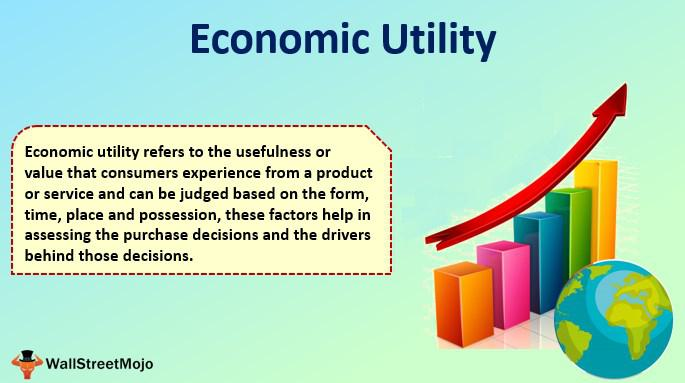

## Table of Contents

## What is economic utility?

Economic utility is a concept that describes how much satisfaction or value a person gets from using a product or service. It's about how useful something is to someone. For example, if you buy a new phone, the utility is the enjoyment and convenience you get from using it. Businesses aim to create products with high utility so that people will want to buy them.

There are different types of utility, like form utility, which is about changing the shape or form of a product to make it more useful. For instance, turning wood into a chair increases its utility because you can now sit on it. Another type is place utility, which involves making a product available where people need it. If you can buy fresh fruits at a local store instead of traveling far, that's an example of place utility. Understanding these types helps businesses meet customer needs better.

## What are the main types of economic utility?

Economic utility comes in different forms, each making things more useful or satisfying for people. The first type is form utility. This happens when a product is changed or made into something new that people find more useful. For example, turning raw cotton into a t-shirt increases its form utility because you can now wear it. Another type is place utility. This is about making sure products are available where people need them. If you can buy your favorite snack at a nearby store instead of driving far away, that's place utility.

Time utility is another important type. It's about having products available when people want them. For instance, a store that's open late at night provides time utility for people who work late shifts. Possession utility is about making it easy for people to own or use a product. Good customer service or easy payment options can increase possession utility. Finally, there's service utility, which is about the extra help or services that come with a product. If a car dealership offers free maintenance for a year, that adds service utility to the car.

Understanding these types of utility helps businesses make products and services that people really want and need. By focusing on increasing the utility of their offerings, companies can better meet customer demands and improve satisfaction.

## How does form utility differ from place utility?

Form utility is about changing something to make it more useful. Think of it like this: if you take a piece of wood and turn it into a chair, that's form utility. The wood by itself isn't very useful, but once it's a chair, you can sit on it. So, form utility is all about making things that people can use in a better way.

Place utility, on the other hand, is about making sure things are where people need them. Imagine you want to buy a book. If the bookstore is far away, it's not very useful. But if there's a bookstore close to your home, that's place utility. It's all about having things in the right spot so people can easily get them. So, while form utility changes what something is, place utility changes where something is.

## Can you explain time utility with an example?

Time utility is about having things available when people want them. Imagine you finish work late at night and you're hungry. If there's a restaurant open late that serves food, that's time utility. The restaurant is useful because it's open at the time you need it.

For example, think about a store that sells winter clothes. If they start selling these clothes in the summer, it's not very helpful. But if they wait until the fall, just before it gets cold, that's time utility. People can buy the clothes right when they need them, making the store more useful.

## What role does possession utility play in consumer satisfaction?

Possession utility is all about making it easy for people to own or use a product. This can really boost how happy customers are with their purchase. For example, if a store offers easy payment plans, like letting you pay in small amounts over time, it can make buying something big, like a new TV, a lot easier. This makes customers feel good because they can enjoy the TV without worrying about a big payment all at once.

Having good customer service also adds to possession utility. If you can call a company and get quick help with a problem, it makes owning their product a lot better. Imagine buying a laptop and then having trouble setting it up. If the company's support team helps you right away, you'll feel much happier with your purchase. So, possession utility is key to keeping customers satisfied because it makes owning and using products easier and more enjoyable.

## How do businesses create form utility?

Businesses create form utility by changing raw materials into things people can use. Think about a company that makes cars. They take steel, glass, and rubber, and turn them into a car you can drive. That's form utility because the materials by themselves aren't very useful, but once they're a car, they're a lot more helpful. Companies do this all the time, like when a furniture maker turns wood into a table or a clothing company turns fabric into a shirt.

Another way businesses create form utility is by improving existing products. For example, a phone company might add a better camera or longer battery life to their next model. This makes the phone more useful and valuable to customers. By constantly finding new ways to make things better or more useful, businesses keep increasing form utility and meeting the needs of their customers.

## What strategies can companies use to enhance place utility?

Companies can enhance place utility by making their products available in more places where people can easily find them. For example, a company might open more stores in different areas or put their products in popular stores that many people visit. This way, customers don't have to travel far to buy what they need. Another strategy is to use online shopping, which lets people buy things from anywhere, anytime. By having a strong online presence and offering fast shipping, a company can make it even easier for people to get their products.

Another way to boost place utility is through smart distribution. Companies can use data to figure out where their customers are and set up distribution centers in those areas. This helps get products to people faster. For instance, a food company might place warehouses near big cities so that fresh food can be delivered quickly to local stores. By thinking carefully about where to put their products, companies can make sure that customers can get what they want without much hassle.

## In what ways can time utility be optimized in service industries?

In service industries, time utility can be optimized by making services available when people need them most. For example, a restaurant can stay open late to serve people who work late shifts. This way, the restaurant is useful at times when other places might be closed. Another way is to offer quick service. If a dry cleaner can get your clothes ready in an hour instead of a day, it's much more helpful for busy people who need their clothes fast.

Another important strategy is to use technology to make services faster and more convenient. For instance, a bank can offer online banking so customers can do their banking anytime, even outside normal business hours. This is really helpful for people who can't get to the bank during the day. Also, scheduling appointments or services at flexible times can make a big difference. If a doctor's office offers evening or weekend appointments, it's easier for people to get the care they need without taking time off work. By focusing on when services are available, service industries can make sure they meet the needs of their customers better.

## How does possession utility affect pricing strategies?

Possession utility can really change how a business sets its prices. If a company makes it easy for people to own something, like offering payment plans or good customer service, they might be able to charge more. People are often willing to pay a bit more if it means they can get what they want without a big hassle. For example, if a furniture store lets you pay for a couch in small monthly payments instead of all at once, they might set a higher total price because the easier payments make the couch more appealing.

On the other hand, if possession utility is low, a business might need to lower their prices to make up for it. If buying something is hard or the customer service is bad, people won't want to pay as much. A car dealership with terrible service might have to offer lower prices to get people to buy their cars. By making it easier and more pleasant for customers to own their products, businesses can use possession utility to support higher prices and keep customers happy.

## What are some advanced techniques for measuring economic utility?

Advanced techniques for measuring economic utility often involve using surveys and data analysis to understand how much people value different products or services. One common method is the use of conjoint analysis, where people are asked to choose between different product options with varying features and prices. This helps businesses figure out which features are most important to customers and how much they're willing to pay for them. Another technique is the use of willingness-to-pay surveys, where people are directly asked how much they would pay for a product or service. This gives businesses a clear idea of the economic value people place on their offerings.

Another advanced method is the use of experimental economics, where researchers set up controlled experiments to see how people make choices. For example, they might give people money to spend in a simulated shopping environment and track what they buy. This can show how different factors affect economic utility. Additionally, big data and machine learning are becoming more popular for measuring utility. By analyzing large amounts of data from customer behavior, like online shopping habits or social media interactions, companies can get a detailed picture of what people value and how they use products. These techniques help businesses better understand and meet customer needs.

## How do cultural differences impact the perception of economic utility?

Cultural differences can really change how people see the value of things. In some cultures, people might care a lot about owning things that show they are successful or rich, like fancy cars or big houses. In other cultures, people might value things that bring the family together, like a big dining table. What's useful or valuable can be different from one place to another because of what people in that culture think is important.

For example, in a culture where time is seen as very important, having services available quickly might be a big deal. People might be willing to pay more for fast food delivery or quick customer service. But in a culture where time isn't as rushed, people might not mind waiting and might value other things more, like the quality of the product or the friendliness of the service. Understanding these differences helps businesses make and sell things that people in different cultures will find useful and valuable.

## What are the future trends in economic utility and how might they influence business models?

In the future, economic utility will be shaped by technology and changing consumer needs. More and more, people will expect things to be personalized. Businesses will use data to make products and services that fit each person's needs. For example, a fitness app might suggest workouts based on what you like and your goals. Also, with the rise of the internet and smart devices, things like time and place utility will become even more important. People will want to buy things online anytime and get them fast. Companies that can make this happen will do well.

These trends will change how businesses work. They might start using more technology to understand what people want and to deliver things quickly. For example, a store might use robots to pack orders and drones to deliver them. This can make place and time utility better. Also, businesses might offer more services that go with their products to increase service utility. For instance, a car company might offer a subscription service that includes maintenance and insurance. By focusing on making things more useful and meeting new expectations, businesses can stay ahead and keep their customers happy.

## What is Economic Utility?

Economic utility is a foundational concept in economics that quantifies the satisfaction or value that consumers derive from the consumption of goods and services. It provides a measurable representation of consumer preferences, offering insights into how individuals make choices among alternatives. Economic utility is often expressed in terms of "utils," a hypothetical unit of measure for utility.

The concept of utility aids businesses in comprehending consumer behavior, allowing them to tailor their product offerings to meet consumer needs more effectively. Four primary types of utility—form, time, place, and possession utility—serve as frameworks for enhancing these offerings, each addressing different aspects of consumer value.

Importantly, economic utility is devoid of moral or ethical considerations. It does not judge the righteousness or virtue of a particular choice or life satisfaction; it solely focuses on the level of satisfaction or preference provided. The intention behind the measurement of utility is purely quantitative, aiming to capture subjective experiences in a way that can be analyzed and compared objectively.

This focus on quantitative measurement often employs mathematical models, notably utility functions, which are used to represent a consumer's preference system and to predict their choices. One common form of utility function is the Cobb-Douglas utility function, which illustrates the utility gained from consuming two goods: 

$$
U(x, y) = x^\alpha \times y^\beta
$$

where $U$ is the utility obtained from consuming quantities $x$ and $y$ of two goods, and $\alpha$ and $\beta$ are parameters that represent the consumer's preference weightings for each good.

By understanding utility, businesses and economists can not only predict consumer choices but also analyze how changes in circumstances, such as price changes or income variations, will affect these choices. This understanding translates into strategies that enhance consumer satisfaction and optimize market performance.

## What is the role of utility in economic decision making?

Utility plays a crucial role in economic decision making by directly influencing both consumer choices and company strategies. Consumers are constantly faced with decisions regarding which products or services to purchase, and these decisions are primarily driven by the utility they expect to obtain. Consumers aim to maximize their total utility given their budget constraints. Accordingly, when faced with multiple options, a rational consumer will opt for the one that offers the greatest satisfaction or utility per unit of cost. This behavior is often modeled using the utility maximization problem where consumers seek to maximize their utility $U(x)$ subject to their budget constraint:

$$
\text{Maximize } U(x)
$$
$$
\text{Subject to } \sum p_i x_i \leq I
$$

where $x_i$ represents quantities of different goods, $p_i$ are their respective prices, and $I$ is the consumer's income.

For companies, understanding and maximizing utility are important for enhancing customer satisfaction and driving sales. By analyzing consumer behavior and preferences, businesses can better tailor their products and services to meet demand, thereby increasing the perceived utility of their offerings. This involves innovations in product features, quality, and overall customer experience, which can lead to a competitive advantage in the market.

Furthermore, understanding utility helps firms allocate resources efficiently and optimize marketing efforts. By identifying which aspects of their products most significantly enhance consumer utility, businesses can prioritize their resources on these attributes. This targeted allocation can be modeled using optimization techniques where businesses seek to maximize the utility derived from each dollar spent on production and marketing. For instance, suppose a company allocates its budget $B$ across different marketing channels $m_i$, each with a marginal utility $MU_i$. The objective would then be to maximize the total utility from their budget:

$$
\text{Maximize } \sum MU_i \cdot m_i
$$
$$
\text{Subject to } \sum c_i \cdot m_i \leq B
$$

where $c_i$ represents the cost associated with each marketing channel.

In summary, utility not only guides consumer choices but also informs broader business strategies, resource allocation, and marketing optimization. By focusing on maximizing utility, companies can better satisfy consumer needs and achieve their financial goals, effectively responding to market dynamics and competition.

## What is the utility in algorithmic trading?

In finance, utility functions are crucial in modeling investor preferences and risk tolerance. They represent an investor's subjective satisfaction level with varying levels of wealth and potential investment outcomes. By leveraging utility functions, [algorithmic trading](/wiki/algorithmic-trading) systems can tailor strategies that align with an investor's specific risk-return profile.

Utility maximization involves optimizing trading strategies by balancing the potential returns against associated risks. This is expressed mathematically as a maximization problem:

$$
\max E[U(W)]
$$

Where $E[U(W)]$ denotes the expected utility of wealth $W$. Different utility functions can reflect varying attitudes towards risk, such as risk-averse, risk-neutral, and risk-seeking behaviors. A commonly used utility function is the Constant Relative Risk Aversion (CRRA) utility function, which can be expressed as:

$$
U(W) = \frac{W^{1-\gamma}}{1-\gamma}
$$

where $\gamma$ is the coefficient of relative risk aversion. Algorithmic trading systems use such functions to evaluate expected utility and make informed decisions.

These algorithms harness historical and real-time data, applying statistical and [machine learning](/wiki/machine-learning) methods to assess potential trades. By incorporating utility theories, algorithms can adjust trading decisions dynamically, enhancing overall performance. For instance, they can determine the optimal asset allocation or decide whether to hold or sell a position to maximize the expected utility.

Python, with its robust financial libraries like NumPy, Pandas, and SciPy, provides an ideal platform for implementing utility-based trading strategies. A simple Python implementation to calculate utility might look like this:

```python
import numpy as np

def crra_utility(wealth, gamma):
    if gamma == 1:
        return np.log(wealth)  # Log utility for gamma = 1
    return (wealth**(1 - gamma)) / (1 - gamma)

# Example usage
wealths = np.array([100, 200, 300])
gamma = 2.0
utilities = crra_utility(wealths, gamma)
print(utilities)
```

Ultimately, utility functions play a crucial role in algorithmic trading by enabling systems to adhere to the personal financial objectives and risk profiles of investors, thereby optimizing trading outcomes.

## References & Further Reading

[1]: Varian, H. R. (1992). ["Microeconomic Analysis."](https://archive.org/details/microeconomicana0000vari_g1b1) W. W. Norton & Company.

[2]: Mas-Colell, A., Whinston, M. D., & Green, J. R. (1995). ["Microeconomic Theory."](https://archive.org/details/microeconomic-theory-mas-colell-whinston-green-1995) Oxford University Press.

[3]: Simon, H. A. (1959). ["Theories of Decision-Making in Economics and Behavioral Science."](https://www.jstor.org/stable/1809901) The Quarterly Journal of Economics, 69(1), 99-118.

[4]: Friedman, M., & Savage, L. J. (1948). ["The Utility Analysis of Choices Involving Risk."](https://www.journals.uchicago.edu/doi/10.1086/256692) Journal of Political Economy, 56(4), 279-304.

[5]: Pratt, J. W. (1964). ["Risk Aversion in the Small and in the Large."](https://www.jstor.org/stable/1913738) Econometrica, 32(1/2), 122-136.

[6]: Chan, E. P. (2009). ["Quantitative Trading: How to Build Your Own Algorithmic Trading Business."](https://github.com/ftvision/quant_trading_echan_book) John Wiley & Sons.

[7]: Lopez de Prado, M. (2018). ["Advances in Financial Machine Learning."](https://www.amazon.com/Advances-Financial-Machine-Learning-Marcos/dp/1119482089) John Wiley & Sons.

[8]: Jansen, S. (2020). ["Machine Learning for Algorithmic Trading: Predictive Models to Extract Signals from Market and Alternative Data for Systematic Trading Strategies with Python."](https://www.amazon.com/Machine-Learning-Algorithmic-Trading-alternative/dp/1839217715) Packt Publishing.