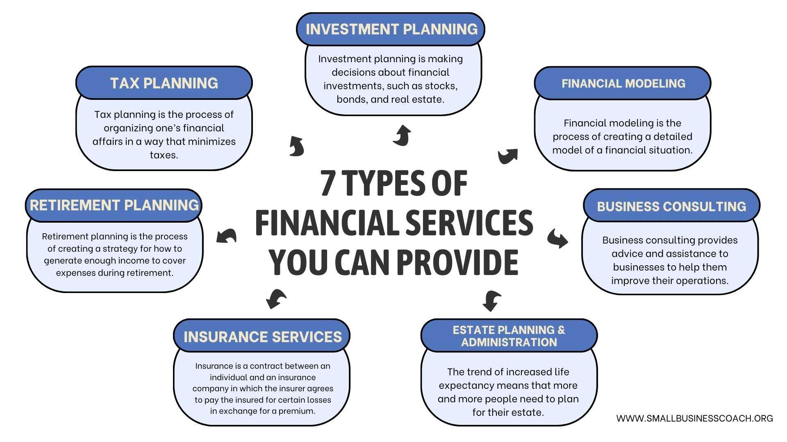

## Table of Contents

## What is finance and why is it important?

Finance is about managing money. It includes things like saving, spending, investing, and borrowing. Finance helps people and businesses plan for the future and make smart choices with their money. It's a big part of our everyday lives, from paying bills to planning for retirement.

Finance is important because it helps us understand how to use money wisely. Without good financial knowledge, it's easy to make bad decisions that can lead to problems like debt or not having enough money for important things. By learning about finance, people can better manage their money, save for the future, and avoid financial stress. This makes life easier and more secure.

## What are the basic types of finance?

There are three main types of finance: personal finance, corporate finance, and public finance. Personal finance is all about how individuals and families manage their money. This includes things like making a budget, saving money, using credit cards, and planning for big goals like buying a house or retiring. It's important for everyone to understand personal finance so they can make good choices with their money.

Corporate finance is about how businesses manage their money. This includes deciding how to spend money on things like new equipment or hiring more workers, and how to raise money through things like loans or selling shares in the company. Good corporate finance helps businesses grow and be successful.

Public finance is about how governments manage money. This includes collecting taxes, spending money on things like schools and roads, and managing the government's debt. Public finance is important because it affects how well the government can provide services to its citizens.

## Can you explain personal finance and its components?

Personal finance is all about how you and your family handle money. It's about making a plan for your money so you can pay your bills, save for the future, and maybe even have some fun. When you understand personal finance, you can make smart choices about spending, saving, and borrowing money. This helps you avoid problems like getting into too much debt or not having enough money when you need it.

The main parts of personal finance include budgeting, saving, investing, and managing debt. Budgeting means making a plan for your money, deciding how much you'll spend on things like rent, food, and entertainment. Saving is about putting money aside for the future, like for emergencies or big goals like buying a house. Investing is using your money to buy things like stocks or real estate, hoping they will grow in value over time. Managing debt means understanding how to use credit cards and loans wisely, so you don't end up owing more money than you can handle.

By learning about these parts of personal finance, you can take control of your money. This can help you feel more secure and less stressed about your finances. It's like having a roadmap for your money, guiding you to a better financial future.

## What is corporate finance and what does it include?

Corporate finance is all about how businesses handle their money. It's like the financial planning part of running a company. Businesses need to decide how to spend their money on things like new machines, buildings, or hiring more people. They also need to figure out how to get more money, maybe by taking out loans or selling shares of the company to investors. Good corporate finance helps a business grow and stay healthy.

One big part of corporate finance is making investment decisions. This means choosing which projects or opportunities the company should spend money on. The goal is to pick the ones that will make the most money in the long run. Another important part is figuring out the best way to raise money. Should the company borrow money, or should it sell shares? Each choice has different risks and benefits. By making smart choices in these areas, a business can keep its finances strong and support its growth.

## How does public finance differ from other types of finance?

Public finance is different from personal and corporate finance because it's about how governments handle money. Instead of focusing on one person or one business, public finance looks at the big picture of a whole country or city. Governments collect money through taxes and then spend it on things like schools, roads, and hospitals. They also have to manage their own debts, which can be a lot of money. Public finance is important because it affects how well the government can help its people.

Unlike personal finance, where you're making choices for yourself or your family, public finance decisions impact everyone in the community. For example, if the government decides to raise taxes, it might mean more money for public services, but it could also mean less money in people's pockets. In corporate finance, a business might focus on making profits and growing, but in public finance, the goal is often to provide the best services to the public, even if it doesn't always make a profit. This makes public finance unique and crucial for the well-being of society.

## What are financial services and what role do they play in the economy?

Financial services are all the things that help people and businesses manage their money. This includes banks, where you can save money or get a loan, and insurance companies, which help protect you from big unexpected costs. There are also investment firms that help you grow your money by buying things like stocks or bonds. These services make it easier for people to handle their money and plan for the future.

Financial services play a big role in the economy. They help money move around, which is important for keeping the economy going. When people save money in a bank, the bank can lend that money to others who need it to start a business or buy a house. This helps the economy grow because it creates jobs and lets people spend more money. Without financial services, it would be hard for the economy to work smoothly, and people might not be able to save, invest, or borrow money as easily.

## What are the different types of banking services available?

Banking services include a lot of different things that help people and businesses manage their money. One common service is a checking account, where you can keep your money and use it to pay bills or buy things with a debit card. Savings accounts are another type of service where you can save money and earn a little bit of interest over time. Banks also offer loans, which let you borrow money for things like buying a car or a house. You pay back the loan over time, usually with interest.

Another important banking service is credit cards. With a credit card, you can borrow money to buy things, and then you pay it back later. This can be helpful, but you need to be careful not to spend more than you can pay back. Banks also provide services like online banking, where you can check your accounts and move money around from your computer or phone. Some banks offer investment services, helping you put your money into things like stocks or mutual funds to try to make more money over time.

Overall, banking services make it easier for people to handle their money. They help you save, spend, borrow, and invest in ways that fit your needs. By using these services, you can keep your finances organized and plan for the future.

## How do investment services work and what are the common types?

Investment services help people grow their money by putting it into different things that might increase in value over time. When you use an investment service, you might work with a financial advisor or use an online platform. They help you choose where to put your money, like in stocks, bonds, or mutual funds. The goal is to make more money than you would just by keeping it in a savings account. But remember, investing can be risky because the value of your investments can go up or down.

There are several common types of investment services. One type is a brokerage account, where you can buy and sell stocks, bonds, and other investments. Another type is a mutual fund, where your money is pooled with other people's money and managed by professionals who invest in a mix of stocks and bonds. There are also retirement accounts like 401(k)s and IRAs, which let you save for the future with some tax benefits. Each type of investment service has its own rules and benefits, so it's important to understand them before you start investing.

## What is insurance and how does it fit into financial services?

Insurance is a type of financial service that helps protect you from big, unexpected costs. When you buy insurance, you pay a small amount of money regularly, called a premium. In return, the insurance company promises to help you if something bad happens, like if your house burns down or if you get sick and need to go to the hospital. This can give you peace of mind because you know you won't have to pay for everything out of your own pocket if something goes wrong.

Insurance fits into financial services because it's all about managing risk and money. Just like banks help you save and borrow money, and investment services help you grow your money, insurance helps you protect your money. It's an important part of planning for the future because it can keep you from losing everything if a disaster strikes. By having insurance, you can focus on other parts of your financial life, like saving and investing, without worrying as much about what might happen if things go wrong.

## Can you describe advanced financial instruments like derivatives and their uses?

Derivatives are advanced financial instruments that get their value from something else, like a stock, a commodity, or even an [interest rate](/wiki/interest-rate-trading-strategies). They're called derivatives because their value is derived from the performance of the underlying asset. Common types of derivatives include options, futures, and swaps. For example, an option gives you the right to buy or sell an asset at a certain price in the future. A future is a contract to buy or sell an asset at a set price on a specific date. Swaps let two parties exchange cash flows or other financial instruments.

Derivatives are used for many reasons. One big use is to manage risk. For example, a farmer might use a futures contract to lock in a price for their crops, protecting them from price changes. Investors and companies also use derivatives to hedge against risks in their investments or business operations. Another use is speculation, where people try to make money by betting on the future price of an asset. While derivatives can be very useful, they can also be risky because their value can change a lot, and they can be hard to understand if you're not careful.

## How do financial regulations impact the types of finance and services offered?

Financial regulations are rules made by the government to make sure that banks, investment firms, and other financial services work fairly and safely. These rules affect all types of finance, like personal, corporate, and public finance. For personal finance, regulations might set limits on how much interest credit card companies can charge or how they can advertise their services. This helps protect people from getting into too much debt or being tricked by confusing offers. For corporate finance, regulations might require companies to be open about their financial health, so investors can make smart choices. This helps keep the business world honest and fair.

Public finance is also affected by regulations, which can control how governments collect and spend money. For example, rules might say how much tax the government can take from people or how it should spend that money on things like schools and roads. These rules help make sure the government uses money in a way that helps everyone. Overall, financial regulations are important because they help keep the financial system stable and protect people from being taken advantage of. They make sure that financial services are offered in a way that is safe and fair for everyone.

## What are the emerging trends in finance and financial services that experts should be aware of?

One big trend in finance and financial services is the use of technology, often called fintech. This includes things like online banking, mobile payment apps, and using [artificial intelligence](/wiki/ai-artificial-intelligence) to help with investing. Fintech makes it easier for people to manage their money without going to a bank. It also helps people who might not have had access to traditional banking services before. Experts should keep an eye on how these technologies are changing the way people save, spend, and invest their money.

Another trend is the focus on sustainable and ethical investing. More and more people want to put their money into companies that are good for the environment or that treat their workers well. This is called [ESG](/wiki/esg-investing) investing, which stands for Environmental, Social, and Governance. Financial services are starting to offer more options for people who want to invest in a way that matches their values. Experts should understand how this trend is growing and how it might change the kinds of investments that are popular in the future.

A third trend is the rise of cryptocurrencies and blockchain technology. Cryptocurrencies like Bitcoin are a new kind of money that exists only online. Blockchain is the technology that makes cryptocurrencies work, and it's also being used for other things like keeping track of who owns what in a safe and clear way. While cryptocurrencies can be risky, they're becoming more popular, and experts should know how they might affect traditional financial services and what new rules might be needed to keep them safe.

## References & Further Reading

[1]: Marcos Lopez de Prado (2018). ["Advances in Financial Machine Learning"](https://www.amazon.com/Advances-Financial-Machine-Learning-Marcos/dp/1119482089). Wiley.

[2]: David Aronson (2006). ["Evidence-Based Technical Analysis: Applying the Scientific Method and Statistical Inference to Trading Signals"](https://www.amazon.com/Evidence-Based-Technical-Analysis-Scientific-Statistical/dp/0470008741). Wiley.

[3]: Stefan Jansen (2020). ["Machine Learning for Algorithmic Trading: Predictive models to extract signals from market and alternative data for systematic trading strategies with Python, 2nd Edition"](https://www.amazon.com/Machine-Learning-Algorithmic-Trading-alternative/dp/1839217715). Packt Publishing.

[4]: Ernest P. Chan (2009). ["Quantitative Trading: How to Build Your Own Algorithmic Trading Business"](https://onlinelibrary.wiley.com/doi/book/10.1002/9781119203377). Wiley.

[5]: Robert Kissell (2017). ["Algorithmic Trading Methods: Applications using Advanced Statistics"](https://www.sciencedirect.com/book/9780128156308/algorithmic-trading-methods). Academic Press.