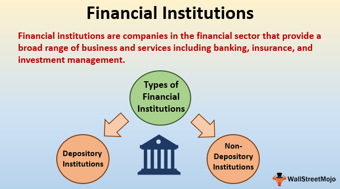

Finance encompasses a wide array of disciplines related to money management, investment, and the economic frameworks that support these processes. It is integral to both individual prosperity and the broader economy, underpinning everything from household budgeting to the fiscal strategies of multinational corporations. At a national and global level, the financial services sector plays a key role by facilitating the movement of capital and liquidity, thereby enabling economic growth and stability. 

Finance can be categorized into three main types: personal finance, corporate finance, and public finance. Personal finance refers to managing individual financial activities like budgeting, savings, investments, and planning for retirement. It involves techniques and strategies to optimally allocate individual resources over time, balancing consumption with saving. Corporate finance, on the other hand, concerns itself with the financial operations of companies. This includes sourcing capital, managing assets, and ensuring proper fiscal management to enhance shareholder value. Public finance relates to how government entities generate revenue through taxation and allocate these funds to fulfill public needs and investments, ensuring economic equilibrium and public welfare.

In recent years, the evolution of technology has introduced algorithmic trading as a significant trend within financial markets. This practice involves executing trades using computer algorithms, often at speeds and frequencies beyond human capability. By leveraging real-time market data and predefined strategies, algorithmic trading enhances trading execution and strategy implementation, thus reshaping the future of financial trading with its promise of increased efficiency and reduced costs.

In this article, the focus will be on exploring the different types of finance, examining the pivotal role of financial services, and understanding how algorithmic trading is transforming the financial landscape.

## Table of Contents

## Types of Finance

Finance is divided into three main categories: personal finance, corporate finance, and public finance. Each category addresses distinct financial activities and objectives, tailored to the requirements of individuals, corporations, and government entities.

Personal finance encompasses the management of individual financial activities. It involves budgeting to optimize income and expenditures and ensuring sufficient savings for future needs, such as retirement. Key aspects include investment planning, tax optimization, and prudent debt management. Individuals must assess their financial goals and risk tolerance to make informed decisions regarding savings and investment products like retirement accounts, stocks, or bonds.

Corporate finance focuses on the financial activities of businesses, addressing strategic financial management to maximize enterprise value. It involves capital investment decisions, where firms evaluate potential investments or projects based on expected returns and associated risks. Analytical methods such as net present value (NPV) or internal rate of return (IRR) are often employed to guide these decisions. Additionally, corporate finance encompasses capital structure management, which refers to the mix of debt and equity financing used to fund operations, and working capital management, which ensures a company can meet its short-term liabilities with its short-term assets.

Public finance relates to government finance management, dealing with the allocation and utilization of resources to achieve socio-economic objectives. A crucial component is taxation, which serves as the primary source of government revenue. Effective fiscal policy, involving government spending and tax measures, is employed to influence economic conditions, manage public debts, and fund public services like education and infrastructure. Public finance aims for macroeconomic stability, equitable distribution of income, and efficient allocation of resources.

Together, these categories of finance serve as the backbone for economic stability, growth, and development by ensuring that financial resources are allocated and managed optimally across various sectors of the economy.

## Role of Financial Services

Financial services are critical to the economy as they facilitate the acquisition and management of financial products by consumers and businesses. These services encompass a wide range of functions, including banking, insurance, investment advice, and wealth management. 

Banking services are fundamental to financial systems, providing the infrastructure for individuals and businesses to deposit, withdraw, and transfer money. Banks also extend credit, enabling businesses to finance operations and individuals to purchase homes, cars, and other goods. The ability to obtain credit is an essential driver of economic activity, allowing for increased investment and consumption.

Insurance services offer protection against various risks, providing financial security to individuals and businesses. By pooling risk among numerous policyholders, insurance companies can offer compensation for losses related to health, property, liability, and life, among others. This risk mitigation is crucial for maintaining economic stability and fostering an environment where businesses and individuals are willing to undertake ventures that could lead to growth and innovation.

Investment advice is another key component of financial services, guiding individuals and organizations in making informed decisions about where to allocate their resources. Professional advisors assist clients in developing strategies that align with their financial goals, considering factors such as risk tolerance, investment horizon, and market conditions. This advice is instrumental in optimizing portfolio performance and achieving long-term wealth objectives.

Wealth management services cater to individuals with substantial assets, offering tailored financial planning and asset management solutions. Wealth managers provide a holistic approach to managing financial resources, incorporating investment management, tax planning, estate planning, and more. This comprehensive strategy helps clients sustain and grow their wealth over time while ensuring financial goals are met.

The financial services sector supports the economy by enabling transactions between individuals, businesses, and governments. It provides the mechanisms for efficient capital flow and [liquidity](/wiki/liquidity-risk-premium) provision, ensuring that resources are allocated where they are most needed. By facilitating these transactions, financial services help maintain economic stability and promote growth, making them indispensable to any functioning economy.

 to Algorithmic Trading

Algorithmic trading, commonly referred to as algo trading, leverages sophisticated computer algorithms to automate trading processes in financial markets. These algorithms execute trades based on pre-established strategies, taking into account various market data parameters to make informed buying and selling decisions. This method has gained significant traction due to its capability to enhance efficiency and execution speeds, which are critical in modern trading environments.

Algorithic trading traces its origins back to the 1970s, when it was primarily used for simple tasks such as executing large volumes of stock trades to minimize price impact. The advent of electronic trading platforms and advances in technology have significantly contributed to the proliferation of [algorithmic trading](/wiki/algorithmic-trading), making it an indispensable tool for many market participants.

Key players utilizing algorithmic trading include hedge funds, investment banks, and individual traders. These entities deploy algorithms for various purposes, ranging from executing trades at optimal prices to exploiting market inefficiencies for profit. For instance, hedge funds often use complex quantitative models, employing algorithms to identify profitable trading opportunities amidst vast datasets. Individual traders, on the other hand, may use off-the-shelf software to automate their trading strategies based on technical indicators.

The rise of algorithmic trading can be attributed to several factors. Firstly, it reduces transaction costs by minimizing human intervention, allowing for a more streamlined trading process. Secondly, algorithms can evaluate multiple market conditions simultaneously, enabling trades to be executed at the best possible price and timing. Finally, the removal of human emotions from trading decisions leads to more consistent and disciplined trading outcomes.

Overall, algorithmic trading represents a paradigm shift in how financial markets operate, emphasizing speed, efficiency, and data-driven decision-making. As technology continues to advance, the prevalence and sophistication of algo trading are expected to grow, further shaping the landscape of global financial markets.

## Components of Algorithmic Trading Systems

Algorithmic trading systems are composed of several crucial components that work together to enhance trading efficiency and precision. These components include market data feed, strategy development and [backtesting](/wiki/backtesting), risk management, and order execution.

Market data feeds are an essential element, providing traders with real-time or historical data necessary for making informed trading decisions. Market data includes price information, trade volumes, and other relevant financial metrics that allow traders to analyze market conditions and adjust their strategies accordingly. Real-time data enables the quick adaptation to market changes, while historical data supports backtesting and strategy development.

Strategy development and backtesting form another critical component, where traders develop algorithmic strategies designed to profit from specific market conditions. Strategy development involves creating mathematical models and rules that dictate when trades should be executed. Backtesting is the process of testing these strategies using historical data to assess their potential effectiveness before deploying them in real markets. This ensures that the strategies are robust and capable of handling different market scenarios.

Risk management processes are implemented to prevent excessive losses during trades and preserve capital. These processes involve setting rules and limits in algorithmic systems to manage exposure to market risks. Techniques such as position sizing, stop-loss orders, and portfolio diversification are commonly used. For instance, a stop-loss order automatically sells a security when its price falls to a pre-determined level, limiting potential losses. Effective risk management ensures that trading strategies align with an investor’s risk tolerance and financial goals.

Order execution is the final stage where trades are executed in the market. This component involves interfacing with trading venues, matching orders with available market liquidity, and ensuring that trades are executed at the best possible prices. Execution algorithms optimize the process by slicing large orders into smaller ones, reducing market impact and minimizing costs. Speed and accuracy are paramount in this phase, as trading opportunities can quickly diminish.

Together, these components create a robust framework that enables algorithmic trading systems to operate efficiently and effectively in dynamic financial markets. Each component plays a vital role in the overall success of algorithmic trading, as they facilitate data acquisition, strategy validation, risk containment, and seamless trade execution.

## Types of Algorithmic Trading Strategies

Algorithmic trading strategies are crucial to optimizing trade execution and maximizing returns. There are several types of strategies employed by traders and institutions, each catering to specific market conditions and objectives.

High-Frequency Trading ([HFT](/wiki/high-frequency-trading-strategies)) is characterized by making a high [volume](/wiki/volume-trading-strategy) of trades in short time frames, capitalizing on minute price differences in securities. The goal is to enter and [exit](/wiki/exit-strategy) positions quickly, often within seconds or milliseconds, to secure profits before the market adjusts. HFT relies heavily on advanced technology and infrastructure to achieve low latency in data transmission and order execution.

Arbitrage involves exploiting price inconsistencies between related financial instruments or markets. For instance, if a stock is priced differently on two separate exchanges, a trader can buy it on the cheaper exchange and sell it on the more expensive one simultaneously, locking in a risk-free profit. This strategy requires precise synchronization and rapid execution to capitalize on momentary inefficiencies.

Market Making is a strategy where traders provide liquidity to the market by both buying and selling securities, profiting from the bid-ask spread. Market makers continuously quote buy and sell prices in an attempt to capture the spread as their revenue. This strategy helps ensure market liquidity and can involve holding inventories of the asset to facilitate continuous trading.

Trend Following strategies aim to capitalize on emerging market trends by taking positions that align with the directional movement of prices. These strategies do not predict market directions but instead follow the established trend, buying in an upward trend and selling in a downward trend. Trend following often employs technical indicators and moving averages to determine entry and exit points.

Each strategy carries its own set of risks and requires specific technological capabilities. HFT and [arbitrage](/wiki/arbitrage) demand advanced computational resources and access to real-time market data and execution capabilities. Market making and [trend following](/wiki/trend-following), while less reliant on speed, require robust risk management and strategic positioning to be effective. The choice of strategy depends on the trader's goals, risk tolerance, and the resources at their disposal.

## Benefits and Drawbacks of Algorithmic Trading

Algorithmic trading has become an integral facet of modern financial markets due to its ability to use computational power to execute trades efficiently. Its benefits are primarily derived from its speed and efficiency. By automating the trading process, algorithmic trading can execute orders in fractions of a second, significantly reducing transaction costs. This rapid execution enables traders to capture fleeting opportunities within the market and adapt quickly to new information or market conditions.

A key advantage of algorithmic trading is its ability to eliminate human emotions from the decision-making process. Emotions such as fear and greed can lead to irrational trading decisions, inflicting significant losses. Automated systems follow predefined parameters and logic, which ensures that trades are executed consistently according to strategy without being swayed by cognitive biases.

However, there are notable risks and drawbacks associated with algorithmic trading. One significant risk is the potential for technology and infrastructure failure. Trading algorithms rely heavily on the robustness of the technology stack, including servers, networking equipment, and software platforms. Any malfunction or failure within these systems can lead to missed trading opportunities or, worse, erroneous trades that result in financial losses.

Regulatory challenges also present an obstacle for algorithmic trading. As this form of trading has surged in popularity, regulators have had to develop new frameworks to manage the associated risks, such as market [volatility](/wiki/volatility-trading-strategies) and systemic risk. Compliance with evolving regulations requires ongoing vigilance and adaptation by trading firms.

Furthermore, algorithmic trading opens up possibilities for market manipulation. Sophisticated traders could exploit algorithms through tactics such as "spoofing," where deceptive orders are placed and canceled quickly to drive market prices in a desired direction. Such practices can disrupt market equilibrium and potentially harm other market participants.

In conclusion, while algorithmic trading offers significant advantages in terms of efficiency and consistency, these come with inherent risks that need strategic management. As technology continues to advance, both opportunity and regulatory scrutiny will increase, necessitating a balanced approach to maximize benefits while minimizing potential downsides.

## Conclusion

Finance and financial services are fundamental to economic stability and growth, providing the infrastructure necessary for individuals, businesses, and governments to function effectively. Personal finance equips individuals to manage their money wisely, ensuring financial security and retirement planning. Similarly, corporate finance allows businesses to optimize their capital structure, enhancing their ability to invest in growth opportunities and innovation. Public finance, through effective fiscal policies and resource allocation, supports the macroeconomic objectives of a nation, fostering sustainable development and prosperity.

Algorithmic trading has emerged as a transformative force in the financial markets, significantly enhancing trading efficiency and liquidity. By utilizing computer algorithms, trades are executed swiftly, allowing for the exploitation of market inefficiencies and price discrepancies at speeds unattainable by human traders. This technological advancement not only reduces transaction costs but also improves market dynamics by ensuring tighter spreads and greater market depth.

However, the increasing dominance of algorithmic trading brings challenges that require continuous adaptation. The reliance on sophisticated technology necessitates robust cybersecurity measures to protect trading systems from potential threats. Additionally, regulators must address the risks of market manipulation and ensure fair trading practices.

As technology evolves, it is imperative for market participants and regulators to continuously adapt and innovate. Harnessing the full benefits of algorithmic trading requires a balanced approach that embraces technological advancements while mitigating associated risks. This ongoing adaptation will ensure that financial markets remain efficient, transparent, and resilient, ultimately contributing to the sustained economic growth and stability that is crucial for global prosperity.

## References & Further Reading

[1]: Marcos Lopez de Prado (2018). ["Advances in Financial Machine Learning"](https://www.amazon.com/Advances-Financial-Machine-Learning-Marcos/dp/1119482089). Wiley.

[2]: David Aronson (2006). ["Evidence-Based Technical Analysis: Applying the Scientific Method and Statistical Inference to Trading Signals"](https://www.amazon.com/Evidence-Based-Technical-Analysis-Scientific-Statistical/dp/0470008741). Wiley.

[3]: Stefan Jansen (2020). ["Machine Learning for Algorithmic Trading: Predictive models to extract signals from market and alternative data for systematic trading strategies with Python, 2nd Edition"](https://www.amazon.com/Machine-Learning-Algorithmic-Trading-alternative/dp/1839217715). Packt Publishing.

[4]: Ernest P. Chan (2009). ["Quantitative Trading: How to Build Your Own Algorithmic Trading Business"](https://onlinelibrary.wiley.com/doi/book/10.1002/9781119203377). Wiley.

[5]: Robert Kissell (2017). ["Algorithmic Trading Methods: Applications using Advanced Statistics"](https://www.sciencedirect.com/book/9780128156308/algorithmic-trading-methods). Academic Press.