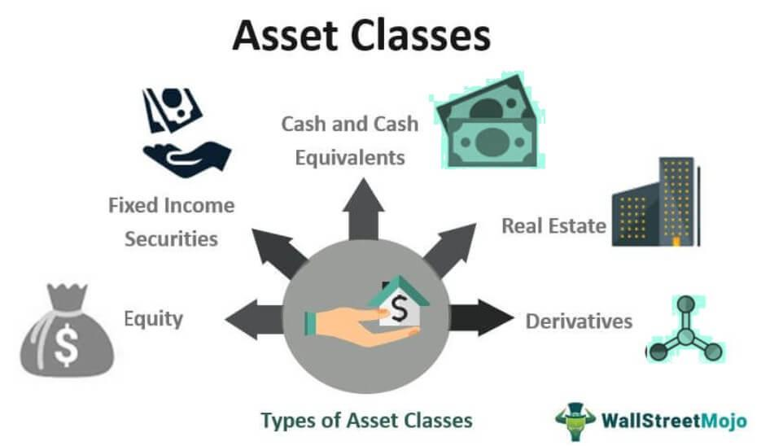

In today's financial markets, understanding key concepts such as 'financial instruments', 'asset classes', 'investment types', and 'algorithmic trading' is essential for investors looking to optimize their strategies. These terms represent the fundamental components of modern investing and are crucial to navigate the complexities of the financial environment effectively.

Financial instruments, representing assets or contracts in the market, serve as the building blocks of trading activities. They enable the buying, selling, and holding of various financial products, facilitating the flow of capital. Asset classes categorize these instruments into groups with similar characteristics and market behaviors, providing a framework for understanding their performance and risk profiles.



Investment types, on the other hand, refer to the diverse avenues investors can explore to grow their wealth, each with distinct risk levels, liquidity, and potential returns. Whether engaging in direct investments like stocks and bonds or exploring indirect options such as mutual funds and ETFs, understanding the nuances of each investment type allows for more tailored portfolio construction.

Algorithmic trading emerges as a sophisticated method employed by investors, particularly institutions, to enhance trading efficiency. By leveraging computer algorithms, traders can execute trades at optimal times and sizes, maximizing speed and minimizing costs. Despite its risks, such as potential system failures, algorithmic trading remains a powerful tool in executing large volumes of trades with precision and speed.

This article aims to provide a comprehensive overview of these financial components, explaining how they interrelate and contribute to the investment landscape. By exploring the available financial instruments, asset classes, different investment types, and the implications of algorithmic trading, readers will gain a clearer understanding of these essential concepts. Equipped with this knowledge, investors can make more informed decisions, improving their investment outcomes and navigating today's financial markets more effectively.

## Table of Contents

## Understanding Financial Instruments

Financial instruments are fundamental components of modern financial markets, acting as vehicles for capital flow among various entities. These instruments are defined as legally binding contracts that can be traded, representing either an asset itself or a package of capital. They serve as essential tools for investors, corporations, and governments to manage capital, hedge risks, and achieve financial objectives.

**Categories of Financial Instruments**

Financial instruments are broadly categorized into two main types: cash instruments and derivative instruments.

1. **Cash Instruments**

   Cash instruments are financial securities whose value is directly influenced by the markets. They are generally easy to trade and have transparent pricing. The primary examples of cash instruments include:

   - **Stocks**: These are securities that represent ownership in a corporation, giving shareholders a claim on part of the corporation's assets and earnings. Stocks are typically traded on stock exchanges, and their prices fluctuate based on supply and demand dynamics.

   - **Bonds**: Bonds are fixed-income securities whereby the issuer borrows capital from investors and, in return, pays periodic interest (coupons) and repays the principal on the maturity date. Bonds are issued by governments, municipalities, or corporations to fund various projects or operations.

2. **Derivative Instruments**

   Derivative instruments are financial contracts whose value is derived from an underlying entity, which may include assets, indexes, or interest rates. These instruments are primarily used for hedging risks or speculating on price movements. Key derivative instruments include:

   - **Options**: Options give the holder the right, but not the obligation, to buy or sell an asset at a predetermined price, known as the strike price, before or at the expiration date. Options are commonly used in hedging strategies to protect against adverse price movements.

   - **Futures**: Futures are standardized contracts obligating the buyer to purchase, and the seller to sell, a specific amount of an asset at a predetermined future date and price. Futures contracts are widely used in commodities, interest rates, and indexes trading to mitigate risk exposure.

**Importance of Understanding Financial Instruments**

Possessing a comprehensive understanding of financial instruments is vital for constructing a diversified and balanced investment portfolio. By effectively utilizing both cash and derivative instruments, investors can achieve optimal asset allocation tailored to their risk preferences and financial goals. Diversification across various instruments can help reduce investment risk and enhance the potential for returns.

In summary, the correct application and management of financial instruments enable investors to efficiently navigate and capitalize on opportunities within the financial markets. Recognizing the distinct characteristics and functions of these instruments is a crucial step toward achieving sustainable and informed financial decision-making.

## Exploring Asset Classes

Asset classes are groups of financial instruments with similar characteristics and behavior in the marketplace, an understanding of which is fundamental for effective investment strategy. These groups form the bedrock of portfolio construction, assisting investors in balancing risk and return.

The primary asset classes consist of equities, fixed income, and cash equivalents. Equities, or stocks, represent ownership in a company and offer potential for capital appreciation and dividends. They are generally considered higher risk and are subject to market [volatility](/wiki/volatility-trading-strategies) but offer potentially higher returns over the long term.

Fixed income assets, primarily bonds, involve lending money to an entity (such as a corporation or government) in exchange for periodic interest payments and the return of the principal at maturity. These are generally considered lower-risk investments compared to equities, providing regular income and preserving capital.

Cash equivalents, such as money market instruments, provide the highest degree of [liquidity](/wiki/liquidity-risk-premium) due to their short maturity periods and low risk. These instruments typically yield lower returns compared to equities and bonds but are suitable for risk-averse investors seeking stability and liquidity.

In addition to these traditional asset classes, there are alternative asset classes, including real estate, commodities, and cryptocurrencies. Real estate investments offer potential income through rent and capital growth, offering portfolios a hedge against inflation. Commodities, like gold and oil, provide diversification benefits and serve as a hedge against inflation or currency devaluation. Cryptocurrencies, a relatively new asset class, offer high volatility and the potential for high returns, but also substantial risk.

Each asset class has unique characteristics that serve distinct roles in managing investment risk and enhancing return potential. Strategic asset allocation across diverse asset classes is a common approach to managing portfolio risk. By diversifying, investors can reduce the impact of any single asset class's performance on the overall portfolio, potentially stabilizing returns.

For instance, balancing stocks and bonds in a portfolio can help mitigate risk. Suppose an investor allocates 60% to stocks and 40% to bonds. In the case of a market downturn affecting stock prices, the bonds may provide offsetting stability and income, cushioning the overall impact on the portfolio.

Understanding these concepts forms the basis for making informed decisions. Investors often employ techniques like Modern Portfolio Theory (MPT), which uses statistical measures such as variance and correlation to optimize the asset mix for maximum expected return for a given level of risk. In Python, this can be achieved using libraries such as NumPy and Pandas:

```python
import numpy as np
import pandas as pd

# Example returns data for stocks and bonds
returns_data = {
    'Stocks': [0.1, 0.2, -0.05, 0.07],
    'Bonds': [0.03, 0.04, 0.02, 0.01]
}

df = pd.DataFrame(returns_data)
expected_returns = df.mean()
cov_matrix = df.cov()

# Calculate portfolio return and standard deviation
portfolio_weights = np.array([0.6, 0.4]) # 60% stocks, 40% bonds
portfolio_return = np.dot(expected_returns, portfolio_weights)
portfolio_stddev = np.sqrt(np.dot(portfolio_weights.T, np.dot(cov_matrix, portfolio_weights)))

print(f"Expected Portfolio Return: {portfolio_return}")
print(f"Portfolio Standard Deviation (Risk): {portfolio_stddev}")
```

Thus, by understanding and effectively utilizing different asset classes, investors can better manage risk and strive for optimal returns, aligning their investment strategies with financial goals.

## Types of Investments

Investment types encompass a multitude of options that investors can employ to enhance their financial assets. Each investment type presents distinct characteristics, allowing investors to align their choices with specific financial goals, risk tolerance, and investment horizons.

Direct investments, such as stocks and bonds, involve purchasing securities that represent ownership or debt obligations directly from the issuers. Stocks provide investors with equity ownership in a corporation, potential dividends, and the opportunity for capital appreciation. Bonds, on the other hand, are fixed-income instruments that represent a loan made by the investor to a borrower, typically a corporation or government, in exchange for regular interest payments and the return of the bond's face value at maturity. The selection between stocks and bonds often depends on the investor's risk preference, as stocks typically offer higher potential returns with increased volatility, whereas bonds provide more stable returns with lower risk.

Indirect investments include mutual funds and exchange-traded funds (ETFs), which pool resources from multiple investors to invest in a diversified portfolio of assets. Mutual funds are managed by professional managers and are valued at the end of the trading day. ETFs are similar but are traded on stock exchanges, allowing intraday trading. These investment vehicles provide diversification advantages, risk management, and liquidity, catering to investors who prefer a hands-off approach and benefit from the expertise of fund managers.

Real estate investments involve purchasing, owning, managing, renting, or selling properties for profit. Real estate offers tangible assets with the potential for capital appreciation and income generation through rental yields. It is considered an effective hedge against inflation and provides diversification benefits beyond traditional financial markets.

Alternative investments, including hedge funds and private equity, represent non-traditional assets that aim to achieve high returns through intricate strategies. Hedge funds utilize diverse tactics, such as long-short strategies, derivatives, and leverage, to generate returns irrespective of market conditions. Private equity entails investments in private companies or buyouts of public companies, aiming to enhance their growth and profitability before selling them for a profit. While these investments can offer substantial returns, they often come with higher risk and lower liquidity, making them suitable for experienced investors with a higher risk tolerance.

Here's a simple Python snippet showcasing a basic calculation for expected returns, illustrating portfolio diversification:

```python
# Sample portfolio expected return calculation
# Weights represent the proportion of total investment
weights = [0.4, 0.3, 0.2, 0.1]  # e.g., stocks, bonds, real estate, alternative investments
expected_returns = [0.08, 0.04, 0.06, 0.12]  # hypothetical expected return rates

# Calculate portfolio expected return
portfolio_return = sum(w * r for w, r in zip(weights, expected_returns))
print(f"Expected Portfolio Return: {portfolio_return:.2%}")
```

This code snippet calculates the expected return of a diversified investment portfolio, providing a simplified example of how investors can strategically allocate assets to potentially enhance returns while managing risk. By selecting the right mix of investment types, investors can achieve a balanced portfolio tailored to their financial objectives and market outlook.

 to Algorithmic Trading

Algorithmic trading involves the use of computer algorithms to execute trades automatically, based on pre-defined parameters. Its core advantage lies in maximizing trading speed and efficiency by eliminating much of the manual intervention required in traditional trading. At its foundation are advanced mathematical models that analyze market data to determine the optimal timing, price, and quantity for placing trades. These models often make use of complex statistical and computational techniques to make split-second decisions that can capitalize on fleeting market opportunities.

Algorithmic trading is especially prevalent among institutional investors and hedge funds. These entities engage in high-[volume](/wiki/volume-trading-strategy) trading activities where the speed and precision offered by algorithms provide a competitive edge. By automating the trading process, firms can execute large orders with reduced market impact, optimizing costs while maintaining anonymity in the market.

One of the significant benefits of [algorithmic trading](/wiki/algorithmic-trading) is its ability to reduce transaction costs. By minimizing human errors and operating continuously without fatigue, algorithms ensure consistent execution of trades at the best available prices. Additionally, algorithms can enhance the speed of trade execution, capitalizing on price movements faster than human traders possibly can.

Moreover, algorithmic trading allows for back-testing trading strategies against historical market data. This back-testing enables traders to refine their models and strategies based on past performance, increasing the likelihood of future success. By using historical data, traders can simulate how their strategies would have performed under various market conditions, thus reducing risks associated with live market trading.

However, algorithmic trading is not without its challenges. System failures, such as software bugs or network outages, can disrupt trading operations, potentially leading to financial losses. Moreover, the rapid execution of trades by multiple algorithms can increase market volatility, occasionally resulting in events like "flash crashes" where prices plummet and recover quickly within minutes. Consequently, regulatory bodies often scrutinize algorithmic trading activities to ensure market stability and integrity.

Overall, algorithmic trading represents a significant advancement in the trading landscape, offering numerous advantages over traditional methods. Nonetheless, understanding its risks and the technology driving it is crucial for investors and traders who wish to integrate it effectively into their trading arsenal.

## How These Financial Elements Interconnect

Financial instruments, asset classes, and investment types interact to create a diverse and intricate financial ecosystem, which supports a wide array of investment strategies. This interconnectedness allows investors to leverage these components to optimize their portfolios for both risk and return.

Algorithmic trading, a sophisticated investment method, can be deployed across various asset classes and financial instruments, providing investors a tactical advantage in managing their investments. Its use can be particularly effective in liquid markets where speed and efficiency are paramount. For example, algorithms can quickly adjust positions in equities, bonds, or derivatives based on real-time market data, taking advantage of [arbitrage](/wiki/arbitrage) opportunities or hedging against certain risks. Code implementation, such as in Python, can automate these strategies efficiently:

```python
import numpy as np

def simple_moving_average(data, window):
    weights = np.ones(window) / window
    sma = np.convolve(data, weights, 'valid')
    return sma

stock_prices = [125, 130, 135, 125, 120, 115, 110, 130, 125, 127]
moving_average = simple_moving_average(stock_prices, 3)
print(moving_average)
```

Understanding how these financial elements interact can significantly enhance an investor's ability to build robust portfolios that can withstand market volatility. By learning the characteristics and behaviors of different asset classes, investors can better anticipate how their portfolios might respond to economic changes and adjust their strategies accordingly.

Moreover, by combining insights gained from asset classification and innovative trading techniques like algorithmic trading, investors have the potential to refine their risk management practices and improve their chances of achieving enhanced returns. For example, diversifying across uncorrelated asset classes or employing hedging strategies can mitigate downside risk while capitalizing on upside potential.

Continuous education and adaptation to new market developments are essential for investors to remain agile and responsive to change. The financial markets are dynamic, with new instruments and technologies constantly emerging, which can alter existing paradigms and introduce novel opportunities and risks. By keeping abreast of these changes, investors are better positioned to align their strategies with evolving market conditions and optimize their financial outcomes.

## Conclusion

In the evolving world of finance, understanding the intricacies of financial instruments, asset classes, various investment types, and algorithmic trading is invaluable. These core components each play a pivotal role in shaping robust investment strategies and achieving targeted financial goals. When investors acquire and properly apply knowledge about these concepts, they can enhance their market performance significantly.

Financial instruments, like stocks and bonds, provide the foundational building blocks for constructing profitable and resilient portfolios. Similarly, asset classes, including equities, fixed income, and alternative investments like real estate or cryptocurrencies, offer diverse avenues to manage risk and optimize return potential. The interplay of various asset classes within a portfolio supports both stability and growth, allowing investors to capitalize on fluctuating market conditions through strategic asset allocation.

Moreover, with the advent of algorithmic trading, rapid advancements in technology offer sophisticated techniques for executing trades. By utilizing computer algorithms, traders can optimize transaction speeds and reduce costs, enhancing overall investment efficiency. However, the dynamic nature of such technological interventions necessitates a commitment to continuous learning and adaptation. Staying informed about emerging technologies and market trends is crucial for investors aiming to seize new opportunities effectively.

By embracing these multifaceted financial tools and strategies, investors are better equipped to navigate the complexities of today's financial markets. This comprehensive understanding not only improves decision-making but also contributes to securing a stable financial future, ensuring both short-term success and long-term wealth accumulation.

## References & Further Reading

[1]: Fabozzi, F. J., Kolm, P. N., Pachamanova, D., & Focardi, S. M. (2007). ["Robust Portfolio Optimization and Management"](https://onlinelibrary.wiley.com/doi/book/10.1002/9781119202172). Wiley.

[2]: Lopez de Prado, M. (2018). ["Advances in Financial Machine Learning"](https://www.amazon.com/Advances-Financial-Machine-Learning-Marcos/dp/1119482089). Wiley.

[3]: Aronson, D. R. (2006). ["Evidence-Based Technical Analysis: Applying the Scientific Method and Statistical Inference to Trading Signals"](https://www.amazon.com/Evidence-Based-Technical-Analysis-Scientific-Statistical/dp/0470008741). Wiley.

[4]: Jansen, S. (2020). ["Machine Learning for Algorithmic Trading: Predictive models to extract signals from market and alternative data for systematic trading strategies with Python"](https://www.amazon.com/Machine-Learning-Algorithmic-Trading-alternative/dp/1839217715). Packt Publishing.

[5]: Chan, E. P. (2009). ["Quantitative Trading: How to Build Your Own Algorithmic Trading Business"](https://github.com/ftvision/quant_trading_echan_book). Wiley.

[6]: Bodie, Z., Kane, A., & Marcus, A. J. (2021). ["Investments"](https://www.mheducation.com/highered/product/investments-bodie-kane/M9781264412662.html). McGraw-Hill Education.

[7]: Hull, J. C. (2017). ["Options, Futures, and Other Derivatives"](https://www.semanticscholar.org/paper/Options%2C-Futures%2C-and-Other-Derivatives-Hull/89bdee500c8623864fc9eb7a471546aa713acc44). Pearson.

[8]: Luenberger, D. G. (1997). ["Investment Science"](https://www.amazon.com/Investment-Science-David-G-Luenberger/dp/0199740089). Oxford University Press. 

These resources provide comprehensive insights into financial instruments, asset classes, investment strategies, algorithmic trading, and the application of advanced technologies in trading.