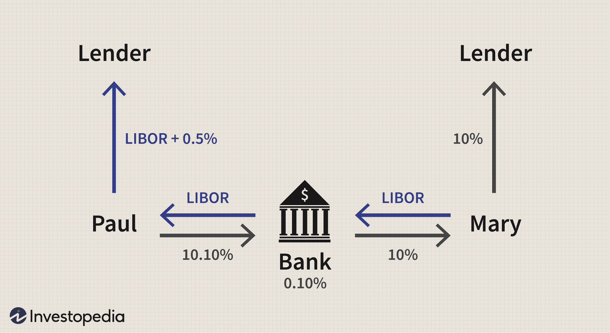

## Table of Contents

## What is a financial swap?

A financial swap is a contract between two parties to exchange cash flows or other financial instruments. It's like trading one set of future payments for another. For example, one party might agree to pay a fixed interest rate, while the other pays a variable rate that changes with market conditions. This helps both parties manage their financial risks better.

Swaps are commonly used by businesses and investors to hedge against changes in interest rates, currency values, or commodity prices. If a company has a loan with a variable interest rate, it might use a swap to switch to a fixed rate, making its future payments more predictable. This can protect the company from sudden increases in interest rates. Swaps can be customized to fit the specific needs of the parties involved, making them a flexible tool in financial management.

## What are the basic types of financial swaps?

There are several basic types of financial swaps, but the most common ones are interest rate swaps and currency swaps. An interest rate swap is when two parties agree to exchange interest payments. One party might pay a fixed rate, while the other pays a variable rate that can change over time. This helps businesses manage the risk of interest rate changes. For example, if a company has a loan with a variable interest rate, it can use an interest rate swap to switch to a fixed rate, making its future payments more predictable.

A currency swap involves exchanging principal and interest payments in one currency for the same in another currency. This is useful for companies that do business in different countries and want to manage their exposure to currency fluctuations. For instance, a company might borrow money in dollars but need euros to operate in Europe. By using a currency swap, the company can effectively convert its dollar loan into a euro loan, reducing the risk of currency value changes affecting its costs.

Another type of swap is a commodity swap, where parties exchange cash flows related to the price of a commodity, like oil or wheat. This helps companies that use or produce commodities to manage the risk of price changes. For example, an airline might use a commodity swap to lock in the price of jet fuel, protecting itself from sudden increases in fuel costs.

## How does an interest rate swap work?

An [interest rate](/wiki/interest-rate-trading-strategies) swap is like a deal between two people where they agree to swap their interest payments. Imagine one person has a loan with a fixed interest rate, and the other has a loan with a variable interest rate that can go up or down. They decide to swap their interest payments. The person with the fixed rate agrees to pay the other person's variable rate, and in return, the person with the variable rate pays the fixed rate. This helps both of them manage their money better. The person with the variable rate now has a steady payment, which can be easier to plan for, while the person with the fixed rate might benefit if the variable rate goes down.

These swaps usually last for a set period, like five or ten years. During this time, the two people keep swapping their interest payments according to the terms they agreed on. The payments are based on a certain amount of money, called the notional principal, but they don't actually exchange this money. They only exchange the interest payments. Interest rate swaps are very common in business because they help companies manage the risk of interest rates changing. For example, a company might use an interest rate swap to turn a variable rate loan into a fixed rate loan, making their future payments more predictable and easier to budget for.

## What is a currency swap and how is it used?

A currency swap is like a deal between two people where they agree to exchange money in different currencies. Imagine one person needs dollars but has euros, and the other needs euros but has dollars. They decide to swap their money. Not only do they exchange the initial amounts, but they also agree to swap back the money at the end of the deal, plus any interest they've earned. This helps both of them use the currency they need without worrying about changes in exchange rates.

Companies often use currency swaps when they do business in different countries. For example, a company in the U.S. might need euros to pay for things in Europe. Instead of borrowing euros directly, which might be expensive or hard to get, the company can borrow dollars and then use a currency swap to turn those dollars into euros. This way, the company can manage its money better and protect itself from sudden changes in currency values. Currency swaps are useful because they can be customized to fit the specific needs of the companies involved, making them a flexible tool in international business.

## Can you explain the concept of a commodity swap?

A commodity swap is like a deal between two people where they agree to swap payments based on the price of a commodity, like oil or wheat. Imagine one person is a farmer who grows wheat and the other is a bakery that needs wheat. The farmer might be worried that the price of wheat will go down, while the bakery might be worried that the price will go up. They can use a commodity swap to help manage these risks. The farmer agrees to pay the bakery if the price of wheat goes up, and the bakery agrees to pay the farmer if the price goes down. This way, both can plan their budgets better.

Commodity swaps are useful for businesses that use or produce commodities. For example, an airline might use a commodity swap to lock in the price of jet fuel. If the price of jet fuel goes up, the airline doesn't have to pay more because the swap covers the difference. This helps the airline manage its costs and protect itself from sudden price changes. Commodity swaps can be customized to fit the specific needs of the companies involved, making them a flexible tool in managing commodity price risks.

## What are equity swaps and what are their benefits?

An equity swap is like a deal between two people where they agree to swap payments based on the performance of stocks or stock indexes. Imagine one person owns a bunch of stocks and the other person wants to benefit from those stocks without actually buying them. They can use an equity swap to do this. The person with the stocks agrees to pay the other person based on how well the stocks do, and in return, the other person pays a fixed or variable rate. This way, the person who wants to benefit from the stocks can do so without having to buy them directly.

Equity swaps are useful because they help people manage their money better. For example, a company might want to invest in a stock market but doesn't want to buy the stocks directly. By using an equity swap, the company can get the benefits of the stock market without actually owning the stocks. This can be helpful for managing risk and planning budgets. Equity swaps can also be customized to fit the specific needs of the people involved, making them a flexible tool in financial management.

## How do credit default swaps function and what are the risks involved?

A credit default swap is like an insurance policy for a loan or a bond. Imagine one person, let's call them the buyer, is worried that the company they lent money to might not pay it back. They can buy a credit default swap from another person, the seller, who agrees to pay the buyer if the company defaults on the loan. In return, the buyer pays the seller regular payments, kind of like insurance premiums. This way, the buyer can protect themselves from losing money if the company can't pay back the loan.

However, credit default swaps come with risks. If a lot of companies start defaulting on their loans at the same time, the seller might not have enough money to pay all the buyers. This can lead to big problems, like what happened during the 2008 financial crisis. Also, because credit default swaps are like betting on whether a company will fail, they can be used to make risky bets. If too many people are betting against a company, it can make the situation worse and even cause the company to fail. So, while credit default swaps can be useful for managing risk, they can also create new risks if not used carefully.

## What is a variance swap and how does it differ from other swaps?

A variance swap is like a deal between two people where they agree to swap payments based on how much a stock or an index moves up and down. Imagine one person thinks a stock will be very stable, while the other thinks it will be very volatile. They can use a variance swap to bet on this. The person who thinks the stock will be stable pays the other person if the stock moves a lot, and the person who thinks it will be volatile pays if the stock stays steady. This way, both can make money based on their predictions about the stock's [volatility](/wiki/volatility-trading-strategies).

Variance swaps are different from other swaps because they focus on the ups and downs of a stock or index, not on its price or interest rates. For example, an interest rate swap is about swapping fixed and variable interest payments, and a currency swap is about swapping different currencies. But a variance swap is all about how much the price of something changes. This makes variance swaps useful for people who want to bet on or protect themselves from big price swings in the market.

## Can you describe the mechanics of a total return swap?

A total return swap is like a deal between two people where one person agrees to pay the other person the total return of an asset, like a stock or a bond. Imagine one person owns a stock and wants to keep it but doesn't want to deal with the ups and downs of its price. They can use a total return swap to pass on the stock's gains or losses to someone else. The person with the stock pays the other person any increase in the stock's value plus any dividends it pays out. In return, the other person pays the person with the stock if the stock's value goes down.

Total return swaps are useful because they let people benefit from an asset without actually owning it. For example, a bank might want to invest in a stock but doesn't want to buy it directly. By using a total return swap, the bank can get the benefits of the stock's performance without having to buy the stock itself. This can help the bank manage its money better and protect itself from sudden changes in the stock's value. Total return swaps can be customized to fit the specific needs of the people involved, making them a flexible tool in financial management.

## What are the key differences between a fixed-for-floating swap and a basis swap?

A fixed-for-floating swap is like a deal where one person agrees to pay a fixed interest rate, and the other person pays a floating interest rate that can change over time. This is really helpful for people who want to switch from a loan with a changing interest rate to one with a steady rate, or the other way around. For example, if a company has a loan with a floating rate, it might use a fixed-for-floating swap to turn it into a fixed rate loan, making its future payments easier to predict.

A basis swap is different because it's about swapping two different floating interest rates. Imagine two people both have loans with floating rates, but the rates are based on different things, like one might be based on the LIBOR and the other on the prime rate. They can use a basis swap to exchange these floating rates with each other. This can help them manage their money better if they think one rate will go up while the other goes down. So, while a fixed-for-floating swap is about switching between fixed and floating rates, a basis swap is about switching between two different floating rates.

## How are exotic swaps structured and what are some examples?

Exotic swaps are like special deals that are more complicated than regular swaps. They are customized to fit the specific needs of the people involved and can be based on all sorts of things, like weather, inflation, or even the price of a specific product. Because they are so unique, exotic swaps can be harder to understand and might have more risks than regular swaps. But they can also be very useful for people who need to manage very specific kinds of risks.

Some examples of exotic swaps include weather swaps and inflation swaps. A weather swap might be used by a company that depends on the weather, like a ski resort. The company could use a weather swap to protect itself from losing money if there's not enough snow. They would agree to pay someone if there's a lot of snow, and in return, that person would pay them if there's not enough snow. An inflation swap is another example. It's used by people who want to protect themselves from inflation, which is when prices go up. They might agree to swap payments based on an inflation index, helping them manage the risk of their costs going up.

## What regulatory considerations should be taken into account when engaging in swap transactions?

When engaging in swap transactions, it's important to think about the rules and regulations that apply. In many countries, swaps are overseen by financial regulators like the Commodity Futures Trading Commission (CFTC) in the U.S. or the European Securities and Markets Authority (ESMA) in Europe. These regulators have rules to make sure swaps are used fairly and safely. For example, they might require that swaps be reported to a central database, so everyone can see what's happening in the market. They might also require that certain swaps be cleared through a central clearinghouse, which acts like a middleman to reduce the risk of one party not paying up.

Another important thing to consider is the documentation and legal agreements needed for swaps. The International Swaps and Derivatives Association (ISDA) provides standard contracts that many people use when they enter into swap agreements. These contracts help make sure everyone understands the terms of the deal and what happens if something goes wrong. It's also important to know about any tax rules that might apply to swaps, as these can affect how much money you make or lose from the swap. By understanding and following these regulations, people can use swaps more safely and effectively.

## References & Further Reading

[1]: ["Interest Rate Swaps and Other Derivatives"](https://www.investopedia.com/terms/i/interestrateswap.asp) by Howard Corb

[2]: ["Swaps and Other Derivatives"](https://www.investopedia.com/ask/answers/060215/what-difference-between-derivatives-and-swaps.asp) by Richard R. Flavell

[3]: Hull, J. C. (2017). ["Options, Futures, and Other Derivatives."](https://www.semanticscholar.org/paper/Options%2C-Futures%2C-and-Other-Derivatives-Hull/89bdee500c8623864fc9eb7a471546aa713acc44) Pearson Education.

[4]: O'Kane, D. (2008). ["Modelling Single-name and Multi-name Credit Derivatives."](https://onlinelibrary.wiley.com/doi/book/10.1002/9781119201960) Wiley Finance.

[5]: Cartea, Á., Jaimungal, S., & Penalva, J. (2015). ["Algorithmic and High-Frequency Trading."](https://assets.cambridge.org/97811070/91146/frontmatter/9781107091146_frontmatter.pdf) Cambridge University Press.