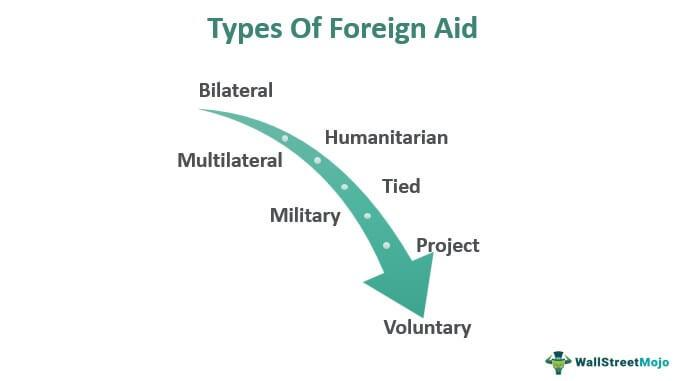

Foreign aid and international assistance constitute essential elements of modern global relations and economics. These mechanisms represent efforts to support economic development, alleviate poverty, and offer emergency relief. Foreign aid is typically structured into several categories, which this article will examine, including bilateral aid, multilateral aid, military aid, and humanitarian assistance. Each type serves its specific purposes, whether through direct economic support, collaborative funding via international organizations, contributions to defense capabilities, or crucial relief during crises.

In addition to traditional aid frameworks, modern financial systems introduce new dimensions, such as algorithmic trading, which can significantly influence foreign exchange markets. This form of trading, utilizing complex computational algorithms to make split-second trading decisions, can impact currency values, subsequently affecting international aid dynamics and contributing to economic stability or volatility.



Understanding these various forms of foreign aid and their interconnectedness with global economic systems is essential for comprehending international economic strategies and fostering global cooperation. As countries navigate increasingly complex economic landscapes, the interplay between foreign aid, comprehensive financial systems, and international diplomacy continues to be a cornerstone of international policy and economic interaction.

## Table of Contents

## Types of Foreign Aid

Foreign aid is a critical element in international relations and is categorized into several distinct types, each serving unique purposes and functions in the global economic landscape.

**Bilateral Aid**

Bilateral aid is direct assistance provided by one country to another. It often reflects the strategic interests and foreign policy objectives of the donor country. Bilateral aid can encompass various projects, such as infrastructure development, health care improvements, and educational programs. This type of aid allows the donor country to establish and strengthen diplomatic relationships and influence the recipient country's policies and governance.

**Multilateral Aid**

Multilateral aid involves contributions from multiple nations, which are then pooled and distributed by international organizations like the United Nations, World Bank, or International Monetary Fund. This type of aid promotes collaborative international efforts to address global challenges, such as poverty, climate change, and economic instability. It aims to leverage resources from numerous countries to achieve more significant impacts than could be attained through individual national efforts.

**Military Aid**

Military aid consists of financial assistance, military equipment, and defense support provided to bolster the recipient country's military capabilities. This type of aid is often used to establish and maintain strategic alliances, enhance regional stability, and promote security cooperation. It can significantly impact international relationships by aligning military agreements and defense priorities among the involved countries.

**Humanitarian Assistance**

Humanitarian assistance is immediate aid provided during crises, such as natural disasters, armed conflicts, or pandemics. It focuses on life-saving measures, including the provision of food, water, shelter, and medical care to affected populations. Unlike other forms of aid, humanitarian assistance aims to address urgent needs and alleviate human suffering, with less emphasis on long-term development and economic growth.

These distinct categories of foreign aid each offer different mechanisms and strategies to support recipient countries, emphasizing the need to understand their specific roles and functions in contributing to global economic and diplomatic efforts.

## Foreign Direct Investment (FDI)

Foreign Direct Investment (FDI) is a crucial [factor](/wiki/factor-investing) in the economic development of recipient countries. It involves multinational corporations investing directly in the economies of foreign countries, typically by establishing business operations, acquiring assets, or engaging in joint ventures. Unlike foreign aid, which might be granted or provided under certain conditions without the requirement for return, FDI represents a long-term commitment by investors and is driven by the pursuit of profit.

One of the primary benefits of FDI is its potential to stimulate economic growth. It can lead to job creation, as multinational corporations establish facilities and require local workforce to operate these entities. This not only reduces unemployment rates but also injects wages into the local economy, which in turn can enhance consumer spending and support further economic activities.

Technological advancement is another significant gain from FDI. When multinational corporations set up operations in a host country, they often bring advanced technologies and managerial know-how. This transfer of knowledge can lead to improved efficiencies and innovation within local firms, enhancing productivity. In some cases, local businesses assimilate these new technologies, a process known as technological spillover, which helps elevate the overall technological competence of the receiving economy.

Moreover, FDI contributes to increased competitiveness in global markets. As domestic firms learn from the operations and practices of multinational companies, they become better equipped to compete both locally and internationally. This exposure to international standards can lead to an enhancement in product quality and business practices, further integrating the recipient economy into the global market.

The strategic importance of FDI is also reflected in its contribution to infrastructure development. Investors may contribute to building essential infrastructure, such as roads, ports, and communication networks, which in turn facilitates better connectivity and commerce both within the host country and with international partners.

However, it is vital to note that while FDI presents numerous opportunities for economic enhancement, it also poses certain challenges. Concerns such as corporate governance, repatriation of profits, and socio-economic impacts on local communities must be managed to ensure that the host country benefits sustainably from these investments. 

In summary, FDI serves as a formidable engine for economic growth, providing employment, fostering technological progress, and enhancing competitiveness. Its role in advancing global economic integration underscores the importance of strategic and well-governed FDI policies to maximize the developmental benefits for recipient countries.

## Aid from Governments and Nonprofits

Government and nonprofit organizations are integral to the landscape of development assistance, with their contributions aimed at addressing various global challenges such as poverty alleviation, education enhancement, and social inequality. These entities collaborate extensively to ensure aid aligns with the broader framework of the Sustainable Development Goals (SDGs) established by the United Nations, which encompass 17 goals aimed at fostering a sustainable future for all.

Governmental aid is often dispensed through agencies dedicated to foreign aid and development. For instance, the United States Agency for International Development (USAID) and the United Kingdom's Department for International Development (DFID) play crucial roles in implementing foreign assistance programs that focus on economic growth, democratic governance, and humanitarian response. These programs are meticulously designed to enhance capacities in developing nations and are frequently aligned with SDG targets, such as ending poverty (SDG 1) and achieving gender equality (SDG 5).

Nonprofit organizations, including non-governmental organizations (NGOs) and international charities, are pivotal in providing on-the-ground support. NGOs like Oxfam and Save the Children work to combat poverty by delivering health services, promoting education, and ensuring food security in communities that need it most. The grassroots approach of these organizations allows them to adapt to local needs effectively, offering tailored solutions to complex social issues.

The aid provided by these governmental and nonprofit entities often takes the form of financial support, technical assistance, and capacity building initiatives. Financial support includes grants and loans directed towards infrastructure development and humanitarian relief efforts. Technical assistance involves the provision of expertise and technology to improve operational efficiencies in recipient countries. Capacity building focuses on empowering local organizations and governments to self-sustain and grow in alignment with their developmental goals.

Strategically, the alignment of aid with the SDGs ensures that the development assistance from governments and nonprofits is not just reactive but also proactive, addressing the root causes of global issues. This alignment also fosters international cooperation and accountability, as countries and organizations work towards common objectives, sharing responsibility for achieving these ambitious global targets.

In conclusion, the involvement of governments and nonprofit organizations is crucial for the sustained provision of development assistance. By focusing on poverty, education, and social issues within the framework of the SDGs, they contribute to creating a more equitable and just global society. Their efforts highlight the importance of strategic, well-coordinated action in achieving transformative outcomes in international development.

## Foreign Trade as Assistance

International trade policies serve as powerful tools for economic assistance by unlocking opportunities for market access and fostering economic development. Trade agreements delineate the rules for cross-border commerce, creating frameworks that can significantly impact the economic prospects of participating nations. By reducing barriers to trade, such as tariffs and quotas, these agreements can enhance the flow of goods and services between countries, promoting efficiency and mutual economic benefits.

Trade as a form of economic assistance is particularly beneficial for less-developed countries. By engaging in international trade, these nations gain access to larger markets, allowing them to expand their export base and increase national income. This access can lead to improvements in employment opportunities as domestic industries grow to meet global demand. Additionally, exposure to international markets encourages the adoption of advanced technologies and management practices, driving broader economic modernization.

The importance of trade agreements is evident in their ability to balance trade relationships across different economies. For instance, agreements like the African Continental Free Trade Area (AfCFTA) aim to create a single continental market, boosting trade within Africa and increasing its integration into the global economy. Similarly, the North American Free Trade Agreement (NAFTA), superseded by the United States-Mexico-Canada Agreement (USMCA), aimed to eliminate trade barriers between neighboring countries, enhancing regional cooperation and economic growth.

While trade agreements open up markets, tariffs can either promote or inhibit economic cooperation. Tariffs, which are taxes imposed on imported goods, can protect nascent industries within a country by making imported goods more expensive and less competitive compared to local products. However, when applied excessively, tariffs may lead to trade wars and disrupt economic relationships, potentially harming the global economy.

Successful trade policies emphasize cooperation and mutual benefits. By negotiating trade terms that align with the economic goals of participating countries, international trade becomes an avenue for sustained economic growth and development. The strategic use of trade policies as indirect economic aid underscores the interconnectedness of national economies and the need for collaborative international economic strategies.

## The Role of Algorithmic Trading

Algorithmic trading, also known as automated trading, employs sophisticated algorithms to execute trades at speeds and frequencies unattainable by human traders. This method involves using complex mathematical models and computer programs to make precise, high-speed trading decisions. In foreign exchange markets, [algorithmic trading](/wiki/algorithmic-trading) plays a pivotal role by processing vast amounts of data to exploit subtle market inefficiencies, thereby influencing currency values, which are critical to international aid and economic stability.

The primary advantage of algorithmic trading is its ability to handle large volumes of data in real-time. This capability allows for the identification of trading opportunities based on patterns not easily detectable by human traders. Algorithmic systems can react to market fluctuations instantly, executing trades based on predefined criteria. In the context of foreign exchange, these criteria might include currency pair prices, interest rates, and economic indicators.

For example, a simple algorithm for trading based on moving averages might be as follows in Python:

```python
def moving_average(data, window_size):
    return sum(data[-window_size:]) / window_size

def trading_decision(prices, short_window, long_window):
    short_ma = moving_average(prices, short_window)
    long_ma = moving_average(prices, long_window)

    if short_ma > long_ma:
        return "Buy"
    elif short_ma < long_ma:
        return "Sell"
    else:
        return "Hold"

prices = [1.15, 1.17, 1.19, 1.18, 1.20, 1.21, 1.22]
decision = trading_decision(prices, short_window=3, long_window=5)
print("Trading Decision:", decision)
```

The implications of this trading method are far-reaching. Currency values directly affect the costs of imports and exports, investor confidence, and by extension, the economic stability of nations—key aspects which impact the allocation and effectiveness of foreign aid. Algorithmic trading can create [volatility](/wiki/volatility-trading-strategies) in these markets, as swift and significant price changes may occur due to the cumulative effect of numerous algorithms executing trades simultaneously.

Moreover, nations providing foreign aid must be cognizant of how currency fluctuations affect aid value. For instance, a depreciating exchange rate in recipient countries might mean that the aid provided loses purchasing power, thus necessitating strategic adjustments by donor countries.

In essence, understanding algorithmic trading is imperative for analyzing global economic trends, enabling countries and international organizations to devise more resilient foreign aid strategies. Policymakers and financial analysts must account for its impact on foreign exchange markets when designing economic policies and aid packages to ensure these factors enhance rather than undermine international cooperation and economic development.

## The Impact of Foreign Aid

Foreign aid is a critical tool for enhancing economic stability and fostering political relationships between countries. By providing financial resources, technology, and expertise, donor countries can help recipient nations improve infrastructure, education, healthcare, and governance, leading to increased economic growth and stability. This assistance can promote diplomatic ties and boost political alliances, as countries often form stronger partnerships through aid-based interactions.

Despite its potential benefits, foreign aid faces challenges such as corruption and inefficient disbursement. Corruption in recipient countries can divert funds away from their intended purposes, reducing aid effectiveness. Mechanisms for transparency and accountability are crucial to ensure that aid reaches those who need it most. Inefficient disbursement, often due to bureaucratic hurdles or mismanagement, can lead to delays and hinder the timely implementation of aid projects.

Properly managed aid can foster sustainable development and global cooperation. Sustainable aid programs focus on building local capacities and promoting economic self-sufficiency, reducing long-term dependency on external assistance. This requires a strategic alignment of foreign aid with recipient countries' development goals and careful monitoring and evaluation of aid outcomes. When effectively administered, foreign aid can catalyze positive changes and contribute to achieving broader international development objectives.

Maintaining the balance between providing immediate relief and fostering long-term development is essential. Donor countries must tailor their aid strategies to suit the unique needs and circumstances of recipient nations, ensuring that aid fosters genuine progress and collaboration on the global stage.

## Conclusion

Foreign aid serves as a vital instrument for countries to tackle global economic and humanitarian challenges. It encompasses a broad spectrum of activities aimed at promoting economic development, fostering political stability, and providing urgent humanitarian relief. To fully leverage the advantages of foreign aid, meticulous management and strategic planning are paramount. Effective foreign aid requires aligning donor objectives with recipient needs, ensuring transparency, and establishing mechanisms for accountability to minimize inefficiencies and corruption.

Moreover, the interplay between foreign aid and global economic systems underscores the need for comprehensive understanding to inform future international policies. Aid effectiveness can be influenced by fluctuations in currency markets, shifts in trade policies, and the emergence of new financial technologies like algorithmic trading. These factors can alter the dynamics of foreign aid delivery and impact its outcomes, necessitating continuous adaptation of strategies in response to global economic changes.

In summary, while foreign aid holds significant potential to catalyze development and strengthen international cooperation, its success hinges on careful orchestration and adaptability to evolving global contexts. Insight into the multifaceted nature of foreign aid and its intricate relationship with the global economy is crucial to crafting policies that both maximize its benefits and mitigate potential drawbacks.

## References & Further Reading

[1]: Moyo, Dambisa. ["Dead Aid: Why Aid is Not Working and How There is a Better Way for Africa."](https://www.amazon.com/Dead-Aid-Working-Better-Africa/dp/0374532125) Farrar, Straus and Giroux, 2009.

[2]: Easterly, William. ["The White Man's Burden: Why the West's Efforts to Aid the Rest Have Done So Much Ill and So Little Good."](https://www.amazon.com/White-Mans-Burden-Efforts-Little/dp/0143038826) Penguin Press, 2006.

[3]: Mavrotas, George, and Mark McGillivray, eds. ["Foreign Aid and Development: Issues, Challenges, and the New Agenda."](https://link.springer.com/book/10.1057/9780230595163) Oxford University Press, 2009.

[4]: Roodman, David. ["Due Diligence: An Impertinent Inquiry into Microfinance."](https://www.cgdev.org/sites/default/files/archive/doc/full_text/DueDiligence/Roodman_Due_Diligence.html) Center for Global Development, 2012.

[5]: Rodrik, Dani. ["The Globalization Paradox: Democracy and the Future of the World Economy."](https://drodrik.scholar.harvard.edu/publications/globalization-paradox-democracy-and-future-world-economy) W. W. Norton & Company, 2011.

[6]: Lopez de Prado, Marcos. ["Advances in Financial Machine Learning."](https://www.amazon.com/Advances-Financial-Machine-Learning-Marcos/dp/1119482089) Wiley, 2018.

[7]: Stiglitz, Joseph E. ["Globalization and Its Discontents."](https://books.google.com/books/about/Globalization_and_Its_Discontents.html?id=geN6MUthHdkC) W.W. Norton & Company, 2002.

[8]: Rajan, Raghuram. ["Fault Lines: How Hidden Fractures Still Threaten the World Economy."](https://www.jstor.org/stable/j.ctt7t8d4) Princeton University Press, 2010.