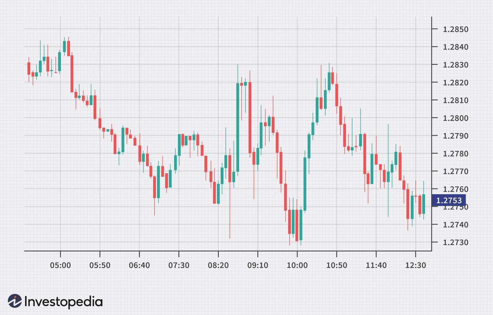

Forex trading, a vast and decentralized market, attracts a diverse range of traders who adopt various strategies based on their specific goals and prevailing market conditions. This complex market structure facilitates the exchange of currencies across different regions and operates continuously, presenting opportunities for both individual and institutional participants. The diversity of traders in the forex market is largely categorized by their trading strategies and time frames, leading to roles such as day traders, swing traders, and position traders. Each trader type tailors their approach to align with their risk tolerance, market perception, and desired liquidity, ultimately forming a spectrum of strategies from short-term, rapid transactions to long-term economic forecasting.

In today's digital landscape, algorithmic trading, often referred to as algo trading, is revolutionizing the forex market, allowing traders to enhance the precision and speed of their transactions. This advancement leverages computerized algorithms to automatically execute trades based on pre-defined criteria, thus minimizing human error and emotional biases. Such automation is transforming traditional trading methodologies and empowering traders to act swiftly in response to market signals.



This article examines the distinct types of traders within the forex market, the ascent of algorithmic trading, and the synergetic potential of merging these strategies to optimize trading results. By comprehending the characteristics of each trader type and recognizing the benefits that systematic trading can offer, individuals are better positioned to elevate their trading success. The integration of traditional methods with sophisticated algorithms not only amplifies trade efficiency but also positions traders to capitalize on evolving market dynamics as technological advancements continue to reshape the forex landscape.

## Table of Contents

## Different Types of Forex Traders

Forex traders can primarily be classified into three distinct categories based on their strategies and the time frames they prefer: day traders, swing traders, and position traders. Each type of trader has unique characteristics and employs specific tactics to navigate the forex market successfully.

**Day Traders**

Day traders are known for executing multiple trades within a single trading day. They aim to capitalize on small price fluctuations and typically close all positions before the market closes to avoid overnight risks. The key to successful day trading is the ability to quickly identify short-term price movements, which often requires access to real-time data and a thorough understanding of technical analysis tools.

A day trader might use indicators like moving averages, the Relative Strength Index (RSI), or the Moving Average Convergence Divergence (MACD) to determine entry and [exit](/wiki/exit-strategy) points. Their risk appetite is generally higher, and they use leverage to amplify gains, though this also increases the potential for losses.

**Swing Traders**

Swing traders hold positions for several days or even weeks, aiming to capture price movements within a larger trend. This type of trading is less frenetic than [day trading](/wiki/day-trading-spy) and often involves a combination of technical and [fundamental analysis](/wiki/fundamental-analysis). Swing traders might analyze economic data releases, industry news, or company earnings reports to anticipate market moves.

Swing trading requires a moderate risk appetite and patience, as positions may experience fluctuations before reaching the desired outcomes. Popular tools for swing trading include Fibonacci retracements, Bollinger Bands, and various candlestick patterns, which help traders identify potential reversal points and continuation patterns.

**Position Traders**

Position traders adopt a long-term perspective, maintaining their positions for months or even years. Their goal is to benefit from overarching trends driven by fundamental economic factors, such as [interest rate](/wiki/interest-rate-trading-strategies) changes, geopolitical events, or macroeconomic indicators. This trading style requires a deep understanding of the factors that drive currency values over time.

Given the extended holding periods, position traders often use less leverage and tolerate larger drawdowns, aligning with their lower risk tolerance. Tools used in position trading include macroeconomic models, comprehensive economic forecasts, and long-term moving averages. These traders typically have a robust understanding of global economic conditions, which helps them anticipate long-term currency movements.

In conclusion, the choice of trading style depends heavily on the trader's risk appetite, market analysis skills, and preferred time horizon. Each type offers distinct advantages and challenges, necessitating a thoughtful approach to strategy development and implementation. Understanding these trader types can assist individuals in aligning their strategies with their trading objectives, enhancing their potential for success in the [forex](/wiki/forex-system) market.

## Understanding Algorithmic Trading

Algorithmic trading automates the buying and selling processes of forex by using a series of pre-defined rules or algorithms, transforming traditional trading practices with its precision and speed. Key components that form the foundation of [algorithmic trading](/wiki/algorithmic-trading) include:

1. **Data Input**: The first essential element involves accessing real-time market data to inform trading decisions. This data encompasses currency prices, economic indicators, and news feeds that can influence market movements. Algorithms rely on this continuous stream of information to identify potential trading opportunities.

2. **Algorithm Analysis**: Once data is collected, algorithms analyze it to pinpoint lucrative trading opportunities. This component involves complex mathematical models and statistical techniques to predict price trends and market behavior. Algorithms can evaluate various parameters such as historical price patterns and volatility to generate trading signals.

3. **Automated Trade Execution**: The final step in algorithmic trading involves executing trades based on identified opportunities. Algorithms autonomously place buy or sell orders, optimizing the timing and price to maximize profitability and reduce market impact. This element ensures that trades are executed with minimal delays, enhancing overall trading efficiency.

Several popular strategies in algorithmic trading cater to different market conditions:

- **Trend-following**: This strategy capitalizes on established price trends, adjusting positions as the market moves in a specific direction. By identifying and following these trends, algorithms aim to profit from sustained price movements.

- **Mean Reversion**: Mean reversion strategies operate on the premise that prices will revert to their historical averages over time. Algorithms detect deviations from these norms, suggesting buy or sell actions when prices are expected to revert to the mean.

- **Statistical Arbitrage**: This strategy uses statistical models to identify and exploit price discrepancies between related currency pairs. Algorithms seek to capitalize on short-term inefficiencies, often involving high-frequency trading to capitalize on small price differences.

- **High-Frequency Trading (HFT)**: HFT strategies employ sophisticated algorithms to execute a large number of trades at extremely high speeds. These strategies typically take advantage of minuscule price changes over very short time frames, requiring advanced technology and low-latency environments.

The unmatched speed and efficiency of algorithmic trading provide substantial advantages over manual trading methods. In fast-moving forex markets, the ability to process vast amounts of data and execute trades swiftly can significantly enhance profitability. By reducing human intervention, algorithms minimize emotional biases and potential errors, ensuring consistent adherence to predefined strategies. As the forex market continues to evolve, algorithmic trading stands out as a powerful tool for traders seeking to optimize their performance through technological advancement.

## Integrating Algo Trading with Traditional Forex Strategies

Integrating algorithmic trading with traditional forex strategies can significantly enhance a trader's performance by improving the precision of trade execution and mitigating emotional biases. By leveraging algorithms, traders can analyze vast amounts of data and execute trades with a level of accuracy and speed not achievable through manual trading alone.

Day traders, who often engage in multiple trades within a single day to benefit from short-term price movements, can particularly advantage from high-frequency trading ([HFT](/wiki/high-frequency-trading-strategies)) algorithms. These algorithms are designed to identify and act on small price discrepancies within seconds, or even milliseconds, thereby maximizing profit potential while minimizing human error. For example, an HFT strategy can continuously scan the forex market for [arbitrage](/wiki/arbitrage) opportunities across different currency pairs and execute trades before such discrepancies are corrected by the market.

Swing traders, who typically hold positions for days or weeks, can benefit from trend-following algorithms. These algorithms help to analyze market trends over longer time frames and provide data-driven insights for optimal entry and exit points. By utilizing statistical methods such as moving averages or [momentum](/wiki/momentum) indicators, traders can identify potential price movements and adjust their positions accordingly to capture profits while the trend persists. For instance, a simple moving average (SMA) crossover strategy could be automated using Python, where a trade is executed anytime a short-term SMA moves above a longer-term SMA, indicating a potential upward trend.

```python
import pandas as pd

# Example data
data = {'price': [1.100, 1.105, 1.110, 1.115, 1.120, 1.125]}
df = pd.DataFrame(data)

# SMA calculations
short_sma = df['price'].rolling(window=2).mean()
long_sma = df['price'].rolling(window=4).mean()

# Trade signals
df['signal'] = (short_sma > long_sma).astype(int)

print(df)
```

Position traders, who aim to profit from long-term market trends, can utilize algorithms that incorporate comprehensive economic data and predictive models. These advanced algorithms can analyze macroeconomic indicators, geopolitical developments, and historical price data to forecast long-term currency movements. For example, utilizing econometric models such as autoregressive integrated moving average (ARIMA) models or [machine learning](/wiki/machine-learning) approaches for predictive analytics can provide a substantial edge.

Overall, combining algorithmic tools with traditional forex strategies empowers traders across different styles to enhance their decision-making process, leading to more consistent and profitable outcomes.

## Choosing the Right Algo Trading Platform

Choosing the right algorithmic trading platform is fundamental for traders looking to leverage technology to improve their forex trading strategies. A suitable platform not only supports efficient trade execution but also facilitates comprehensive strategy implementation. Notable platforms that have gained popularity among both novice and experienced traders include MetaTrader 4/5, QuantConnect, and [Interactive Brokers](/wiki/interactive-brokers-api). Each of these platforms offers distinct features that cater to different trading needs and skills.

MetaTrader 4 and MetaTrader 5 are widely recognized for their user-friendly interfaces and extensive support for automated trading via Expert Advisors (EAs). These platforms provide robust tools for technical analysis, charting, and [backtesting](/wiki/backtesting), allowing traders to simulate trading strategies using historical data to evaluate their potential effectiveness before live deployment. MetaTrader platforms are particularly favored for their accessibility and the active community that shares custom indicators and scripts.

QuantConnect stands out due to its emphasis on flexibility and its open-source nature, providing traders with the ability to create complex algorithms using programming languages like Python and C#. It offers powerful backtesting capabilities, access to real-time data, and a cloud-based environment for executing strategies. This platform is ideal for quantitative traders who prefer to build highly customizable and intricate trading systems.

Interactive Brokers is known for its extensive range of available financial instruments and its robust trading platform. It excels in providing real-time data and comprehensive risk management tools, essential for minimizing potential losses and maximizing trading efficiency. Interactive Brokers caters to professional traders seeking a platform with advanced analytical tools and a wide array of options for executing trades.

When choosing an algorithmic trading platform, traders should consider several factors to ensure alignment with their trading goals and technical capabilities. The availability of real-time market data is crucial for making informed decisions and executing trades at optimal times. Additionally, the platform should offer strong backtesting capabilities so traders can rigorously test their strategies under historical market conditions. Risk management tools are also a key consideration, as they help traders control their exposure and protect their investments from adverse market movements.

In summary, selecting the right algo trading platform involves evaluating the specific features and functionalities that best meet a trader's needs. By considering factors such as data access, backtesting, and risk management, traders can choose a platform that supports their trading objectives and enhances their ability to navigate the forex market effectively.

## Conclusion

The fusion of traditional trading approaches with algorithmic trading offers numerous advantages, such as efficiency, speed, and precision in executing forex trades. By leveraging these advanced technologies, traders can significantly enhance their performance and reduce the risks associated with emotional biases.

Understanding the various trader types—whether day traders, swing traders, or position traders—plays a critical role in designing effective trading strategies. Incorporating algorithmic systems enables these traders to refine their methods by offering data-driven insights and automated processes. For instance, day traders can exploit high-frequency trading algorithms to capture fleeting market opportunities, while swing and position traders can rely on trend-following algorithms to inform their long-term strategies.

As financial markets continue to evolve with technological advancements, staying informed about these changes is crucial for maintaining a competitive edge. The rapid rate of innovation demands that traders remain adaptable, integrating new tools and strategies to optimize their trading outcomes. The use of algorithmic trading not only complements traditional approaches but also prepares traders for future market dynamics, ensuring sustained success in the forex trading landscape.

## References & Further Reading

[1]: ["Advances in Financial Machine Learning"](https://www.amazon.com/Advances-Financial-Machine-Learning-Marcos/dp/1119482089) by Marcos Lopez de Prado

[2]: ["Evidence-Based Technical Analysis: Applying the Scientific Method and Statistical Inference to Trading Signals"](https://www.amazon.com/Evidence-Based-Technical-Analysis-Scientific-Statistical/dp/0470008741) by David Aronson

[3]: ["Machine Learning for Algorithmic Trading"](https://github.com/stefan-jansen/machine-learning-for-trading) by Stefan Jansen

[4]: ["Quantitative Trading: How to Build Your Own Algorithmic Trading Business"](https://www.amazon.com/Quantitative-Trading-Build-Algorithmic-Business/dp/1119800064) by Ernest P. Chan

[5]: ["Trading and Exchanges: Market Microstructure for Practitioners"](https://wclc2019.iaslc.org/public/publication/Download_PDFS/Trading-And-Exchanges-Market-Microstructure-For-Practitioners.pdf) by Larry Harris

[6]: Aldridge, I. (2009). ["High-Frequency Trading: A Practical Guide to Algorithmic Strategies and Trading Systems"](https://www.ahmetbeyefendi.com/wp-content/uploads/2020/07/High-Frequency-Trading-Irene-Aldridge.pdf). Wiley Trading. 

[7]: Chincarini, L. (2010). ["The Quantitative Equity Portfolio Management"](https://books.google.com/books/about/Quantitative_Equity_Portfolio_Management.html?id=CpPEYzvonCEC). McGraw Hill. 

[8]: Dempster, M. A. H., & Leemans, V. (2006). ["An Automated FX Trading System Using Adaptive Reinforcement Learning"](https://www.sciencedirect.com/science/article/pii/S0957417405003015). Expert Systems with Applications.