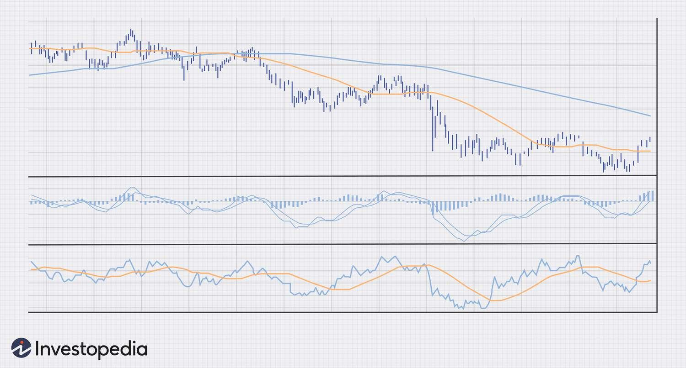

## Table of Contents

## What are Forex trend indicators and why are they important for trading?

Forex trend indicators are tools that traders use to understand the direction in which a currency pair is moving. These indicators help traders see if the market is going up, going down, or staying the same. Some common trend indicators include moving averages, the Relative Strength Index (RSI), and the Moving Average Convergence Divergence (MACD). By using these indicators, traders can make better guesses about where the market might go next.

Trend indicators are important for trading because they help traders make smarter decisions. If a trader can see that a currency pair is trending upwards, they might decide to buy it, hoping to sell it later at a higher price. On the other hand, if the trend is downwards, a trader might sell the currency pair or avoid buying it. By using trend indicators, traders can reduce their risks and increase their chances of making a profit. In short, trend indicators are like a map for traders, helping them navigate the tricky world of Forex trading.

## What is the difference between leading and lagging trend indicators?

Leading trend indicators are like fortune tellers for the market. They try to predict what the market will do next before it actually happens. Some examples are the Relative Strength Index (RSI) and the Stochastic Oscillator. Traders use these indicators to get a head start on buying or selling, hoping to make money before everyone else catches on. But, leading indicators can be tricky because they sometimes give false signals, making it hard to know if they're right or not.

Lagging trend indicators, on the other hand, are like historians. They look at what the market has already done and then tell you about it. Moving averages and the Moving Average Convergence Divergence (MACD) are common lagging indicators. They help traders confirm if a trend is really happening, but they don't predict the future. This means traders using lagging indicators might miss out on the early stages of a trend, but they can be more sure that the trend is real before they make a move.

## How does the Moving Average indicator work to identify trends?

The Moving Average indicator helps traders see the overall direction of a currency pair by smoothing out price changes over time. It does this by calculating the average price of a currency over a certain number of past periods, like days or hours. For example, a 50-day moving average would add up the closing prices of the last 50 days and then divide by 50. This average is then plotted on a chart, creating a line that moves more slowly than the actual price, making it easier to spot trends.

Traders use moving averages to figure out if a currency pair is trending up or down. If the price of the currency stays above the moving average line, it suggests that the trend is going up. On the other hand, if the price stays below the moving average, it suggests that the trend is going down. Traders often use two moving averages with different time periods, like a short-term and a long-term moving average. When the short-term moving average crosses above the long-term one, it's called a "golden cross" and signals a potential upward trend. If the short-term average crosses below the long-term one, it's called a "death cross" and signals a potential downward trend.

## What is the MACD and how can it be used to predict trend changes?

The MACD, or Moving Average Convergence Divergence, is a tool traders use to see if the trend of a currency pair is changing. It works by comparing two moving averages of different lengths. The MACD line is the difference between a short-term moving average (usually 12 periods) and a long-term moving average (usually 26 periods). There's also a signal line, which is a moving average of the MACD line itself (usually 9 periods). When these lines cross each other, it can tell traders that the trend might be about to change.

Traders look for two main signals from the MACD to predict trend changes. First, when the MACD line crosses above the signal line, it's called a bullish crossover, and it suggests that the trend might be turning upward. On the other hand, when the MACD line crosses below the signal line, it's called a bearish crossover, and it suggests that the trend might be turning downward. Second, traders also watch for the MACD histogram, which shows the difference between the MACD line and the signal line. When the histogram starts to move away from the zero line, it can signal the start of a new trend, and when it moves back toward the zero line, it can signal that the trend might be weakening.

## Can you explain the Relative Strength Index (RSI) and its role in trend analysis?

The Relative Strength Index, or RSI, is a tool that helps traders see if a currency pair is overbought or oversold. It does this by measuring how fast and how much the price of the currency is changing. The RSI is shown as a number between 0 and 100. If the RSI is above 70, it means the currency might be overbought, and if it's below 30, it means the currency might be oversold. Traders use these levels to guess when the price might change direction.

In trend analysis, the RSI can help traders spot when a trend might be getting weaker or stronger. If the RSI stays above 50, it can mean the trend is going up. If it stays below 50, it can mean the trend is going down. Traders also look for something called divergence. This happens when the price of the currency is going one way, but the RSI is going the other way. For example, if the price is going up but the RSI is going down, it might mean the upward trend is losing steam, and the price could start to go down soon. By watching the RSI, traders can make better guesses about when to buy or sell.

## What are Bollinger Bands and how do they help in identifying market trends?

Bollinger Bands are a tool that helps traders see how much a currency pair's price is moving around. They are made up of three lines: the middle line is a moving average, usually over 20 periods, and the other two lines are set above and below this middle line. The distance between the top and bottom lines changes based on how much the price is moving. When the price is moving a lot, the bands get wider, and when the price is moving less, the bands get narrower.

Traders use Bollinger Bands to spot trends and possible changes in trends. If the price keeps touching the top band, it might mean the trend is going up. If it keeps touching the bottom band, it might mean the trend is going down. Traders also look for when the price moves outside the bands. If it goes above the top band, it might mean the price will soon come back down. If it goes below the bottom band, it might mean the price will soon go back up. By watching how the price moves with the Bollinger Bands, traders can make better guesses about where the market might go next.

## How does the Parabolic SAR indicator assist in trend following?

The Parabolic SAR, or Stop and Reverse, is a tool that helps traders see if a trend is going up or down. It puts little dots on a chart, either above or below the price. If the dots are below the price, it means the trend is going up, and traders might want to buy. If the dots are above the price, it means the trend is going down, and traders might want to sell. The dots move closer to the price as the trend keeps going, helping traders know when to stay in the trade.

When the dots switch from being below the price to above it, or from above to below, it's a sign that the trend might be changing. Traders use this switch to decide when to get out of their current trade and maybe start a new one in the opposite direction. By following the Parabolic SAR, traders can keep track of trends and make decisions about when to buy or sell based on where the dots are on the chart.

## What is the Ichimoku Cloud and how does it provide comprehensive trend information?

The Ichimoku Cloud, also known as Ichimoku Kinko Hyo, is a tool that helps traders see the whole picture of a trend. It does this by putting different lines and areas on a chart. The cloud itself is made up of two lines: the Senkou Span A and the Senkou Span B. The space between these lines is the cloud, and it changes color depending on whether the trend is going up or down. If the price is above the cloud, it means the trend is going up. If the price is below the cloud, it means the trend is going down. There are also other lines like the Tenkan-sen and Kijun-sen, which help traders see shorter and longer trends.

Traders use the Ichimoku Cloud to make decisions about when to buy or sell. For example, if the price crosses above the cloud, it might be a good time to buy because the trend is turning upward. If the price crosses below the cloud, it might be a good time to sell because the trend is turning downward. The cloud also helps traders see where the price might go next because it acts like a support or resistance level. By looking at all the parts of the Ichimoku Cloud, traders can get a good idea of the trend and make smarter choices about trading.

## How can traders use the Average Directional Index (ADX) to measure trend strength?

The Average Directional Index, or ADX, is a tool that helps traders see how strong a trend is. It does this by giving a number between 0 and 100. If the ADX number is above 25, it means the trend is strong. If it's below 20, the trend is weak. Traders use the ADX to figure out if it's a good time to follow a trend or if the market is just moving sideways without a clear direction.

Along with the ADX line, there are two other lines called the Positive Directional Indicator (+DI) and the Negative Directional Indicator (-DI). These lines help traders see if the trend is going up or down. If the +DI line is above the -DI line, it means the trend is going up. If the -DI line is above the +DI line, it means the trend is going down. By looking at all three lines together, traders can get a good idea of both the strength and the direction of the trend, helping them make better trading decisions.

## What are the advantages and limitations of using the Fibonacci retracement levels as trend indicators?

Fibonacci retracement levels help traders see where the price of a currency might go next. They do this by drawing lines on a chart at certain percentages, like 23.6%, 38.2%, 50%, 61.8%, and 100%. These percentages come from a special math idea called the Fibonacci sequence. Traders use these lines to guess where the price might stop going down before it starts going up again, or where it might stop going up before it starts going down again. This can help traders decide when to buy or sell. It's like having a map that shows where the price might take a break before moving on.

But, Fibonacci retracement levels also have some problems. They don't always work, and the price can go past the lines without stopping. This means traders can get tricked into buying or selling at the wrong time. Also, different traders might draw the lines in different places, which can make it confusing. Because of this, it's a good idea to use Fibonacci retracement levels with other tools, like moving averages or the RSI, to make better guesses about where the price might go. By using more than one tool, traders can feel more sure about their decisions.

## How can advanced traders combine multiple trend indicators for more accurate trend predictions?

Advanced traders can combine multiple trend indicators to get a better picture of where the market might be headed. For example, they might use the Moving Average Convergence Divergence (MACD) to spot when a trend might be starting or ending, and then check the Relative Strength Index (RSI) to see if the currency is overbought or oversold. If the MACD shows a bullish crossover and the RSI is below 70, it might be a good time to buy. By looking at more than one indicator, traders can feel more confident in their guesses about the trend.

Another way to combine indicators is to use the Average Directional Index (ADX) to measure how strong the trend is, along with Bollinger Bands to see how much the price is moving around. If the ADX shows a strong trend and the price is touching the top Bollinger Band, it might mean the trend will keep going up. But if the price starts to move outside the bands, it could be a sign that the trend is about to change. By using different indicators together, traders can see both the direction and the strength of the trend, which can help them make smarter trading choices.

## What are some common pitfalls and mistakes to avoid when using Forex trend indicators?

When using Forex trend indicators, one common mistake traders make is relying on just one indicator. Using only one tool can lead to wrong guesses because no single indicator is perfect. It's like trying to solve a puzzle with just one piece. Traders should use more than one indicator to see different parts of the market and make better decisions. For example, combining the Moving Average with the RSI can give a clearer picture of both the trend and whether the currency is overbought or oversold.

Another pitfall is ignoring the bigger picture. Sometimes, traders focus too much on short-term signals and forget to look at the long-term trend. This can make them buy or sell at the wrong times. It's important to look at different time frames, like daily and weekly charts, to understand where the market is really going. Also, traders should not ignore important news or events that can change the market quickly. By keeping an eye on the bigger picture and using multiple indicators, traders can avoid these common mistakes and make smarter trades.

## What are Trend Indicators in Forex Trading?

Trend indicators are essential tools in Forex trading, serving to define and confirm the general market direction. These indicators enable traders to ascertain whether the market is experiencing an uptrend, a downtrend, or moving sideways. An uptrend is characterized by increasing prices, a downtrend indicates decreasing prices, and a sideways market suggests stability in price movement with no significant upward or downward trajectory.

To gauge these trends, traders employ a variety of technical analysis tools, each with its unique methodology. Among the most commonly used trend indicators are moving averages, the Moving Average Convergence Divergence (MACD), and Bollinger Bands.

**Moving Averages**

Moving averages smooth out price data to identify the direction of the trend over a specific period. The two primary types are the simple moving average (SMA) and the exponential moving average (EMA). The EMA gives more weight to recent prices, making it more responsive to new information. The formula for a simple moving average over $n$ periods is as follows:

$$

SMA = \frac{\sum_{i=1}^{n} P_i}{n} 
$$

where $P_i$ represents the price at each period.

**Moving Average Convergence Divergence (MACD)**

MACD is a [momentum](/wiki/momentum) indicator that follows trends. It is constructed using two EMAs—a slow moving average and a fast-moving average—and subtracting the former from the latter. The MACD line is derived from these EMAs, and a signal line, which is a moving average of the MACD line itself, is used to identify buy and sell signals. The MACD histogram represents the difference between the MACD line and the signal line:

$$

\text{MACD} = EMA_{\text{fast}} - EMA_{\text{slow}} 
$$

**Bollinger Bands**

Bollinger Bands consist of a central moving average line and two price channels (bands) above and below it. These bands are plotted at standard deviation levels above and below the moving average, adjusting themselves based on market [volatility](/wiki/volatility-trading-strategies). They serve as useful indicators of overbuying and overselling conditions:

$$

\text{Upper Band} = SMA_n + k \cdot \sigma 
$$
$$

\text{Lower Band} = SMA_n - k \cdot \sigma 
$$

where $\sigma$ is the standard deviation of the asset's price, and $k$ is the factor determining the distance of the band from the moving average, commonly set at 2.

In summary, these trend indicators provide traders with crucial insights into market trends. They form the foundation of many trading strategies, helping traders make informed decisions in the dynamic Forex market.

## What are the Key Trend Indicators for Algorithmic Trading?

Moving Averages, Moving Average Convergence Divergence (MACD), and Bollinger Bands are widely recognized trend indicators, integral to algorithmic trading in Forex markets. These technical tools provide clarity on market directions, facilitating informed trading decisions.

**Moving Averages** are statistical measures used to identify the direction of a trend. They help smooth out price data by creating a constantly updated average price. Different types of moving averages, such as the Simple Moving Average (SMA) and the Exponential Moving Average (EMA), are commonly used. The SMA is calculated as the arithmetic mean of a given set of prices over a specific number of periods. The EMA gives more weight to recent prices, allowing it to respond more quickly to price changes.

*Simple Moving Average (SMA):*

$$
\text{SMA} = \frac{P_1 + P_2 + \ldots + P_n}{n}
$$

where $P$ are the prices at different time intervals $n$.

**Moving Average Convergence Divergence (MACD)** is a momentum oscillator that calculates the difference between two moving averages of a security’s price, typically the 12-day EMA and the 26-day EMA. The MACD line oscillates above and below a zero line. The signal line, often a 9-day EMA of the MACD, is placed on top of the MACD line to indicate buy or sell opportunities.

*MACD Formula:*

$$
\text{MACD} = \text{EMA}_{12} - \text{EMA}_{26}
$$

*Signal Line:*

$$
\text{Signal Line} = \text{EMA}_9 \text{(MACD)}
$$

Python code snippet for calculating MACD:

```python
import numpy as np
import pandas as pd

def ema(series, span):
    return series.ewm(span=span, adjust=False).mean()

def macd(series):
    ema_12 = ema(series, 12)
    ema_26 = ema(series, 26)
    macd_line = ema_12 - ema_26
    signal_line = ema(macd_line, 9)
    return macd_line, signal_line

# Example usage with a Pandas Series of prices
# prices = pd.Series([...])
# macd_line, signal_line = macd(prices)
```

**Bollinger Bands** consist of a middle band (SMA) and two outer bands that are standard deviations away from the middle band. They represent price volatility, providing boundaries that the price is statistically unlikely to exceed.

*Bollinger Bands Formula:*

Middle Band = $\text{SMA}(n)$

Upper Band = $\text{SMA}(n) + k \times \text{SD}(n)$

Lower Band = $\text{SMA}(n) - k \times \text{SD}(n)$

where $n$ is the number of periods, and $k$ is typically set to 2.

These indicators form a foundational part of automated trading systems, offering algorithms the data needed to make split-second decisions. Their implementation in algorithmic systems requires careful consideration of market conditions, tuning the parameters to suit specific trading strategies and market environments. Understanding the nuances of each indicator and their interaction with different market dynamics can significantly augment the effectiveness and profitability of algorithmic trading strategies.

## What are Advanced Trend Following Indicators?

Sophisticated [trend following](/wiki/trend-following) indicators have become indispensable in modern algorithmic trading, offering refined insights into market dynamics. One such advanced tool is the Trend Magic Enhanced indicator, which synthesizes the Commodity Channel Index (CCI) and Average True Range (ATR) to provide traders with precise entry and [exit](/wiki/exit-strategy) signals based on both market momentum and volatility. 

The CCI is used to identify cyclical trends in the market by comparing an asset's typical price to its moving average and standard deviation, which can be expressed as:

$$
\text{CCI} = \frac{(\text{Typical Price} - \text{SMA})}{0.015 \times \text{Mean Deviation}}
$$

Where the Typical Price is the average of the high, low, and closing prices, and SMA is the Simple Moving Average of the Typical Price over a predetermined period.

On the other hand, ATR measures market volatility by calculating the average of true ranges over a set period. True Range is defined as the greatest of the following values:

1. The current high minus the current low.
2. The absolute value of the current high minus the previous close.
3. The absolute value of the current low minus the previous close.

By combining these two indicators, Trend Magic Enhanced provides traders with signals that consider not only the direction of the trend but also the strength and consistency of the market’s movements. This dual approach enables traders to anticipate potential trend shifts with greater accuracy.

Customization of the Trend Magic Enhanced indicator allows traders to adjust parameters to align with their trading strategies and risk tolerance. Traders can set threshold values for CCI deviations or adjust the ATR's period to change the sensitivity of the signals. This flexibility is crucial in adapting to different market conditions and ensures the approach remains robust across various currency pairs and time frames.

Moreover, the Trend Magic Enhanced indicator can be programmed to alert traders of emerging trend shifts via notifications or automated actions, thereby integrating seamlessly into algorithmic trading systems. For example, using Python, traders can implement this indicator in an automated trading strategy as follows:

```python
import talib

# Assume `prices` is a DataFrame with columns: 'high', 'low', 'close'

# Calculate the Average True Range (ATR)
atr = talib.ATR(prices['high'], prices['low'], prices['close'], timeperiod=14)

# Calculate the Commodity Channel Index (CCI)
cci = talib.CCI(prices['high'], prices['low'], prices['close'], timeperiod=20)

# Define Trend Magic Enhanced logic
def trend_magic_enhanced(cci, atr):
    # For simplicity, thresholds are set. Adjust these according to strategy requirements.
    cci_threshold = 100
    atr_threshold = 1.5

    if cci > cci_threshold and atr > atr_threshold:
        return "Buy Signal"
    elif cci < -cci_threshold and atr > atr_threshold:
        return "Sell Signal"
    else:
        return "Hold"

# Apply the logic
prices['trend_magic_signal'] = prices.apply(lambda row: trend_magic_enhanced(row['CCI'], row['ATR']), axis=1)
```

This simplified implementation highlights how combining CCI and ATR into a unified indicator can improve decision-making and trade execution. By offering customizable and precise signals, advanced trend following indicators like Trend Magic Enhanced play a critical role in optimizing algorithmic trading strategies.

## References & Further Reading

[1]: Bergstra, J., Bardenet, R., Bengio, Y., & Kégl, B. (2011). ["Algorithms for Hyper-Parameter Optimization."](https://papers.nips.cc/paper/4443-algorithms-for-hyper-parameter-optimization) Advances in Neural Information Processing Systems 24.

[2]: ["Advances in Financial Machine Learning"](https://www.amazon.com/Advances-Financial-Machine-Learning-Marcos/dp/1119482089) by Marcos Lopez de Prado

[3]: ["Evidence-Based Technical Analysis: Applying the Scientific Method and Statistical Inference to Trading Signals"](https://www.amazon.com/Evidence-Based-Technical-Analysis-Scientific-Statistical/dp/0470008741) by David Aronson

[4]: ["Machine Learning for Algorithmic Trading"](https://github.com/PacktPublishing/Machine-Learning-for-Algorithmic-Trading-Second-Edition) by Stefan Jansen

[5]: ["Quantitative Trading: How to Build Your Own Algorithmic Trading Business"](https://books.google.com/books/about/Quantitative_Trading.html?id=j70yEAAAQBAJ) by Ernest P. Chan