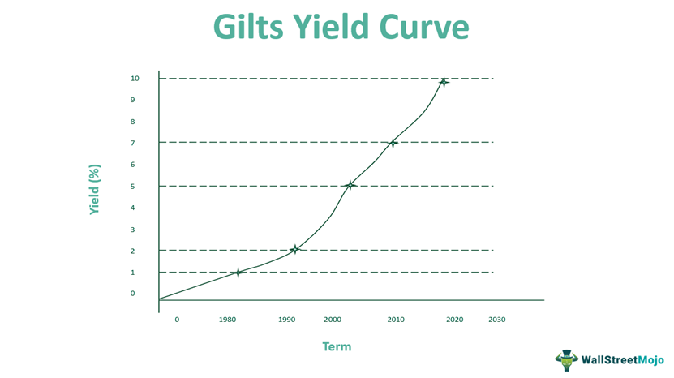

Investment strategies offer a variety of opportunities, with gilts being a prominent option. Issued predominantly by the UK government, gilts are integral to conservative investment portfolios due to their perceived security. These government bonds are comparable to U.S. Treasury securities, providing a fixed income stream and generally presenting lower risk because of the high creditworthiness of the issuer. The secure nature of gilts makes them particularly appealing to risk-averse investors seeking stability.

In recent years, the integration of advanced technology has introduced algorithmic trading into the gilt market. This form of trading utilizes computer algorithms to automate the decision-making processes, facilitating faster and more efficient transactions. It has enhanced the attractiveness of gilts by improving liquidity and enabling the execution of complex trading strategies that were previously unattainable through manual methods.



This article aims to provide a comprehensive exploration of gilts, their different types, and the various strategies that can be employed when investing in them. Furthermore, the impact of algorithmic trading on optimizing gilt investments will be discussed, highlighting the growing intersection between traditional investment products and cutting-edge technology. By understanding these facets, investors can better diversify their portfolios and manage risk.

## Table of Contents

## What Are Gilts?

Gilts are government bonds predominantly issued by the United Kingdom, India, and other Commonwealth nations, comparable to the US Treasury securities. These bonds are characterized by their high creditworthiness, stemming from the sovereign strength of their issuing governments. This attribute makes gilts a low-risk investment option, favored by risk-averse investors seeking stable and predictable returns in the form of fixed income.

The historical origins of gilts trace back to the UK, where they have been a staple of the financial market since their inception in the 17th century. Initially introduced as a mechanism for governments to raise funds, gilts have since evolved to play a critical role in both domestic and global financial systems, serving as a primary vehicle for government financing and monetary policy implementation.

In the modern financial landscape, gilts contribute significantly to the stability and liquidity of capital markets. Their influence extends globally, with many institutional investors incorporating gilts into their portfolios to balance risk, given their typically low correlation with more volatile asset classes such as equities. This stability underpins their use as a benchmark for fixed income securities.

A distinct characteristic of gilts is their promise to pay periodic interest, known as coupons, along with the return of principal at maturity. This structure provides investors with a predictable income stream, which is especially attractive during periods of market uncertainty or economic downturn.

The significance of gilts in global financial markets is underscored by their use as indicators of government fiscal health and economic conditions. Changes in gilt yields are carefully monitored, as they provide insights into investor sentiment and expectations for future economic activity and inflation.

By offering a secure investment option, gilts enable governments to attract both domestic and international capital, facilitating infrastructure projects and public expenditures. This symbiotic relationship underscores the importance of gilts not only for individual investors but also for broader economic development.

## Types of Gilts

Gilts signify a critical component of the bond market, particularly within the UK, and are segmented into various types based on their characteristics and intended investment outcomes. Each type of gilt offers distinct features geared towards meeting the diverse risk and return profiles of investors.

### Conventional Gilts

Conventional gilts are the most straightforward form, offering investors a fixed coupon rate that remains constant until maturity. These instruments are not adjusted for inflation, making them susceptible to changing inflation dynamics. Investors receive periodic interest payments at the fixed rate, and the principal amount is repaid at maturity. The formula for calculating the price of a conventional gilt is similar to other fixed-income securities and can be expressed as:

$$
P = \frac{C}{1 + r} + \frac{C}{(1 + r)^2} + \cdots + \frac{C + F}{(1 + r)^n}
$$

where $P$ is the price, $C$ is the annual coupon payment, $r$ is the discount rate, $F$ is the face value, and $n$ is the number of years until maturity.

### Index-Linked Gilts

These gilts are designed to protect investors from inflation risks by adjusting both the principal and interest payments in line with the UK Retail Prices Index (RPI). The adjustment ensures that the real value of the investment is preserved over time. With index-linked gilts, the coupon payments and redemption value fluctuate with changes in inflation, offering a hedge against eroding purchasing power. The adjustment process typically involves multiplying the nominal payment amounts by the ratio of the current RPI to the initial RPI.

### Corporate Gilts or Gilt-Edged Securities

While true gilts are government-issued, the term "gilt-edged securities" is colloquially used for high-quality corporate bonds that exhibit similar characteristics of low default risk and stable returns. These securities are backed by corporations with strong credit ratings, providing a relatively stable income stream, albeit with slightly higher risk compared to government-issued gilts due to corporate credit risk exposure.

### Gilt Funds

Gilt funds are investment vehicles that pool resources from multiple investors to create a diversified portfolio primarily comprising government bonds. These funds offer investors an opportunity to gain exposure to gilts without directly purchasing the individual securities. Gilt funds are advantageous for those seeking bond market exposure with professional management to navigate [interest rate](/wiki/interest-rate-trading-strategies) changes and other market variables. The fund performance is closely tied to the interest rate environment, with net asset value (NAV) fluctuations reflecting changes in the underlying bond prices.

Investors selecting among these types of gilts must consider their investment goals, risk tolerance, and economic outlook, as each type serves different purposes within portfolio construction and asset allocation strategies.

## Investment Strategies Involving Gilts

Gilts serve as a pivotal component in diverse investment strategies, particularly for those aiming for stability and predictable returns. Given their low correlation with equity markets, gilts present a valuable tool for diversification. By incorporating gilts into an investment portfolio, investors can mitigate risks associated with equity market [volatility](/wiki/volatility-trading-strategies), achieving a more balanced asset allocation. This balance is crucial, especially during economic downturns, as gilts typically exhibit lower price volatility compared to equities.

In terms of risk management, gilts provide a hedge against market turbulence. Their significance is underscored during periods of economic uncertainty, where stable and predictable income becomes paramount. As gilt prices are influenced by interest rates, their price movements can often counteract those seen in more volatile asset classes, thereby providing a buffer during market stress.

Yield pickup is another strategic advantage offered by gilts. Investors can enhance the yield of a fixed-income portfolio by carefully selecting gilts with varying maturities and yields. This strategy involves analyzing the yield curve, which represents the relationship between interest rates and different maturities. By investing in gilts that offer relatively higher yields while maintaining acceptable risk levels, investors can effectively boost overall portfolio returns.

Tactical allocation involves adjusting investments in gilts based on macroeconomic indicators and interest rate forecasts. This strategy requires active monitoring of economic developments, such as inflation rates, central bank policies, and fiscal measures. For instance, if interest rates are expected to rise, investors might reduce exposure to long-term gilts, which are more sensitive to interest rate changes, in favor of short-term instruments. Conversely, if the economic environment suggests a decline in interest rates, increasing long-term gilt holdings could lock in higher yields.

Here's a basic Python example to illustrate how an investor could analyze gilt yields using historical data to refine strategy:

```python
import pandas as pd
import matplotlib.pyplot as plt

# Load historical yield data for gilts
data = pd.read_csv('gilt_yield_data.csv')
data['Date'] = pd.to_datetime(data['Date'])
data.set_index('Date', inplace=True)

# Plot yield curve
plt.figure(figsize=(10, 6))
plt.plot(data.index, data['Short_Term_Yield'], label='Short-Term Gilt Yield')
plt.plot(data.index, data['Long_Term_Yield'], label='Long-Term Gilt Yield')
plt.title('Gilt Yield Curves Over Time')
plt.xlabel('Date')
plt.ylabel('Yield (%)')
plt.legend()
plt.grid(True)
plt.show()

# Determine strategic moves based on historical yield analysis
if data['Long_Term_Yield'].iloc[-1] > data['Short_Term_Yield'].iloc[-1]:
    strategy = "Consider increasing long-term gilt holdings to lock in higher yields."
else:
    strategy = "Focus on short-term gilts to mitigate potential interest rate risks."

print(strategy)
```

In summary, integrating gilts into an investment portfolio not only serves as a risk diversifier but also offers opportunities for yield enhancement and tactical asset allocation, all of which contribute to a more robust and adaptable investment strategy.

## Algo Trading and Gilts

Algorithmic trading in gilts utilizes sophisticated algorithms to automate trading decisions and facilitate executions. This use of technology is becoming increasingly integral to the gilt market, which is recognized for its stability and predictability. Algorithms are well-suited to handle large volumes and complex transactions in the gilt market, enhancing [liquidity](/wiki/liquidity-risk-premium) by providing the ability to execute large trades swiftly without significantly impacting market prices. 

The benefits of [algorithmic trading](/wiki/algorithmic-trading) in gilts extend to exploiting market inefficiencies and micro-trends. Algorithms can scan vast amounts of market data in real time, identify patterns that might be imperceptible to human traders, and execute trades based on these insights within fractions of a second. For instance, an algorithm might detect a temporary price disparity between gilts and related securities or forecast short-term yield movements, allowing traders to capitalize on these opportunities.

Algorithmic approaches also offer the potential to outperform human operators in gilt investments under certain conditions. These algorithms can be continuously tuned and optimized to respond to evolving market dynamics, adjusting strategies faster than traditional human traders. However, whether they can consistently outperform depends on multiple factors, including the robustness of the algorithm, the quality of data inputs, and the changing contours of the financial markets. While algorithms excel at processing large data volumes and executing trades swiftly, human intuition and experience remain valuable, particularly in interpreting macroeconomic factors that influence gilt prices.

In conclusion, algorithmic trading serves as a powerful tool in gilt markets, enhancing transaction efficiency and identifying opportunities for value. While it offers potential advantages over manual trading, the key is a balanced approach that combines advanced algorithms with human insight. This dual strategy can improve trading outcomes and maintain market resilience, particularly in the nuanced world of gilt investments.

## Risks and Considerations

When considering investments in gilts, it is crucial to understand the various risks and considerations that can affect their performance. Gilts, while generally considered low-risk, are still exposed to several financial risks that investors should be aware of.

### Interest Rate Risk

Interest rate risk is one of the most significant risks affecting gilt prices. When interest rates rise, the price of existing bonds typically falls, as newer issues offer higher yields. This inverse relationship can be represented mathematically as:

$$
P = \frac{C}{(1 + r)^1} + \frac{C}{(1 + r)^2} + \ldots + \frac{C + F}{(1 + r)^n}
$$

where $P$ is the price of the bond, $C$ is the annual coupon payment, $r$ is the interest rate, and $F$ is the face value of the bond at maturity. Understanding this relationship is vital for gilt investors, especially in a rising interest rate environment, as it can lead to depreciation of their investment.

### Inflation Risk

Inflation risk is another consideration, particularly concerning conventional gilts. While index-linked gilts offer protection by adjusting their principal and interest payments according to the inflation rate, conventional gilts do not have such a mechanism. The real rate of return on conventional gilts can be eroded in times of high inflation, meaning that the purchasing power of the income received from these bonds can decline if inflation rates exceed expectations.

### Reinvestment Risk

Reinvestment risk refers to the possibility that the income generated from gilt investments cannot be reinvested at the same rate as the initial investment, particularly when interest rates are declining. This can result in a lower overall yield for the investor over time. Investors need to be strategic about their reinvestment options to maintain yields in such scenarios, possibly by diversifying into other asset classes or seeking out bonds with longer maturities.

### Market Variability

Market variability is a broader risk encompassing economic and political factors that can significantly impact gilt markets. Economic changes, like GDP growth rates or shifts in fiscal policy, can influence interest rate decisions, thereby affecting gilt prices. Similarly, political events such as elections, legislative changes, or international relations can create uncertainty, which might lead to increased volatility in gilt markets. Investors should monitor these indicators closely and adjust their portfolios accordingly to mitigate these risks. 

In conclusion, understanding the risks associated with investing in gilts—such as interest rate risk, inflation risk, reinvestment risk, and market variability—is essential for making informed investment decisions. By adequately managing these risks, investors can effectively utilize gilts in their portfolios to achieve a balance of stability and return.

## Conclusion

Gilts represent a core investment option for those prioritizing fixed income and stability due to their low-risk profile and the high creditworthiness of issuing governments. They offer a secure investment vehicle through various types such as conventional gilts, index-linked gilts, and gilt funds. Each type allows investors to craft strategic portfolios that align with their risk appetite and investment goals.

Both traditional and algorithmic trading strategies provide investors with versatile approaches to navigate gilt markets. Traditional methods focus on manual assessment and decision-making processes, capitalizing on a deep understanding of market trends and historical data. In contrast, algorithmic trading leverages technology to execute trades swiftly and exploit market inefficiencies or micro-trends, offering enhanced liquidity and precision in trade execution. These strategies empower investors to optimize returns and manage risk by incorporating macroeconomic indicators and interest rate forecasts in their decision-making processes.

Understanding the nuanced types of gilts and their corresponding strategies enables investors to effectively tailor portfolios. Investors can leverage diversification benefits since gilts often exhibit low correlation with equity markets, thereby reducing portfolio volatility. Additionally, the stability of gilts makes them indispensable for hedging against market fluctuations and strategically enhancing yield pickups in fixed income portfolios.

Incorporating gilts enhances portfolio robustness, providing a balanced allocation that supports long-term financial objectives. By integrating gilts, investors can achieve a well-rounded investment strategy that combines safety, stable returns, and the flexibility to adjust to changing market dynamics. This comprehensive understanding facilitates better decision-making, aligning investment efforts with personal financial goals while effectively managing risk and ensuring more predictable income streams.

## References & Further Reading

[1]: ["Fixed Income Analysis"](https://en.wikipedia.org/wiki/Fixed_income_analysis) by Barbara S. Petitt, Jerald E. Pinto - An essential guide to understanding fixed income products, including government bonds such as gilts.

[2]: Dimson, E., & Marsh, P. (2001). ["UK Financial Market Returns, 1955–2000."](https://www.academia.edu/104810994/U_K_Financial_Market_Returns_1955_2000) CFA Institute - A detailed investigation into the returns of UK financial markets, with implications for gilt investors.

[3]: ["An Introduction to Algorithmic Trading: Basic to Advanced Strategies"](https://www.wiley.com/en-us/An+Introduction+to+Algorithmic+Trading%3A+Basic+to+Advanced+Strategies-p-9781119975090) by Edward Leshik and Jane Cralle - Offers insights into algorithmic trading, including strategies applicable to the gilt market.

[4]: ["Investing in Fixed Income Securities"](https://www.merrilledge.com/investor-education/understanding-bonds) by Frank J. Fabozzi - Covers the characteristics and risks of fixed income securities like gilts, providing context for investment strategies.

[5]: ["The Handbook of Fixed Income Securities"](https://www.amazon.com/Handbook-Fixed-Income-Securities-Ninth/dp/1260473899) by Frank J. Fabozzi, Steven V. Mann - A comprehensive resource on fixed income products, with detailed sections on government bonds, including gilts.