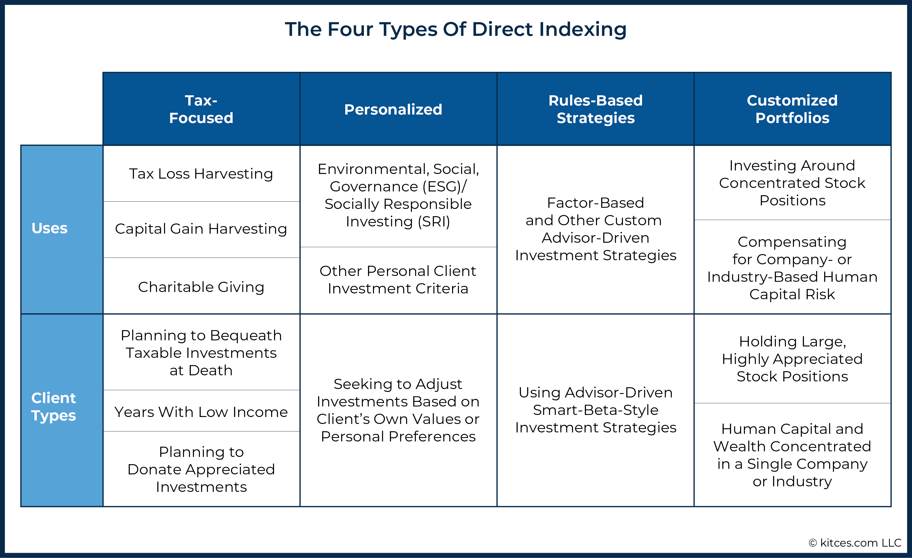

## Table of Contents

## What is an ETF and why is indexing important for its performance?

An ETF, or Exchange-Traded Fund, is a type of investment that holds a collection of assets like stocks, bonds, or commodities. You can buy and sell ETFs on a stock exchange, just like you would with individual stocks. ETFs are popular because they offer a way to invest in a broad market or a specific sector without having to buy each asset separately. This makes it easier and often cheaper for investors to diversify their portfolios.

Indexing is important for an ETF's performance because it helps the fund track the performance of a specific market index, like the S&P 500. When an ETF is designed to mimic an index, it holds the same assets in the same proportions as the index. This means the ETF's performance will closely match the index's performance, minus any fees. Indexing is beneficial because it's a passive investment strategy, which usually results in lower costs and can lead to better long-term returns compared to actively managed funds that try to beat the market.

## What are the basic types of indexing used in ETFs?

There are two main types of indexing used in ETFs: full replication and sampling. Full replication means the ETF tries to hold all the same stocks or assets as the index it's tracking. For example, if an ETF is tracking the S&P 500, it will buy all 500 stocks in the same amounts as the index. This method is straightforward but can be expensive and hard to manage if the index has a lot of stocks.

The other type is sampling, where the [ETF](/wiki/etf-trading-strategies) only holds a smaller, representative sample of the index's stocks. Instead of buying all the stocks, the ETF picks a few that are similar to the whole index. This method is cheaper and easier to manage, but it might not track the index as closely as full replication. Both methods have their pros and cons, and the choice depends on the ETF's goals and the index it's trying to follow.

## How does market-cap weighting affect ETF performance?

Market-cap weighting means that in an ETF, bigger companies take up a larger part of the fund. For example, if a company is worth a lot more than others, it will have a bigger slice of the ETF. This can affect the ETF's performance because if the big companies do well, the ETF will do well too. But if those big companies don't do so well, the ETF might not perform as well either.

This type of weighting is common in many ETFs that track popular indexes like the S&P 500. It's simple and reflects how the market values companies. But it can also mean the ETF is more focused on a few big companies, which might make it riskier if those companies have problems. So, while market-cap weighting can lead to good performance when big companies are doing well, it can also lead to bigger drops if those companies struggle.

## What is equal weighting and how does it differ from market-cap weighting?

Equal weighting means that every company in an ETF gets the same amount of money, no matter how big or small it is. So if an ETF has 100 companies, each one gets 1% of the total money in the fund. This is different from market-cap weighting, where bigger companies get more money because they are worth more.

Equal weighting can be good because it gives smaller companies a chance to affect the ETF's performance. If a small company does really well, it can help the whole ETF. But it also means the ETF might not do as well as a market-cap weighted one if the big companies are doing great. So, equal weighting spreads the risk and reward more evenly across all the companies in the ETF.

## Can you explain what fundamental indexing is and its impact on ETF performance?

Fundamental indexing is a way to pick stocks for an ETF based on things like how much money a company makes, how many assets it has, or how many people it employs, instead of just how much the company is worth in the market. This means the ETF might put more money into companies that are doing well in these areas, even if they are not the biggest companies in the market.

Using fundamental indexing can change how an ETF performs. It might do better than a market-cap weighted ETF if the companies it picks based on their fundamentals do well. But it can also be riskier because it's not just following the market's ups and downs. It's trying to find companies that are strong in other ways, which might not always match what the market thinks is important.

## What are the advantages and disadvantages of using smart beta indexing in ETFs?

Smart beta indexing in ETFs tries to mix the best parts of both active and passive investing. It uses rules to pick stocks, but these rules are different from just following the market's size. Smart beta might look at things like how much a company pays in dividends, how much it grows, or how risky it is. This can help the ETF do better than just copying the market, and it can be cheaper than having someone pick stocks for you. It also lets investors focus on what they think is important, like getting more dividends or less risk.

But smart beta indexing also has some downsides. It can be hard to know if the rules used to pick stocks will really work better than just following the market. Sometimes, these rules might not work as well as expected, and the ETF might not do as well as a simple market-cap weighted one. Also, smart beta ETFs can be more expensive than regular index ETFs because they need more work to keep the rules up to date. So, while smart beta can offer a different way to invest, it comes with its own set of risks and costs.

## How does factor-based indexing work and what factors are commonly used?

Factor-based indexing in ETFs is all about [picking](/wiki/asset-class-picking) stocks based on certain things, called factors, that can help the ETF do better than just copying the market. These factors are like special rules that the ETF follows to choose which stocks to buy. Instead of just looking at how big a company is, like in market-cap weighting, [factor](/wiki/factor-investing)-based indexing looks at other things that might make a stock do well over time.

Some common factors used in factor-based indexing are value, [momentum](/wiki/momentum), quality, and low [volatility](/wiki/volatility-trading-strategies). Value means picking stocks that seem cheap compared to what the company is worth. Momentum is about choosing stocks that have been going up in price recently, hoping they will keep going up. Quality looks for companies that are strong and stable, with good profits and less debt. Low volatility picks stocks that don't go up and down as much as others, which can make the ETF less risky. By focusing on these factors, an ETF can try to beat the market, but it also comes with its own risks and might not always work as planned.

## What role does ESG (Environmental, Social, and Governance) indexing play in ETF performance?

[ESG](/wiki/esg-investing) indexing in ETFs means picking stocks based on how well companies do in taking care of the environment, treating people fairly, and running their business the right way. This can affect how the ETF does because it might not pick the biggest or most popular companies, but instead, it chooses ones that are good at these three things. If more people want to invest in companies that care about the environment, treat their workers well, and have good leaders, then an ESG ETF might do better than others.

But using ESG indexing can also make things harder for the ETF. It might miss out on some big companies that don't do well in ESG but are still good investments. Also, it can be tough to know if a company is really doing well in these areas, because it's not always easy to measure. So, while ESG indexing can help the ETF do well if people care about these things, it can also make the ETF's performance different from what you might expect if you were just looking at the market as a whole.

## How can thematic indexing influence the performance of an ETF?

Thematic indexing in ETFs means picking stocks that fit into a certain theme or trend, like technology, clean energy, or health care. When you invest in a thematic ETF, you're betting that the theme will do well in the future. If the theme becomes popular and the companies in the ETF do well, the ETF's performance can be really good. For example, if you invest in a tech-themed ETF and technology keeps growing, your ETF might grow a lot too.

But thematic indexing can also be risky. If the theme doesn't do as well as expected, the ETF might not do well either. For instance, if you invest in a clean energy ETF and the world doesn't switch to clean energy as fast as you thought, the ETF might not grow much. So, while thematic indexing can lead to big wins if you pick the right theme, it can also lead to big losses if you pick the wrong one.

## What are the potential risks and rewards of using alternative weighting methods in ETF indexing?

Using alternative weighting methods in ETF indexing, like equal weighting, fundamental indexing, or smart beta, can offer some big rewards. These methods can help the ETF do better than just copying the market. For example, equal weighting gives smaller companies a chance to shine, which can lead to big gains if those companies do well. Fundamental indexing might pick companies that are strong in ways the market might not see, leading to better performance if those companies grow. Smart beta can mix the best of both worlds, using rules to pick stocks that might beat the market while still being cheaper than having someone pick stocks for you.

But these alternative weighting methods also come with risks. They might not work as well as expected, and the ETF could do worse than a simple market-cap weighted one. Equal weighting can be riskier because it spreads the money evenly, so if big companies do well but smaller ones don't, the ETF might not do as well. Fundamental indexing can be hard to get right, and if the rules used to pick stocks don't work, the ETF might struggle. Smart beta can be more expensive and might not always beat the market, so it's a gamble on whether the rules will pay off. So, while alternative weighting can lead to big rewards, it also comes with the chance of big risks.

## How do different indexing strategies affect the tracking error of an ETF?

Different indexing strategies can change how closely an ETF follows its target index, which is called tracking error. If an ETF uses full replication, it tries to hold all the same stocks as the index in the same amounts. This usually keeps the tracking error low because the ETF is a close copy of the index. But if the ETF uses sampling, where it only holds a smaller, representative sample of the index's stocks, the tracking error might be higher. This is because the ETF isn't an exact match to the index, so its performance might not line up as well.

Alternative weighting methods like equal weighting, fundamental indexing, or smart beta can also affect tracking error. These methods don't just follow the market's size, so the ETF might not move the same way as the index. For example, equal weighting gives the same amount of money to each company, which can lead to a bigger tracking error if the smaller companies don't do as well as the big ones. Fundamental indexing and smart beta use different rules to pick stocks, which can make the ETF's performance different from the index, leading to a higher tracking error. So, the choice of indexing strategy can make a big difference in how closely an ETF tracks its target index.

## What advanced techniques are used in optimizing ETF indexing for better performance?

One advanced technique used to optimize ETF indexing is called optimization algorithms. These are like special math tools that help the ETF pick the best mix of stocks to get as close as possible to the index's performance without having to buy all the stocks. This can save money and make the ETF easier to manage. Another technique is called securities lending, where the ETF lends out some of its stocks to other investors for a fee. This can bring in extra money for the ETF, which can help improve its performance.

Another way to optimize ETF indexing is by using derivatives like futures and options. These are like bets on how the market will do, and they can help the ETF track the index more closely without having to buy all the stocks. For example, if an ETF wants to track the S&P 500 but doesn't want to buy all 500 stocks, it can use S&P 500 futures to get the same effect. This can be cheaper and more flexible. Also, some ETFs use tax management strategies to lower the taxes investors have to pay, which can make the ETF's performance better after taxes.

## References & Further Reading

[1]: ["Advances in Financial Machine Learning"](https://www.amazon.com/Advances-Financial-Machine-Learning-Marcos/dp/1119482089) by Marcos Lopez de Prado

[2]: ["Machine Learning for Algorithmic Trading"](https://github.com/stefan-jansen/machine-learning-for-trading) by Stefan Jansen

[3]: ["Quantitative Trading: How to Build Your Own Algorithmic Trading Business"](https://github.com/LucindaYa/quant-resources/blob/master/Quantitative%20Trading%20How%20to%20Build%20Your%20Own%20Algorithmic%20Trading%20Business.pdf) by Ernest P. Chan

[4]: ["Evidence-Based Technical Analysis: Applying the Scientific Method and Statistical Inference to Trading Signals"](https://www.amazon.com/Evidence-Based-Technical-Analysis-Scientific-Statistical/dp/0470008741) by David Aronson

[5]: ["Exchange-Traded Funds and the Index Revolution"](https://www.fidelity.com/learning-center/smart-money/etf-vs-index-fund) by Peter Sleep