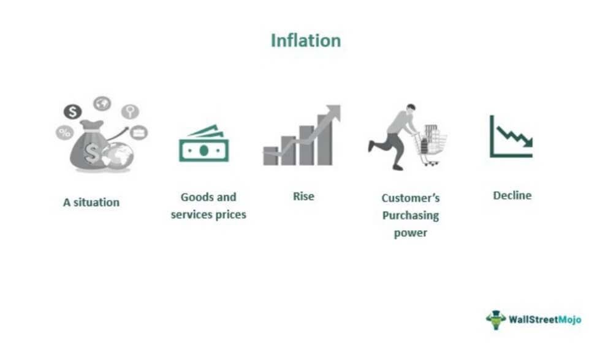

In an age where economic variables dictate the state of global markets, understanding inflation and its implications is more crucial than ever. Inflation refers to the rate at which the general level of prices for goods and services is rising, resulting in a decline in currency purchasing power. This metric plays a pivotal role in economic policy and affects everyday financial decisions, corporate strategies, and government policies. For investors and traders, inflation is not just an economic indicator; it is a force that shapes market behavior and influences portfolio performance.

This article examines the concepts of inflation, including its various types and how they intersect with algorithmic trading. Algorithmic trading has become increasingly popular, leveraging technology to make high-frequency and high-precision trading decisions. Understanding how inflation interacts with this sophisticated trading method is essential for optimizing investments. Algorithmic traders must adjust their strategies in response to inflationary changes to maximize returns and minimize risks.



We also explore how inflation impacts various financial markets and the strategies traders use to navigate these challenges. The effects of inflation differ across asset classes, creating opportunities and risks that traders need to manage efficiently. For instance, inflation can erode the real returns on fixed income securities but might offer potential gains in commodities.

A well-rounded comprehension of these elements is essential for making informed investment decisions in the modern financial landscape. As markets become more interconnected and complex, the ability to adapt to economic changes, such as inflation fluctuations, becomes a crucial skill. Traders and investors who can anticipate inflationary trends and incorporate those insights into their strategies will be better positioned to achieve sustainability and growth in their portfolios.

## Table of Contents

## Understanding Inflation

Inflation signifies the pace at which the overall prices of goods and services increase, leading to a reduction in purchasing power. This economic phenomenon is a critical measure as it reflects the cost of living over time and affects economic decision-making by consumers, businesses, and policymakers. Central banks, such as the Federal Reserve in the United States or the European Central Bank in the European Union, implement monetary policies to keep inflation within target ranges to prevent adverse economic consequences like hyperinflation—an uncontrolled surge in prices—or stagflation, where stagnant economic growth occurs alongside high inflation.

Central banks use tools like interest rate adjustments, open market operations, and reserve requirements modifications to control inflation. By raising interest rates, central banks can discourage borrowing and spending, reducing the money supply in the economy, which may help lower inflation. Conversely, lowering interest rates can stimulate borrowing and investment, potentially increasing inflation if it results in heightened demand.

There are numerous theories about why inflation occurs, but the two most referenced are Keynesian and monetarist perspectives:

1. **Keynesian Economics**: This theory, attributed to economist John Maynard Keynes, suggests that inflation is a result of demand-driven factors. According to Keynesian thought, inflation can arise from increased demand surpassing aggregate supply, causing upward pressure on prices. This can be due to various factors, such as higher government spending or lower taxes, which increase disposable income and thereby consumer spending. Additionally, inflation can also result from supply-side factors, such as rising production costs, which are passed on to consumers as higher prices.

2. **Monetarism**: Monetarist theory, widely associated with economist Milton Friedman, places the money supply at the focal point of inflationary dynamics. Monetarists argue that inflation is primarily the result of too much money chasing too few goods. They advocate for the regulation of a stable rate of monetary growth to manage inflation. According to the quantity theory of money, expressed in the equation $MV = PQ$, where $M$ is the money supply, $V$ is velocity of money, $P$ is the price level, and $Q$ is the quantity of goods and services, an increase in the money supply ($M$) leads directly to a proportional increase in the price level ($P$) if the velocity of money ($V$) and the quantity of output ($Q$) are held constant.

Understanding these foundational theories aids in grasping the complex mechanics of inflation and allows policymakers to devise and implement effective monetary policies to maintain economic stability.

## Types of Inflation

Inflation represents the rate at which prices for goods and services rise, impacting purchasing power. Various types of inflation affect the economy in distinct ways, necessitating different strategies for management and analysis. 

Demand-Pull Inflation occurs when the demand for goods and services surpasses their available supply. This type often arises in a growing economy where consumer and business confidence increases, leading to higher spending. As demand escalates, prices tend to rise, creating inflationary pressure. An example scenario could involve a rapidly expanding industry where consumer interest outpaces production capacity, driving prices up. Central banks might counter this by increasing interest rates to curtail spending.

Cost-Push Inflation is triggered by an increase in the costs of production, compelling companies to elevate their prices to maintain profit margins. This type of inflation can be caused by rising wages or an increase in prices for raw materials. For instance, if the cost of oil surges, transport and production expenses climb, resulting in higher prices for goods and services. Unlike demand-pull inflation, external factors often play a significant role in cost-push inflation, such as geopolitical tensions affecting oil supply.

Stagflation represents a difficult economic situation where high inflation coincides with stagnating economic growth and rising unemployment. This scenario defies the traditional Phillips Curve, which posits an inverse relationship between inflation and unemployment. An example of stagflation occurred during the 1970s, driven by oil price shocks and poor fiscal policies, leading to slowed economic growth amid rising prices and joblessness.

Hyperinflation is characterized by extremely rapid and unmanageable inflation that erodes currency value at an alarming rate. It often results from excessive money supply growth unchecked by economic output. For example, Zimbabwe in the late 2000s experienced hyperinflation with rates reaching as high as billions of percent monthly. Hyperinflation severely impacts everyday life, leading to economic instability and loss of confidence in the national currency, often requiring comprehensive economic reform to stabilize the economy.

Understanding these types of inflation is important for developing strategies to manage their impacts on the economy and financial markets.

## Theories Explaining Inflation

Inflation can be explained by various economic theories, with Keynesian Economics and Monetarism being two of the most influential perspectives.

Keynesian Economics links inflation to economic pressures that arise from both the supply side and demand side of the market. According to this theory, inflation occurs when there is an increase in the overall demand for goods and services that exceeds existing supply, known as demand-pull inflation. This can be triggered by factors such as government spending, consumer expenditure, or investment spending rising more rapidly than the economy's capacity to produce goods and services. Keynesians also point out another form of inflation called cost-push inflation, which happens when increasing production costs, such as wages and raw materials, compel producers to raise prices to maintain profit margins. Keynesian economists advocate for policies that regulate demand through fiscal and monetary measures to manage inflation.

Monetarism, on the other hand, attributes inflation to the growth rate of the money supply. Monetarists, following the ideas of economist Milton Friedman, suggest that inflation is a monetary phenomenon that arises when there is too much money in circulation compared to what is needed for economic transactions. The equation of exchange, expressed as $MV = PT$, where $M$ is the money supply, $V$ is the velocity of money, $P$ is the price level, and $T$ is the [volume](/wiki/volume-trading-strategy) of transactions, encapsulates the monetarist view. According to this formula, any increase in $M$ with a stable $V$ and $T$ results in increased $P$, or price levels, indicating inflation. Monetarists argue for the importance of regulating monetary growth to align closely with economic growth to avoid inflation. They advocate for policy measures that target the growth of the money supply.

While both theories have their critics, they provide essential frameworks for understanding the dynamics of inflation and guiding economic policy. Keynesian approaches focus on regulating demand and production costs, while monetarism zeroes in on controlling monetary supply for achieving price stability.

## Inflation Impact on Financial Markets

Inflation has significant implications for financial markets, influencing asset prices, yields, and market dynamics. This section examines the impact of inflation on the stock market, bond market, and [forex](/wiki/forex-system) market.

### Stock Market

Inflation affects corporate earnings and valuation metrics in several ways. When inflation rises, input costs for companies—such as raw materials, labor, and energy—also tend to increase. This can compress profit margins if companies are unable to pass these costs onto consumers through higher prices. As a result, earnings growth can be hampered, negatively impacting stock valuations.

Moreover, inflation influences the discount rate used in discounted cash flow valuation models. The formula for calculating the present value $PV$ of future cash flows $CF$ is:

$$
PV = \frac{CF}{(1 + r)^n}
$$

where $r$ is the discount rate and $n$ is the period number. Higher inflation typically leads to increased interest rates, which elevate the discount rate $r$, thereby reducing the present value of future cash flows. This results in lower stock valuations.

Investor sentiment can also be negatively impacted by inflation, as high and unpredictable inflation rates create uncertainty regarding future earnings and economic stability. However, certain sectors like energy and consumer staples may outperform in inflationary environments due to their ability to adjust prices more effectively.

### Bond Market

Inflation erodes the purchasing power of fixed-income streams, making bonds less attractive to investors. This is primarily due to the fact that bond coupon payments are typically fixed and do not increase with inflation. As inflation expectations rise, investors demand higher yields to compensate for the anticipated loss in purchasing power, leading to a decline in bond prices.

The relationship between bond prices and yields can be understood through the following formula for a bond's yield to maturity $YTM$:

$$
YTM \approx \frac{C + \frac{F-P}{n}}{\frac{F+P}{2}}
$$

where $C$ is the annual coupon payment, $F$ is the face value, $P$ is the price of the bond, and $n$ is the number of years to maturity. Higher inflation expectations lead to a rise in $YTM$ as $P$ decreases.

Inflation-indexed bonds, such as Treasury Inflation-Protected Securities (TIPS) in the U.S., offer a safeguard against inflation by adjusting principal and interest payments with changes in the inflation rate, thus preserving purchasing power.

### Forex Market

Inflation impacts currency values and international trade competitiveness. Higher domestic inflation compared to trading partners can result in currency depreciation. This occurs because more inflative countries see a relative decrease in the purchasing power of their currencies, making their goods more expensive internationally and affecting trade balances.

Exchange rates adjust to reflect differences in inflation, influenced by purchasing power parity—the theory that in the long term, exchange rates should move towards levels that equalize the price of identical goods and services in different countries. The relative price level change is captured by:

$$
\frac{E_1}{E_0} = \frac{1 + \text{inflation}_\text{domestic}}{1 + \text{inflation}_\text{foreign}}
$$

where $E_0$ and $E_1$ are the exchange rates at the start and end of the period, respectively.

Additionally, capital flows can be altered by inflation-induced [interest rate](/wiki/interest-rate-trading-strategies) changes. Higher inflation often leads to higher interest rates to curb inflation, attracting foreign investment and appreciating the currency in the short term. However, persistent high inflation can undermine economic confidence, leading to currency depreciation in the long term. 

Understanding these dynamics is crucial for investors and policymakers to navigate the complex interplay between inflation and financial markets.

## Algorithmic Trading and Inflation

Algorithmic trading employs computer algorithms to execute trading decisions, which necessitates an understanding of inflation's effects on financial markets. Inflation, a critical economic indicator, can significantly impact asset prices, necessitating traders to incorporate inflationary analysis in their algorithms. 

One vital aspect of algorithm creation is the integration of real-time macroeconomic data and historical inflation trends. Algorithms need to analyze current inflation data alongside historical trends to predict potential future movements in asset prices. This process allows for adjustments in trading strategies, ensuring that they remain effective across varying inflationary climates. For example, algorithms can be programmed to adjust for changes in a central bank's inflation targets or expectations, thereby modifying investment strategies accordingly.

Machine learning models are instrumental in assessing inflationary environments. By employing supervised learning, these algorithms can be trained using historical inflation data and asset price fluctuations, allowing them to recognize patterns and make informed predictions. Such models can analyze how different types of inflation—such as demand-pull or cost-push inflation—might affect specific asset classes differently. For instance, an increase in production costs may lead to cost-push inflation, impacting the profit margins of companies and consequently affecting stock valuations.

Below is a simplified example of using Python to implement a basic [machine learning](/wiki/machine-learning) model that predicts asset price changes based on inflation data:

```python
import numpy as np
from sklearn.model_selection import train_test_split
from sklearn.linear_model import LinearRegression

# Sample data: historical inflation rates and corresponding asset price changes
inflation_rates = np.array([2.0, 2.5, 1.8, 3.0, 2.1, 1.9]).reshape(-1, 1)
asset_price_changes = np.array([5.0, 5.5, 4.8, 6.0, 5.1, 4.9])

# Splitting data into training and testing sets
X_train, X_test, y_train, y_test = train_test_split(inflation_rates, asset_price_changes, test_size=0.2, random_state=42)

# Initializing and training the Linear Regression model
model = LinearRegression()
model.fit(X_train, y_train)

# Predicting asset price changes based on test data
predictions = model.predict(X_test)

print("Predicted Asset Price Changes:", predictions)
```

This basic example demonstrates how historical inflation data can be used to predict changes in asset prices through machine learning models. Such models are crucial for [algorithmic trading](/wiki/algorithmic-trading) to adapt strategies dynamically and mitigate risks associated with inflation. Traders thus gain an edge by anticipating the market's reaction to varying inflationary pressures, allowing for informed and timely trading decisions.

## Practical Examples and Case Studies

### Case Study: Renaissance Technologies' Use of Inflation Metrics in Trading Models

Renaissance Technologies, a prominent quantitative [hedge fund](/wiki/hedge-fund-trading-strategies), has been instrumental in incorporating various economic indicators, including inflation metrics, into their trading models. Utilizing sophisticated algorithms and statistical techniques, Renaissance leverages historical inflation data to predict future market movements and make informed trading decisions.

Inflation can significantly impact the valuation of assets, making it imperative for trading models to incorporate these fluctuations. Renaissance Technologies employs machine learning models to analyze the correlation between inflation rates and asset price changes. By integrating real-time inflation data, the firm fine-tunes their algorithms to adapt to the dynamic market conditions characterized by inflationary pressures.

The fund's Medallion Fund, which has consistently delivered outstanding returns, likely considers a plethora of inflation-related data points. Variables such as the Consumer Price Index (CPI) or Producer Price Index (PPI) are analyzed to detect trends and patterns that might indicate shifts in inflation. Such data helps Renaissance predict pricing pressure on both input costs and final consumer demand, thereby optimizing trade execution strategies.

### Case Study: Bridgewater Associates' Inclusion of Inflation in Macroeconomic Strategies

Bridgewater Associates, one of the largest hedge funds globally, operates under a unique "All Weather" investment philosophy. This approach is rooted in anticipating and adapting to various economic conditions, including inflation. The firm's strategy involves a comprehensive analysis of macroeconomic indicators, of which inflation plays a central role.

Ray Dalio, the founder of Bridgewater Associates, emphasizes the importance of understanding the cyclical nature of economies and how inflation influences these cycles. Inflation affects both nominal and real returns, necessitating adjustments in portfolio allocations to hedge against inflation risks. Bridgewater uses a systematic framework to evaluate how rising inflation impacts asset classes differently, guiding their strategic asset allocation.

Incorporating inflation into their economic framework allows Bridgewater to manage risk by diversifying across assets that typically perform well during inflationary periods, such as commodities and inflation-linked bonds. The firm employs both historical data and econometric models to simulate potential inflation scenarios and stress test their portfolios. This methodology aims to achieve a balanced risk-return profile that aligns with their macroeconomic insights.

Bridgewater's research-intensive approach ensures that inflation metrics are deeply integrated into their overall investment strategy, allowing them to navigate inflating environments successfully. By continuously updating their models with fresh data, the firm maintains a proactive stance in managing inflation effects on their investments.

## Conclusion

Inflation remains a pervasive and influential [factor](/wiki/factor-investing) in the economic environment, affecting all financial market segments. Its impacts are multifaceted, influencing decision-making processes from corporate investment strategies to national fiscal policies. In financial markets, inflation affects corporate earnings, alters valuation metrics, and erodes the purchasing power of fixed-income investments, among other effects.

Algorithmic traders must possess a profound understanding of inflation and its implications to thrive. The complexity of inflation demands that traders do more than simply react; they must anticipate and adapt their strategies to the shifts it causes within the markets. This requires integrating robust macroeconomic data analysis with algorithmic trading strategies. By incorporating real-time inflation-related data, algorithms can be fine-tuned to recognize and respond to patterns and anomalies in market behavior resulting from inflationary pressures.

Dynamic strategies are essential for hedging against inflationary risks. Traders can employ machine learning models to simulate various inflationary scenarios and understand their potential impacts on asset prices. For example, using Python, traders can develop models that continuously learn from incoming data, identifying correlations between inflation data and market movements. A sample Python code to track inflation metrics and their impact on asset prices might look like this:

```python
import pandas as pd
from sklearn.linear_model import LinearRegression
import numpy as np

# Example data: historical inflation rates and corresponding asset prices
inflation_data = pd.DataFrame({
    'Inflation_Rate': [2.1, 2.5, 3.0, 2.8, 2.6],
    'Asset_Price': [100, 102, 105, 103, 104]
})

# Linear regression model to find correlation
X = inflation_data[['Inflation_Rate']]
y = inflation_data['Asset_Price']

model = LinearRegression()
model.fit(X, y)

# Coefficient representing the relationship between inflation rate and asset prices
print(f'Coefficient: {model.coef_[0]}')

# Predicting future asset prices based on expected inflation rates
predicted_asset_price = model.predict(np.array([[3.2]]))
print(f"Predicted Asset Price at 3.2% Inflation: {predicted_asset_price[0]}")
```

Through comprehensive analysis and the implementation of adaptive strategies, algorithmic traders can better navigate the unstable waters of inflation. This adaptability helps to safeguard trade models from risks posed by inflation, ensuring sustained success and resilience in ever-changing economic climates. By staying informed and prepared, traders can maintain their competitive edge even in the face of unpredictable inflationary shifts.

## References & Further Reading

[1]: ["Inflation Targeting: Lessons from the International Experience"](https://www.jstor.org/stable/j.ctv301gdr) by Ben S. Bernanke

[2]: ["The Alchemy of Finance"](https://www.amazon.com/Alchemy-Finance-George-Soros/dp/0471445495) by George Soros

[3]: Friedman, M. (1968). ["The Role of Monetary Policy."](https://www.aeaweb.org/aer/top20/58.1.1-17.pdf) The American Economic Review, 58(1), 1-17.

[4]: Keynes, J. M. (1936). ["The General Theory of Employment, Interest, and Money."](https://www.files.ethz.ch/isn/125515/1366_KeynesTheoryofEmployment.pdf)

[5]: ["Adaptive Markets: Financial Evolution at the Speed of Thought"](https://www.jstor.org/stable/j.ctvc7778k) by Andrew W. Lo

[6]: ["A Primer for the Mathematics of Financial Engineering"](https://resources.caih.jhu.edu/primo-explore/threads/index_htm_files/A_Linear_Algebra_Primer_For_Financial_Engineering.pdf) by Dan Stefanica

[7]: Bernanke, B.S. & Mihov, I. (1998). ["Measuring Monetary Policy."](https://pages.stern.nyu.edu/~dbackus/Identification/BernankeMihov_QJE_98.pdf) The Quarterly Journal of Economics, 113(3), 869-902.

[8]: ["The Big Short: Inside the Doomsday Machine"](https://www.amazon.com/Big-Short-Inside-Doomsday-Machine/dp/0393338827) by Michael Lewis