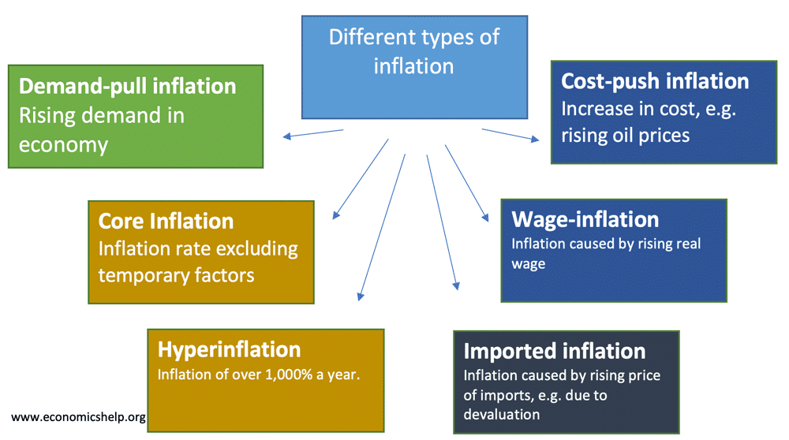

## Table of Contents

## What is inflation?

Inflation is when the prices of things we buy, like food and toys, go up over time. It means that the money we have can buy less stuff than before. Imagine if a candy bar cost $1 last year, but this year it costs $1.10. That's inflation. It happens because the amount of money in the economy grows faster than the number of goods and services.

There are different reasons why inflation happens. Sometimes, it's because the cost of making things goes up, like if the price of sugar goes up, then candy might cost more. Other times, it's because people have more money to spend, so they're willing to pay more for things. Governments and banks try to control inflation by changing interest rates or the amount of money in circulation.

Inflation isn't always bad. A little bit of inflation can be good because it encourages people to spend money now rather than later. But if inflation gets too high, it can make life hard because everything becomes more expensive quickly. That's why people and governments keep a close eye on it.

## What are the different types of inflation?

There are a few different types of inflation that people talk about. The first type is called demand-pull inflation. This happens when there are too many people wanting to buy things, but there aren't enough things to go around. It's like when everyone wants the newest toy, and the store runs out of them. So, the price of the toy goes up because everyone is willing to pay more to get it.

Another type is cost-push inflation. This happens when the cost of making things goes up. For example, if it costs more to grow wheat because of a bad harvest, then the price of bread might go up. Companies might raise their prices to cover these higher costs, and that's cost-push inflation.

There's also built-in inflation, which happens when people expect prices to keep going up. Workers might ask for higher wages to keep up with the rising costs, and then companies might raise their prices to pay for those higher wages. It's like a cycle where everyone expects prices to keep increasing, so they keep going up.

## What is demand-pull inflation?

Demand-pull inflation is when too many people want to buy things, but there aren't enough things to go around. It's like when everyone wants the newest toy, and the store runs out of them. Because so many people want the toy, they are willing to pay more to get it. So, the price of the toy goes up. This happens because the demand for the toy is pulling the price higher.

This type of inflation can happen when the economy is doing well, and people have more money to spend. When people have more money, they might want to buy more things, like cars, houses, or toys. If everyone is trying to buy these things at the same time, and there aren't enough of them, the prices go up. It's like a tug-of-war between what people want to buy and what's available to buy.

## What is cost-push inflation?

Cost-push inflation happens when the cost of making things goes up. Imagine if it costs more to grow wheat because of a bad harvest. The price of bread might go up because it costs more to make it. Companies might raise their prices to cover these higher costs. This type of inflation is called cost-push because the higher costs are pushing the prices up.

It can happen for different reasons. Sometimes, it's because the price of raw materials, like oil or metal, goes up. Other times, it might be because wages go up, and companies need to pay their workers more. When these costs go up, companies might not have a choice but to raise the prices of their products to keep making money. That's how cost-push inflation works.

## What is built-in inflation?

Built-in inflation happens when people expect prices to keep going up. It's like a cycle where everyone thinks things will cost more in the future, so they act in ways that make prices go up now. For example, workers might ask for higher wages to keep up with the rising costs of living. When they get higher wages, companies might raise their prices to pay for those higher wages. This cycle keeps going because everyone expects prices to keep increasing.

This type of inflation can be tricky to stop because it's based on what people think will happen. If everyone believes prices will keep going up, they might keep asking for more money or raising prices, which makes the cycle continue. Governments and banks try to manage these expectations by keeping inflation at a steady, low level so people don't expect big price jumps.

## How does demand-pull inflation occur?

Demand-pull inflation happens when people want to buy more things than what's available. Imagine everyone wants the newest toy, but the store doesn't have enough. Because so many people want it, they're willing to pay more to get it. So, the price of the toy goes up. This is like a tug-of-war where the demand for things is pulling the prices higher.

This kind of inflation often happens when the economy is doing well. When people feel good about their money, they might want to buy more stuff, like cars, houses, or toys. If everyone is trying to buy these things at the same time, and there aren't enough of them, the prices go up. It's all about too much demand for the things that are available.

## What causes cost-push inflation?

Cost-push inflation happens when it costs more to make things. Imagine if the price of wheat goes up because of a bad harvest. Now, it costs more to make bread, so the bakery might raise the price of bread to cover these higher costs. That's cost-push inflation. It's like the higher costs are pushing the prices up.

This type of inflation can happen for different reasons. Sometimes, it's because the price of raw materials, like oil or metal, goes up. Other times, it might be because workers want higher wages, and companies need to pay them more. When these costs go up, companies might not have a choice but to raise the prices of their products to keep making money. That's how cost-push inflation works.

## What are the effects of built-in inflation on the economy?

Built-in inflation can make the economy tricky because it's based on what people think will happen. If everyone expects prices to keep going up, they might ask for more money or raise prices now. This can start a cycle where prices keep increasing because everyone thinks they will. It's like a self-fulfilling prophecy where the belief in higher future prices makes them happen now. This can make things more expensive for everyone, and it can be hard to stop once it starts.

Governments and banks try to manage built-in inflation by keeping it at a steady, low level. They do this so people don't expect big price jumps. If people think prices will stay the same or only go up a little, they might not ask for big raises or raise their prices so much. This helps keep the economy stable and prevents the cycle of built-in inflation from getting out of control.

## Can you explain stagflation and how it relates to inflation types?

Stagflation is when the economy is not growing, lots of people can't find jobs, and prices are going up. It's like a mix of bad things happening at the same time. Normally, if prices go up, it means people are buying a lot and the economy is doing well. But with stagflation, even though prices are going up, the economy is not doing well, and people are out of work.

Stagflation can happen because of different types of inflation. It might start with cost-push inflation, where the cost of making things goes up. For example, if oil prices go up, it costs more to make and move things, so prices go up. But if people don't have more money to spend, they might buy less, and companies might not hire more people. This can lead to stagflation, where prices are high, but the economy is stuck and not growing. Demand-pull inflation, where too many people want to buy things, doesn't usually cause stagflation because it's linked to a growing economy. But if it happens at the same time as cost-push inflation, it can make stagflation worse.

## How do different types of inflation impact monetary policy?

Different types of inflation can make central banks change their monetary policy. When there's demand-pull inflation, it means people want to buy a lot of things, but there aren't enough things to go around. Central banks might raise interest rates to make borrowing money more expensive. This can slow down how much people want to spend and help stop prices from going up too fast. If they don't do this, demand-pull inflation could keep getting worse and make the economy too hot.

Cost-push inflation happens when it costs more to make things. If oil prices go up, it can make everything more expensive. Central banks might not raise interest rates right away because that could make things worse by slowing down the economy even more. Instead, they might wait to see if the higher costs go away on their own or use other tools like controlling the money supply to keep inflation in check. If cost-push inflation lasts a long time, they might need to do something more to stop prices from going up too much.

Built-in inflation is tricky because it's about what people think will happen. If everyone expects prices to keep going up, they might ask for more money or raise prices now. Central banks need to keep inflation steady and low to stop this cycle. They might use interest rates or talk to the public to make sure people don't expect big price jumps. If they can keep expectations under control, it helps keep the economy stable and stops built-in inflation from getting out of hand.

## What are the historical examples of each type of inflation?

Demand-pull inflation happened a lot in the United States during the 1960s. The economy was doing really well, and people had more money to spend. They wanted to buy cars, houses, and other things, but there weren't enough of them to go around. So, the prices of these things went up because everyone was willing to pay more to get them. This type of inflation is linked to a growing economy where people feel good about spending money.

Cost-push inflation was seen in the 1970s, also in the United States. The price of oil went up a lot because of an oil crisis. Oil is used to make and move a lot of things, so when it got more expensive, everything else got more expensive too. Companies had to raise their prices to cover the higher costs of oil. This made prices go up even though the economy wasn't doing well, which led to a problem called stagflation.

Built-in inflation can be seen in many countries over time, but a good example is in the United Kingdom during the 1970s. People expected prices to keep going up, so workers asked for higher wages to keep up with the rising costs. When they got higher wages, companies raised their prices to pay for those wages. This cycle kept going because everyone thought prices would keep increasing, which made them go up even more. It's a tricky type of inflation because it's based on what people think will happen.

## How can governments and central banks mitigate the effects of different types of inflation?

Governments and central banks can help control demand-pull inflation by making borrowing money more expensive. They do this by raising interest rates. When interest rates go up, people might not want to borrow as much money to buy things like cars or houses. This can slow down how much people spend and help stop prices from going up too fast. If the central bank keeps an eye on how much people are spending and adjusts interest rates, it can keep demand-pull inflation under control.

For cost-push inflation, the approach can be different. When the cost of making things goes up, like if oil prices go up, raising interest rates right away might make things worse by slowing down the economy even more. Instead, central banks might wait to see if the higher costs go away on their own. They could also use other tools, like controlling how much money is in the economy, to keep prices from going up too much. If cost-push inflation lasts a long time, they might need to do something more to stop prices from getting out of hand.

Built-in inflation is tricky because it's about what people think will happen. If everyone expects prices to keep going up, they might ask for more money or raise prices now. To stop this cycle, central banks need to keep inflation steady and low. They can use interest rates or talk to the public to make sure people don't expect big price jumps. If they can keep expectations under control, it helps keep the economy stable and stops built-in inflation from getting out of hand.

## How does inflation impact financial markets?

Inflation has significant implications for financial markets, influencing asset prices, yields, and market dynamics. This section examines the impact of inflation on the stock market, bond market, and [forex](/wiki/forex-system) market.

### Stock Market

Inflation affects corporate earnings and valuation metrics in several ways. When inflation rises, input costs for companies—such as raw materials, labor, and energy—also tend to increase. This can compress profit margins if companies are unable to pass these costs onto consumers through higher prices. As a result, earnings growth can be hampered, negatively impacting stock valuations.

Moreover, inflation influences the discount rate used in discounted cash flow valuation models. The formula for calculating the present value $PV$ of future cash flows $CF$ is:

$$
PV = \frac{CF}{(1 + r)^n}
$$

where $r$ is the discount rate and $n$ is the period number. Higher inflation typically leads to increased interest rates, which elevate the discount rate $r$, thereby reducing the present value of future cash flows. This results in lower stock valuations.

Investor sentiment can also be negatively impacted by inflation, as high and unpredictable inflation rates create uncertainty regarding future earnings and economic stability. However, certain sectors like energy and consumer staples may outperform in inflationary environments due to their ability to adjust prices more effectively.

### Bond Market

Inflation erodes the purchasing power of fixed-income streams, making bonds less attractive to investors. This is primarily due to the fact that bond coupon payments are typically fixed and do not increase with inflation. As inflation expectations rise, investors demand higher yields to compensate for the anticipated loss in purchasing power, leading to a decline in bond prices.

The relationship between bond prices and yields can be understood through the following formula for a bond's yield to maturity $YTM$:

$$
YTM \approx \frac{C + \frac{F-P}{n}}{\frac{F+P}{2}}
$$

where $C$ is the annual coupon payment, $F$ is the face value, $P$ is the price of the bond, and $n$ is the number of years to maturity. Higher inflation expectations lead to a rise in $YTM$ as $P$ decreases.

Inflation-indexed bonds, such as Treasury Inflation-Protected Securities (TIPS) in the U.S., offer a safeguard against inflation by adjusting principal and interest payments with changes in the inflation rate, thus preserving purchasing power.

### Forex Market

Inflation impacts currency values and international trade competitiveness. Higher domestic inflation compared to trading partners can result in currency depreciation. This occurs because more inflative countries see a relative decrease in the purchasing power of their currencies, making their goods more expensive internationally and affecting trade balances.

Exchange rates adjust to reflect differences in inflation, influenced by purchasing power parity—the theory that in the long term, exchange rates should move towards levels that equalize the price of identical goods and services in different countries. The relative price level change is captured by:

$$
\frac{E_1}{E_0} = \frac{1 + \text{inflation}_\text{domestic}}{1 + \text{inflation}_\text{foreign}}
$$

where $E_0$ and $E_1$ are the exchange rates at the start and end of the period, respectively.

Additionally, capital flows can be altered by inflation-induced [interest rate](/wiki/interest-rate-trading-strategies) changes. Higher inflation often leads to higher interest rates to curb inflation, attracting foreign investment and appreciating the currency in the short term. However, persistent high inflation can undermine economic confidence, leading to currency depreciation in the long term. 

Understanding these dynamics is crucial for investors and policymakers to navigate the complex interplay between inflation and financial markets.

## References & Further Reading

[1]: ["Inflation Targeting: Lessons from the International Experience"](https://www.jstor.org/stable/j.ctv301gdr) by Ben S. Bernanke

[2]: ["The Alchemy of Finance"](https://www.amazon.com/Alchemy-Finance-George-Soros/dp/0471445495) by George Soros

[3]: Friedman, M. (1968). ["The Role of Monetary Policy."](https://www.aeaweb.org/aer/top20/58.1.1-17.pdf) The American Economic Review, 58(1), 1-17.

[4]: Keynes, J. M. (1936). ["The General Theory of Employment, Interest, and Money."](https://www.files.ethz.ch/isn/125515/1366_KeynesTheoryofEmployment.pdf)

[5]: ["Adaptive Markets: Financial Evolution at the Speed of Thought"](https://www.jstor.org/stable/j.ctvc7778k) by Andrew W. Lo

[6]: ["A Primer for the Mathematics of Financial Engineering"](https://resources.caih.jhu.edu/primo-explore/threads/index_htm_files/A_Linear_Algebra_Primer_For_Financial_Engineering.pdf) by Dan Stefanica

[7]: Bernanke, B.S. & Mihov, I. (1998). ["Measuring Monetary Policy."](https://pages.stern.nyu.edu/~dbackus/Identification/BernankeMihov_QJE_98.pdf) The Quarterly Journal of Economics, 113(3), 869-902.

[8]: ["The Big Short: Inside the Doomsday Machine"](https://www.amazon.com/Big-Short-Inside-Doomsday-Machine/dp/0393338827) by Michael Lewis