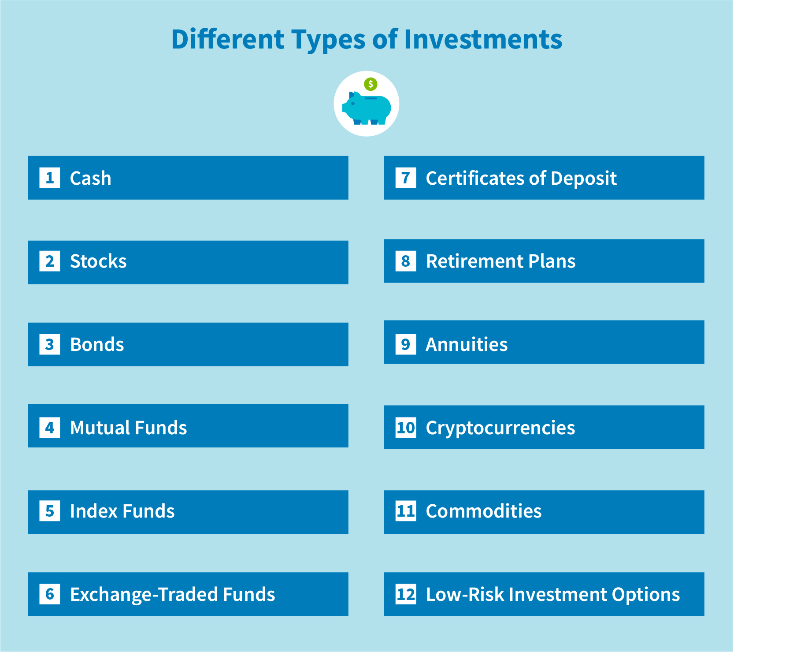

## Table of Contents

## What is an investment note?

An investment note is a type of financial document that explains the details of an investment opportunity. It is often used by companies or startups to attract investors by providing information about the business, the amount of money needed, and how the investment will be used. The note usually includes details like the expected return on investment, the risks involved, and the terms of the investment.

These notes are important because they help investors make informed decisions. By reading an investment note, an investor can understand if the opportunity matches their investment goals and risk tolerance. It's like a guide that helps investors see the potential benefits and downsides before they decide to put their money into the project.

## What are the different types of investment notes available to investors?

There are several types of investment notes that investors can consider. One common type is the convertible note, which is often used by startups. This note starts as a loan but can be converted into equity, or ownership in the company, at a later date. This is helpful for new businesses that might not have a set value yet. Another type is the promissory note, which is a simple loan agreement where the investor lends money to a company and gets paid back with interest over time.

Another type of investment note is the revenue share note. With this, instead of getting a fixed [interest rate](/wiki/interest-rate-trading-strategies), the investor gets a percentage of the company's revenue until they reach a certain amount. This can be good for businesses with steady income but not a lot of assets. Lastly, there are secured notes, where the investment is backed by some kind of asset, like property or equipment. This makes the investment less risky because if the company can't pay back the money, the investor can take the asset instead.

Each type of investment note has its own benefits and risks. Convertible notes can be great for investors who believe in a company's future growth. Promissory notes offer a more predictable return, while revenue share notes can be appealing if you think a company will do well financially. Secured notes provide a safety net but might offer lower returns because they are less risky. Choosing the right type depends on what the investor is looking for in terms of risk and reward.

## How do secured investment notes differ from unsecured investment notes?

Secured investment notes are backed by some kind of asset, like property or equipment. This means if the company can't pay back the money, the investor can take the asset instead. This makes secured notes less risky because there's something to fall back on if things go wrong. Investors might choose secured notes if they want a safer investment, but they might get a lower return because the risk is lower.

Unsecured investment notes, on the other hand, don't have any assets backing them up. If the company can't pay back the money, the investor doesn't have anything to take instead. This makes unsecured notes riskier, but they might offer higher returns to make up for that risk. Investors might choose unsecured notes if they're willing to take on more risk for the chance of a bigger reward.

## What are the key features of convertible investment notes?

Convertible investment notes are a special kind of investment that starts as a loan but can turn into ownership in a company later on. This is really helpful for new businesses that don't have a clear value yet. When someone invests with a convertible note, they lend money to the company. But instead of getting their money back with interest like a regular loan, they can choose to get a piece of the company instead. This happens when the company reaches a certain point, like getting more funding or hitting a certain date.

The main thing about convertible notes is that they have something called a conversion rate. This decides how much of the company the investor gets when they turn their loan into ownership. There's also usually a discount rate, which means the investor gets to buy the ownership for less than what new investors would pay. This is a way to reward them for taking the risk early on. Convertible notes can be a good choice for investors who believe in the company's future and want to be part of its growth.

## How do fixed-rate investment notes work and what are their benefits?

Fixed-rate investment notes are a type of investment where you lend money to a company or organization, and they promise to pay you back with a set amount of interest over time. The interest rate stays the same from the start until the end of the note's term. This means you know exactly how much money you'll get back and when, which makes it easier to plan your finances.

The main benefit of fixed-rate investment notes is that they are predictable. You don't have to worry about the interest rate going up or down because it's locked in. This can be really helpful if you want a steady income or if you're saving for something specific and need to know how much money you'll have. Another benefit is that they can be less risky than other types of investments because you know what you're getting. But, because they're safer, the interest rate might be lower than what you could get from riskier investments.

## What are floating-rate investment notes and how do they adjust to market conditions?

Floating-rate investment notes are a type of investment where the interest you earn can change over time. Unlike fixed-rate notes, where the interest stays the same, floating-rate notes adjust based on something called a benchmark rate. This benchmark rate could be something like the prime rate or the federal funds rate, which are rates that change as the economy changes. So, if the benchmark rate goes up, the interest you earn on your floating-rate note goes up too. If the benchmark rate goes down, your interest goes down as well.

The main way floating-rate notes adjust to market conditions is by following the changes in the benchmark rate. This means they can be a good choice if you think interest rates might go up, because you'll earn more interest as rates rise. But it also means there's more uncertainty, because you don't know exactly how much interest you'll earn over time. This can be a bit riskier than fixed-rate notes, but it can also be a way to take advantage of rising interest rates in the market.

## Can you explain the concept of zero-coupon investment notes and their tax implications?

Zero-coupon investment notes are a type of investment where you buy the note at a lower price than its face value, and then you get the full face value back when the note matures. For example, you might buy a zero-coupon note for $800 that will be worth $1,000 when it matures in a few years. The difference between what you paid and what you get back is your interest, but you don't get any payments along the way. This makes zero-coupon notes different from other types of notes where you get interest payments regularly.

When it comes to taxes, zero-coupon notes can be a bit tricky. Even though you don't get any interest payments until the note matures, the IRS says you have to pay taxes on the interest you earn each year. This is called imputed interest. So, every year, you have to report a part of the interest you'll eventually get as income, even though you don't actually get the money until the note matures. This means you might have to pay taxes on money you haven't received yet, which can be a bit confusing but is important to keep in mind when investing in zero-coupon notes.

## What role do inflation-linked investment notes play in an investment portfolio?

Inflation-linked investment notes help protect your money from losing value because of inflation. Inflation means that over time, the cost of things goes up, so your money can buy less. These notes are special because the interest they pay, or the amount you get back at the end, goes up with inflation. This means if prices go up, the value of your investment goes up too, keeping your money's buying power the same.

Adding inflation-linked notes to your investment portfolio can be a smart move if you want to keep your money safe from inflation. They can balance out other investments that might lose value when inflation rises. By having some of your money in these notes, you make sure that at least part of your savings grows along with the cost of living, helping you plan for the future without worrying as much about inflation eating away at your money.

## How do structured investment notes combine traditional investments with derivatives?

Structured investment notes mix regular investments like stocks or bonds with something called derivatives. Derivatives are like bets on how the market will do. They can be based on things like stock prices, interest rates, or even the weather. When you buy a structured note, part of your money goes into the regular investment, and part goes into the derivative. This mix can make the note more interesting because it can offer different ways to earn money, depending on how the market moves.

These notes can be good for people who want to try something different with their money. They might give you a chance to earn more than you would with just a regular investment, but they can also be riskier. Because they use derivatives, the value of the note can go up or down a lot, depending on what happens in the market. So, it's important to understand how they work and what you might gain or lose before you decide to invest in them.

## What are the risks associated with high-yield investment notes?

High-yield investment notes can offer bigger returns than other investments, but they come with more risks too. One big risk is that the company you invest in might not be able to pay you back. These notes are often from companies that are not as strong financially, so there's a higher chance they could run into money problems. If they can't pay back what they owe, you could lose some or all of your investment.

Another risk is that high-yield notes can be harder to sell if you need your money back quickly. They don't trade as easily as other investments, so you might have to wait longer or sell them for less than you paid. Also, because they promise higher returns, they can be affected more by changes in the economy or interest rates. If things go wrong, the value of your high-yield notes could drop a lot, making them a riskier choice.

## How can an investor assess the creditworthiness of an issuer of investment notes?

To assess the creditworthiness of an issuer of investment notes, an investor should start by looking at the company's credit rating. Credit rating agencies like Moody's, Standard & Poor's, and Fitch give companies grades based on how likely they are to pay back their debts. A high rating means the company is seen as safe and likely to pay you back, while a low rating means it's riskier. Investors can find these ratings online or in financial reports.

Another way to check creditworthiness is by looking at the company's financial statements. These documents show how much money the company makes, how much it owes, and how it's doing overall. If a company has a lot of debt and not much money coming in, it might struggle to pay back its investment notes. Investors can also read the company's annual reports and news articles to see if there are any big changes or problems that could affect its ability to pay back what it owes. By doing this research, investors can get a better idea of whether the company is a good bet or too risky.

## What advanced strategies can be used to optimize returns from a portfolio of investment notes?

One advanced strategy to optimize returns from a portfolio of investment notes is diversification. This means spreading your money across different types of notes, like fixed-rate, floating-rate, and inflation-linked notes. By doing this, you can balance out the risks and rewards. For example, if interest rates go up, your floating-rate notes might do better, while your fixed-rate notes stay the same. This way, if one type of note doesn't do well, the others might make up for it, helping to keep your overall returns steady.

Another strategy is to use a laddering approach. This means buying investment notes that mature at different times. For instance, you could buy some notes that mature in one year, some in two years, and some in three years. When each note matures, you can reinvest the money into new notes at the current interest rates. This can help you take advantage of higher rates if they go up, and it also gives you regular access to your money, which can be useful if you need it for other things. By using these strategies, you can work towards getting the best possible returns from your investment notes while managing the risks.

## References & Further Reading

[1]: Bergstra, J., Bardenet, R., Bengio, Y., & Kégl, B. (2011). ["Algorithms for Hyper-Parameter Optimization."](https://dl.acm.org/doi/10.5555/2986459.2986743) Advances in Neural Information Processing Systems 24.

[2]: ["Advances in Financial Machine Learning"](https://www.amazon.com/Advances-Financial-Machine-Learning-Marcos/dp/1119482089) by Marcos Lopez de Prado

[3]: ["Evidence-Based Technical Analysis: Applying the Scientific Method and Statistical Inference to Trading Signals"](https://www.amazon.com/Evidence-Based-Technical-Analysis-Scientific-Statistical/dp/0470008741) by David Aronson

[4]: ["Machine Learning for Algorithmic Trading"](https://github.com/stefan-jansen/machine-learning-for-trading) by Stefan Jansen

[5]: ["Quantitative Trading: How to Build Your Own Algorithmic Trading Business"](https://www.amazon.com/Quantitative-Trading-Build-Algorithmic-Business/dp/1119800064) by Ernest P. Chan