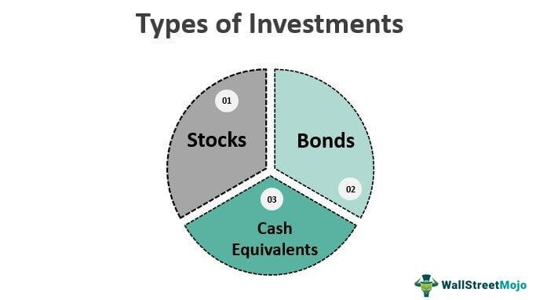

Investors today have a plethora of choices when it comes to choosing investment vehicles for wealth-building and risk management. The financial landscape offers a wide array of instruments, from traditional stocks and bonds to innovative options like algorithmic trading and structured notes. Each type of financial instrument presents its own set of opportunities and risks, making it essential for investors to thoroughly understand these options to make informed decisions.

Stocks and bonds have long been the cornerstone of many investment portfolios. Stocks represent ownership in a company and the potential for growth through appreciation and dividends. Bonds, on the other hand, are debt instruments that offer fixed interest payments over a specified period. Both are fundamental components of diversified investment strategies.

However, the financial industry has evolved significantly with the advent of technology and the increasing complexity of markets. Algorithmic trading, or "algo trading," employs sophisticated computer programs to automate trading decisions based on predefined criteria. This approach can enhance trading efficiency by eliminating emotional biases and executing trades with speed and precision.

Investment notes, another intriguing option, are debt securities akin to bonds, often featuring additional attributes like tax benefits or conversion rights. They serve different investment purposes such as income generation or risk mitigation and can be part of more complex financial products.

Understanding these instruments and their potential impact on your portfolio is crucial for achieving financial success. By diversifying their exposure across various investment vehicles, investors can tailor their strategies to align with their specific financial goals and risk tolerance.

As we demystify these financial tools, we explore their applications in today's dynamic markets, offering insights to help you navigate the multifaceted world of investing.

## Table of Contents

## Investment Vehicles: An Overview

Investment vehicles are integral tools that investors utilize to achieve financial returns. These instruments cover a broad spectrum, each differing in risk, potential return, and alignment with specific investment goals. Major investment vehicles include stocks, bonds, Exchange-Traded Funds (ETFs), mutual funds, and real estate.

**Stocks** represent ownership in a company and offer potential returns through capital appreciation and dividends. They are known for higher volatility and risk but can provide substantial returns aligned with a company's performance. Choosing stocks requires analyzing company fundamentals, market trends, and economic factors.

**Bonds** are fixed-income securities representing a loan made by an investor to a borrower, typically corporate or governmental entities. They tend to be less volatile than stocks, providing regular interest payments and principal repayment upon maturity. Bonds play a crucial role in stabilizing a portfolio and generating steady income, especially important for risk-averse investors.

**ETFs** are investment funds traded on stock exchanges, similar to stocks. They comprise a collection of assets like stocks and bonds, offering diversification with relatively low costs. ETFs are designed to track specific indices, sectors, or commodities. They combine the benefits of diversification found in mutual funds with the ease of trading similar to stocks.

**Mutual funds** pool money from multiple investors to purchase a diversified portfolio of stocks, bonds, or other securities, managed by professional fund managers. They offer the advantage of professional management and diversification but often come with management fees and a lack of trading flexibility compared to ETFs.

**Real estate** involves investing in physical properties or Real Estate Investment Trusts (REITs). This vehicle provides income through rent and potential property appreciation. However, real estate investment requires significant capital, has liquidity concerns, and demands active management or reliance on professional managers.

Selecting appropriate investment vehicles depends on one's financial objectives, which can range from wealth accumulation to income generation and risk tolerance levels. For instance, younger investors with longer time horizons may opt for stocks or growth-oriented mutual funds, while individuals approaching retirement may favor bonds or income-focused ETFs. Balancing these elements within an investment strategy ensures alignment with personal financial goals and adaptability to market fluctuations.

## Financial Instruments: What Are They?

Financial instruments are contracts that establish monetary value and facilitate trading between parties in financial markets. They enable the transfer and redistribution of financial risk and value, and they are fundamental to modern financial systems. These instruments range from basic ones such as stocks and bonds to more complex derivatives and structured products.

Stocks represent equity ownership in a company and provide shareholders with the potential for capital appreciation and dividends. Bonds are debt securities, where an investor loans money to an entity in exchange for periodic interest payments and the return of the bond's face value upon maturity. These straightforward instruments offer a foundational means for investors to gain exposure to different sectors and industries.

Derivatives, such as options and futures, are financial contracts whose value is derived from the performance of an underlying asset, index, or rate. Options give the holder the right, but not the obligation, to buy or sell an asset at a pre-agreed price before a specified date, allowing for strategies that manage market exposure, generate income, or hedge against potential losses. Futures obligate the buyer to purchase, or the seller to sell, an asset at a future date and pre-determined price, commonly used in hedging or speculation, particularly in commodities and financial markets.

Structured products are pre-packaged investment strategies that typically involve derivatives combined with securities, such as a bond. These products are designed to meet specific risk-return objectives and can include tailored payouts, capital protection, or yield enhancements. They appeal to investors seeking customized risk exposure and return profiles.

Key functions of financial instruments in the market include diversification, which reduces exposure to individual asset risks by allocating investments across a wide array of vehicles; speculation, enabling investors to bet on the future direction of markets or prices for potential profit; and hedging, which provides protection against unfavorable price movements in investments or commodities. 

A thorough understanding of these instruments and their applications is crucial for the creation of a diversified and resilient investment portfolio. By selecting the appropriate mix, investors can align financial instruments with their investment objectives and risk tolerance, facilitating informed decision-making and enhancing potential returns.

## Investment Notes: A Closer Look

Investment notes are a category of debt securities that represent a financial agreement in which an investor lends a sum to a borrower, typically a corporation, government, or financial institution. These securities share several features with bonds, including the obligation to make periodic interest payments and having a specified maturity date. A key characteristic of investment notes is their potential to provide capital preservation, income generation, and the ability to tailor investments to specific financial strategies.

**Features and Examples**

Investment notes typically have features akin to traditional bonds. They offer regular interest payments, known as coupon payments, until maturity, at which point the principal amount is returned to the investor. The [interest rate](/wiki/interest-rate-trading-strategies) can be fixed or floating, depending on the structure of the note. Investment notes are versatile, with notable examples including:

1. **Treasury Notes**: Issued by governments, these notes are considered risk-free investments as they are backed by the issuing country's ability to tax and print currency. They have a maturity of 1 to 10 years and offer semi-annual interest payments.

2. **Mortgage-Backed Securities (MBS)**: These are complex structured notes derived from the pooling of mortgages. Investors receive payments derived from the underlying mortgage repayments, making them sensitive to changes in interest rates and housing market dynamics.

3. **Convertible Notes**: Providing a hybrid investment option, these notes start as debt securities but offer the option to convert into equity at a predetermined conversion rate. This feature allows investors to benefit from potential equity appreciation while still receiving fixed interest income during the debt phase.

**Strategic Benefits**

1. **Tax Efficiency**: Certain investment notes provide tax advantages. For example, interest from municipal notes is often exempt from federal, and sometimes state, income taxes, making them attractive to high-net-worth individuals seeking tax relief.

2. **Stability and Safety**: As a safe-haven investment, investment notes such as Treasury notes are valued for their stability, especially during market volatility. Investors seeking capital preservation often prioritize such instruments.

3. **Inclusion in Structured Financial Products**: Many structured products incorporate investment notes to enhance yield or introduce risk-adjusted exposure to various market conditions. These products can cater to different investment goals by offering bespoke features that align with specific risk appetites.

In summary, investment notes stand out due to their ability to balance risk and return, fulfill diverse investment objectives, and adapt to changing market environments. Their inclusion in a comprehensive investment strategy allows for tailored risk management and tax efficiency, appealing to both conservative and more adventurous investors. As financial markets evolve, investment notes continue to play a pivotal role in providing structured and predictable income streams within diversified portfolios.

## Algorithmic Trading: The Future of Investing

Algorithmic trading, known as 'algo trading', employs computer algorithms to manage trading decisions and execute trades based on predefined parameters. This innovation in financial markets offers significant advantages, such as increased speed and precision in trade execution, while also minimizing the impact of human emotions on trading decisions. By automating processes, [algorithmic trading](/wiki/algorithmic-trading) allows for more consistent trading outcomes, which is crucial in today's highly competitive and volatile markets.

Key strategies employed in algorithmic trading include trend-following, market-making, and [arbitrage](/wiki/arbitrage). Each strategy leverages different aspects of market behavior:

1. **Trend-Following**: This strategy capitalizes on persistent market trends. It involves identifying a trend and generating trading signals based on the continuation of this trend. For example, the moving average crossover is a popular trend-following method where trading signals are triggered when a short-term moving average crosses a long-term moving average.

2. **Market-Making**: This involves providing liquidity to the market by simultaneously offering bid and ask quotes. Market makers earn profits from the spread between these bid and ask prices. Algorithmic systems ensure that these quotes are adjusted continuously and efficiently based on market conditions.

3. **Arbitrage**: This strategy exploits price discrepancies across different markets or instruments. High-frequency trading algorithms are particularly effective for arbitrage, as they can swiftly identify and capitalize on short-lived opportunities for profit before the market corrects itself.

Algorithmic trading is extensively used in various markets, including equities, [forex](/wiki/forex-system), options, and futures. Its ability to process vast volumes of data in real-time and execute trades within milliseconds offers a competitive edge, particularly in high-frequency trading scenarios.

Understanding algorithmic trading can significantly enhance an investor's trading capabilities, especially in fast-paced market environments. By embracing algorithm-driven strategies, traders can improve their decision-making processes and optimize capital allocation across diverse asset classes. As technology continues to evolve, algorithmic trading is poised to remain at the forefront of investment strategies, offering unparalleled opportunities to those who master its complexities.

## Combining Investment Notes and Algo Trading: A Strategic Approach

Investment notes and algorithmic trading represent two distinct yet complementary facets of modern investment management. Investment notes, as fixed-income instruments, offer steady income streams and mitigate risk through structured interest payments and defined maturities. Conversely, algorithmic trading introduces automation and precision in executing trades. By leveraging complex algorithms, it enhances market timing, access to [liquidity](/wiki/liquidity-risk-premium), and portfolio rebalancing efficiency.

Integrating these two elements provides a multi-dimensional approach to portfolio management. Investment notes contribute stability and predictability, shielding the portfolio from the erratic swings of other asset classes. They can serve as a risk management cornerstone, especially in volatile market conditions. Their income component can also fund investments in growth-oriented or speculative activities facilitated by algorithmic trading.

Algorithmic trading, with its capacity for rapid processing and data analysis, optimizes capital allocation. Algorithms can sift through vast amounts of market data and execute trades with precision, potentially exploiting fleeting arbitrage opportunities or implementing complex strategies such as [statistical arbitrage](/wiki/statistical-arbitrage) or pairs trading. This capability allows investors to enhance returns within a diversified portfolio, maintaining liquidity and responsiveness to dynamic market conditions.

A strategic alignment of investment notes and algorithmic trading could significantly balance portfolio [volatility](/wiki/volatility-trading-strategies). While the former ensures income through a conservative investment framework, the latter can pursue alpha through tactical trading strategies. The complementary nature of these tools empowers investors to adapt to technological advancements and evolving market dynamics.

This integration necessitates a solid understanding of financial markets and technological literacy. As algorithms become more sophisticated, investors should be aware of their structure and limitations. Continuous learning about emerging trends and advancements in trading technologies is crucial for investors and portfolio managers. This strategic pairing of investment notes and algorithmic trading concepts can lead to an optimized investment approach adaptable to both present challenges and future opportunities in financial markets.

## Conclusion

Investment vehicles and financial instruments play a crucial role in shaping the modern investment landscape. Investors today have access to an extensive array of options ranging from traditional stocks and bonds to innovative notes and sophisticated algorithmic trading techniques. The ability to carefully select the right combination of these instruments is fundamental in achieving specific financial goals. Aligning your choice of investment vehicles with your financial objectives and risk tolerance can enhance returns while mitigating risks. 

Staying abreast of market trends and being aware of technological advancements like algorithmic trading can offer a significant competitive edge. Algorithmic trading, which utilizes precise, data-driven trading strategies, represents a growing sector that continues to evolve with advancements in technology and data analytics. By leveraging these tools, investors can navigate complex financial markets more efficiently and make informed trading decisions, thus enhancing their resilience against market volatility.

While exploring these diverse options, it is advisable to seek professional financial advice. Experienced advisors can provide personalized strategies that align with your unique financial needs and goals. Whether constructing a diversified portfolio or adopting innovative trading practices, professional guidance ensures that your strategy is well-suited to the current market environment and tailored to your personal risk profile. 

In summary, the integration of varied investment vehicles and financial instruments, supported by strategic advice, forms the foundation of successful wealth management and investing in today's dynamic financial markets.

## References & Further Reading

[1]: Bergstra, J., Bardenet, R., Bengio, Y., & Kégl, B. (2011). ["Algorithms for Hyper-Parameter Optimization."](https://dl.acm.org/doi/10.5555/2986459.2986743) Advances in Neural Information Processing Systems 24.

[2]: ["Advances in Financial Machine Learning"](https://www.amazon.com/Advances-Financial-Machine-Learning-Marcos/dp/1119482089) by Marcos Lopez de Prado

[3]: ["Evidence-Based Technical Analysis: Applying the Scientific Method and Statistical Inference to Trading Signals"](https://www.amazon.com/Evidence-Based-Technical-Analysis-Scientific-Statistical/dp/0470008741) by David Aronson

[4]: ["Machine Learning for Algorithmic Trading"](https://github.com/stefan-jansen/machine-learning-for-trading) by Stefan Jansen

[5]: ["Quantitative Trading: How to Build Your Own Algorithmic Trading Business"](https://www.amazon.com/Quantitative-Trading-Build-Algorithmic-Business/dp/1119800064) by Ernest P. Chan