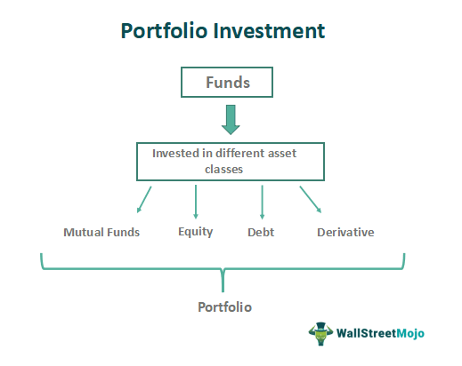

Investment portfolio management strategies encompass a wide array of approaches aimed at optimizing the allocation and performance of assets to achieve specific financial objectives. These strategies typically involve asset selection, diversification, risk assessment, and periodic rebalancing to align with an investor’s goals and risk tolerance. As financial markets continue to evolve and grow in complexity, the emphasis on innovative and efficient portfolio management techniques has become increasingly significant.

Algorithmic trading, characterized by the use of computer algorithms to execute trading instructions with speed and precision, has quickly become a cornerstone of modern finance. Algorithms can analyze a vast amount of data, monitor market conditions, and execute trades autonomously, reducing the dependency on human intervention. This method is renowned for its ability to execute trades swiftly and at optimum prices, thus enhancing liquidity and efficiency in the markets.



By combining portfolio management strategies with algorithmic trading, investors can potentially optimize returns while maintaining a balanced risk profile. Algorithms can aid in portfolio management by facilitating automatic rebalancing, tactical asset allocation, and real-time market analysis. This integration enables a dynamic approach to managing investments, allowing portfolios to adjust and react instantly to market changes.

This article will explore the confluence of traditional investment portfolio management strategies and the technological advancements in algorithmic trading. It will examine the foundational concepts of each, assess the synergy between them, and provide insights into how they can be harnessed to achieve superior portfolio performance. Furthermore, the article will discuss essential aspects of risk management, platform selection, and regulatory considerations, ensuring that readers are well-equipped to navigate the modern financial landscape.

Understanding these modern financial tools is paramount for investors seeking to leverage technology to drive investment success. As the finance industry continues to migrate towards automation and data-driven decision-making, the ability to adeptly integrate algorithmic trading into portfolio management is a critical skill for optimizing financial outcomes and sustaining a competitive edge in the market.

## Table of Contents

## What is an Investment Portfolio?

An investment portfolio is a collection of financial assets such as stocks, bonds, commodities, real estate, mutual funds, exchange-traded funds (ETFs), and other securities. The primary purpose of an investment portfolio is to achieve an individual's or an organization's specific financial goals, whether these involve capital appreciation, income generation, or risk management.

Types of assets typically included in a portfolio vary based on the investor's objectives, risk tolerance, and investment horizon. Common assets include:

1. **Stocks**: Equities representing ownership in a company, offering potential capital gains and dividends.
2. **Bonds**: Debt securities providing regular interest payments and principal repayment at maturity, generally considered less risky than stocks.
3. **Mutual Funds and ETFs**: Pooled investment vehicles offering diversification by investing in a broad range of securities.
4. **Real Estate**: Property investments generating rental income and potential appreciation.
5. **Commodities**: Physical goods like gold, oil, and agricultural products, often used as hedging tools against inflation.
6. **Alternative Investments**: Includes hedge funds, private equity, and venture capital, typically involved higher risk and higher potential returns.

Diversification plays a crucial role in portfolio management, aiming to reduce risk by spreading investments across various asset classes. The logic behind diversification is rooted in the concept that different assets will behave differently under the same economic conditions. Thus, the poor performance of one asset can potentially be offset by strong performance in another. Mathematically, diversification aims to minimize the portfolio's overall variance by choosing assets whose returns have low or negative correlations with each other.

Investment portfolios are crafted to align with individual financial goals through careful asset selection and allocation tailored to an investor's risk appetite, time horizon, and financial situation. Whether the goal is wealth accumulation, preservation of capital, or generating a steady income stream, the portfolio should be structured accordingly.

Risk assessment is integral to portfolio construction, involving evaluating the potential variability in investment returns and the chance of significant financial loss. This includes understanding market risk, [interest rate](/wiki/interest-rate-trading-strategies) risk, credit risk, and [liquidity](/wiki/liquidity-risk-premium) risk. By assessing these risks, investors can make informed decisions about how much risk they are willing to assume and how this affects their asset allocation. 

In summary, an investment portfolio acts as a strategic tool to manage investment risk and achieve financial objectives through a well-diversified mix of assets, carefully selected and aligned with the investor's goals and risk tolerance. This strategic alignment and risk management are vital components in constructing and maintaining a resilient and effective investment portfolio.

## Understanding Algorithmic Trading

Algorithmic trading refers to the use of computer programs and systems to execute trading orders in financial markets according to predefined criteria. Algorithms are designed to process a large number of variables quickly, enabling traders to execute orders at a speed and frequency that is impossible for a human trader. Common characteristics of [algorithmic trading](/wiki/algorithmic-trading) include the use of complex mathematical models to determine trading strategies and the minimization of human intervention in the trading process.

### History and Evolution

The advent of algorithmic trading can be traced back to the early 1970s with the development of electronic communication networks (ECNs), which allowed for the automated matching of buy and sell orders, initially focusing on large institutional trades. The introduction of the NASDAQ in 1971 marked a significant milestone, followed by advancements in computing technology and data transmission speeds through the 1980s and 1990s. Regulations such as the SEC's Regulation ATS (Alternative Trading System) in 1998 provided a framework for the operation of trading platforms that facilitated high-frequency trading. More recently, the integration of [artificial intelligence](/wiki/ai-artificial-intelligence) (AI) and [machine learning](/wiki/machine-learning) technologies has further revolutionized the field, allowing for the creation of more sophisticated algorithms capable of analyzing vast amounts of data in real time.

### Benefits of Algorithmic Trading

Algorithmic trading offers several advantages over traditional trading methods. Firstly, it allows for the execution of trades at the best possible prices, increasing market efficiency. Automation reduces transaction costs by eliminating the need for manual trade execution and minimizes the influence of human emotion on trading decisions, leading to more consistent results. Algorithms can operate continuously, scanning markets for opportunities and executing trades instantaneously when conditions meet specified criteria. Additionally, the ability to test trading strategies on historical data, known as [backtesting](/wiki/backtesting), enables traders to optimize their algorithms before risking capital in live markets.

### Common Algorithms and Strategies

Various types of algorithms are employed in trading, each serving a distinct purpose. Some of the prevalent strategies include:

- **Arbitrage**: This involves exploiting price discrepancies of the same asset in different markets or forms. For example, currency arbitrage might involve simultaneously buying and selling the same currency pair in different markets to profit from a difference in price.

- **Trend Following**: These algorithms identify trends in financial markets and execute trades based on the direction of these trends. Techniques such as moving averages are often used to signal entry and exit points.

- **Mean Reversion**: This strategy is based on the assumption that asset prices and returns will eventually return to their long-term means. Algorithms are crafted to capitalize on deviations from these means.

- **Market Making**: Involves providing liquidity to financial markets by simultaneously posting buy and sell orders. Profits are made from the bid-ask spread.

### Key Technologies

The advancement of algorithmic trading is heavily reliant on technologies such as AI and machine learning. These technologies enable the development of predictive models that can analyze vast datasets, such as historical price data, market sentiment, and macroeconomic indicators, to forecast future market movements. Python, with its robust libraries like NumPy, Pandas, and Scikit-learn, is a popular language for developing algorithmic trading models due to its simplicity and powerful data analysis capabilities. An example of a simple trading signal might be:

```python
def moving_average_signal(prices, short_window, long_window):
    signals = pd.DataFrame(index=prices.index)
    signals['short_ma'] = prices['close'].rolling(window=short_window, min_periods=1).mean()
    signals['long_ma'] = prices['close'].rolling(window=long_window, min_periods=1).mean()
    signals['signal'] = 0.0
    signals['signal'][short_window:] = np.where(signals['short_ma'][short_window:] > signals['long_ma'][short_window:], 1.0, 0.0)
    signals['positions'] = signals['signal'].diff()
    return signals
```

This function computes the short and long-term moving averages of a stock and generates buy/sell signals based on their crossovers. Such strategies can be further enhanced using machine learning models that [factor](/wiki/factor-investing) in additional market indicators and data cues for improved decision-making.

In summary, algorithmic trading has significantly transformed financial markets, offering enhanced trading efficiency, reduced execution costs, and the ability to harness complex data-driven strategies to optimize trading outcomes.

## Integrating Algo Trading with Investment Portfolios

Integrating algorithmic trading into investment portfolios presents several advantages that can significantly enhance portfolio management. Algorithmic trading enables more precise asset selection and diversification through the use of sophisticated mathematical models and statistical analysis. These models can identify patterns and correlations among various asset classes that may not be apparent through traditional analysis. By leveraging these insights, algorithms can optimize the asset allocation process, ensuring portfolios are well-diversified and aligned with investors' risk tolerance and financial goals.

One of the main benefits of employing algorithmic trading in portfolio management is its ability to process large volumes of data at high speed, allowing for timely decision-making. Algorithms can execute trades based on predefined criteria, minimizing the emotional bias that often accompanies human trading decisions. This efficiency extends to the rebalancing of portfolios, where algorithms can automate the process of buying and selling assets to maintain the desired asset allocation. Automation not only saves time but also ensures that portfolios remain in line with investment strategies, adapting to changing market conditions with minimal delay.

Numerous case studies demonstrate the successful integration of algorithmic trading in portfolio management. For instance, quantitative hedge funds have consistently outperformed traditional funds by utilizing algorithmic strategies to exploit market inefficiencies. These funds often rely on high-frequency trading algorithms, which can execute trades within microseconds, capturing small price discrepancies that would be impractical for human traders to exploit. Additionally, robo-advisors have gained popularity by incorporating algorithmic trading in their investment services, offering personalized portfolio management at a lower cost than traditional financial advisors.

However, the integration of algorithmic trading into investment portfolios is not without challenges. One major consideration is the potential for technical failures or errors in algorithmic models, which can lead to significant financial losses. Rigorous backtesting of algorithms using historical data is essential to ensure their reliability and effectiveness in different market conditions. Moreover, it is crucial to have robust risk management systems in place to safeguard against unexpected market events and [volatility](/wiki/volatility-trading-strategies) that could adversely impact algorithmic strategies. Compliance with regulatory requirements is also an important factor, as financial markets are subject to strict oversight to prevent market manipulation and ensure fair trading practices.

In summary, the integration of algorithmic trading into investment portfolios offers a range of benefits, including enhanced asset selection, improved diversification, and efficient portfolio management through automation. While challenges exist, they can be mitigated through careful planning, thorough testing, and adherence to regulatory standards, paving the way for improved investment performance.

## Risk Management in Algo Trading

Algorithmic trading introduces unique sets of risks that require specific management strategies to ensure robust financial performance. Understanding these risks forms the foundation for implementing effective risk mitigation techniques.

### Understanding the Risks Associated with Algorithmic Trading

Algorithmic trading operates at high speed and [volume](/wiki/volume-trading-strategy), necessitating precise control over execution. Common risks include:

1. **Market Risk**: The danger of asset values declining, which algorithms must adapt to continuously.
2. **Latency and Execution Risk**: Delay or failure in executing orders can result in significant financial losses due to rapidly changing market conditions.
3. **Model Risk**: Mis-specification, coding errors, or unforeseen market conditions may cause the trading model to perform inadequately.
4. **Operational Risk**: Failures in systems or processes can disrupt trading.

### Tools and Techniques for Risk Mitigation

To mitigate these risks, traders employ various tools and techniques:

- **Backtesting and Simulation**: Running algorithms against historical data to evaluate performance and refine models.
- **Real-time Monitoring**: Continuous tracking of algorithm performance and market conditions to ensure quick reaction to anomalies.
- **Position Sizing and Diversification**: Allocating capital judiciously across different strategies and assets to spread risk.
- **Dynamic Hedging**: Using derivatives to manage potential losses from adverse price movements.

Python, a popular language in algorithmic trading, allows for efficient backtesting. A simple example is using the `[backtrader](/wiki/backtrader)` package:

```python
import backtrader as bt

class MyStrategy(bt.Strategy):
    def next(self):
        if self.dataclose[0] > self.dataclose[-1]:
            self.buy(size=100)
        else:
            self.sell(size=100)

cerebro = bt.Cerebro()
data = bt.feeds.YahooFinanceData(dataname='AAPL', fromdate=datetime(2020, 1, 1), todate=datetime(2021, 1, 1))
cerebro.adddata(data)
cerebro.addstrategy(MyStrategy)
cerebro.run()
cerebro.plot()
```

### The Impact of Market Volatility on Algorithmic Strategies

Market volatility directly affects algorithmic strategies, potentially increasing risks and impacting performance:

- **Slippage**: High volatility can cause prices to change rapidly, causing potential discrepancies between expected and actual trade prices.
- **Liquidity Variability**: During volatile periods, liquidity may dry up, making it difficult to execute large orders without affecting the market.

### Compliance and Regulatory Considerations in Algo Trading

Regulatory frameworks govern algorithmic trading to maintain market integrity. Compliance encompasses several areas:

- **Trade Reporting**: Ensuring transparency by reporting trades to regulatory bodies.
- **Risk Controls**: Implementing pre-trade controls to prevent erroneous orders from impacting the market.
- **Market Manipulation**: Strategies must avoid practices like spoofing or layering, which are illegal under regulations such as the U.S. Securities and Exchange Commission (SEC) and the European Securities and Markets Authority (ESMA).

### Smart Risk Management Practices for Long-term Success

For sustainable success in algorithmic trading, prudent risk management practices are essential:

- **Regular Audits of Algorithms**: Periodically reviewing and updating algorithms to address any discrepancies or inefficiencies.
- **Fail-safe Mechanisms**: Incorporating mechanisms to terminate trading in case anomalies are detected.
- **Continuous Education**: Staying updated with market changes, regulatory updates, and technological advancements.

Balancing risk with opportunity in algorithmic trading involves utilizing sophisticated tools and adhering to regulatory frameworks, thereby maximizing the potential for profitable outcomes while safeguarding against unexpected market shifts.

## Choosing the Right Platforms and Tools

When selecting platforms and tools for algorithmic trading, it is crucial to consider features that align with the needs of both beginner and advanced traders. Key features in trading platforms include advanced charting tools, customizable algorithms, real-time data feeds, and robust security protocols. These features facilitate not only the execution of trades but also provide comprehensive insights and analytics to enhance decision-making.

Top trading platforms like MetaTrader, [Interactive Brokers](/wiki/interactive-brokers-api), and NinjaTrader are well-regarded for their algorithmic trading capabilities. MetaTrader, for example, offers the MetaQuotes Language (MQL), allowing users to write trading scripts and develop custom indicators. Interactive Brokers provides a more versatile API, supporting various programming languages such as Python and Java, which is suitable for those who have experience with software development.

When evaluating the suitability of different platforms, individual needs should be the focal point. Factors such as user interface, available assets, transaction fees, and the level of customer support can significantly affect the user experience. A trader's proficiency in coding or familiarity with certain analytical tools can also influence the choice of platform.

Backtesting is an indispensable component of algorithmic trading. It involves testing trading strategies on historical data to evaluate their potential effectiveness before applying them to live markets. The capability of a platform to provide extensive historical data and execute backtesting efficiently is crucial. This process helps traders understand the risk and return characteristics of their strategies, thereby optimizing performance.

Integration capabilities are another critical consideration. The chosen platform should seamlessly integrate with existing financial tools and software, such as Excel or business intelligence systems. This compatibility enables traders to import and export data efficiently, thus facilitating comprehensive analysis and reporting. Moreover, the platform should support APIs that allow custom software to interact with its trading system, further enhancing its flexibility and utility.

As algorithmic trading continues to evolve, choosing the right platforms and tools demands careful consideration of numerous factors. By focusing on features that align with individual trading needs and prioritizing the importance of backtesting and integration capabilities, traders can optimize their platform choice to enhance investment outcomes.

## The Future of Investment Portfolios and Algo Trading

Emerging trends in algorithmic trading and portfolio management point to a future where technology plays a pivotal role. Algorithmic trading, which uses computer algorithms to execute trades at optimal moments, is evolving with technological advancements, notably in artificial intelligence (AI) and machine learning. These technologies are being increasingly integrated into investment strategies, offering unprecedented precision and efficiency.

AI and machine learning are revolutionizing finance by automating data analysis and pattern recognition. Machine learning algorithms can process vast amounts of historical and real-time data to identify trading opportunities and optimize portfolio returns. For instance, predictive analytics can forecast market trends, while [reinforcement learning](/wiki/reinforcement-learning) improves trading strategies through continuous learning from market feedback.

Potential technological advancements include the use of quantum computing, which promises to enhance computational capabilities exponentially. This could lead to faster and more accurate data analysis, revolutionizing how investment decisions are made. Blockchain technology is another area of interest, offering enhanced security and transparency in transactions.

The future landscape of investment strategies will likely feature increased reliance on AI-driven decision-making processes. Investors can expect more sophisticated risk management tools, capable of dynamically adjusting to market conditions. Algorithmic strategies will become more adaptive, capable of managing complex portfolios with high-frequency trading methods.

Investors need to prepare for and adapt to these changes by embracing technology and increasing their understanding of algorithmic processes. Staying informed about technological advancements and regulatory changes is crucial. Engaging with financial technology platforms that offer educational resources can help investors navigate the evolving market. Investors should also focus on enhancing their technical skills, potentially by learning programming languages like Python, which is extensively used for developing trading algorithms.

In conclusion, the future of investment portfolios and algo trading will be shaped by technological innovation. By staying ahead of emerging trends and incorporating advanced tools, investors can position themselves for success in this rapidly changing environment.

## Conclusion

In conclusion, algorithmic trading is becoming increasingly significant in modern finance. It provides a level of precision, speed, and efficiency in executing trades that is unparalleled by traditional methods. By leveraging sophisticated algorithms, traders can manage vast amounts of data and capitalize on fleeting market opportunities. This capacity not only enhances the potential for superior portfolio performance but also aligns with the growing demand for more nuanced investment strategies that can adapt quickly to market changes.

The integration of algorithmic trading in investment portfolios is a viable strategy for those seeking to optimize their financial outcomes. As individuals and institutions strive for better returns, the reliance on algo trading has become more prevalent, demonstrating its capacity to improve asset selection, diversification, and risk management. Furthermore, as the technology evolves, the potential for achieving greater accuracy in market predictions and investment decisions continues to expand.

For investors, exploring algorithmic trading presents an opportunity to stay ahead in a rapidly changing financial landscape. Embracing these strategies involves understanding both the technological aspects and the potential risks associated with them. However, with careful implementation and monitoring, the benefits far outweigh the challenges.

Balancing innovation with prudent investment practices is essential. While algorithmic trading offers revolutionary tools for enhancing portfolio performance, maintaining a vigilant approach to risk management and regulatory compliance remains crucial. Investors should approach these technologies with a strategic mindset, ensuring that innovation complements their overarching financial goals and risk tolerance. As the field of finance continues to evolve, remaining informed and adaptive will be key to leveraging the full potential of algorithmic trading.

## References & Further Reading

[1]: Bergstra, J., Bardenet, R., Bengio, Y., & Kégl, B. (2011). ["Algorithms for Hyper-Parameter Optimization."](https://papers.nips.cc/paper/4443-algorithms-for-hyper-parameter-optimization) Advances in Neural Information Processing Systems 24.

[2]: ["Advances in Financial Machine Learning"](https://www.amazon.com/Advances-Financial-Machine-Learning-Marcos/dp/1119482089) by Marcos Lopez de Prado

[3]: ["Evidence-Based Technical Analysis: Applying the Scientific Method and Statistical Inference to Trading Signals"](https://www.amazon.com/Evidence-Based-Technical-Analysis-Scientific-Statistical/dp/0470008741) by David Aronson

[4]: ["Machine Learning for Algorithmic Trading"](https://github.com/stefan-jansen/machine-learning-for-trading) by Stefan Jansen

[5]: ["Quantitative Trading: How to Build Your Own Algorithmic Trading Business"](https://www.amazon.com/Quantitative-Trading-Build-Algorithmic-Business/dp/1119800064) by Ernest P. Chan