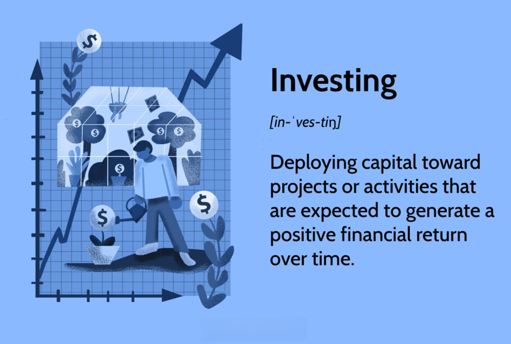

In the fast-paced world of financial markets, investing can seem daunting for beginners. The complexities and vast array of options often make the initial steps overwhelming. However, understanding various investment types is crucial for creating a diversified portfolio, which can balance risk and reward to achieve personal financial goals. Diversification is a cornerstone of investing, reducing the volatility of returns by spreading investments across different asset types.

In recent years, algorithmic trading, or algo trading, has become a dominant force in modern finance. This innovative approach involves using computer programs to automate trading decisions, enabling rapid and precise execution that surpasses human capabilities. Algorithmic trading opens new avenues for investors, providing opportunities to leverage technology and data-driven strategies to potentially enhance portfolio performance.



This article aims to guide beginners through the basics of investing and introduce the concept of algorithmic trading. By laying a strong foundation in investment principles and exploring modern innovations, both novice and seasoned investors can make informed decisions that align with their financial aspirations.

Let's embark on this journey to make informed investment decisions, embrace the potential of algorithmic trading, and achieve greater financial literacy. This venture into the world of investing could lead to not only financial returns but also a deeper understanding of how markets operate, ultimately fostering confidence in navigating financial endeavors.

## Table of Contents

## Understanding Investment Basics

Before exploring specific investment types, it is crucial to grasp the basic principles of investing. Fundamentally, investing involves the allocation of resources—most often, monetary—with the expectation of generating income or attaining profit over time. Successful investing is grounded in an understanding of key components such as risk, return, time horizon, and asset allocation, each playing a significant role in shaping investment strategies and outcomes.

Risk refers to the possibility of losing some or all of the original investment, influenced by the volatility and uncertainties inherent in financial markets. Return, conversely, represents the profit that an investor can earn from an investment over a certain period. This is often expressed as a percentage of the original investment and can be influenced by dividends, interest rates, and capital gains.

Time horizon is a critical [factor](/wiki/factor-investing) determining how investors plan their investments according to their financial objectives. Short-term investors who need quick returns generally face more [volatility](/wiki/volatility-trading-strategies), whereas long-term investors might have a steadier path with less market fluctuation impact. Asset allocation involves diversifying investments across various asset classes, such as stocks, bonds, and real estate, to optimize the balance between risk and return. A well-structured asset allocation strategy can shield an investor against significant losses by mitigating risks associated with any single asset.

Investment outcomes are significantly influenced by market conditions, investor psychology, and broader economic factors. Market conditions, driven by factors like supply and demand, can cause fluctuations in asset prices, making timing crucial. Investor psychology, guided by emotions such as fear and greed, can lead to suboptimal decision-making. Finally, macroeconomic elements such as inflation, interest rates, and economic growth can alter the attractiveness of certain investments and thereby impact returns.

Before initiating an investment journey, setting a clear financial goal and evaluating personal risk tolerance is vital to crafting a coherent investment strategy. Risk tolerance is unique to each individual, shaped by factors like age, income, and investment experience. A well-defined financial goal provides direction and purpose to an investment portfolio, ensuring the selected investments align with the investor's objectives, whether it is wealth accumulation, retirement, or funding for education.

By focusing on these fundamental concepts, investors are better equipped to navigate the complex landscape of financial markets, setting the stage for informed and effective investment decisions.

## Common Investment Types

Stocks represent partial ownership in a company and confer rights to a portion of its profits and assets. As equity instruments, stocks offer two primary forms of returns: capital appreciation and dividends. Capital appreciation occurs when the price of a stock rises over time, allowing the investor to sell the stock at a profit. Dividends are periodic payments made to shareholders from a company's earnings. The value of a stock can be influenced by company performance, investor sentiment, and broader economic factors.

Bonds are debt securities that investors provide to a corporation, government, or other entity in exchange for periodic interest payments and the return of the bond's face value upon maturity. They are considered fixed-income investments due to the consistent nature of interest payments. Bonds are generally perceived as less risky than stocks due to their relatively stable returns and the priority they have over stocks in the event of the issuer's bankruptcy. Typical bond types include government bonds, corporate bonds, and municipal bonds.

Mutual funds pool money from multiple investors to buy a diversified portfolio of stocks, bonds, or other securities, managed by professional fund managers. These funds offer investors the advantage of diversification, reducing risk by spreading investments across various assets to minimize the impact of any single asset's underperformance. Mutual fund investors benefit from professional management and economies of scale, though they incur management fees and may realize capital gains upon the sale of fund shares.

Exchange-Traded Funds (ETFs) are investment funds that hold assets such as stocks, commodities, or bonds and trade on stock exchanges like a single stock. ETFs combine features of mutual funds and stocks by offering diversification and professional management, while providing [liquidity](/wiki/liquidity-risk-premium) and flexibility due to their exchange listing. ETFs often have lower fees than mutual funds and allow investors to buy or sell shares throughout the trading day at market prices.

Real estate involves the purchase, ownership, management, rental, or sale of land and buildings for profit. Real estate investment can focus on residential homes, commercial properties, or industrial sites. Investors may generate returns through rental income and property appreciation. Real estate can serve as a hedge against inflation and offers diversification benefits to a portfolio. However, real estate investments require significant capital, are relatively illiquid, and entail risks such as market fluctuations and property management challenges.

In summary, the common types of investments—stocks, bonds, mutual funds, ETFs, and real estate—each present distinct benefits and trade-offs. Understanding the characteristics and risks of each asset class enables investors to construct a diversified portfolio tailored to their financial goals and risk tolerance.

## The Rise of Algorithmic Trading

Algorithmic trading, often recognized as algo trading, marks a significant evolution in the financial markets by leveraging the power of computer algorithms to automate trading decisions. This technology-driven approach enhances trading efficiency by executing orders at a speed and frequency that far surpasses human capabilities. By harnessing sophisticated algorithms, traders can analyze and process vast datasets in real-time, enabling them to capitalize on fleeting market inefficiencies and [arbitrage](/wiki/arbitrage) opportunities that might otherwise be missed.

At its core, [algorithmic trading](/wiki/algorithmic-trading) employs algorithms, which are sets of predefined rules applied to execute trades. These rules can encompass various aspects such as timing, price, quantity, and other mathematical models. For instance, a simplistic example might be utilizing a moving average crossover strategy where a 'buy' signal is generated when a short-term moving average exceeds a long-term moving average.

```python
# Example of a moving average crossover strategy using Python
import pandas as pd

# Load the price data into a pandas DataFrame
data = pd.read_csv('stock_prices.csv')
data['Short_MA'] = data['Close'].rolling(window=40, min_periods=1).mean()
data['Long_MA'] = data['Close'].rolling(window=100, min_periods=1).mean()

# Generate buy/sell signals
data['Signal'] = 0
data['Signal'][40:] = np.where(data['Short_MA'][40:] > data['Long_MA'][40:], 1, 0)
data['Position'] = data['Signal'].diff()

# Display the signals
print(data[['Close', 'Short_MA', 'Long_MA', 'Signal', 'Position']].tail())
```

Historically, algorithmic trading was predominantly utilized by institutional investors such as hedge funds and investment banks due to the high costs and technical expertise required to develop and maintain sophisticated trading systems. However, recent advancements in technology and the proliferation of user-friendly trading platforms have democratized access, enabling retail investors to partake in algo trading. Retail investors now have the opportunity to utilize platforms offering algorithmic trading tools, allowing them to automate trading strategies and benefit from the same efficiencies as large-scale financial institutions.

Understanding the mechanics of algorithmic trading can significantly enhance an investor's trading strategy. By reducing human error and emotional biases, algo trading promotes rational decision-making based on meticulously analyzed data. The speed at which these algorithms operate allows for the swift execution of trades, ensuring the swift capture of narrow price spreads and reduction in transaction costs. 

In sum, while algorithmic trading offers a modern and efficient approach to trading, it is crucial for investors to attain a fundamental understanding of its principles and applications. Its accessibility to retail investors signifies a burgeoning opportunity to explore new investment horizons and optimize trading strategies in a dynamic and data-driven manner.

## Benefits and Risks of Algo Trading for Beginners

Algorithmic trading (algo trading) offers several advantages for beginners venturing into the world of financial markets. One of its primary benefits is the elimination of emotional and psychological biases that often adversely affect human traders. This objectivity can lead to more consistent and rational trading decisions.

Algo trading can utilize [backtesting](/wiki/backtesting), which involves testing trading strategies using historical data to assess their potential performance. By doing so, traders can refine their strategies before deploying them, minimizing risk and optimizing potential returns. To backtest a strategy in Python, one might use libraries such as [pandas](https://pandas.pydata.org/) for data manipulation and [Backtrader](https://www.[backtrader](/wiki/backtrader).com/) for simulating trading strategies.

```python
import backtrader as bt

class MyStrategy(bt.Strategy):
    def __init__(self):
        self.sma = bt.indicators.SimpleMovingAverage(self.data.close, period=15)

    def next(self):
        if not self.position:  # if not in the market
            if self.data.close[0] > self.sma[0]:
                self.buy()
        elif self.data.close[0] < self.sma[0]:
            self.sell()

# Initialize cerebro engine
cerebro = bt.Cerebro()
# Add data feed to cerebro
data_feed = bt.feeds.YahooFinanceData(dataname='AAPL', fromdate=datetime(2020, 1, 1), todate=datetime(2021, 1, 1))
cerebro.adddata(data_feed)
# Add strategy to cerebro
cerebro.addstrategy(MyStrategy)
# Run the backtest
cerebro.run()
```

Algo trading is also adept at identifying and capitalizing on fleeting market opportunities that may be missed by human traders, potentially increasing profits through high-frequency trading and arbitrage opportunities. Despite these advantages, algorithmic trading comes with inherent risks that beginners should not underestimate.

Technological failures such as software glitches, connectivity disruptions, or inadequate hardware resources can lead to significant financial losses. Moreover, market anomalies or unexpected events can impact performance and undermine even the most well-intentioned strategies. Anomalies such as flash crashes can lead to rapid, significant deviations in market prices, posing substantial risks.

For beginners, it is imperative to have a solid understanding of the underlying principles of algorithmic trading before engaging in it. This includes being aware of the risks of over-optimization, or "curve fitting," where a strategy is too tightly tailored to historical data and may not perform well in real markets. Risk management techniques and continuous education are essential to mitigate these challenges and harness the benefits of algorithmic trading effectively. Engaging with online communities and leveraging educational platforms can further enhance a trader's competence and confidence.

## Getting Started with Investing and Algo Trading

To embark on a successful investing journey, especially when considering algorithmic trading, beginners should prioritize education. This involves leveraging various resources such as [books](/wiki/algo-trading-books), online courses, and staying updated with the latest financial news. Books like "The Intelligent Investor" by Benjamin Graham provide timeless insights into value investing, while online platforms like Coursera and Udacity offer courses on financial markets and algorithmic trading. Financial news outlets such as Bloomberg and CNBC offer timely information on market trends and economic developments, which are crucial for informed decision-making.

Starting with a diversified portfolio of traditional investments is a practical approach. Diversification involves spreading investments across different asset classes—like stocks, bonds, and real estate—to reduce risk. This approach helps in understanding market dynamics, as different asset classes react uniquely to economic changes. For instance, while stocks may be more volatile, bonds generally offer stable returns, thus balancing the portfolio.

In the context of algorithmic trading, beginners can initially use demo accounts or paper trading. These platforms simulate trading environments, allowing individuals to practice without financial risk. For instance, Python can be employed to create simple trading algorithms using libraries such as NumPy for numerical analysis and Pandas for data manipulation. A basic algorithm might look like the following:
```python
import numpy as np
import pandas as pd

def moving_average_strategy(prices, window=20):
    rolling_mean = prices.rolling(window=window).mean()
    signals = np.where(prices > rolling_mean, 1, 0)  # Buy when price is above the moving average
    return signals

# Example usage with hypothetical prices
prices = pd.Series([100, 101, 102, 103, 95, 99, 98, 110, 115, 120])
signals = moving_average_strategy(prices)
print(signals)
```
This code calculates a simple moving average strategy where a buy signal is generated when the price is above the moving average.

Choosing reliable and user-friendly platforms is essential for both traditional and algorithmic trading. Platforms like [Interactive Brokers](/wiki/interactive-brokers-api) and TradeStation provide robust tools for algorithmic traders and offer extensive educational resources. These platforms support backtesting strategies and offer APIs for developing custom trading algorithms.

Setting clear financial goals is fundamental. Goals should be Specific, Measurable, Achievable, Relevant, and Time-bound (SMART). For instance, a goal may be to achieve a 5% return over inflation within five years. Continual education and market research are crucial as markets are dynamic. Using tools such as Google Alerts for financial topics or subscribing to investment newsletters can keep investors informed about the latest market trends and opportunities.

In summary, building a solid foundation through education, starting with a diversified portfolio, experimenting with algorithmic trading in a risk-free environment, selecting the right platforms, and setting financial goals are key steps for beginners looking to succeed in investing and algorithmic trading.

## Conclusion

Investing is a multifaceted endeavor that transcends the mere pursuit of financial returns; it is fundamentally about achieving one's financial goals through informed decision-making. Beginners who understand various investment types can effectively diversify their portfolios, thus managing risks more robustly and increasing their chances of success. Diversification, a core principle in investing, involves spreading investments across different asset classes to minimize exposure to any single risk. For example, a portfolio that combines stocks, bonds, and real estate can offer a balance of potential high returns and stability.

Algorithmic trading has introduced new dimensions to the investment landscape, offering possibilities previously inaccessible to many investors. While this advanced form of trading leverages computational power to analyze and act on market data efficiently, it necessitates a thorough understanding and careful consideration. The automated nature of algorithmic trading can help eliminate emotional biases, but it also introduces unique risks, such as technological errors and the potential for exacerbated market anomalies.

For beginners, the investment journey should be characterized by a cautious approach—starting small, engaging in continuous learning, and maintaining discipline. These fundamental practices enable newbies to gradually acclimate to market dynamics while avoiding premature exposure to high-risk strategies. Education can be fortified through resources such as books, courses, and financial news, which provide insights into both traditional and algorithmic investing methodologies.

Embracing the journey of investing requires flexibility and a willingness to leverage both traditional investment vehicles and modern trading strategies like algorithmic trading. By being open to diverse approaches and consistently refining their strategies, investors can align their portfolios with their financial objectives, ultimately paving the way toward reaching their aspirations. In doing so, they not only secure financial returns but also build a robust foundation for long-term financial security and growth.

## References & Further Reading

[1]: ["The Intelligent Investor"](https://www.amazon.com/Intelligent-Investor-Definitive-Investing-Essentials/dp/0060555661) by Benjamin Graham

[2]: ["Algorithmic Trading: Winning Strategies and Their Rationale"](https://www.amazon.com/Algorithmic-Trading-Winning-Strategies-Rationale-ebook/dp/B00CY5HC0U) by Ernie Chan

[3]: ["Advances in Financial Machine Learning"](https://www.amazon.com/Advances-Financial-Machine-Learning-Marcos/dp/1119482089) by Marcos Lopez de Prado

[4]: ["Machine Learning for Algorithmic Trading"](https://github.com/stefan-jansen/machine-learning-for-trading) by Stefan Jansen

[5]: ["Quantitative Trading: How to Build Your Own Algorithmic Trading Business"](https://www.amazon.com/Quantitative-Trading-Build-Algorithmic-Business/dp/1119800064) by Ernest P. Chan

[6]: ["Evidence-Based Technical Analysis: Applying the Scientific Method and Statistical Inference to Trading Signals"](https://www.amazon.com/Evidence-Based-Technical-Analysis-Scientific-Statistical/dp/0470008741) by David Aronson

[7]: Lo, A. W. (2004). ["The Adaptive Markets Hypothesis: Market Efficiency from an Evolutionary Perspective."](https://papers.ssrn.com/sol3/papers.cfm?abstract_id=602222) The Journal of Portfolio Management, 30(5), 15-29.