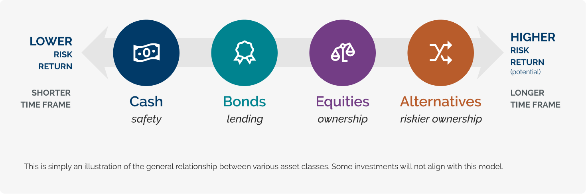

In today's dynamic financial landscape, understanding different types of investments is crucial for both novice and experienced investors. This article explores ownership investments, lending investments, and the emerging use of algorithmic trading in managing investment portfolios. Recognizing the distinctions among these investment types is essential for making informed financial decisions.

Ownership investments entail acquiring assets with the expectation of appreciating value over time. These assets encompass stocks, real estate, and commodities. Stocks offer investors the potential for dividends and capital gains, while real estate investments provide rental income and the possibility of property appreciation. Additionally, commodities such as precious metals often serve as a hedge against inflation and economic uncertainties, providing another avenue for ownership assets.



Conversely, lending investments involve providing capital to an entity and receiving interest payments in return. Common types include bonds and savings accounts. Bonds are fixed-income securities that deliver regular interest payments and return the principal upon maturity. Savings accounts, though offering lower interest rates, provide a secure place for funds with guaranteed returns. These lending investments are typically seen as lower-risk options with moderate returns compared to ownership investments. 

Algorithmic trading represents a significant advancement in investment portfolio management. It leverages computer algorithms to execute trades based on predefined criteria, optimizing investment strategies through speed and precision. Often employed in high-frequency trading environments, algorithmic trading applies across various asset classes, including stocks, bonds, and real estate contracts. By automating trade execution, this approach can enhance liquidity, manage risk, and potentially increase returns by strategically allocating assets.

As we examine ownership and lending investments alongside algorithmic trading, it becomes evident that these elements collectively shape investment strategies. Understanding their respective characteristics, risk profiles, and potential returns equips investors to align these strategies with their financial objectives, facilitating a comprehensive and adaptable investment approach.

## Table of Contents

## Ownership Investments

Ownership investments are assets that investors acquire with the expectation that they will increase in value over time, generating potential returns either through appreciation or income. These investments play a crucial role in portfolio diversification and long-term wealth accumulation. The main categories of ownership investments include stocks, real estate, and commodities such as precious metals.

### Stocks

Stocks represent shares of ownership in a company and are one of the most prevalent forms of ownership investments. When an individual purchases stock, they are essentially buying a portion of that company and, consequently, a claim on its assets and earnings. Stocks can provide returns in two primary ways: dividends and capital gains. Dividends are periodic payments made by companies to their shareholders as a distribution of profits. Capital gains occur when the stock's market price rises above the purchase price. The risk associated with stocks can vary widely depending on the company's performance, market conditions, and economic factors, but historically, equities have offered higher long-term returns compared to more conservative assets (Dimson, Marsh, & Staunton, 2021).

### Real Estate

Real estate investments entail the purchase of physical property, which can provide income and potential appreciation. Investors often classify real estate under residential, commercial, or industrial categories. Rental income is a common benefit of real estate investments, generating cash flow for the investor. Over time, as market demand increases, the property may also appreciate, offering capital gains upon sale. Unlike stocks, real estate is a tangible asset, offering diversification and serving as an effective hedge against inflation. However, real estate requires substantial capital, and its [liquidity](/wiki/liquidity-risk-premium) is generally lower compared to stocks (Geltner, Miller, Clayton, & Eichholtz, 2013).

### Commodities and Collectibles

Commodities such as precious metals (e.g., gold, silver) are also considered ownership investments. Investors acquire these assets as a safeguard against inflation and currency devaluation. Precious metals have intrinsic value and tend to perform well under economic downturns, making them a secure store of wealth. Collectibles, including art and vintage items, can also appreciate considerably in value, though they often require specialized knowledge to invest effectively. The markets for these investments are less liquid and more volatile than traditional markets but can offer substantial rewards for investors with expertise in these areas (Jaffe & Randolph, 2010).

Ownership investments are integral to building a diversified investment portfolio, providing the dual benefits of income generation and capital appreciation. They offer higher returns compared to lending investments, albeit with increased risk and [volatility](/wiki/volatility-trading-strategies). Knowing the characteristics and potential of each type of ownership investment allows investors to tailor their strategies in line with financial objectives and risk tolerance.

### References

- Dimson, E., Marsh, P., & Staunton, M. (2021). Long Term Asset Returns. In CFA Institute Research Foundation.  
- Geltner, D., Miller, N. G., Clayton, J., & Eichholtz, P. (2013). Commercial Real Estate Analysis & Investments. Cengage Learning.  
- Jaffe, J. F., & Randolph, Z. H. (2010). The Guide to Alternative Investments: The World's Leading Alternative Investment Firms on the Benefits, Opportunities, and Risks of Investing In Hedge Funds, Private Equity, Commodities, and More. The Pensions Institute. 

## Lending Investments

Lending investments are financial instruments that involve providing capital to an entity, typically in exchange for periodic interest payments and the return of principal at maturity. These investments serve as a way for investors to earn interest income, often with lower associated risks compared to ownership investments such as stocks or real estate.

### Bonds

Bonds represent a common form of lending investment. They are fixed-income securities issued by governments, municipalities, or corporations to raise capital. When an investor purchases a bond, they are essentially lending money to the issuer for a specified period. In return, the issuer agrees to pay interest, typically semi-annually or annually, at a predetermined rate throughout the bond's term. At maturity, the bondholder receives the principal amount, also known as the face value.

The bond's yield, an important measure of its return, can be calculated as follows:

$$
\text{Yield} = \frac{\text{Coupon Payment}}{\text{Current Market Price}}
$$

Bonds are generally considered lower-risk investments, particularly government bonds, due to the relatively stable nature of interest payments and the assurance of principal repayment.

### Savings Accounts

Another form of lending investment is a savings account. These accounts, offered by banks and financial institutions, allow individuals to deposit funds in exchange for interest payments. While the interest rates for savings accounts are typically lower than those of bonds, they offer a safe and highly liquid asset class. Deposits are often insured by government agencies, adding an additional layer of security for investors.

The annual percentage yield (APY) for savings accounts is calculated using the formula:

$$
\text{APY} = \left(1 + \frac{\text{Interest Rate}}{n}\right)^n - 1
$$

where $n$ is the number of compounding periods per year.

### Risk and Return Profile

Lending investments are generally characterized by lower risk compared to ownership investments. This is due to the predictable nature of interest payments and the priority they often have in the event of issuer bankruptcy or liquidation. While the returns on lending investments, such as bonds and savings accounts, are modest compared to those on stocks or commodities, they offer stability and preservation of capital. This makes lending investments an attractive option for risk-averse investors seeking steady income and principal protection.

## Algorithmic Trading

Algorithmic trading, often referred to as algo trading, involves the use of computer algorithms to automatically execute trading orders in financial markets based on predefined criteria. This method leverages the power of computing to facilitate faster, more efficient trading activities that are typically beyond the capacity of human traders.

Algo trading optimizes investment strategies by exploiting the advantages of speed and efficiency inherent in computer systems. These algorithms can process large volumes of data, identify trading opportunities, and execute orders in fractions of a second, a process known as high-frequency trading ([HFT](/wiki/high-frequency-trading-strategies)). This rapid execution capability is vital in contemporary financial markets where prices can fluctuate significantly within very short timeframes.

The application of [algorithmic trading](/wiki/algorithmic-trading) spans a variety of asset classes, including stocks, bonds, and real estate contracts. In the stock market, algorithms can analyze price movements, historical trends, and market signals to make buy or sell decisions. For bonds, algorithms might evaluate [interest rate](/wiki/interest-rate-trading-strategies) movements and credit quality changes. Even in real estate, trading contracts and investment products, such as Real Estate Investment Trusts (REITs), can benefit from algorithmic strategies by focusing on metrics like property valuation trends and rental yields.

Algorithmic trading strategies can be diverse and complex. Some common strategies include:

1. **Trend Following**: This strategy involves algorithms detecting upward or downward trends in asset prices and executing trades accordingly.

2. **Arbitrage**: Algorithms are utilized to exploit price differences of the same asset in different markets or forms.

3. **Market Making**: Involves placing orders on both buy and sell sides to profit from the bid-ask spread.

4. **Mean Reversion**: This strategy assumes that the asset price will revert to its historical mean or average.

An example of a simple algorithmic trading strategy in Python could look like this:

```python
import numpy as np

# Sample data: A list of stock prices.
stock_prices = [100, 102, 101, 105, 107, 106]

def moving_average(prices, window_size):
    return np.convolve(prices, np.ones(window_size)/window_size, mode='valid')

# Calculate moving average with a window size of 3.
moving_averages = moving_average(stock_prices, 3)

# Sample strategy: Buy when the price is below the moving average, sell when above.
for i, price in enumerate(stock_prices[len(stock_prices)-len(moving_averages):]):
    if price < moving_averages[i]:
        print(f"Buy at price: {price}")
    elif price > moving_averages[i]:
        print(f"Sell at price: {price}")
```

Algorithmic trading has broadened its scope with the integration of [machine learning](/wiki/machine-learning) and [artificial intelligence](/wiki/ai-artificial-intelligence) techniques. These advanced systems can adapt to new information in real-time, improving the precision of trading strategies. Despite its advantages, algorithmic trading isn't devoid of risks. System failures, data errors, and market volatility can lead to significant losses, underscoring the need for robust risk management protocols. 

In conclusion, algorithmic trading represents a significant evolution in managing investment portfolios, offering enhanced speed, efficiency, and the ability to process complex datasets that inform buy and sell decisions in dynamic market conditions.

## Comparative Analysis

Comparing ownership and lending investments requires examining the fundamental differences in risk, reward, and liquidity. Ownership investments, such as stocks and real estate, typically present higher risks due to their susceptibility to market fluctuations. However, this higher risk is often associated with the potential for substantial returns. Stocks, for example, can yield dividends and capital gains, while real estate can provide rental income alongside property appreciation. The volatility inherent in these investments can be a double-edged sword, offering opportunities for significant gains but also the potential for substantial losses.

Conversely, lending investments are generally considered lower-risk due to their predictable interest income and return of principal upon maturity. Bonds and savings accounts, classic examples of lending investments, provide stable earnings through interest payments. However, the lower risk associated with these investments typically translates into modest returns compared to ownership investments. The fixed-income nature of lending investments means that they serve as a reliable source of income, especially during periods of market instability.

Liquidity is another crucial [factor](/wiki/factor-investing) to consider. Ownership investments such as stocks are generally more liquid than real estate, allowing investors to quickly convert them into cash if needed. On the other hand, bonds often have specific maturity dates, which can limit liquidity unless sold on secondary markets, potentially at a discount.

Algorithmic trading introduces an advanced layer that can enhance investment strategies across both ownership and lending types. By utilizing computer algorithms, this approach can manage risk more effectively, optimize liquidity, and seek to increase returns through strategic asset allocation. Algorithmic trading systems can analyze vast datasets and execute trades at speeds and efficiencies unattainable by human traders, often benefiting from high-frequency trading environments.

For instance, in a Python-based algorithmic trading system, an investor might implement a strategy using the libraries like `pandas` and `numpy` to analyze historical market data, calculate optimal portfolio distributions, and automate rebalancing processes. A simple example might involve calculating the Sharpe ratio to find the optimal balance between risk and return:

```python
import numpy as np

# Expected return of the portfolio
expected_return = 0.08  

# Risk-free rate
risk_free_rate = 0.02  

# Standard deviation of the portfolio's excess return
portfolio_std_dev = 0.15  

# Sharpe Ratio calculation
sharpe_ratio = (expected_return - risk_free_rate) / portfolio_std_dev
```

Algorithmic trading thus serves as a complementary tool, potentially harmonizing the advantages of both ownership and lending investments while addressing their respective weaknesses. This integration can assist investors in crafting a diversified and adaptable investment portfolio aligned with their unique financial goals and risk tolerances.

## Conclusion

Understanding ownership and lending investments provides a foundational framework for building a diversified investment portfolio. Ownership investments, such as stocks, real estate, and commodities, offer opportunities for capital appreciation and potential income streams. These investments, however, come with varying degrees of risk and generally require a longer-term commitment. On the other hand, lending investments like bonds and savings accounts provide more stable returns and lower risk, appealing to more conservative investors.

Incorporating algorithmic trading can offer a competitive edge in managing investments proactively. Algorithmic trading optimizes execution speed and efficiency, allowing for real-time responses to market changes across diverse asset classes. By leveraging advanced algorithms, investors can enhance portfolio performance through strategic asset allocation and risk management. The use of quantitative models to generate trading signals enables investors to exploit market inefficiencies and execute high-frequency trades with precision.

Investors should assess their risk tolerance and investment goals to decide which combination of these strategies aligns best with their financial objectives. A well-balanced investment portfolio might include a mix of ownership and lending instruments, complemented by algorithmic trading techniques to improve liquidity and returns. Understanding individual financial goals and risk appetite is critical to selecting the appropriate investment mix. For instance, younger investors with a higher risk tolerance may prefer a portfolio tilted towards stocks and commodities, while more risk-averse investors might choose a larger allocation in bonds and savings accounts. By thoughtfully combining these components, investors can better navigate financial markets and work towards achieving their long-term investment objectives.

## References & Further Reading

[1]: Dimson, E., Marsh, P., & Staunton, M. (2021). ["Long Term Asset Returns."](https://api.repository.cam.ac.uk/server/api/core/bitstreams/c498bbb7-9f03-4c52-b86a-1f4229dc60ed/content) In CFA Institute Research Foundation.

[2]: Geltner, D., Miller, N. G., Clayton, J., & Eichholtz, P. (2013). ["Commercial Real Estate Analysis & Investments."](https://www.researchgate.net/publication/245702364_Commercial_Real_Estate_Analysis_and_Investments) Cengage Learning.

[3]: Jaffe, J. F., & Randolph, Z. H. (2010). ["The Guide to Alternative Investments: The World's Leading Alternative Investment Firms on the Benefits, Opportunities, and Risks of Investing In Hedge Funds, Private Equity, Commodities, and More."](https://methods.sagepub.com/book/mono/spatial-regression-models-2e/back-matter/s9781071802588.i766) The Pensions Institute.

[4]: Chan, E. (2013). ["Quantitative Trading: How to Build Your Own Algorithmic Trading Business."](https://github.com/ftvision/quant_trading_echan_book) Wiley.

[5]: Lopez de Prado, M. (2018). ["Advances in Financial Machine Learning."](https://www.amazon.com/Advances-Financial-Machine-Learning-Marcos/dp/1119482089) Wiley.

[6]: Jansen, S. (2020). ["Machine Learning for Algorithmic Trading."](https://github.com/stefan-jansen/machine-learning-for-trading) Packt Publishing.

[7]: Aronson, D. (2006). ["Evidence-Based Technical Analysis: Applying the Scientific Method and Statistical Inference to Trading Signals."](https://www.amazon.com/Evidence-Based-Technical-Analysis-Scientific-Statistical/dp/0470008741) Wiley.