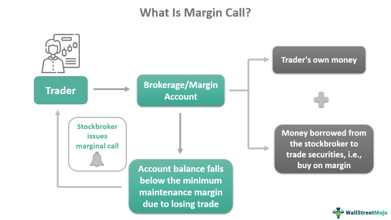

Margin calls are a critical aspect of margin trading in finance, representing an essential mechanism to manage the risk associated with leveraged trading. A margin call occurs when the value of an investor's margin account falls below the broker's required minimum account balance, necessitating the deposit of additional funds or securities to bring the account back to the required level. This requirement ensures that the brokerage firm is protected from potential losses due to diminished collateral value, thereby maintaining the integrity of the trading and borrowing system.

Understanding the different types of margin calls is crucial for traders, especially those employing algorithmic trading strategies. Algorithmic trading, with its high speed and efficiency, can influence the rate at which margin calls occur and are managed. As such, knowledge of margin call mechanisms and proactive management is vital to prevent forced liquidations or account restrictions that could arise during volatile market conditions.



This article examines the various types of margin calls, their implications for traders, and the role of algorithmic trading in managing margin call situations. Furthermore, we explore strategies that traders can utilize to effectively mitigate the risks associated with margin calls. Employing these strategies can lead to more stable trading outcomes and help traders navigate the complexities of margin trading with greater confidence and assurance.

## Table of Contents

## Understanding Margin Calls

A margin call occurs when the value of securities in a margin account falls below the maintenance margin threshold set by the broker. At this point, the broker demands that the investor add funds or deposit additional securities to subsidize the account to the required level. This process is essential for managing the risk exposure taken on by brokers, particularly when market conditions lead to a decrease in the value of securities held on margin.

The maintenance margin is the minimum balance that must be maintained in a margin account. If the market value of the investor's position decreases, causing their equity to fall below the maintenance margin, a margin call is triggered. The formula to understand when a margin call might happen can be represented as follows:

$$
\text{Equity} = \text{Value of Securities} - \text{Loan Amount}
$$

When this equity value falls below the maintenance margin requirement, which is often a percentage of the total market value of the securities, a margin call occurs. For example, if a broker requires a 30% maintenance margin, and the equity falls below this threshold, the investor must increase their equity either by adding cash or selling securities within the account to bring it back to the acceptable level. 

Margin calls serve a crucial role in protecting brokers from the risk associated with the decline in collateral value. If the investor does not meet the margin call, the broker has the authority to liquidate the securities in the account to recoup the loan amount, thus preventing potential losses due to the account's under-collateralization. This liquidation can be executed without requiring the investor's approval. Understanding the mechanics of margin calls is key for traders to manage their investments effectively and mitigate potential financial risks.

## Types of Margin Calls

Margin calls play an integral role in margin trading by ensuring that investors maintain sufficient equity in their accounts. Broadly, margin calls are classified into two primary categories: Maintenance Margin Calls and Fed Margin Calls.

Maintenance Margin Calls occur when the equity in an investor's margin account dips below a pre-defined threshold. This threshold, often set by the broker, represents the minimum percentage of equity required to safeguard the broker's interests. For instance, if a brokerage mandates a maintenance margin of 30%, and the investor's account equity falls below this level, a maintenance margin call is initiated. This scenario necessitates that the investor either deposits additional funds or sells off assets to restore the required equity level. The equation for calculating equity can be represented as:

$$
\text{Equity} = \text{Total Account Value} - \text{Loan Amount}
$$

Whereas, the maintenance margin percentage is:

$$
\text{Maintenance Margin \%} = \left( \frac{\text{Equity}}{\text{Total Account Value}} \right) \times 100
$$

Fed Margin Calls, governed by Regulation T, are imposed by the Federal Reserve Board to control the initial margins in the securities market. Regulation T stipulates that an investor must deposit at least 50% of the total purchase price of securities as the initial margin. This regulation is intended to prevent excessive borrowing and the associated market risks. If investors fail to meet this initial margin requirement, they are subjected to a Fed Margin Call. In such cases, they must deposit the necessary funds to align with the regulatory standards or face potential account restrictions and forced liquidations of their holdings. The formula for the initial margin required under Regulation T is:

$$
\text{Initial Margin Required} = 0.5 \times \text{Purchase Price of Securities}
$$

In summary, Maintenance Margin Calls serve as a broker's safeguard when an investor's account equity depletes below a broker-specific threshold. In contrast, Fed Margin Calls enforce a regulatory initial margin at 50% of securities' purchase price to curb excessive leverage in the financial markets. Understanding these distinctions is vital for traders to maintain compliance and manage risk effectively.

## Maintenance Margin Calls

The maintenance margin represents the minimum account balance that an investor must sustain after purchasing securities, ensuring that the broker's risk is managed if the value of the investor's holdings declines. Should an account's equity fall below this threshold, the broker will issue a maintenance margin call, requiring the investor to deposit additional funds or securities to restore the account balance to the required level.

Brokerage firms often set their own maintenance margin requirements, which can exceed the federal minimum standard of 25%. This variation is a strategic measure allowing brokers to mitigate risk in volatile market conditions. For example, if a broker sets a maintenance margin requirement at 30% and an investor's account value depreciates significantly, the investor is obligated to deposit funds promptly to cover the shortfall.

The maintenance margin can be expressed mathematically as follows:

$$
\text{Maintenance Margin} = \frac{\text{Equity in Account}}{\text{Current Market Value of Securities}}
$$

When the maintenance margin percentage calculated falls below the broker's prescribed level, a margin call is triggered. In practical terms, if an investor holds $10,000 worth of securities and the broker requires a 30% maintenance margin, the equity in the investor's account must not drop below $3,000. If it does, the investor will receive a margin call, necessitating immediate action to deposit additional collateral or sell some assets to bring the account back into compliance.

By understanding the nuances of maintenance margin requirements and anticipating potential market movements, investors can better prepare to respond to margin calls, preserving their financial positions and maintaining compliance with brokerage standards.

## Fed Margin Calls

Fed Margin Calls are triggered when an investor's margin account does not comply with the initial margin requirement set by the Federal Reserve Board, which is currently 50%. This requirement mandates that an investor must fund at least 50% of a security's purchase price with their own equity, limiting the remaining portion to borrowed funds. 

The primary objective of Fed Margin Calls is to ensure that investors maintain sufficient equity before initiating transactions involving borrowed capital, thus protecting both the brokerage and the broader financial system from excessive leverage risks. By requiring this initial 50% margin, the regulation aims to avert potential systemic risks that could arise in the event of sharp market downturns.

Failure to meet a Fed Margin Call can result in significant consequences for the investor, including account restrictions and forced liquidation of assets. Specifically, if the equity in the account falls below this threshold without additional deposits to correct the shortfall, the brokerage firm may liquidate the securities purchased on margin to recoup its funds. This process not only solidifies the broker's position but also prevents further losses that could materialize if the securities continue to decline in value.

To illustrate how the Fed Margin requirement works, consider the following example in Python:

```python
def calculate_fed_margin(equity, purchase_price):
    initial_margin_required = 0.5 * purchase_price
    if equity < initial_margin_required:
        margin_call_amount = initial_margin_required - equity
        return margin_call_amount
    else:
        return 0

# Example usage
equity_amount = 4000
purchase_price = 10000
margin_call = calculate_fed_margin(equity_amount, purchase_price)

if margin_call > 0:
    print(f"A Fed Margin Call is issued. Deposit an additional ${margin_call}.")
else:
    print("No Fed Margin Call. Equity is sufficient.")
```

In this example, if an investor wanted to purchase $10,000 worth of securities, they would be required to have at least $5,000 in equity. If only $4,000 is available, the program would suggest depositing an additional $1,000 to meet the initial margin requirement and avoid a Fed Margin Call.

## Impact of Algorithmic Trading on Margin Calls

Algorithmic trading leverages computer algorithms to execute trades at a pace and frequency unachievable by humans. This technology significantly influences the management of margin calls, both in terms of responsiveness and risk exposure. 

Firstly, the speed at which [algorithmic trading](/wiki/algorithmic-trading) operates allows traders to react quickly to margin calls. In highly volatile markets, prices can shift rapidly, and the ability to adjust positions instantaneously can prevent substantial losses. Algorithms can be programmed to automatically trigger specific actions, such as selling off assets or transferring funds to maintain necessary margin levels. This swift response can offer traders a strategic advantage, minimizing disruptions to trading activities.

For instance, consider a trading algorithm that continuously monitors a portfolio’s equity balance against the maintenance margin requirements. Upon detecting that the equity has approached a critical threshold, the algorithm could automatically execute pre-defined sell orders to raise the equity back to the requisite levels. This process might look something like the following Python snippet:

```python
def check_and_rebalance_portfolio(current_equity, margin_requirement, portfolio):
    if current_equity < margin_requirement:
        # Determine the required amount to cover the margin call
        shortfall = margin_requirement - current_equity
        # Sell assets to make up the shortfall
        sell_assets(portfolio, shortfall)

def sell_assets(portfolio, amount_needed):
    # Placeholder for algorithm to select and sell assets
    # based on liquidity, risk, and other criteria
    pass
```

However, algorithmic trading also presents increased risks if not properly managed. The same speed and automation that provide strategic advantages can lead to unfavorable outcomes if algorithms operate on flawed considerations or encounter unforeseen market conditions. For instance, poorly optimized algorithms could execute trades that inadvertently escalate a margin call situation by liquidating positions at inopportune times.

Moreover, the automation inherent in algorithmic trading can propagate errors across multiple transactions, potentially increasing the exposure to risk. Such errors could stem from incorrect parameters, malfunctioning code, or unexpected market behaviors. Thus, ensuring robust algorithm testing and risk management protocols is crucial to mitigate these potential hazards.

Overall, while algorithmic trading enhances the efficiency of margin call management, it necessitates strict oversight and effective risk mitigation strategies to prevent adverse outcomes caused by automated decision-making processes.

## Strategies to Avoid Margin Calls

To effectively mitigate margin calls, traders should adopt various risk management strategies. One approach is to maintain extra cash reserves in the trading account. By keeping additional funds readily available, traders can quickly meet margin calls, minimizing the risk of forced liquidation.

Diversification is another prudent strategy. By spreading investments across different asset classes, sectors, or geographies, a portfolio is less vulnerable to market [volatility](/wiki/volatility-trading-strategies). This reduces the likelihood of substantial declines in account equity, which can trigger margin calls. The concept of diversification leverages the principle that not all asset classes move in tandem; by balancing risk, the overall portfolio becomes more resilient.

Frequent monitoring of the margin account is essential. Traders should regularly review their account status to ensure it complies with the required equity levels. Many brokerage platforms offer automated alerts that notify traders when their account approaches the maintenance margin threshold, allowing them to take preemptive actions.

Lastly, setting personal maintenance margins higher than those stipulated by brokers can provide an additional cushion. By creating a safety buffer above the broker's margin requirements, traders can withstand market fluctuations without immediate concern for margin calls. This strategy involves identifying a comfortable margin level and adhering to it, thereby reducing exposure to sudden market downturns.

These strategies collectively enhance a trader's ability to navigate financial markets more safely, ensuring that margin calls have a limited impact on their investment journey.

## Conclusion

Understanding and managing margin calls is essential for successful margin trading. Margin calls serve as pivotal checkpoints, ensuring that the leverage employed in trading remains sustainable and within stipulated risk parameters. By implementing strategic practices, traders can efficiently mitigate the risks associated with margin calls. This includes establishing adequate cash reserves, maintaining diversified portfolios, and regularly monitoring account balances to ensure compliance with margin requirements.

Algorithmic tools play a significant role in enhancing margin call management. These tools can swiftly assess portfolio risks and execute necessary trades to maintain balance levels. When employed wisely, algorithms provide a strategic advantage by enabling quick responses to margin calls, particularly in volatile markets where the margin levels may rapidly fluctuate. However, the use of algorithms must be balanced with prudent risk management strategies to prevent over-leverage and potential liquidations.

Effective margin management can lead to more consistent trading outcomes and financial stability. Traders can minimize disruptions by maintaining a well-cushioned margin account, thereby enhancing their ability to capitalize on market opportunities. Utilizing both traditional strategies and modern algorithmic tools, traders can achieve a balanced approach to margin trading, enhancing overall financial robustness and ensuring long-term success in the trading landscape.

## References & Further Reading

[1]: ["Quantitative Trading: How to Build Your Own Algorithmic Trading Business"](https://www.amazon.com/Quantitative-Trading-Build-Algorithmic-Business/dp/0470284889) by Ernest P. Chan

[2]: ["Machine Learning for Algorithmic Trading"](https://github.com/PacktPublishing/Machine-Learning-for-Algorithmic-Trading-Second-Edition) by Stefan Jansen

[3]: ["Advances in Financial Machine Learning"](https://www.amazon.com/Advances-Financial-Machine-Learning-Marcos/dp/1119482089) by Marcos Lopez de Prado

[4]: Loss, D. (2011). ["Risk Management for Algorithmic Trading."](https://admarkon.medium.com/risk-management-strategies-for-algorithmic-traders-best-practices-8bc959298e0a) The Journal of Trading, 6(2).

[5]: Passow, B. N. (2010). ["Analyzing the Impacts of Algorithmic Trading on Financial Markets."](https://www.researchgate.net/scientific-contributions/Benjamin-N-Passow-69695728) Proceedings of the 10th IEEE International Conference on Computer and Information Technology.

[6]: Securities and Exchange Commission. ["Investor Bulletin: Understanding Margin Accounts"](https://www.investor.gov/introduction-investing/general-resources/news-alerts/alerts-bulletins/investor-bulletins-29)

[7]: Federal Reserve Board. ["Regulation T: Credit by Brokers and Dealers."](https://www.ecfr.gov/current/title-12/chapter-II/subchapter-A/part-220)

[8]: Aronson, D. R. (2006). ["Evidence-Based Technical Analysis: Applying the Scientific Method and Statistical Inference to Trading Signals"](https://www.amazon.com/Evidence-Based-Technical-Analysis-Scientific-Statistical/dp/0470008741)