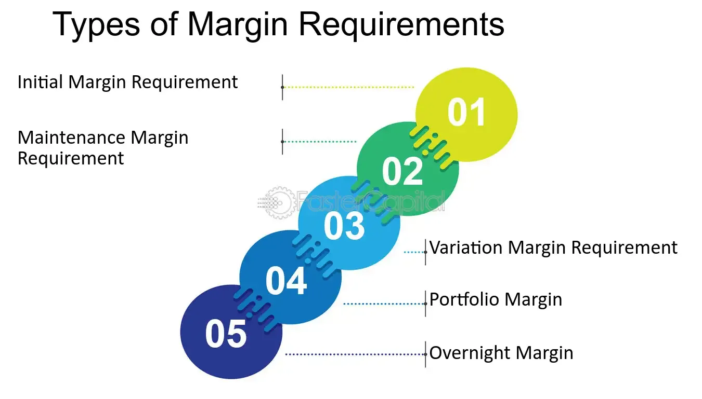

## Table of Contents

## What is a margin call?

A margin call happens when the value of the stocks or other investments you bought with borrowed money goes down a lot. When you buy on margin, you're using money that you borrowed from your broker to buy more stocks than you could with just your own money. If the value of those stocks drops, your broker might ask you to put more money into your account or sell some of your investments to cover the loan. This is called a margin call.

If you don't meet the margin call by adding more money or selling some of your investments, your broker can sell your stocks without asking you first. This is to make sure they get their money back. It's important to keep an eye on your investments and be ready to act if you get a margin call, because it can happen quickly and lead to big losses if you're not careful.

## How does a margin call work?

When you buy stocks using money borrowed from your broker, it's called buying on margin. If the value of those stocks drops a lot, your broker might worry that you won't be able to pay back the loan. This is when they might issue a margin call. A margin call is like a warning from your broker saying, "Hey, the value of your stocks has gone down, and you need to do something about it."

To handle a margin call, you have two choices. You can either put more of your own money into your account to cover the drop in value, or you can sell some of your stocks to pay back part of the loan. If you don't do either of these things quickly enough, your broker can sell your stocks without asking you first. They do this to make sure they get their money back. It's important to act fast when you get a margin call because it can lead to big losses if you're not careful.

## What triggers a margin call?

A margin call happens when the value of your stocks bought with borrowed money drops a lot. When you buy stocks on margin, you're using money from your broker to buy more stocks than you could with just your own money. If the value of those stocks goes down, your broker might get worried that you won't be able to pay back the loan. This is when they might issue a margin call.

The exact point at which a margin call is triggered depends on something called the maintenance margin. This is a minimum amount of equity you need to keep in your account. If the value of your stocks falls below this level, your broker will ask you to add more money or sell some stocks to bring your account back up to the required level. If you don't do this quickly, your broker can sell your stocks to cover the loan without asking you first.

## What is the difference between a margin call and a maintenance margin?

A margin call is like a warning from your broker that you need to do something because the value of your stocks bought with borrowed money has gone down a lot. When this happens, your broker might ask you to add more of your own money or sell some of your stocks to cover the loan. If you don't act fast, your broker can sell your stocks without asking you first to make sure they get their money back.

A maintenance margin is a rule set by your broker about how much money you need to keep in your account. It's like a minimum balance that shows you can still pay back the loan even if the value of your stocks goes down. If the value of your stocks falls below this maintenance margin, it triggers a margin call, and you'll need to take action to bring your account back up to the required level.

## How can a margin call affect my investments?

When you get a margin call, it means the value of your stocks bought with borrowed money has dropped a lot. Your broker is worried you might not be able to pay back the loan, so they ask you to add more money or sell some stocks to cover it. If you don't do this quickly, your broker can sell your stocks without asking you first. This can lead to big losses because you might have to sell your stocks at a low price when their value is down.

If you have to sell your stocks at a low price, it can make your losses even worse. Plus, if you can't meet the margin call, your broker might not let you buy on margin again for a while. This can limit your ability to make new investments and grow your portfolio. So, it's really important to keep an eye on your investments and be ready to act if you get a margin call, because it can have a big impact on your financial situation.

## What are the types of margin calls?

There are two main types of margin calls: a house call and a federal call. A house call happens when the value of your stocks drops below the maintenance margin set by your broker. This is like a rule your broker makes to protect themselves. If this happens, your broker will ask you to add more money or sell some stocks to bring your account back up to the level they need.

A federal call is a bit different. It's based on rules set by the Federal Reserve, the big boss of banks in the U.S. If the value of your stocks drops below the federal minimum, which is usually 25% of the total value of your stocks, you'll get a federal call. Like with a house call, you'll need to add more money or sell some stocks to meet this requirement. Both types of margin calls can lead to big changes in your investments, so it's important to know the difference and be ready to act.

## What is an intraday margin call?

An intraday margin call is a special kind of margin call that happens during the trading day. When you buy stocks on margin, you're using borrowed money from your broker. If the value of those stocks drops a lot during the day, your broker might worry that you won't be able to pay back the loan. They could ask you to add more money or sell some stocks right away to cover the drop in value. This is called an intraday margin call.

Intraday margin calls are different from regular margin calls because they can happen very quickly. You might not have much time to react because they happen while the market is still open. If you don't meet the intraday margin call fast enough, your broker can sell your stocks without asking you first. This can lead to big losses if you're not careful, so it's important to keep an eye on your investments and be ready to act quickly if you get an intraday margin call.

## What is a regular margin call?

A regular margin call happens when the value of your stocks bought with borrowed money drops a lot. When you buy stocks on margin, you're using money from your broker to buy more stocks than you could with just your own money. If the value of those stocks goes down, your broker might worry that you won't be able to pay back the loan. This is when they might issue a regular margin call, asking you to add more money or sell some stocks to cover the drop in value.

Unlike an intraday margin call, which can happen during the trading day, a regular margin call usually happens after the market closes. You'll have a bit more time to react, but you still need to act quickly. If you don't meet the margin call by adding more money or selling some stocks, your broker can sell your stocks without asking you first. This can lead to big losses, so it's important to keep an eye on your investments and be ready to take action if you get a regular margin call.

## How can I avoid a margin call?

To avoid a margin call, keep a close eye on your investments. When you buy stocks with borrowed money, the value of those stocks can go up and down. If they go down a lot, you might get a margin call. To prevent this, make sure you have enough money in your account to cover any drops in value. This means not borrowing too much money to buy stocks and keeping some extra cash in your account as a safety net.

Another way to avoid a margin call is to set up stop-loss orders. These are like automatic safety switches that sell your stocks if they drop to a certain price. This can help stop your losses from getting too big and might keep you from getting a margin call. Also, try to spread out your investments so you're not putting all your money into one stock or one type of investment. This can help lower the risk of a big drop in value that could lead to a margin call.

## What are the best practices for managing margin calls?

To manage margin calls well, you need to keep a close eye on your investments. When you buy stocks with borrowed money, their value can go up and down. If they go down a lot, you might get a margin call. To handle this, make sure you have enough money in your account to cover any drops in value. This means not borrowing too much money to buy stocks and keeping some extra cash as a safety net. It's also a good idea to set up stop-loss orders. These are like automatic safety switches that sell your stocks if they drop to a certain price, which can help stop your losses from getting too big and might keep you from getting a margin call.

Another good practice is to spread out your investments. Don't put all your money into one stock or one type of investment. This can help lower the risk of a big drop in value that could lead to a margin call. If you do get a margin call, act quickly. You can either add more money to your account or sell some of your stocks to cover the loan. If you don't do this fast enough, your broker can sell your stocks without asking you first, which can lead to big losses. So, always be ready to take action if you get a margin call.

## What are the regulatory requirements related to margin calls?

The rules about margin calls come from two places: your broker and the government. Your broker can set their own rules about how much money you need to keep in your account. This is called the maintenance margin. If the value of your stocks drops below this level, your broker will ask you to add more money or sell some stocks. This is called a house call. Each broker can have different rules, so it's important to know what your broker's rules are.

The government also has rules about margin calls. In the U.S., the Federal Reserve sets a rule that says you need to keep at least 25% of the total value of your stocks in your account. If the value of your stocks drops below this level, you'll get a federal call. You'll need to add more money or sell some stocks to meet this requirement. These rules are there to protect both you and your broker from big losses if the value of your stocks goes down a lot.

## How do different brokerages handle margin calls differently?

Different brokerages can handle margin calls in their own way. They each set their own rules about how much money you need to keep in your account, called the maintenance margin. If the value of your stocks drops below this level, your broker will ask you to add more money or sell some stocks. This is called a house call. Some brokers might have a higher maintenance margin than others, which means you need to keep more money in your account. This can make it harder to get a margin call, but it also means you need to have more cash on hand.

Another way brokerages can be different is in how quickly they act on a margin call. Some brokers might give you more time to add money or sell stocks, while others might act faster and sell your stocks without asking you first if you don't meet the margin call quickly enough. It's important to know your broker's rules so you can be ready to act if you get a margin call. This can help you avoid big losses and keep your investments safe.

## What is Understanding Margin Calls?

A margin call occurs when the value of securities in a margin account falls below the maintenance margin threshold set by the broker. At this point, the broker demands that the investor add funds or deposit additional securities to subsidize the account to the required level. This process is essential for managing the risk exposure taken on by brokers, particularly when market conditions lead to a decrease in the value of securities held on margin.

The maintenance margin is the minimum balance that must be maintained in a margin account. If the market value of the investor's position decreases, causing their equity to fall below the maintenance margin, a margin call is triggered. The formula to understand when a margin call might happen can be represented as follows:

$$
\text{Equity} = \text{Value of Securities} - \text{Loan Amount}
$$

When this equity value falls below the maintenance margin requirement, which is often a percentage of the total market value of the securities, a margin call occurs. For example, if a broker requires a 30% maintenance margin, and the equity falls below this threshold, the investor must increase their equity either by adding cash or selling securities within the account to bring it back to the acceptable level. 

Margin calls serve a crucial role in protecting brokers from the risk associated with the decline in collateral value. If the investor does not meet the margin call, the broker has the authority to liquidate the securities in the account to recoup the loan amount, thus preventing potential losses due to the account's under-collateralization. This liquidation can be executed without requiring the investor's approval. Understanding the mechanics of margin calls is key for traders to manage their investments effectively and mitigate potential financial risks.

## What are the types of margin calls?

Margin calls play an integral role in margin trading by ensuring that investors maintain sufficient equity in their accounts. Broadly, margin calls are classified into two primary categories: Maintenance Margin Calls and Fed Margin Calls.

Maintenance Margin Calls occur when the equity in an investor's margin account dips below a pre-defined threshold. This threshold, often set by the broker, represents the minimum percentage of equity required to safeguard the broker's interests. For instance, if a brokerage mandates a maintenance margin of 30%, and the investor's account equity falls below this level, a maintenance margin call is initiated. This scenario necessitates that the investor either deposits additional funds or sells off assets to restore the required equity level. The equation for calculating equity can be represented as:

$$
\text{Equity} = \text{Total Account Value} - \text{Loan Amount}
$$

Whereas, the maintenance margin percentage is:

$$
\text{Maintenance Margin \%} = \left( \frac{\text{Equity}}{\text{Total Account Value}} \right) \times 100
$$

Fed Margin Calls, governed by Regulation T, are imposed by the Federal Reserve Board to control the initial margins in the securities market. Regulation T stipulates that an investor must deposit at least 50% of the total purchase price of securities as the initial margin. This regulation is intended to prevent excessive borrowing and the associated market risks. If investors fail to meet this initial margin requirement, they are subjected to a Fed Margin Call. In such cases, they must deposit the necessary funds to align with the regulatory standards or face potential account restrictions and forced liquidations of their holdings. The formula for the initial margin required under Regulation T is:

$$
\text{Initial Margin Required} = 0.5 \times \text{Purchase Price of Securities}
$$

In summary, Maintenance Margin Calls serve as a broker's safeguard when an investor's account equity depletes below a broker-specific threshold. In contrast, Fed Margin Calls enforce a regulatory initial margin at 50% of securities' purchase price to curb excessive leverage in the financial markets. Understanding these distinctions is vital for traders to maintain compliance and manage risk effectively.

## What are Maintenance Margin Calls?

The maintenance margin represents the minimum account balance that an investor must sustain after purchasing securities, ensuring that the broker's risk is managed if the value of the investor's holdings declines. Should an account's equity fall below this threshold, the broker will issue a maintenance margin call, requiring the investor to deposit additional funds or securities to restore the account balance to the required level.

Brokerage firms often set their own maintenance margin requirements, which can exceed the federal minimum standard of 25%. This variation is a strategic measure allowing brokers to mitigate risk in volatile market conditions. For example, if a broker sets a maintenance margin requirement at 30% and an investor's account value depreciates significantly, the investor is obligated to deposit funds promptly to cover the shortfall.

The maintenance margin can be expressed mathematically as follows:

$$
\text{Maintenance Margin} = \frac{\text{Equity in Account}}{\text{Current Market Value of Securities}}
$$

When the maintenance margin percentage calculated falls below the broker's prescribed level, a margin call is triggered. In practical terms, if an investor holds $10,000 worth of securities and the broker requires a 30% maintenance margin, the equity in the investor's account must not drop below $3,000. If it does, the investor will receive a margin call, necessitating immediate action to deposit additional collateral or sell some assets to bring the account back into compliance.

By understanding the nuances of maintenance margin requirements and anticipating potential market movements, investors can better prepare to respond to margin calls, preserving their financial positions and maintaining compliance with brokerage standards.

## References & Further Reading

[1]: ["Quantitative Trading: How to Build Your Own Algorithmic Trading Business"](https://www.amazon.com/Quantitative-Trading-Build-Algorithmic-Business/dp/0470284889) by Ernest P. Chan

[2]: ["Machine Learning for Algorithmic Trading"](https://github.com/PacktPublishing/Machine-Learning-for-Algorithmic-Trading-Second-Edition) by Stefan Jansen

[3]: ["Advances in Financial Machine Learning"](https://www.amazon.com/Advances-Financial-Machine-Learning-Marcos/dp/1119482089) by Marcos Lopez de Prado

[4]: Loss, D. (2011). ["Risk Management for Algorithmic Trading."](https://admarkon.medium.com/risk-management-strategies-for-algorithmic-traders-best-practices-8bc959298e0a) The Journal of Trading, 6(2).

[5]: Passow, B. N. (2010). ["Analyzing the Impacts of Algorithmic Trading on Financial Markets."](https://www.researchgate.net/scientific-contributions/Benjamin-N-Passow-69695728) Proceedings of the 10th IEEE International Conference on Computer and Information Technology.

[6]: Securities and Exchange Commission. ["Investor Bulletin: Understanding Margin Accounts"](https://www.investor.gov/introduction-investing/general-resources/news-alerts/alerts-bulletins/investor-bulletins-29)

[7]: Federal Reserve Board. ["Regulation T: Credit by Brokers and Dealers."](https://www.ecfr.gov/current/title-12/chapter-II/subchapter-A/part-220)

[8]: Aronson, D. R. (2006). ["Evidence-Based Technical Analysis: Applying the Scientific Method and Statistical Inference to Trading Signals"](https://www.amazon.com/Evidence-Based-Technical-Analysis-Scientific-Statistical/dp/0470008741)