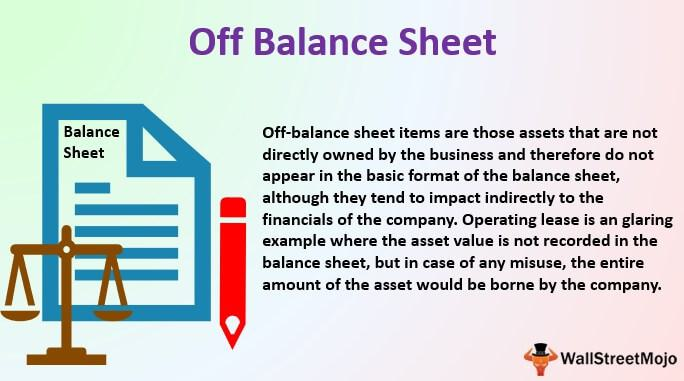

Financial reporting is a critical process for businesses to communicate their financial health and performance to stakeholders, including investors, regulators, and the public. It involves the preparation and presentation of financial statements such as the balance sheet, income statement, and cash flow statement. These documents provide a comprehensive overview of a company’s financial position and are essential for making informed decisions about investments and corporate governance.

Off-balance sheet assets refer to those resources or obligations not recorded on a company’s balance sheet. These can include items like leases, joint ventures, and certain derivatives. While not directly listed on the balance sheet, they can have significant implications for a company’s risk profile and financial performance. Companies may exclude these from their balance sheets due to accounting rules or strategic financial management, making a thorough understanding critical for assessing a company's genuine financial condition.



Algorithmic trading, meanwhile, is the use of computer algorithms to automate trading decisions, often executing orders at speeds and frequencies beyond human capability. This method relies heavily on quantitative data analysis and can incorporate vast sets of financial data to predict market trends and execute trades efficiently. The emergence of advanced technologies and data analytics in recent decades has positioned algorithmic trading as a dominant force in financial markets, helping to shape liquidity and market dynamics.

The relevance of these concepts is heightened in today’s complex financial landscape, where transparency, efficiency, and accuracy are paramount. Accurate financial reporting provides the bedrock of reliable data for algorithmic trading strategies, enabling traders to analyze market information and execute precise trades. Conversely, discrepancies or lack of transparency in financial reporting, particularly regarding off-balance sheet assets, can significantly impact trading strategies and market stability.

Understanding off-balance sheet assets is crucial, as stakeholders need to assess a company’s true financial picture. These assets, if not reported transparently, can distort market perceptions, leading to potentially destabilizing effects. Consequently, there is a strong link between financial reporting and algorithmic trading, with accurate and transparent reporting serving as a prerequisite for effective and ethical trading practices.

The purpose of this article is to explore the interaction between financial reporting, off-balance sheet assets, and algorithmic trading. By examining their intersections and impacts, this analysis aims to enhance the understanding of how these elements affect financial markets, fostering more informed decision-making and regulatory practices.

## Table of Contents

## Understanding Financial Reporting

Financial reporting is a critical function for businesses, providing a structured representation of an entity's financial performance and position over a specific period. It serves as a communication tool that conveys the financial health and operational results of a business to various stakeholders, including investors, creditors, and regulatory agencies. Financial reporting is essential as it offers transparency and accountability, forming the basis for decision-making processes that can influence investment, credit, and management decisions.

The role of financial reports in decision-making is paramount. Investors rely on these reports to assess the profitability and viability of a company before committing their funds. Creditors use financial data to evaluate the creditworthiness and risk associated with extending loans. Moreover, regulatory bodies utilize these reports to ensure compliance with financial laws and regulations. Internally, management uses financial reports to make informed operational and strategic decisions, aiming to optimize performance and guide business strategies.

The main components of financial reports include three fundamental statements: the balance sheet, the income statement, and the cash flow statement. 

1. **Balance Sheet**: This provides a snapshot of a company's financial position at a particular point in time. It includes assets, liabilities, and shareholders' equity, structured under the accounting equation $\text{Assets} = \text{Liabilities} + \text{Shareholders' Equity}$.

2. **Income Statement**: Also known as the profit and loss statement, it shows the company's performance over a period, detailing revenues, expenses, and profits or losses. It helps stakeholders understand where a company’s revenue is coming from and how it is being spent.

3. **Cash Flow Statement**: This reports on the cash generated and used during the period, segmented into operating, investing, and financing activities. It provides insights into a company’s liquidity and financial flexibility.

Off-balance sheet assets are an integral consideration in financial reports, representing items that do not appear directly on the balance sheet. These can include certain leases, joint ventures, and financial instruments like derivatives. They are often kept off the balance sheet to enhance financial ratios and manage financial risk. Despite not appearing on the balance sheet, off-balance sheet assets must be disclosed transparently in the notes to financial statements, ensuring that stakeholders have a comprehensive view of a company’s financial obligations and risks.

Financial reporting is governed by regulations and standards that aim to ensure consistency, reliability, and transparency. In many countries, the International Financial Reporting Standards (IFRS) or Generally Accepted Accounting Principles (GAAP) serve as the framework for accounting practices. These standards dictate how financial statements are prepared and presented, ensuring comparability across companies and industries. Compliance with these standards is mandatory, and failure to adhere can lead to legal ramifications and loss of investor trust.

Regulations have evolved over time to address complex financial instruments and off-balance sheet arrangements. For instance, the adoption of IFRS 16 has led to significant changes in how leases are reported, requiring many previously off-balance sheet leases to be recorded on the balance sheet. This evolution highlights the adaptive nature of financial reporting standards to reflect economic realities and maintain the integrity of financial information.

## Exploring Off-Balance Sheet Assets

Off-balance sheet assets are resources that a company does not include on its balance sheet, typically because they do not meet specific accounting criteria for recognition as assets. These assets are crucial in understanding a company's true financial health and are often associated with legal or financial arrangements that keep them off the primary financial statements. They are excluded from the balance sheet to conform with accounting standards that differentiate between owned and controlled resources versus those that are influenced or used by the company.

Common examples of off-balance sheet assets include leases, joint ventures, and derivatives:

1. **Leases**: Prior to the adoption of new accounting standards like IFRS 16, operating leases were not recognized on the balance sheet. This allowed companies to report lower liabilities and assets, influencing financial ratios such as the debt-to-equity ratio.

2. **Joint Ventures**: In some cases, the equity method of accounting is applied, where only a company's share of the joint venture's profits is included in financial statements, excluding the venture's full assets and liabilities.

3. **Derivatives**: Financial instruments that derive their value from underlying assets typically appear as off-balance sheet items unless they meet specific hedge accounting criteria.

The use of off-balance sheet assets offers both risks and benefits for companies. One potential benefit is improved financial ratios. By keeping certain liabilities and assets off the balance sheet, companies may appear more financially stable, potentially influencing investor perceptions favorably. However, the main risk lies in masking the actual financial obligations, which might lead to a misunderstanding of the company’s true leverage and risk exposure. This can have severe repercussions during financial downturns or when obligations are called upon.

The practice of reporting off-balance sheet assets can significantly affect a company's financial appearance. When large liabilities, such as lease obligations, are not reflected on the balance sheet, a company's leverage and capital structure appear healthier than they actually are. This can mislead investors and stakeholders who base their investment decisions on surface-level financial health indicators. Transparent reporting, therefore, becomes crucial.

For investors and stakeholders, transparency in the reporting of off-balance sheet assets is vital. It allows for a more accurate assessment of a company's risk profile and financial stability. Ensuring transparency requires adherence to updated accounting standards and regulations that mandate disclosures about off-balance sheet arrangements. These disclosures help in painting a fuller picture of potential future obligations and risks, enabling informed decision-making. 

Consequently, companies need to maintain high levels of transparency and disclosure in their financial reports to ensure stakeholders have the information necessary to assess the company's comprehensive financial condition. This not only builds trust but also aligns with the broader goals of maintaining market integrity and stability.

 to Algorithmic Trading

Algorithmic trading, often referred to as algo trading, has transformed the landscape of financial markets since its inception in the late 20th century. Initially sparked by the development of electronic communication networks in the 1970s, [algorithmic trading](/wiki/algorithmic-trading) gained significant traction with the advent of high-frequency trading ([HFT](/wiki/high-frequency-trading-strategies)) in the early 2000s. The fundamental idea behind algorithmic trading is to automate trading decisions and executions using pre-programmed instructions, which base their operations on variables such as timing, price, and [volume](/wiki/volume-trading-strategy).

At its core, algorithmic trading involves the use of computer algorithms to execute trades at speeds and frequencies unattainable by human traders. These algorithms can process vast amounts of market data and execute orders within milliseconds. They typically analyze numerous parameters, such as historical and real-time market data, to make informed decisions on whether to buy, sell, or hold assets.

The advantages of algorithmic trading are numerous. Foremost among these is the ability to exploit market opportunities with rapid execution, reducing transaction costs, and minimizing human error and emotional influence in trading decisions. Moreover, algorithmic trading ensures [liquidity](/wiki/liquidity-risk-premium) provision to the markets, reducing bid-ask spreads and enhancing market efficiency.

Several strategies in algorithmic trading have developed over time, each aiming to capitalize on different market conditions. High-frequency trading (HFT) is one of the most prominent forms, involving thousands of trades within seconds to profit from small price changes. Another popular strategy is statistical [arbitrage](/wiki/arbitrage), which uses quantitative methods to identify pricing inefficiencies between securities. Momentum trading and market-making are additional strategies, where the former attempts to capitalize on trending stocks and the latter involves continuous buying and selling to earn the spread.

Technology and data play a pivotal role in algorithmic trading. Advances in computational power and data analytics have revolutionized the field, with [machine learning](/wiki/machine-learning) and [artificial intelligence](/wiki/ai-artificial-intelligence) enhancing predictive capabilities and pattern recognition. Additionally, the proliferation of data—ranging from price movements and [order book](/wiki/order-book-trading-strategies) dynamics to macroeconomic indicators—feeds the algorithms' insatiable demand for information, making real-time processing and analysis integral for successful trading models.

In summary, algorithmic trading is a sophisticated and evolving field that leverages technology to enhance the efficiency and effectiveness of trading in financial markets. The continued advancement of computational tools and data analytics promises further innovation, potentially reshaping global financial systems.

## The Intersection of Financial Reporting and Algo Trading

Accurate financial reporting is vital for algorithmic trading strategies as it provides the necessary data that algo traders rely on to make informed decisions. Financial reports offer crucial insights into a company's financial health, profitability, and risks, which are inputs for trading algorithms designed to assess market conditions and predict price movements.

Algo traders use financial reports data in various ways, primarily by integrating it into their algorithms to forecast market trends and opportunities. For instance, balance sheets, income statements, and cash flow statements furnish details that can be quantified and modeled to predict future earnings or financial stability, subsequently guiding buy or sell decisions. Machine learning models can process large volumes of financial data to identify patterns or anomalies that might indicate potential shifts in asset prices. Python, with libraries such as Pandas for data manipulation and Scikit-learn for machine learning, is often employed to create these predictive models.

```python
import pandas as pd
from sklearn.linear_model import LinearRegression

# Example of using financial data to predict stock prices
data = pd.read_csv('financial_reports.csv')
features = data[['Net Income', 'Total Revenue', 'Total Assets']]
target = data['Stock Price']

model = LinearRegression()
model.fit(features, target)
predictions = model.predict(features)
```

Case studies reveal that anomalies in financial reporting—such as earnings restatements or undisclosed liabilities—can lead to significant impacts on algorithmic trading outcomes. For example, when a company revises its earnings downwards, algorithms that previously flagged the stock as a buy based on inflated figures may now classify it as a sell, leading to a rapid sell-off. These sudden market movements highlight the necessity for continuous reinforcement of algorithms to adapt to changing financial disclosures.

Off-balance sheet assets pose challenges for algorithmic traders as they may conceal the true financial position of a company. These assets, including leases and derivatives, often escape traditional financial scrutiny, potentially leading to an overvaluation or undervaluation of a company's stock. Without transparent reporting, algo traders may misinterpret the actual risk exposure, resulting in flawed trading strategies that could lead to losses.

Transparency in financial reporting is crucial for reducing market manipulation and maintaining the integrity of financial markets. By ensuring that all assets, including off-balance sheet items, are accurately reported, regulators and companies can provide traders with reliable data, fostering a fair trading environment. Enhanced transparency helps algorithms assess true financial conditions, reducing the likelihood of trading based on misleading or incomplete information.

In conclusion, the interplay between financial reporting and algorithmic trading underscores the importance of comprehensive and truthful reporting practices. Accurate financial data enables more effective and reliable algorithmic trading strategies, contributing to more efficient and transparent financial markets.

## Regulatory and Ethical Considerations

The regulatory landscape governing financial reporting and algorithmic trading is complex, with numerous guidelines and standards designed to enhance transparency and market integrity. Financial reporting is primarily regulated through international standards such as the International Financial Reporting Standards (IFRS) and the Generally Accepted Accounting Principles (GAAP). These frameworks establish guidelines for the accurate and complete disclosure of financial information, including the treatment of off-balance sheet assets. Accurate reporting of these assets is crucial to provide stakeholders with a comprehensive understanding of a company’s financial position. Ethical considerations here revolve around the imperative to truthfully represent financial data, avoiding any manipulation that might mislead investors or regulators.

In the sphere of algorithmic and high-frequency trading (HFT), regulatory bodies such as the U.S. Securities and Exchange Commission (SEC) and the Commodity Futures Trading Commission (CFTC) in the United States, and the European Securities and Markets Authority (ESMA) in Europe, have developed specific rules. These regulations focus on ensuring fair trading practices, requiring algorithmic trading firms to maintain adequate risk controls and observe transparency requirements. The Markets in Financial Instruments Directive II (MiFID II) is a notable regulatory framework in Europe that governs trading practices and seeks to enhance market transparency by mandating detailed reporting of trading activities.

Financial regulators play a pivotal role in supervising both reporting and trading activities. They enforce compliance through audits, impose sanctions for breaches, and issue guidelines to adapt to evolving market conditions. This oversight is key in maintaining market confidence and protecting investors from potential harms associated with misinformation or unethical trading practices.

Best practices for compliance and ethical trading involve implementing robust internal controls, conducting regular audits of trading algorithms, and ensuring that off-balance sheet items are accurately reported. Traders and companies should adhere to the principle of transparency, providing thorough documentation and explanations for financial reporting. Ethical trading practices include ensuring that algorithms do not engage in manipulative behaviors such as spoofing or layering, which can distort market prices and harm market participants.

As the financial landscape continues to evolve, staying informed of regulatory updates and technological advancements is essential for professionals in the field. This vigilance helps to mitigate risks and uphold the integrity of financial markets.

## Future Trends and Innovations

Emerging trends in financial reporting standards are continuously shaping how off-balance sheet assets are treated and disclosed. These assets, which traditionally remained obscured from balance sheets, are undergoing greater scrutiny due to evolving accounting standards such as the International Financial Reporting Standards (IFRS) and the Generally Accepted Accounting Principles (GAAP). One of the notable trends is the push towards enhanced transparency, compelling companies to provide more detailed disclosures of these assets. This shift is aimed at providing a clearer picture of a company's financial health to stakeholders, thereby minimizing risks associated with uninformed decision-making.

In parallel, advancements in algorithmic trading technologies, particularly through the incorporation of Artificial Intelligence (AI) and Machine Learning (ML), are significantly transforming trading strategies. AI and ML facilitate the analysis of vast datasets at unprecedented speeds, enabling the development of sophisticated trading algorithms that can adapt and learn over time. These technologies not only enhance predictive accuracy but also improve the efficiency of executing trades. For instance, neural networks and natural language processing (NLP) can be used to analyze financial reports and news feeds, providing traders with actionable insights based on real-time data.

Regulatory frameworks governing both financial reporting and algorithmic trading are likely to evolve in response to these technological advancements. Regulatory bodies are expected to implement stricter guidelines to ensure fair trading practices and to protect investors from potential risks associated with high-frequency trading and financial disclosure irregularities. Future changes may include comprehensive reporting standards for algorithmic trading activities and more stringent disclosure requirements for off-balance sheet items.

As transparency in financial reporting increases, it is anticipated that trading algorithms will need to be recalibrated to account for more comprehensive and accurate data inputs. Enhanced visibility into financial reports could lead to more sophisticated models that better assess the financial stability and potential risks of companies. These developments require algorithms to incorporate advanced data analytics techniques to remain competitive and effective.

The integration of blockchain technology promises to revolutionize both areas by providing immutable and transparent records of transactions and financial statements. Blockchain could facilitate real-time reporting and auditing, significantly reducing the risk of fraud and errors in financial reporting. Likewise, in trading, blockchain can ensure the authenticity and traceability of trades, preventing market manipulation and fostering trust among market participants. This technology's decentralized nature may lead to a more democratized financial ecosystem, altering traditional dynamics in financial reporting and trading.

Overall, the future of financial reporting and algorithmic trading is poised for transformative changes driven by technological innovations and evolving regulatory standards. Embracing these trends is essential for stakeholders aiming to leverage emerging opportunities while navigating the complexities of modern financial markets.

## Conclusion

Understanding the interplay between financial reporting and algorithmic trading is crucial for navigating today's financial markets effectively. Accurate financial reporting provides a foundation for informed decision-making by both traditional investors and algorithmic traders. It is imperative to recognize that financial reports, which include crucial data such as income statements, balance sheets, and cash flow statements, are critical tools that traders use to develop and adjust their trading strategies.

Off-balance sheet assets present a particular challenge in this context. These assets, which can include items like leases and derivatives, are not reflected on the balance sheet, yet they can significantly affect a company's financial standing. Accurate and transparent reporting of these assets is vital for market transparency, helping mitigate risks associated with misinformation or incomplete data. For algorithmic trading, in particular, the lack of transparency in reporting off-balance sheet assets can lead to flawed algorithms and inaccurate trading signals, emphasizing the critical need for rigorous disclosure practices.

The integration of financial reporting and algorithmic trading offers both challenges and opportunities. As technology evolves, the potential for more sophisticated trading algorithms grows, alongside the complexity of reporting requirements. This integration demands continuous education for financial professionals to keep pace with advancements and maintain effective regulatory compliance. Embracing these changes will enable market participants to harness new technologies while upholding the integrity and transparency that underpin robust financial markets.

In conclusion, by fostering a deeper understanding of the dynamics between financial reporting and algorithmic trading, and emphasizing the essential role of transparency in the disclosure of off-balance sheet assets, financial professionals can better equip themselves to leverage opportunities while navigating the challenges of an increasingly complex landscape. Continuous learning and adaptation are paramount for staying informed and maintaining a competitive edge in finance.

## References & Further Reading

[1]: Off-Balance Sheet Financing: Understanding the Concerns and Improvements Needed ([link](https://www.investopedia.com/terms/o/obsf.asp))

[2]: Hull, J. C. (2018). "Options, Futures, and Other Derivatives" (10th Edition). Pearson. [Details regarding financial instruments and derivatives]. 

[3]: Lewis, M. (2014). "Flash Boys: A Wall Street Revolt." W. W. Norton & Company. [Insight into high-frequency trading and market structure].

[4]: International Financial Reporting Standards (IFRS) Foundation: [The Conceptual Framework for Financial Reporting](https://www.ifrs.org/content/dam/ifrs/publications/pdf-standards/english/2021/issued/part-a/conceptual-framework-for-financial-reporting.pdf)

[5]: Basel Committee on Banking Supervision. (2013). "Basel III: The Liquidity Coverage Ratio and liquidity risk monitoring tools." Bank for International Settlements. [Overview of regulatory standards related to financial risk].