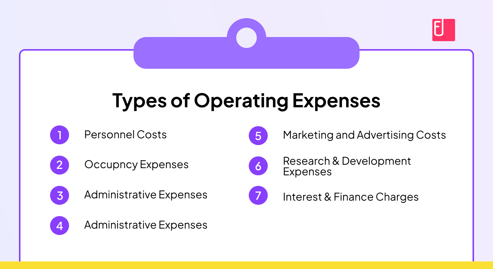

Operating expenses are essential components of a business, encompassing the costs incurred in the day-to-day functioning of a company. These expenses are crucial for maintaining the operational flow and ensuring that the business machinery remains smooth and effective. In a business context, operating expenses typically include costs associated with rent, utilities, payroll, software, and marketing, among others. These expenses are pivotal as they directly impact the profitability and financial health of a firm. Proper management of these expenses can lead to increased efficiency, cost savings, and higher profit margins.

In the context of algorithmic trading, managing operating expenses becomes even more significant due to the high-stakes nature of financial markets and the critical role that technology plays in this sector. Algorithmic trading relies heavily on advanced software, data feeds, and IT infrastructure to make rapid and accurate trading decisions. Consequently, the expenses related to technology, such as software licenses, data feed subscriptions, and IT personnel, form a substantial part of the operating costs. Efficiently managing these expenses is vital for algo trading firms to maintain a competitive edge, as even small inefficiencies can lead to significant financial losses in high-frequency trading environments where margins are often thin.

The purpose of this article is to explore the various types of business expenses specific to algorithmic trading and their implications for firms operating in this space. By understanding and categorizing these expenses, trading firms can better strategize and optimize their financial performance. This entails a detailed examination of fixed versus variable expenses, direct and indirect costs, and how these specifically apply to algorithmic trading operations. The management of these expenses not only affects a firm's bottom line but also its ability to innovate and expand its market reach. By adopting strategic approaches to expense management, algo trading firms can enhance their financial health and achieve sustainable growth in an increasingly competitive environment.

## Table of Contents

## Understanding Business Expenses

Business expenses refer to the costs incurred by a company in the [course](/wiki/best-algorithmic-trading-courses) of conducting its operations and generating revenue. These expenses are fundamental to understanding a firm's financial performance and are essential for strategic planning and budgeting. Properly managed business expenses can enhance profitability, while poorly managed ones can undermine it. In the highly competitive and dynamic field of algorithmic trading, managing these expenses becomes even more critical due to the rapid pace of technological advancements and the substantial investments in infrastructure and human capital required.

### Overview of Fixed vs. Variable Expenses

Fixed expenses are those that remain constant regardless of the level of business activity. Examples include rent, salaries for non-commission staff, and insurance. These expenses provide a predictable financial obligation that can aid in long-term planning but also add rigidity to the financial structure.

Variable expenses, in contrast, change in proportion to business activity levels. In an [algorithmic trading](/wiki/algorithmic-trading) firm, examples include transaction fees, which vary based on the [volume](/wiki/volume-trading-strategy) of trades, and performance-based compensation, which is contingent on trading success. These expenses offer flexibility but require careful monitoring to manage effectively with fluctuating business operations.

### Distinction Between Direct and Indirect Costs

Direct costs are expenses that can be directly attributed to a specific project or operational activity. For trading firms, this includes expenses like data feeds and transaction fees, which are directly related to executing trades.

Indirect costs, also known as overheads, are not directly traceable to specific business activities but are necessary for daily operations. Examples include utilities, administrative salaries, and office supplies. In an algo trading context, indirect costs might encompass expenses related to general IT infrastructure that supports but doesn’t execute trades directly.

### Relevance in Trading Firms, Especially Algo Trading

In algorithmic trading firms, the distinction between fixed vs. variable expenses and direct vs. indirect costs helps in crafting effective financial strategies and operational budgets. These trading entities require sophisticated technology and data infrastructure, representing significant operating expenses that must be justified by commensurate trading profits.

For algo trading firms, these expenses are not merely operational but strategic. The choice of technology platforms, data acquisition methods, and analytics tools constitutes a large portion of variable costs. Direct costs, such as execution fees and technology investments in high-frequency trading systems, play a crucial role in maintaining a competitive edge.

Continuously optimizing these expenses, by embracing cost-efficient technologies and strategies, is critical. For instance, utilizing cloud-based solutions can convert fixed IT costs into manageable variable expenses, aligning with trading activity levels.

Understanding these expenses and their role within the firm's financial ecosystem allows trading firms to allocate resources efficiently, improve profitability, and maintain competitiveness in a fast-paced environment.

## Types of Operating Expenses in Algo Trading

Operating expenses in algorithmic trading are varied and essential for the smooth functioning of trading operations. These expenses typically include compensation, technology-related costs, sales, marketing, and administrative expenses specific to the sector.

### Compensation, Sales, and Marketing Expenses

Compensation is a significant expense category in algo trading firms. This includes salaries, bonuses, and benefits for employees involved in developing, maintaining, and optimizing trading algorithms. Talented programmers, data analysts, and quantitative researchers are pivotal to an algo firm's success; hence their compensation often reflects the industry's competitive nature.

Sales and marketing expenses, though not as extensive as in other industries, are crucial for algo trading firms seeking to expand their client base and enhance their market presence. These can include costs related to marketing campaigns, brand development, and client relationship management. Effective marketing strategies help in distinguishing a firm within a competitive landscape where technological superiority often serves as a selling point.

### Technology-Related Expenses

The technological backbone of any algo trading firm comprises critical expenses such as software licenses, high-speed data feeds, and infrastructure costs. Software licenses are required for algorithm development platforms, [backtesting](/wiki/backtesting) tools, and risk management systems. Additional costs may arise from acquiring proprietary or third-party libraries that offer quantitative models or advanced data analytics features.

Data feeds are another crucial expense, as successful algorithmic trading often relies on real-time and historical data across various markets. The cost of these data services is determined by the breadth of the data offered and its latency. Firms might also invest in low-latency networks and co-location services near key financial exchanges to gain a competitive edge in speed-sensitive markets.

### Administrative Costs

Administrative costs, while typically smaller in proportion to other expenses, are indispensable for maintaining orderly operations. These costs often include office space leasing, utility expenses, legal fees, and compliance costs. Given the high regulatory scrutiny in financial trading, expenditure on compliance is essential to ensure adherence to industry regulations and avoid costly penalties.

In summary, operating expenses in algorithmic trading encompass a range of financial outlays that support critical functions within the firm. Effective management of these expenses is necessary for maintaining operational efficiency and achieving profitable trading outcomes.

## Impact of Operating Expenses on Financial Performance

Operating expenses are a crucial component of a firm's financial structure as they directly influence profitability. These expenses encompass the costs associated with maintaining the day-to-day functioning of a business rather than producing goods or services, making their management pivotal for sustaining financial health.

Operating expenses impact a firm’s bottom line by reducing the net income, given that they are deducted from gross revenue. The formula for calculating net income illustrates this:

$$
\text{Net Income} = \text{Revenue} - \text{COGS} - \text{Operating Expenses} - \text{Interest} - \text{Taxes}
$$

Here, reducing operating expenses, while keeping other variables constant, directly enhances net income and boosts profitability. However, the challenge lies in striking a balance between minimizing these expenses and not negatively impacting the quality of operations or revenue generation.

**Balancing Operation Costs with Revenue Generation**

Balancing operational costs with revenue generation is critical to ensuring the financial success of a firm, particularly in algorithmic trading where market conditions can shift rapidly. The goal is to streamline costs without impairing the firm's ability to generate revenue. This requires thorough cost analysis to identify non-essential expenditures or areas where cost efficiency can be improved, such as automating processes or renegotiating vendor contracts.

**Methods for Assessing and Optimizing Operating Expenses**

1. **Benchmarking and Budgeting**: Establishing industry benchmarks allows firms to compare their expenses with industry standards and identify potential areas for savings. Budgeting helps in forecasting and maintaining discipline in managing expenses.

2. **Cost-Volume-Profit Analysis**: This tool enables firms to understand how changes in costs and volume affect their profit. By analyzing break-even points, firms can make informed decisions about cost management.

3. **Technology Utilization**: Implementing advanced technologies can lead to significant cost savings. For instance, using machine learning algorithms can optimize trading strategies and lower transaction costs. Automation reduces manual labor, thereby cutting labor expenses.

4. **Outsourcing Non-Core Activities**: Non-essential functions can be outsourced to third-party providers, leveraging their expertise and economies of scale to reduce costs.

5. **Regular Expense Audits**: Conducting periodic audits allows for the identification of waste or inefficiencies within the operating expenses. This, combined with continuous monitoring, can prevent costs from escalating unnoticed.

By employing these strategies, firms can keep operating expenses in check, thus enhancing their financial performance. An effectively managed expense structure can serve as a competitive advantage, allowing a firm to reinvest savings into growth opportunities or innovation, further driving revenue generation.

## Cost of Goods Sold vs. Operating Expenses

In the context of algorithmic trading, the Cost of Goods Sold (COGS) represents the direct costs associated with executing trades and maintaining trading systems. Unlike traditional businesses where COGS primarily includes costs of materials and labor required to produce goods, in algo trading, COGS may encompass expenses such as transaction fees, brokerage fees, data acquisition costs related to trading activities, and any direct operational costs needed to run trading algorithms.

Operating expenses, on the other hand, are the costs incurred in the day-to-day functioning of a trading firm, excluding the direct costs of trading activities. These include salaries of personnel, office rent, utilities, and administrative expenses. In essence, operating expenses are broader and extend beyond the direct costs captured by COGS.

The primary distinction between COGS and operating expenses lies in their direct association with revenue-generating activities. COGS are directly variable with the firm’s trading volume and performance, while operating expenses are generally fixed or semi-fixed, reflecting the overhead of maintaining the business irrespective of trading levels.

However, some trading firms might classify certain components of COGS as part of operating expenses due to the unique nature of their trading operations. For instance, ongoing technology costs critical to executing trades efficiently, such as fees for maintaining high-speed data feeds or specialized algorithmic software licenses, might be treated as operational expenses due to their indispensable role in the daily operation of the firm. This categorization can sometimes provide a more comprehensive view of the firm's operational cost structure.

Despite this overlap, clear differentiation between COGS and operating expenses is crucial for accurate financial reporting and performance analysis. Accurate allocation ensures better insights into cost management and profitability, which is essential for financial decision-making within algorithmic trading firms.

## Strategies for Managing Operating Expenses

Managing operating expenses in algorithmic trading is crucial for enhancing a firm's profitability and maintaining a competitive edge. Effective cost management strategies involve adopting best practices that optimize resource use while leveraging technological innovations to minimize overheads. Here, we explore these strategies in detail.

### Best Practices for Managing Expenses in a Trading Environment

1. **Implementing Cost-effective Infrastructure Solutions**: Trading firms benefit significantly from optimizing their IT infrastructure. Transitioning to cloud-based platforms instead of maintaining extensive physical servers can reduce costs related to hardware acquisition and maintenance. Cloud solutions also offer scalability, allowing firms to adjust resources based on demand.

2. **Outsourcing Non-Core Functions**: By outsourcing functions like IT support and back-office operations, trading firms can focus on their core activities while reducing costs. This practice allows firms to capitalize on external expertise without incurring the full costs of in-house staff.

3. **Establishing Rigorous Budgeting and Forecasting**: Effective budget management involves not only tracking expenses but also forecasting future costs and revenues. Utilizing advanced analytics helps firms predict and accommodate potential market fluctuations that may affect operating expenses.

### Technological Innovations that Help Reduce Costs

1. **Artificial Intelligence (AI) and Machine Learning (ML)**: These technologies can automate routine tasks such as data analysis and trading decisions, significantly reducing the need for extensive human resources. Algorithms can also identify patterns and make predictions faster than manual processes, improving a firm's operational efficiency.

2. **Blockchain for Transaction Recording**: Adopting blockchain technology can lower costs associated with transaction verification and record-keeping. Blockchain offers a secure, immutable ledger that reduces the need for intermediaries, thereby cutting down transaction costs.

3. **Robust Data Management Systems**: Implementing sophisticated data management systems ensures efficient data storage, retrieval, and analysis. Efficient data handling reduces time and resources spent on data processing, which is essential in a data-driven environment like algorithmic trading.

### Examples of Firms Effectively Managing Operating Expenses for Competitive Advantage

1. **Renaissance Technologies**: Known for its Medallion Fund, Renaissance Technologies employs advanced quantitative models to manage trading. By investing heavily in technology and employing top-tier quantitative professionals, Renaissance Technologies effectively manages its operating expenses while maintaining a competitive edge.

2. **Two Sigma Investments**: This firm leverages big data and machine learning to drive its trading strategies. Two Sigma's focus on innovation in technology allows it to streamline operations and maintain cost-efficiency, contributing to its success in the competitive trading landscape.

3. **Citadel Securities**: By optimizing its technological stack and focusing on AI-driven market-making strategies, Citadel has effectively reduced operating costs. Continuous investment in technology ensures that Citadel stays ahead in the market, offering a robust example of strategic expense management.

In conclusion, managing operating expenses in algorithmic trading involves a combination of strategic planning, leveraging the latest technologies, and adopting best practices aimed at cost optimization. These strategies not only enhance financial performance but also provide a significant competitive advantage in a rapidly evolving trading environment.

## Conclusion

In the conclusion of our exploration into operating expenses within algorithmic trading, several key points have emerged. Understanding the nature and structure of operating expenses is crucial for trading firms. These expenses encompass a range of costs, from technology outlays necessary for efficient trading operations to administrative overheads and marketing expenses. Recognizing and categorizing these expenditures aids in strategic planning and financial management.

The significance of distinguishing between operating expenses and Cost of Goods Sold (COGS) cannot be overstated. While COGS pertains directly to the production of goods, operating expenses extend beyond production costs to cover the broader spectrum of business operations. This distinction helps firms allocate resources effectively and develop targeted strategies for cost reduction.

Effective management of operating expenses directly influences a firm's financial performance. By optimizing these costs, firms can enhance their profitability and maintain a competitive edge in the dynamic trading environment. Technologies such as advanced analytics and automation play a pivotal role in reducing costs and improving operational efficiencies.

Firms are encouraged to adopt strategic financial management practices, focusing on balancing operational costs with revenue generation. Continuous assessment and optimization are key to maintaining financial health and sustainability. A proactive approach to managing operating expenses, supported by technological innovation and strategic planning, empowers trading firms to navigate challenges and capitalize on opportunities in the algorithmic trading landscape.

## FAQs

### What are the differences between SG&A and COGS?

Selling, General, and Administrative Expenses (SG&A) and Cost of Goods Sold (COGS) are distinct categories within a firm's financial statements. SG&A expenses represent the overhead costs not directly tied to production or the provision of goods and services. These include costs related to sales teams, marketing, rent, utilities, and administrative roles. On the contrary, COGS refers to the direct costs incurred in the production of goods or services that a firm sells. This comprises expenses for raw materials, labor, and manufacturing overheads. The distinction is crucial for accurate financial analysis and reporting since COGS is deducted from sales revenue to determine gross profit, while SG&A is subtracted from gross profit to arrive at operating profit.

### How can algorithmic trading firms reduce operating expenses effectively?

Algorithmic trading firms can effectively manage their operating expenses through several strategies:

1. **Automation**: By employing advanced algorithms and automated systems, firms can reduce manual intervention and labor costs.

2. **Cloud Computing**: Shifting to cloud-based infrastructure can reduce the need for on-premises data centers, cutting down costs related to hardware, maintenance, and energy.

3. **Data Management**: Optimizing data usage and subscriptions for market feeds can prevent overspending on redundant or excessive data services.

4. **Outsourcing**: Non-core activities such as IT support or administration can be outsourced to specialized providers, thus allowing firms to focus resources on strategic functions.

### Why is separating selling, general, and administrative expenses from other costs essential?

Separating SG&A from other costs is essential to gain a clear view of a firm's financial operations. It allows for more precise monitoring and management of overheads, providing insights into the efficiency and effectiveness of the company's support functions. This separation also aids in budgeting, financial planning, and performance evaluation by allowing firms to track and control costs that do not directly contribute to the production processes. Furthermore, investors and analysts can better assess a firm’s operational efficiency by isolating these expenses.

### What role do operating expenses play in financial decision-making?

Operating expenses play a critical role in financial decision-making as they directly impact a firm's profitability and cash flow. By carefully monitoring these expenses, firms can optimize their operational efficiency and allocate resources where they are most needed. Operating expenses are a key component of the income statement, influencing the calculation of operating profit and net income. Efficient management of these expenses can enhance a company’s financial health, making it more attractive to investors. Additionally, understanding these costs is vital for setting strategic priorities and pursuing cost-effective innovations in technology and processes.

## References & Further Reading

[1]: Bergstra, J., Bardenet, R., Bengio, Y., & Kégl, B. (2011). ["Algorithms for Hyper-Parameter Optimization."](https://dl.acm.org/doi/10.5555/2986459.2986743) Advances in Neural Information Processing Systems 24.

[2]: ["Advances in Financial Machine Learning"](https://www.amazon.com/Advances-Financial-Machine-Learning-Marcos/dp/1119482089) by Marcos Lopez de Prado

[3]: ["Evidence-Based Technical Analysis: Applying the Scientific Method and Statistical Inference to Trading Signals"](https://www.amazon.com/Evidence-Based-Technical-Analysis-Scientific-Statistical/dp/0470008741) by David Aronson

[4]: ["Machine Learning for Algorithmic Trading"](https://github.com/stefan-jansen/machine-learning-for-trading) by Stefan Jansen

[5]: ["Quantitative Trading: How to Build Your Own Algorithmic Trading Business"](https://www.amazon.com/Quantitative-Trading-Build-Algorithmic-Business/dp/1119800064) by Ernest P. Chan