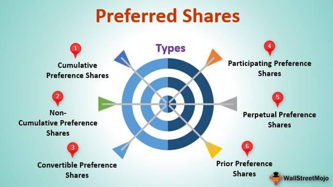

In the ever-evolving world of finance and investment, choosing the right investment options is crucial for securing your financial future. Investors today are confronted with an array of financial instruments, each with distinct features, risk profiles, and potential returns. This article will explore some intriguing investment avenues: different types of shares, the specific category of preference shares, and the innovative world of algorithmic trading. These options are designed to cater to varying levels of risk tolerance and involvement preferences, making them suitable for diverse investor profiles. Understanding the nuances of these investment vehicles is essential for constructing a robust portfolio that aligns with your financial goals. As financial markets continue to evolve, integrating a mix of traditional and modern investment strategies can be a valuable approach, enhancing the potential for portfolio growth and risk management over time.

## Table of Contents



## Understanding Different Types of Shares

Shares are fundamental financial instruments representing ownership interest in a company, and they provide investors with an opportunity to benefit from the company's growth and success. There are primarily two types of shares that investors can consider: common shares and preference shares, each offering distinct features that affect an investor's right to dividends, voting, and priority in the event of liquidation.

Common shares, often referred to as ordinary shares, are the most prevalent type of stock issued by companies. These shares typically come with voting rights, allowing shareholders to have a say in major corporate decisions such as electing the board of directors. Dividends paid to common shareholders are not guaranteed and can fluctuate based on the company's profitability and strategic priorities. This variability implies a potential for capital appreciation if the company performs well, but it also introduces risk if earnings decline.

Preference shares differ from common shares in several important ways. They usually do not confer voting rights to shareholders. However, preference shares are characterized by a fixed dividend, offering a more reliable income stream compared to the variable dividends of common shares. This fixed income feature makes preference shares an appealing option for risk-averse investors seeking steady returns.

In the event of liquidation, preference shareholders have a higher claim on assets than common shareholders, though still subordinate to debt holders. This prioritization can provide additional security for preference shareholders in financial downturns. Furthermore, some preference shares may have features such as convertibility, which allows investors to convert their preference shares into common shares under prescribed conditions, thereby offering potential for capital gains.

Understanding the unique characteristics and benefits of each type of share is crucial for tailoring an investment strategy that aligns with one's financial goals and risk tolerance. Potential investors should carefully consider their income needs and investment horizon when deciding between common and preference shares, as each offers distinct advantages and disadvantages within a diversified portfolio.

## The Features of Preference Shares

Preference shares, often regarded as a hybrid security, exhibit a blend of features typical of both equity and debt instruments. This unique characteristic makes them particularly appealing to investors seeking a consistent income stream combined with some elements of equity investment.

One of the primary attributes of preference shares is their dividend priority. Preference shareholders receive dividends before any are distributed to common shareholders. This priority is a significant advantage for investors desiring stable returns, as preference shares typically come with fixed dividend rates. Unlike common shares, where dividends can fluctuate based on the company’s performance, the fixed-rate nature of preference shares provides a predictable income.

Moreover, in the unfortunate event of a company's liquidation, preference shareholders hold a superior claim on the company's remaining assets compared to common shareholders. This higher claim on assets offers an added layer of security in riskier business environments.

Preference shares also introduce the flexibility of convertibility options. Certain preference shares may be convertible into a predefined number of common shares under specific conditions or at the holder's or issuer's discretion. This feature allows investors to potentially benefit from the company's growth by switching to common shares, which might offer higher capital appreciation prospects if the company performs well.

There are several types of preference shares designed to cater to varying investor needs:

1. **Cumulative Preference Shares**: These shares allow unpaid dividends to accumulate and be paid out in the future, offering investors assurance of eventual dividend recovery.

2. **Non-cumulative Preference Shares**: Unlike their cumulative counterparts, these do not accumulate unpaid dividends. If the company decides not to pay a dividend in a given year, investors cannot claim it in the future.

3. **Convertible Preference Shares**: These give investors the right to convert their preference shares into a specified number of common shares, often at predetermined times and conditions.

4. **Participatory Preference Shares**: These shares provide the holder with the ability to participate in the excess profits of the company, over and above the fixed dividend rate. This feature allows for higher returns in particularly profitable years.

These diverse options provide investors with the flexibility to align their investments with their individual risk tolerance and income requirements. As such, understanding the specific features of each type of preference share is crucial for making informed investment decisions.

## Pros and Cons of Investing in Preference Shares

Preference shares offer several advantages, making them attractive to income-focused investors. One primary benefit is the fixed dividend yield, which provides a stable and predictable income stream. This stability is particularly appealing during periods of economic uncertainty when the [volatility](/wiki/volatility-trading-strategies) of common stock dividends can increase. Furthermore, in the event of a company's liquidation or bankruptcy, preference shareholders have a higher claim on assets compared to common shareholders. This preferential treatment in the capital structure can offer additional security to investors concerned about downside risk.

However, investing in preference shares is not without its drawbacks. One significant limitation is the potential for limited capital appreciation. Unlike common shares, which may benefit substantially from a company's growth and increasing stock prices, the upside for preference shares is typically more constrained due to their fixed dividend nature. Another disadvantage is the lack of voting rights generally associated with preference shares. This means shareholders often have little or no say in the strategic decisions of the company, such as mergers, acquisitions, or changes in corporate governance.

The decision to invest in preference shares should thus be carefully evaluated in the context of an investor's overall financial goals, income needs, and risk tolerance. Investors seeking a predictable income stream with a lower risk profile may find preference shares appealing despite their limitations. Conversely, those looking for high growth potential and a more active role in company decision-making might prefer common shares or other investment vehicles. As with any investment decision, thorough analysis and understanding of individual risk tolerance and financial objectives are critical.

 to Algorithmic Trading

Algorithmic trading, commonly referred to as 'algo trading', is a method of executing trades that leverages complex computer algorithms to make decisions based on a myriad of market data inputs. These algorithms are designed to execute trades at the most optimal prices and speeds, which can lead to outcomes that often surpass those achieved by human traders. 

The core of [algorithmic trading](/wiki/algorithmic-trading) is its ability to process vast amounts of data in real-time, assessing patterns, trends, and correlations that may not be immediately apparent to human analysts. This capability allows algorithms to identify profitable trading opportunities and execute trades within fractions of a second, far quicker than any human could. 

One prominent feature of algo trading is its application in high-frequency trading ([HFT](/wiki/high-frequency-trading-strategies)), where trades are executed at an extremely rapid pace. This speed gives institutional investors a substantial advantage in the market, as they can capitalize on shifts and opportunities with unparalleled precision and timing. The efficiency brought about by algorithmic trading is not only limited to speed but also extends to the reduction of transaction costs. By automating the trading process, costs typically associated with manual trading, such as human errors and emotional biases, are minimized.

Institutional investors such as hedge funds, investment banks, and other financial services firms have widely adopted algorithmic trading strategies due to their capacity to process large-scale orders and execute intricate trading strategies effectively. These firms invest heavily in technology and data infrastructure to maintain competitive edges, analyzing streams of quantitative data and maintaining sophisticated algorithmic models.

Moreover, the technological advancements in financial markets have begun to open the doors of algorithmic trading to retail investors. With increased access to computational power and sophisticated trading platforms, retail investors can now utilize algo trading tools that were once exclusive to large institutions. This democratization has enabled a wider array of market participants to engage in automated trading, offering new opportunities for portfolio management and investment strategy.

In conclusion, algorithmic trading represents a significant evolution in the practice of trading within financial markets, shifting the paradigm from traditional manual methods to highly automated processes. The speed, efficiency, and potential profitability of algo trading continue to drive its adoption, shaping the future of trading environments across the globe.

## Benefits and Risks of Algorithmic Trading

Algorithmic trading, widely used in modern financial markets, offers several advantages that have reshaped trading strategies. One of the key benefits is improved order execution speed. By utilizing algorithms, trades are executed at speeds far beyond human capability, enabling investors to capitalize on fleeting market opportunities and achieve optimal pricing. This mechanization minimizes slippage, the difference between the expected price of a trade and the actual price. Additionally, algorithmic trading substantially reduces transaction costs, as it leverages technologies to seek out the most cost-effective methods of trade execution without manual intervention.

Another advantage is the elimination of human emotion from trading decisions, which often leads to more rational and consistent trading outcomes. Emotional factors like fear and greed, which can negatively affect decision-making, are eradicated, ensuring that trades are performed according to the pre-set parameters of the algorithm. This can be particularly beneficial in volatile markets, where emotional trading can lead to poor decision-making and significant losses.

Despite its advantages, algorithmic trading carries inherent risks. System failures, such as software bugs or hardware malfunctions, can lead to significant financial losses. The reliability of the network infrastructure supporting trading platforms is also crucial, as latency or disconnections can result in unexecuted or duplicate orders. Algorithm errors, potentially stemming from flawed coding or logical assumptions, may lead to unintended trades. These errors highlight the importance of rigorous algorithm testing and validation in diverse market conditions.

Unexpected market volatility poses another risk, as algorithms designed for stable market environments may not perform as expected when conditions shift rapidly. Algorithms often depend on historical data to predict future trends; however, this dependency can become a hindrance during unprecedented market events, where historical patterns no longer hold.

To mitigate these risks, robust risk management strategies are essential. Effective measures include the establishment of fail-safes, such as circuit breakers that halt trading in case of significant anomalies, and diversification of algorithms to reduce reliance on any single strategy. Continuous monitoring and real-time analysis of algorithm performance ensure quick identification and rectification of issues. Regular audits and updates to the algorithmic model ensure it adapts to evolving market conditions. For instance, Python code can be used to simulate and backtest algorithm performance, allowing traders to assess risk under varied scenarios:

```python
import pandas as pd
import numpy as np

def backtest_strategy(data, strategy):
    balance = 0
    for index, row in data.iterrows():
        signal = strategy(row)
        if signal == 'buy':
            balance += execute_trade('buy', row['price'])
        elif signal == 'sell':
            balance += execute_trade('sell', row['price'])
    return balance

def execute_trade(action, price):
    # Simulate trade execution
    cost = price * 0.001  # Assuming 0.1% transaction cost
    return price - cost if action == 'buy' else -price - cost

# Example data and strategy
historical_data = pd.DataFrame({'price': np.random.rand(100) * 100})
sample_strategy = lambda x: 'buy' if x['price'] < 50 else 'sell'

profits = backtest_strategy(historical_data, sample_strategy)
```

Algorithmic trading promises substantial rewards but requires diligent attention to risk management to fully capitalize on its potential.

## Combining Investment Strategies for Diversification

Integrating preference shares and algorithmic trading within a comprehensive investment strategy offers a robust approach to portfolio diversification. Each asset class contributes unique attributes that can collectively optimize returns and mitigate risks, catering to various investor goals and risk appetites.

Preference shares provide a layer of financial stability through their fixed income characteristics. These shares typically pay dividends at a predetermined rate, which can be particularly appealing during periods of market volatility. Given their priority over common stock dividends and a higher claim on assets in case of bankruptcy, preference shares can be an effective tool for investors seeking steady income and lower risk exposure. This stability can counterbalance the often more volatile and potentially higher-risk nature of equity markets.

On the other hand, algorithmic trading, characterized by the use of automated and complex algorithms, invites the possibility of superior returns. By leveraging advanced computational strategies, algorithmic trading capitalizes on short-term market inefficiencies and executes trades with precision beyond human capability. This automation eliminates human emotional factors and enhances transaction speed, which can lead to better execution prices and reduced costs. For example, algorithms might utilize real-time financial data and statistical models to predict price movements, adjusting positions instantaneously to optimize returns.

In a strategic portfolio, combining preference shares with algorithmic trading systems creates a degree of diversification that balances stability with growth potential. Preference shares can act as a safeguard against downturns in more volatile, equity-driven components of a portfolio, ensuring an income stream even in turbulent market conditions. Meanwhile, the innovative and dynamic nature of algorithmic trading can drive capital appreciation during favorable market phases.

Diversification, fundamentally, involves allocating investments across various asset classes and strategies to reduce risk. The correlation between different assets is central here—preferably, one would aim for a lower correlation between combined assets. Incorporating uncorrelated or negatively correlated assets helps in spreading risk, reducing the impact of any single investment’s poor performance on the overall portfolio.

For investors seeking to diversify effectively, understanding the mathematical principles underlying asset correlation is crucial. Suppose $\rho_{A,B}$ represents the correlation coefficient between asset A and asset B. A coefficient closer to -1 indicates that the assets tend to move in opposite directions, which is ideal for hedging risks in a diversified portfolio. Incorporating programming tools such as Python can assist in analyzing and visualizing these relationships:

```python
import numpy as np
import matplotlib.pyplot as plt

# Sample data for asset returns
returns_preference_shares = np.random.normal(loc=0.02, scale=0.05, size=100)
returns_algo_trading = np.random.normal(loc=0.04, scale=0.1, size=100)

# Calculate correlation
correlation = np.corrcoef(returns_preference_shares, returns_algo_trading)[0, 1]
print(f'Correlation Coefficient: {correlation}')

# Plotting the data
plt.scatter(returns_preference_shares, returns_algo_trading)
plt.title('Return Correlation between Preference Shares and Algorithmic Trading')
plt.xlabel('Preference Shares Returns')
plt.ylabel('Algorithmic Trading Returns')
plt.show()
```

By strategically integrating preference shares and algorithmic trading within a well-diversified portfolio, investors can achieve a synergy that promotes capital preservation and growth potential. Understanding the function and fit of each component is essential in constructing a portfolio aligned with long-term financial objectives and risk tolerance levels.

## Conclusion

Choosing the right mix of investment options is essential for constructing a robust and effective investment portfolio. Understanding each asset's unique characteristics and inherent risks is a prerequisite for making informed choices. Preference shares and algorithmic trading represent two distinct investment avenues that can complement each other when strategically combined.

Preference shares offer investors a fixed dividend yield, providing a reliable income stream, and a higher claim on company assets compared to common shares in the case of liquidation. Although they lack the capital appreciation potential and voting rights that come with common shares, their stable returns can be appealing to risk-averse investors seeking consistent income.

On the other hand, algorithmic trading, with its reliance on sophisticated computer programs, provides opportunities for rapid and efficient trade execution. It potentially offers superior returns by exploiting market inefficiencies. However, the risks associated with algo trading—such as system failures and algorithmic errors—necessitate robust risk management and continuous monitoring.

By strategically incorporating both preference shares and algorithmic trading into a single portfolio, investors can achieve diversification, balancing stability with the potential for enhanced returns. Diversification, expressed mathematically, reduces risk by spreading investments across varying types of assets:

$$
\text{Portfolio Variance} = \sum_{i=1}^{n} \sum_{j=1}^{n} w_i w_j \sigma_{ij}
$$

where $w_i$ and $w_j$ are the weights of the assets in the portfolio and $\sigma_{ij}$ represents the covariance between the assets. This formula highlights how allocating investments in diverse assets can reduce overall portfolio risk.

Continuous education and market analysis are crucial for keeping abreast of changes and advancements in the financial landscape, particularly with the evolving technologies in trading. By remaining informed, investors can adjust their strategies to align with their financial goals and risk tolerance. Through a thoughtful combination of preference shares, algorithmic trading, and other investment tools, investors can effectively tailor portfolios to meet specific objectives, optimizing for both risk management and potential returns.

## References & Further Reading

[1]: Bergstra, J., Bardenet, R., Bengio, Y., & Kégl, B. (2011). ["Algorithms for Hyper-Parameter Optimization."](https://papers.nips.cc/paper/4443-algorithms-for-hyper-parameter-optimization) Advances in Neural Information Processing Systems 24.

[2]: ["Advances in Financial Machine Learning"](https://www.amazon.com/Advances-Financial-Machine-Learning-Marcos/dp/1119482089) by Marcos Lopez de Prado

[3]: ["Evidence-Based Technical Analysis: Applying the Scientific Method and Statistical Inference to Trading Signals"](https://www.amazon.com/Evidence-Based-Technical-Analysis-Scientific-Statistical/dp/0470008741) by David Aronson

[4]: ["Machine Learning for Algorithmic Trading"](https://github.com/stefan-jansen/machine-learning-for-trading) by Stefan Jansen

[5]: ["Quantitative Trading: How to Build Your Own Algorithmic Trading Business"](https://github.com/LucindaYa/quant-resources/blob/master/Quantitative%20Trading%20How%20to%20Build%20Your%20Own%20Algorithmic%20Trading%20Business.pdf) by Ernest P. Chan