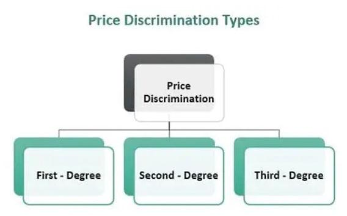

## Table of Contents

## What is price discrimination?

Price discrimination is when a business charges different prices to different customers for the same product or service. This happens because the business wants to make more money by charging more to people who are willing to pay more, and less to people who might not buy if the price is too high. For example, airlines often charge more for last-minute tickets because they know some people will pay more to travel at the last minute.

There are different types of price discrimination. One type is when a business charges different prices based on the age or location of the customer. For example, movie theaters might charge less for children or seniors. Another type is when a business charges different prices based on how much a customer buys. For example, a store might offer a discount if you buy in bulk. Price discrimination can help businesses earn more money, but it can also make some customers feel unfair if they find out they are paying more than others for the same thing.

## What are the basic types of price discrimination?

Price discrimination comes in three main types: first-degree, second-degree, and third-degree. First-degree price discrimination is when a business charges each customer the highest price they are willing to pay. This is hard to do because businesses need to know exactly how much each person will pay, but it can happen in things like auctions or negotiations. Second-degree price discrimination is when a business offers different prices based on how much a customer buys. For example, a store might sell one soda for $1 but a pack of six sodas for $5. This encourages people to buy more to get a better deal.

Third-degree price discrimination is when a business charges different prices to different groups of people. This can be based on things like age, location, or time of purchase. For example, a movie theater might charge less for children and seniors, or a store might have a special sale for students. This type of price discrimination is common because businesses can easily tell which group a customer belongs to. Each type of price discrimination helps businesses make more money by charging different prices to different customers, but it can also make some customers feel treated unfairly if they find out they are paying more than others for the same thing.

## Can you explain first-degree price discrimination with an example?

First-degree price discrimination is when a business charges each customer the highest price they are willing to pay. This means the business tries to get as much money as possible from each person. It's hard to do because the business needs to know exactly how much each person will pay. But it can happen in situations like auctions or when people negotiate prices.

For example, imagine you're at an auction for a rare painting. Everyone at the auction wants the painting, but they all have different amounts of money they're willing to spend. The auctioneer starts the bidding low and people start to bid higher and higher. The person who really wants the painting and has the most money keeps bidding until they win the auction. They end up paying the highest price they were willing to pay, which is first-degree price discrimination. The auctioneer made as much money as possible from that one person.

## How does second-degree price discrimination work?

Second-degree price discrimination is when a business offers different prices based on how much a customer buys. This means the more you buy, the less you pay for each item. It's like getting a discount for buying in bulk. For example, a store might sell one soda for $1, but if you buy a pack of six sodas, you only pay $5. This way, the store encourages people to buy more to get a better deal.

This type of price discrimination helps businesses make more money because people who want to save money will buy more at once. It's common in things like grocery stores, where you can buy a big bag of chips for less than buying several small bags. But it can also make some people feel like they have to buy more than they need just to get the lower price.

## What is an example of third-degree price discrimination?

Third-degree price discrimination is when a business charges different prices to different groups of people. This can be based on things like age, location, or time of purchase. For example, a movie theater might charge less for children and seniors than for adults. They know that kids and older people might not pay as much, so they lower the price to get them to come to the movies.

Another example is when a store has special sales for students. They might offer a discount on certain days or with a student ID. This way, the store can attract more students who might not have a lot of money to spend. It helps the store sell more to a specific group of people by giving them a lower price.

## What are the legal implications of price discrimination?

Price discrimination can be legal or illegal depending on the situation and the laws of the country. In the United States, the Robinson-Patman Act makes it illegal for businesses to give different prices to different buyers if it hurts competition. This law is mainly about protecting small businesses from being treated unfairly by big companies. If a business charges different prices to different customers and it hurts competition, it could be breaking the law.

However, not all price discrimination is illegal. For example, offering discounts to certain groups like students or seniors is usually okay as long as it's not hurting competition. Also, businesses can charge different prices based on how much a customer buys, like giving a discount for buying in bulk. The key is that the price discrimination should not harm competition or unfairly disadvantage certain buyers. If a business is unsure, it's a good idea to talk to a lawyer to make sure they are following the law.

## How do companies implement price discrimination strategies?

Companies use different ways to charge different prices to different people. They might use special computer programs to figure out how much each person is willing to pay. For example, airlines use these programs to change ticket prices based on when people buy them and how many seats are left on the plane. They charge more for last-minute tickets because they know some people will pay more to travel at the last minute. Companies also use things like loyalty programs or special sales to offer different prices to different groups of people. For example, a store might have a special sale for students to get them to buy more.

Another way companies do this is by offering different prices based on how much someone buys. For example, a store might sell one soda for $1 but a pack of six sodas for $5. This encourages people to buy more to get a better deal. Companies also use information about their customers, like their age or where they live, to charge different prices. For example, a movie theater might charge less for children and seniors because they know these groups might not pay as much. By using these strategies, companies can make more money by charging different prices to different people.

## What are the economic effects of price discrimination on consumers and producers?

Price discrimination can affect consumers in different ways. For some people, it can be good because they might get lower prices. For example, students or seniors might pay less for things like movie tickets or bus rides. But for others, it can be bad because they might have to pay more than others for the same thing. If people find out they are paying more, they might feel it's not fair. Also, price discrimination can make some people buy more than they need just to get a discount, like buying a big pack of soda to save money.

For producers, price discrimination can help them make more money. By charging different prices to different people, they can get more money from people who are willing to pay more, and still sell to people who can only pay less. This can help them sell more and make bigger profits. But it can also be hard to do because they need to know a lot about their customers and be careful not to break any laws. If they do it right, it can help them do better in the market, but if they do it wrong, it can hurt their business and make people not want to buy from them.

## How can technology enhance the effectiveness of price discrimination?

Technology helps companies do price discrimination better by using special computer programs. These programs can look at a lot of information about customers, like what they buy, when they buy it, and how much they are willing to pay. For example, airlines use these programs to change ticket prices based on when people buy them and how many seats are left on the plane. They can charge more for last-minute tickets because they know some people will pay more to travel at the last minute. This helps airlines make more money by charging different prices to different people.

Technology also makes it easier for companies to keep track of their customers and offer them different prices. For example, online stores can use cookies to remember what you looked at and offer you special deals. They might show you a higher price if they think you are willing to pay more, or a lower price if they want to get you to buy something. This way, companies can make more money by charging different prices to different people, and it's all done quickly and easily with technology.

## What are the ethical considerations surrounding price discrimination?

Price discrimination can make some people feel it's not fair. When companies charge different prices to different people for the same thing, some customers might feel they are being treated badly. For example, if someone finds out they paid more for a plane ticket than someone else sitting next to them, they might feel angry. This can make people lose trust in the company and not want to buy from them again. It's important for companies to think about how their pricing can affect how people feel about them.

On the other hand, price discrimination can also help some people. For example, giving discounts to students or seniors can make things more affordable for them. This can be good because it helps people who might not have a lot of money to spend. But companies need to be careful and make sure they are not hurting competition or breaking any laws. They should think about the good and bad effects of their pricing and try to be fair to everyone.

## How do different market structures influence the application of price discrimination?

Different market structures can change how companies use price discrimination. In a monopoly, where one company controls the whole market, it's easier for the company to charge different prices to different people. They can do this because they don't have to worry about other companies trying to take their customers away. For example, a utility company might charge different rates to different customers based on how much electricity they use. In a competitive market, where many companies are selling the same thing, it's harder to use price discrimination. Companies have to be careful because if they charge too much, customers might go to another company. But they can still use it by offering special deals to certain groups of people, like students or seniors.

In an oligopoly, where a few big companies control the market, price discrimination can be tricky. These companies watch each other closely and might copy each other's pricing strategies. If one company starts charging different prices to different people, the others might do the same. This can lead to a situation where all the companies are using price discrimination, but they have to be careful not to start a price war. In a monopolistic competition, where many companies sell similar but not identical products, companies can use price discrimination to stand out. They might offer different prices to different groups of people to attract more customers and make more money. But they still have to think about how their competitors might react.

## What advanced models or theories exist for optimizing price discrimination strategies?

There are some smart ways companies can use to make their price discrimination better. One way is called "dynamic pricing." This means changing prices based on what's happening right now, like how many people want to buy something or how much they are willing to pay. For example, ride-sharing apps like Uber use dynamic pricing to charge more when a lot of people need rides, like during a big event or bad weather. Another way is called "segmentation analysis." This means looking at different groups of customers and figuring out how much each group is willing to pay. Companies can use this information to charge different prices to different groups, like giving discounts to students or charging more to last-minute buyers.

Another model is called "yield management," which is often used by airlines and hotels. This model helps companies make the most money by changing prices based on how many seats or rooms are left and how close it is to the time of the flight or stay. For example, an airline might charge more for a ticket as the flight gets closer because they know some people will pay more to travel at the last minute. These models help companies make more money by charging different prices to different people, but they need to use a lot of information and special computer programs to do it right.

## References & Further Reading

[1]: Bergstra, J., Bardenet, R., Bengio, Y., & Kégl, B. (2011). ["Algorithms for Hyper-Parameter Optimization."](https://papers.nips.cc/paper/4443-algorithms-for-hyper-parameter-optimization) Advances in Neural Information Processing Systems 24.

[2]: ["Advances in Financial Machine Learning"](https://www.amazon.com/Advances-Financial-Machine-Learning-Marcos/dp/1119482089) by Marcos Lopez de Prado

[3]: ["Evidence-Based Technical Analysis: Applying the Scientific Method and Statistical Inference to Trading Signals"](https://www.amazon.com/Evidence-Based-Technical-Analysis-Scientific-Statistical/dp/0470008741) by David Aronson

[4]: ["Machine Learning for Algorithmic Trading"](https://github.com/PacktPublishing/Machine-Learning-for-Algorithmic-Trading-Second-Edition) by Stefan Jansen

[5]: ["Quantitative Trading: How to Build Your Own Algorithmic Trading Business"](https://books.google.com/books/about/Quantitative_Trading.html?id=j70yEAAAQBAJ) by Ernest P. Chan