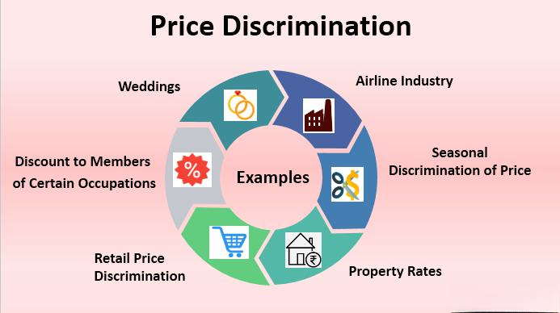

In the evolving world of economics and financial markets, understanding pricing strategies is crucial for businesses and traders. Pricing strategies not only determine the profitability of companies but also influence market dynamics and consumer behavior. This article explores how economic models, price discrimination, and algorithmic trading interact and influence enterprises and markets. These concepts form the backbone of informed decision-making in both the corporate and trading environments.

Economic models serve as essential tools in unraveling complex economic phenomena by simplifying and elucidating real-world interactions. They provide frameworks for analyzing market trends and consumer behaviors, thereby aiding in strategic planning and policy assessment. Price discrimination, on the other hand, enables businesses to tailor their pricing schemes to different consumer segments, optimizing revenue through targeted pricing tactics. Algorithmic trading employs advanced algorithms to swiftly analyze data and execute trades with precision, thereby enhancing market efficiency and liquidity.



Whether you're a business owner, trader, or economics enthusiast, comprehensive knowledge of these topics is essential. Understanding how these elements interconnect contributes to more effective decision-making, fosters innovation in product offerings, and enhances competitive advantage. Join us as we break down these complex yet integral components of modern economics, equipping you with the insights necessary to navigate the challenges and opportunities in today's dynamic economic landscape. By embracing these strategies, companies and individuals can better position themselves for success in an ever-evolving market environment.

## Table of Contents

## Understanding Economic Models

Economic models are fundamental tools used in economics to abstractly represent complex real-world processes. By creating simplified versions of these processes, economists can analyze and predict how economic agents behave and how markets operate. These models play an integral role in analyzing market trends, consumer behavior, and the impact of policy changes. 

One of the most well-known types of economic model is the supply and demand model. This model illustrates how the quantity of a good supplied by producers and the quantity demanded by consumers depend on the good's price. The interaction between supply and demand determines the market equilibrium, which is the price at which the quantity supplied equals the quantity demanded.

Another important concept is market equilibrium, which occurs when there is no tendency for change because supply and demand are in balance. In graphical terms, the equilibrium point is where the supply and demand curves intersect. Changes in factors such as consumer preferences, income levels, and production costs can shift these curves, leading to a new equilibrium.

Cost-benefit analysis is a crucial type of economic model used to assess the economic efficiency of different options by comparing their costs and benefits. This model aids in decision-making processes by evaluating the trade-offs involved, allowing businesses and policymakers to choose options that maximize net benefits.

Businesses leverage economic models to make informed decisions and optimize their pricing strategies by understanding how different factors impact the market. For instance, cost-benefit analyses help businesses evaluate new projects or investments by weighing potential benefits against associated costs. Supply and demand models enable pricing strategies that align with market conditions, helping businesses maximize profits or capture market share.

Real-world examples demonstrate how economic models impact economic forecasting and decision-making. For example, during the COVID-19 pandemic, governments and businesses relied on economic models to forecast the potential impacts of lockdowns and other measures on economies. Models predicting shifts in consumer demand and supply chain disruptions played a crucial role in strategizing responses to the crisis.

In summary, economic models are indispensable tools that provide clarity and predictive power, helping stakeholders make decisions that can lead to favorable economic outcomes. By distilling complex economic dynamics into understandable concepts, these models offer valuable insights that inform both strategic planning and policy formulation.

## Price Discrimination Strategies

Price discrimination is a pricing strategy where businesses charge varying prices to different consumers for the same product or service. This strategy allows companies to maximize profits by capturing consumer surplus and catering effectively to diverse market segments. Price discrimination can be classified into three main types: first-degree, second-degree, and third-degree discrimination.

First-degree price discrimination, also known as perfect price discrimination, involves charging each consumer the maximum price they are willing to pay. This approach aims to capture all available consumer surplus. While theoretically compelling, it is challenging to implement due to difficulties in accurately determining each consumer's willingness to pay.

Second-degree price discrimination relies on offering different pricing structures based on the quantity consumed or product version. Volume discounts, bulk pricing, and versioning strategies fall under this category. For instance, utility companies often use tiered pricing structures, where the price per unit decreases as consumption increases.

Third-degree price discrimination involves segmenting consumers into distinct groups based on identifiable characteristics, such as age or location, and charging each group a different price. Common examples include student discounts, senior citizen discounts, and geographic pricing variations.

Businesses adopt price discrimination strategies to maximize profits by capturing additional consumer surplus that would otherwise remain untapped. This is achieved by tailoring prices to segments with varying price elasticities. For example, airlines commonly use third-degree price discrimination, offering different fares based on booking time, class, and refundability.

Legal and ethical considerations are crucial in the application of price discrimination practices. While generally legal, businesses must ensure compliance with anti-discrimination laws and avoid practices that could be deemed exploitative or unfair. Ethically, firms must balance profit maximization with maintaining consumer trust and fairness.

Case studies across industries highlight the effective implementation of price discrimination. In the pharmaceutical industry, companies often practice third-degree price discrimination by offering lower prices for essential drugs in developing countries, balancing accessibility with profitability. Similarly, digital platforms like e-commerce sites use data analytics and consumer profiling to tailor second-degree price discrimination, promoting various discounts and offers to different consumer segments based on their purchasing behavior.

In summary, price discrimination is a potent tool for businesses aiming to optimize their pricing strategies and boost profits. By understanding and implementing the different types of price discrimination while considering legal and ethical implications, firms can effectively cater to diverse consumer needs and enhance their market position.

## The Role of Algorithmic Trading

Algorithmic trading, also known as algo trading, involves the use of complex algorithms and mathematical models to automate trading decisions in financial markets. This modern trading strategy leverages technology to enhance speed, accuracy, and efficiency, allowing traders and institutions to process vast amounts of data and execute trades significantly faster than human traders.

### Data Processing and Trade Execution

At the heart of [algorithmic trading](/wiki/algorithmic-trading) is the ability to analyze and react to market data in real time. Algorithms can sift through large volumes of market information, identify patterns, and make calculated trading decisions within milliseconds. This capability is particularly beneficial in high-frequency trading, where even a fraction of a second can determine the profitability of a trade.

Python, a widely-used programming language, is frequently employed for developing trading algorithms due to its rich libraries and tools for data analysis and [machine learning](/wiki/machine-learning). A simple Python snippet for executing a trade based on moving average crossover might look like this:

```python
import pandas as pd

def moving_average_strategy(prices, short_window=40, long_window=100):
    signals = pd.DataFrame(index=prices.index)
    signals['price'] = prices
    signals['short_mavg'] = prices.rolling(window=short_window, min_periods=1).mean()
    signals['long_mavg'] = prices.rolling(window=long_window, min_periods=1).mean()
    signals['signal'] = 0.0
    signals['signal'][short_window:] = np.where(signals['short_mavg'][short_window:] > signals['long_mavg'][short_window:], 1.0, 0.0)
    signals['positions'] = signals['signal'].diff()

    return signals
```

### Types of Trading Algorithms

Several types of algorithmic strategies are prevalent in the financial industry:

1. **Trend-Following Algorithms**: These algorithms capitalize on market trends. They typically utilize technical indicators like moving averages to identify entry and exit points, as illustrated in the above example.

2. **Mean-Reversion Algorithms**: These strategies are based on the principle that asset prices will revert to their historical mean over time. Mean-reversion algorithms look for price dips or peaks, betting that the price will return to its average.

3. **Arbitrage Algorithms**: Arbitrage strategies exploit price discrepancies of an asset across different markets or forms. Algorithms quickly identify arbitrage opportunities and execute trades to profit from the price differences.

### Benefits and Challenges

Algorithmic trading offers numerous advantages, notably increased efficiency and improved market [liquidity](/wiki/liquidity-risk-premium). Algorithms can execute trades at optimal prices, reduce transaction costs, and eliminate human errors involved in manual trading.

However, algo trading also presents challenges. The high speed of trades can lead to significant market [volatility](/wiki/volatility-trading-strategies), sometimes causing flash crashes where asset prices plummet and recover within minutes. Furthermore, the complexity of algorithms can lead to unforeseen outcomes if not carefully monitored and continuously updated.

### Regulatory Environment

Due to its potential impact on market stability, algorithmic trading is subject to stringent regulatory scrutiny. Regulators worldwide, including the U.S. Securities and Exchange Commission (SEC) and the European Securities and Markets Authority (ESMA), have established guidelines to manage risks associated with algo trading. These regulations often require robust risk management systems, testing of algorithms before deployment, and transparent reporting practices.

Algorithmic trading has undeniably transformed modern financial markets by offering increased efficiency and precision. While the rapid execution and data-driven decision-making that algorithms provide are beneficial, the associated risks and regulatory demands necessitate a balanced and well-managed approach to their implementation.

## Integrating Economic Models with Pricing and Trading Strategies

The integration of economic models, pricing strategies, and algorithmic trading represents a sophisticated approach that is increasingly relevant in today’s data-driven markets. These elements, when effectively combined, can provide businesses and traders with a powerful framework for optimizing their pricing and trading operations.

Businesses and traders can utilize economic models to identify and anticipate market trends. These models, such as those based on supply and demand or market equilibrium, provide invaluable data that can be used to shape pricing strategies. A company can analyze these models to adjust prices dynamically in response to shifting market conditions, ensuring competitiveness while maximizing profitability.

Algorithmic trading further enhances this integration by employing algorithms to process large datasets, thus enabling quick and precise trading decisions. By incorporating data from economic models, these trading algorithms can be calibrated to respond to market changes more effectively. For example, an algorithm designed to execute trades based on mean-reversion strategies might adjust its parameters in real-time through economic indicators, thereby improving the success rate of trades.

Recent advancements in machine learning and [artificial intelligence](/wiki/ai-artificial-intelligence) (AI) have further expanded the potential uses of economic and trading models. Machine learning algorithms can be trained on historical data to uncover complex patterns and correlations that traditional methods might miss. For instance, neural networks can predict price movements based on inputs from various economic models, allowing for highly informed trading strategies. Python's libraries such as TensorFlow and scikit-learn are particularly useful for developing and fine-tuning these machine learning models.

```python
from sklearn.model_selection import train_test_split
from sklearn.ensemble import RandomForestRegressor
import pandas as pd

# Assume df is a DataFrame containing relevant economic data
X = df.drop('future_price', axis=1)
y = df['future_price']

# Split the data
X_train, X_test, y_train, y_test = train_test_split(X, y, test_size=0.2, random_state=42)

# Train a machine learning model
model = RandomForestRegressor(n_estimators=100, random_state=42)
model.fit(X_train, y_train)

# Predict future prices
predictions = model.predict(X_test)
```

Future trends in integrating these strategies point towards even more seamless integration of AI and economic models within trading systems. The evolution of big data analytics and cloud computing further supports this trend, enabling the processing of vast quantities of data more efficiently. Innovations such as quantum computing and blockchain technology are also anticipated to influence the scalability and security of trading operations.

As these technologies advance, businesses and traders must remain adaptable, continuously refining their strategies to maintain a competitive edge. Understanding how to synchronize economic models with pricing strategies and algorithmic trading will remain crucial for capitalizing on opportunities in an ever-evolving financial landscape.

## Conclusion

Economic models, price discrimination, and algorithmic trading serve as formidable instruments for organizations that seek to thrive amid the competition of today's markets. These tools, when used strategically, facilitate informed decision-making and maximize profitability by allowing businesses and traders to anticipate market behaviors, tailor pricing to diverse consumer segments, and execute trades with unparalleled precision.

Grasping the complexities inherent in these components can provide a critical advantage. Economic models simplify the vast intricacies of real-world markets, offering forecasts and frameworks that inform pricing strategies. By understanding how price discrimination can segment markets and enhance revenues, enterprises are better equipped to serve different consumer segments, increasing their market share. Algorithmic trading, on the other hand, brings speed and accuracy to trading activities, improving efficiency and liquidity in financial markets, while also posing challenges due to potential market volatility.

As economic and trading landscapes continue to evolve, the importance of remaining informed and adaptive cannot be overstated. Markets are ever-changing, influenced by technological innovations, geopolitical shifts, and changes in consumer behavior. Staying abreast of these changes ensures that companies and individuals are armed with the latest strategies and insights, positioning them for success.

By embracing economic models, price discrimination, and algorithmic trading, companies and traders are better equipped to navigate complexities and leverage opportunities in today's dynamic economic environment. These strategies empower organizations to respond proactively to challenges, capitalizing on strengths and recognizing opportunities for growth. The integration of these tools not only enhances competitive advantage but also ensures organizations are well-prepared for the continuous evolution of markets.

## References & Further Reading

[1]: Bergstra, J., Bardenet, R., Bengio, Y., & Kégl, B. (2011). ["Algorithms for Hyper-Parameter Optimization."](https://papers.nips.cc/paper/4443-algorithms-for-hyper-parameter-optimization) Advances in Neural Information Processing Systems 24.

[2]: ["Advances in Financial Machine Learning"](https://www.amazon.com/Advances-Financial-Machine-Learning-Marcos/dp/1119482089) by Marcos Lopez de Prado

[3]: ["Evidence-Based Technical Analysis: Applying the Scientific Method and Statistical Inference to Trading Signals"](https://www.amazon.com/Evidence-Based-Technical-Analysis-Scientific-Statistical/dp/0470008741) by David Aronson

[4]: ["Machine Learning for Algorithmic Trading"](https://github.com/PacktPublishing/Machine-Learning-for-Algorithmic-Trading-Second-Edition) by Stefan Jansen

[5]: ["Quantitative Trading: How to Build Your Own Algorithmic Trading Business"](https://books.google.com/books/about/Quantitative_Trading.html?id=j70yEAAAQBAJ) by Ernest P. Chan