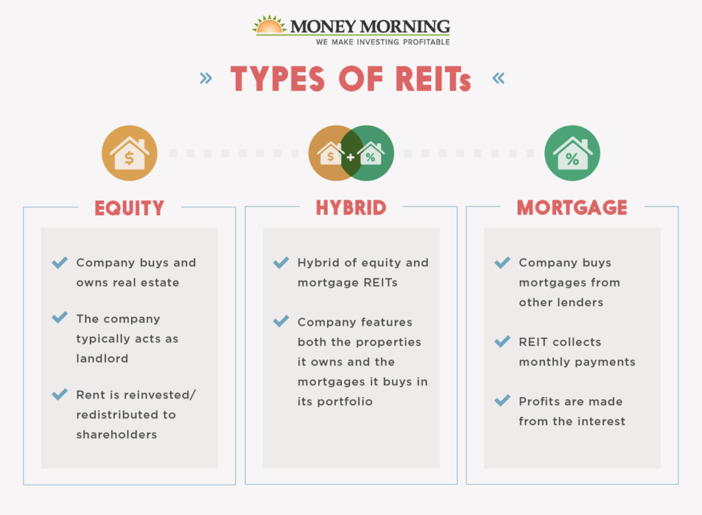

## Table of Contents

## What is a REIT and how does it work?

A REIT, or Real Estate Investment Trust, is a company that owns, operates, or finances income-generating real estate. It's like a mutual fund for real estate, allowing people to invest in properties without having to buy, manage, or finance them directly. REITs can own different types of properties, like apartments, shopping centers, offices, or hotels. By investing in a REIT, you can earn a share of the income produced through real estate without having to deal with the hassles of being a landlord.

REITs work by pooling money from many investors to buy and manage properties. They are required by law to pay out at least 90% of their taxable income as dividends to shareholders each year. This makes them attractive to investors looking for regular income. The value of a REIT can go up or down based on how well the properties are doing and what's happening in the real estate market. So, while REITs can offer good returns and income, they also come with risks, just like any other investment.

## What are the different types of REITs?

There are three main types of REITs: equity, mortgage, and hybrid. Equity REITs own and operate income-generating real estate. They make money by renting out the properties they own, like apartments, shopping centers, or office buildings. The rent they collect is then paid out to investors as dividends. This is the most common type of REIT and is what most people think of when they hear about REITs.

Mortgage REITs, on the other hand, don't own physical properties. Instead, they invest in mortgages or mortgage-backed securities. They make money from the interest on these loans. This type of REIT can be riskier because it depends a lot on interest rates and the health of the mortgage market. Hybrid REITs are a mix of both equity and mortgage REITs. They own properties and also invest in mortgages, trying to balance the benefits and risks of both types.

Each type of REIT has its own way of making money and its own level of risk. Equity REITs are usually seen as more stable because they rely on rental income, while mortgage REITs can be more volatile due to changes in interest rates. Hybrid REITs try to find a middle ground, but they still [carry](/wiki/carry-trading) risks from both sides. When choosing a REIT to invest in, it's important to understand these differences and how they might affect your investment.

## What is an equity REIT and what are its characteristics?

An equity REIT is a type of Real Estate Investment Trust that owns and manages properties like apartments, shopping centers, office buildings, and hotels. These properties are leased out to tenants, and the rent collected from these tenants becomes the main source of income for the equity REIT. This income is then paid out to investors as dividends, making equity REITs a popular choice for people looking for regular income from their investments.

Equity REITs are generally seen as more stable than other types of REITs because their income comes from rental payments, which are usually more predictable than interest rates or mortgage markets. However, the value of an equity REIT can still go up or down based on how well the properties are doing and what's happening in the real estate market. For example, if a shopping center owned by an equity REIT has a lot of empty stores, the income from that property might go down, which could affect the dividends paid to investors.

## What is a mortgage REIT and how does it differ from an equity REIT?

A mortgage REIT is a type of Real Estate Investment Trust that doesn't own physical properties like apartments or shopping centers. Instead, it invests in mortgages or mortgage-backed securities. These are loans that people take out to buy homes or other properties. The mortgage REIT makes money from the interest that borrowers pay on these loans. This type of REIT can be riskier because its income depends a lot on interest rates and how well people are paying back their loans.

The main difference between a mortgage REIT and an equity REIT is how they make money. An equity REIT owns actual buildings and earns money by renting them out to tenants. The rent they collect is then paid out to investors as dividends. On the other hand, a mortgage REIT earns money from the interest on loans, not from renting out properties. Because of this, equity REITs are usually seen as more stable since rental income is more predictable, while mortgage REITs can be more volatile due to changes in interest rates and the health of the mortgage market.

## What is a hybrid REIT and what advantages does it offer?

A hybrid REIT is a mix of both equity and mortgage REITs. It owns some real estate properties, like apartments or shopping centers, and also invests in mortgages or mortgage-backed securities. This means it makes money from both renting out properties and from the interest on loans. By combining these two types of investments, a hybrid REIT tries to balance the benefits and risks of both equity and mortgage REITs.

The main advantage of a hybrid REIT is that it can offer a more balanced investment. Because it earns money in two different ways, it might be less affected by problems in just one part of the real estate market. For example, if interest rates go up and hurt the mortgage part of the business, the rental income from the properties might help make up for it. This can make a hybrid REIT a good choice for investors who want to spread their risk but still get regular income from real estate.

## How can beginners start investing in REITs?

Starting to invest in REITs is pretty easy for beginners. First, you need to open a brokerage account. This is like a bank account but for buying and selling investments. You can do this online with many different companies. Once your account is set up, you can start looking for REITs to buy. You can find them listed on stock exchanges, just like regular stocks. It's a good idea to do some research first to find REITs that fit your goals and how much risk you're okay with.

After you've picked a REIT, you can buy shares through your brokerage account. Just like buying a stock, you'll enter how many shares you want and place your order. Once you own the shares, you'll start getting dividends, which are payments from the REIT's income. These dividends can be a nice way to earn some regular money from your investment. Remember, though, that the value of your REIT shares can go up or down, so it's important to keep an eye on your investment and maybe talk to a financial advisor if you're not sure about anything.

## What are the key factors to consider when choosing a REIT for investment?

When choosing a REIT to invest in, it's important to look at the type of properties the REIT owns. Some REITs focus on apartments, others on shopping centers, office buildings, or hotels. Each type of property can be affected differently by the economy. For example, if a lot of people are moving to a city, apartment REITs might do well. But if people are shopping online more, shopping center REITs might struggle. So, think about what kinds of properties you believe will do well in the future.

Another key [factor](/wiki/factor-investing) is the financial health of the REIT. You want to check if the REIT is making enough money to pay its bills and still give you dividends. Look at things like the REIT's funds from operations (FFO), which is a bit like profit but more specific to real estate. Also, see how much debt the REIT has. Too much debt can be risky, especially if interest rates go up. Finally, consider the management team. A good team can make smart decisions that help the REIT grow and keep paying dividends.

Lastly, think about the dividend yield and the REIT's history of paying dividends. The dividend yield tells you how much money you'll get back each year compared to what you paid for the shares. A high yield can be good, but be careful because sometimes a high yield can mean the REIT is in trouble. Also, look at how long the REIT has been paying dividends and if it has raised them over time. A REIT that has a good track record of paying and increasing dividends might be a safer bet for your investment.

## How do REITs fit into a diversified investment portfolio?

REITs can be a great addition to a diversified investment portfolio because they offer a way to invest in real estate without buying property directly. When you add REITs to your portfolio, you're spreading your money across different types of investments, which can help lower your risk. If the stock market goes down, your REITs might still do well because they depend on rental income or interest from loans, not just stock prices. This can help balance out your overall investment returns.

Another reason to include REITs in your portfolio is that they often pay high dividends. This means you can get regular income from your investment, which can be really helpful if you're looking for money to live on or to reinvest. By mixing REITs with other investments like stocks, bonds, and maybe even some cash, you create a more balanced portfolio. This way, you're not putting all your eggs in one basket, and you can enjoy the benefits of real estate without the hassle of being a landlord.

## What are the tax implications of investing in REITs?

When you invest in REITs, you need to know about the taxes. REITs don't pay corporate income tax as long as they give at least 90% of their taxable income to shareholders as dividends. This is good for the REIT, but it means you have to pay taxes on the dividends you get. The tax rate on these dividends can be different depending on your income and the type of dividends. Some dividends are taxed as regular income, and some might be taxed at a lower rate if they are qualified dividends.

Another thing to think about is the tax on capital gains. If you sell your REIT shares for more than you paid for them, you'll have to pay capital gains tax on the profit. How much you pay depends on how long you held the shares. If you held them for less than a year, it's a short-term capital gain, and you'll pay your regular income tax rate. If you held them for more than a year, it's a long-term capital gain, and the tax rate is usually lower. So, when you're thinking about investing in REITs, remember to consider these tax rules to understand how they might affect your returns.

## What advanced strategies can be used to maximize returns from REIT investments?

To maximize returns from REIT investments, one advanced strategy is to focus on sector rotation. This means you keep an eye on different parts of the real estate market and move your money around based on which sectors are doing well. For example, if you think the economy is going to grow, you might put more money into REITs that own office buildings or shopping centers because more people will be working and shopping. But if you think the economy might slow down, you might switch to REITs that own apartments or healthcare facilities, which tend to be more stable. By moving your money around like this, you can try to take advantage of the ups and downs in the real estate market.

Another strategy is to use dividend reinvestment plans (DRIPs). Many REITs offer these plans, which let you automatically use your dividends to buy more shares of the REIT. Over time, this can help your investment grow faster because you're buying more shares without spending extra money. Plus, if the REIT keeps raising its dividends, you'll get even more shares each time. This can really add up and help you maximize your returns in the long run. Just remember, though, that while these strategies can help, they also come with risks, so it's important to do your homework and maybe talk to a financial advisor before you start.

## How do economic cycles affect different types of REITs and what strategies should be employed during these cycles?

Economic cycles can have a big impact on different types of REITs. When the economy is doing well, people have more money to spend, and businesses are growing. This can be good for REITs that own shopping centers, office buildings, and hotels because more people are shopping, working, and traveling. But when the economy slows down, these same REITs might struggle because people are spending less and businesses might not need as much office space. On the other hand, REITs that own apartments or healthcare facilities might do better during a slowdown because people always need a place to live and healthcare services, no matter what the economy is doing.

To make the most of these economic cycles, you can use a strategy called sector rotation. This means you move your money around to different types of REITs based on what's happening in the economy. When you think the economy is going to grow, you might put more money into REITs that own shopping centers or office buildings. But if you think the economy might slow down, you could switch to REITs that own apartments or healthcare facilities. Another strategy is to use dividend reinvestment plans (DRIPs). These plans let you automatically use your dividends to buy more shares of the REIT, which can help your investment grow faster over time. By using these strategies, you can try to get the best returns from your REIT investments no matter what the economy is doing.

## What are the latest trends and future outlook for REITs in the investment market?

The latest trends in the REIT market show a big focus on technology and sustainability. More and more REITs are using technology to make their buildings smarter and more efficient. This includes things like smart thermostats, energy-saving lights, and even apps that let tenants control their space. Sustainability is also a big deal, with many REITs trying to make their buildings more eco-friendly. This can help them save money on energy costs and attract tenants who care about the environment. Another trend is the growth of online shopping, which has changed the way people use shopping centers. Some REITs are turning old malls into places with more than just stores, like adding apartments, offices, or entertainment areas.

Looking to the future, the outlook for REITs seems pretty good, but there are some things to watch out for. As more people work from home, the demand for office space might change, which could affect office REITs. But on the other hand, the need for housing might keep growing, which could be good for apartment REITs. Interest rates are also something to keep an eye on because they can affect how much money REITs can borrow and how much they have to pay back. If interest rates go up, it might be harder for REITs to make money. Overall, REITs can still be a good way to invest in real estate, but it's important to stay informed about these trends and changes in the market.

## References & Further Reading

[1]: National Association of Real Estate Investment Trusts (NAREIT). (n.d.). [Investing in REITs](https://www.reit.com/nareit).

[2]: Geltner, D., Miller, N. G., Clayton, J., & Eichholtz, P. (2013). [Commercial Real Estate Analysis and Investments](https://www.researchgate.net/publication/245702364_Commercial_Real_Estate_Analysis_and_Investments). South-Western Educational Pub.

[3]: Goodman, J., & Gray, A. (2020). ["The Intelligent REIT Investor: How to Build Wealth with Real Estate Investment Trusts"](https://www.amazon.com/Intelligent-REIT-Investor-Wealth-Investment/dp/1119252717). Wiley.

[4]: Lopez de Prado, M. (2018). ["Advances in Financial Machine Learning"](https://www.amazon.com/Advances-Financial-Machine-Learning-Marcos/dp/1119482089). Wiley.

[5]: Chan, E. (2013). ["Algorithmic Trading: Winning Strategies and Their Rationale"](https://github.com/ftvision/quant_trading_echan_book). Wiley.

[6]: Jansen, S. (2020). ["Machine Learning for Algorithmic Trading: Predictive Models to Transform the Financial Markets"](https://github.com/stefan-jansen/machine-learning-for-trading). Packt Publishing.