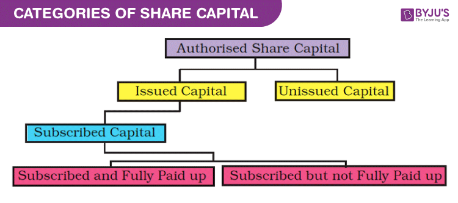

In the landscape of corporate finance, share capital represents one of the most crucial elements in the foundation of a company's financial structure. Share capital refers to the funds raised by a company through the issuance of shares of stock, which signifies ownership in the company. This capital is fundamental for funding business operations, enabling companies to undertake projects, acquire assets, or invest in research and development. The importance of share capital is underscored by its direct connection to a company's ability to expand, innovate, and compete effectively in the marketplace. Shareholders, who own these shares, provide the financial backing that a company requires while also bearing the associated risks and participating in potential rewards.

Algorithmic trading, an indispensable component of modern financial markets, refers to the use of complex algorithms to automate trading decisions. This technology has transformed the trading landscape, allowing for high-speed trade execution and enabling the processing of vast amounts of data to identify profitable opportunities. The significance of algorithmic trading lies in its ability to enhance market efficiency, provide liquidity, and reduce transaction costs. Traders can employ a variety of strategies including statistical arbitrage, market making, and momentum trading, each leveraging sophisticated algorithms to achieve optimal returns. Furthermore, algorithmic trading plays a vital role in managing share capital more effectively by integrating advanced analytics and machine learning to optimize investment decisions.



In summary, understanding the dynamics of share capital is essential for comprehending how businesses fund their operations and drive growth. Simultaneously, algorithmic trading represents a critical advancement in financial technology, offering a significant edge in the execution and management of trading activities. Together, these components underscore the evolving landscape of corporate finance, where traditional practices meet cutting-edge technology to shape future financial strategies.

## Table of Contents

## Understanding Share Capital

Share capital is a critical element of a company's financial structure, representing the funds a company raises in exchange for issuing ownership stakes in the form of shares. It is a component of a company's equity, appearing on the balance sheet, and plays a vital role in financing business operations, enabling growth, and providing a cushion against adverse economic conditions. Share capital offers shareholders partial ownership of the company and entitles them to a portion of the company's profits, usually in the form of dividends.

Share capital can be categorized into two main types: authorized share capital and issued share capital. These terms describe the company's capacity to issue shares and the actual shares it has sold to investors.

**Authorized Share Capital**

Authorized share capital, sometimes known as nominal or registered capital, refers to the maximum amount of share capital that a company is permitted to issue to shareholders as stated in its constitutional documents. Authorized share capital provides the company with flexibility in managing capital needs without frequent amendments to its articles of incorporation. For example, if a company has an authorized share capital of 1 million shares but requires additional funding, it might only issue 500,000 shares, leaving room to issue more when necessary.

Companies set authorized share capital to outline the upper limit of shares they might wish to distribute in the future, preparing for potential expansion or investment opportunities. However, it is important to note that authorized share capital does not reflect the actual number of shares a company has issued.

**Issued Share Capital**

Issued share capital, in contrast, represents the actual number of shares that a company has sold to shareholders. This figure includes both shares distributed to the public and those assigned to insiders and company executives. Issued share capital reflects the funds the company has raised through share issuance and is crucial in determining shareholder equity.

For example, a company with an authorized share capital of 1 million shares might issue only 600,000 shares to meet its current capital needs. These issued shares constitute the issued share capital, and any capital raised from their sale is used for business operations, expansion, and other financial strategies.

The distinction between authorized and issued share capital is significant because while authorized share capital indicates a company's potential to raise funds through equity, issued share capital shows the actual shareholding structure and the financial resources obtained from shareholders. An understanding of both concepts aids in assessing a company's financial strategies, its flexibility in capital markets, and the extent of ownership dilution among shareholders.

## Types of Share Capital

Share capital represents the funds raised by a company in exchange for issuing shares of ownership in the business. It forms the core of a company's financial structure and can be broadly categorized into two main types: common stock and preferred stock. Understanding the differences between these types of share capital is crucial for investors and corporate managers. 

### Common Stock

Common stock is the most prevalent form of share capital. Shareholders of common stock typically [carry](/wiki/carry-trading) voting rights, which allow them to participate in major corporate decisions, such as electing the board of directors. The ownership of common stock offers the potential for capital appreciation and dividends, although dividends are not guaranteed. Companies may choose to reinvest profits for further growth rather than distribute them to shareholders.

In terms of claim on assets, common stockholders are the last to receive any residual interest in the event of liquidation. That is, after all debts and obligations to creditors and preferred stockholders are fulfilled, any remaining assets are distributed among common stockholders. Due to this subordinate position, common stock is considered riskier than preferred stock.

### Preferred Stock

Preferred stock, while less common than common stock, serves as an appealing option for investors seeking more predictable income streams. Preferred shareholders receive dividends that are generally fixed and paid out before any dividends are paid to common shareholders. This feature offers a higher level of dividend assurance compared to common stock.

Preferred stock typically does not carry voting rights, which means preferred shareholders have limited influence over corporate governance decisions. However, some preferred shares come with special voting privileges, particularly when dividends are in arrears. In the hierarchy of claims on assets, preferred shareholders are prioritized over common shareholders but are subordinate to debt holders.

Preferred stock can be further categorized into different types, such as cumulative and non-cumulative preferred stock. Cumulative preferred stock ensures that if a company is unable to pay dividends in a given period, the missed dividends accumulate and must be paid out before any dividends can be paid to common shareholders. On the other hand, non-cumulative preferred stock forgoes any missed dividends, meaning shareholders cannot claim arrears in future periods.

### Comparison of Voting Rights, Dividend Preferences, and Claim on Assets

The comparison between common and preferred stock can be summarized in the following table:

| Feature                  | Common Stock                      | Preferred Stock                    |
|--------------------------|-----------------------------------|------------------------------------|
| **Voting Rights**        | Typically have voting rights      | Generally do not have voting rights|
| **Dividend Preferences** | Dividends are variable and not guaranteed | Fixed dividends paid before common stock dividends |
| **Claim on Assets**      | Last claim in event of liquidation| Priority over common stockholders  |

Investors consider these attributes when deciding between common and preferred stocks based on their individual risk tolerance and investment goals. Those seeking stability and priority in dividends might prefer preferred stock, while those interested in potential capital gains and involvement in corporate governance might opt for common stock. Understanding these distinctions is key to making informed investment decisions and managing corporate financial structures effectively.

## Methods of Raising Share Capital

Share capital represents an essential source of funding for businesses, and companies can raise share capital through various methods. The most common approaches to raising share capital are public offerings, private placements, and rights issues. Each method has distinct advantages and disadvantages, dependent on factors such as the company's objectives, market conditions, and investor appetite.

### Public Offerings

Public offerings, often known as initial public offerings (IPOs) when a company sells shares to the public for the first time, allow companies to raise substantial capital by selling equity to the general public in the stock market. A company conducts an IPO to improve capital for growth and expansion. Once public, the company’s shares are traded on a stock exchange, making them more liquid.

**Pros:**
- **Access to Capital:** Public offerings can raise significant amounts of capital. Facebook's IPO in 2012, for instance, raised approximately $16 billion USD.
- **Increased Visibility and Credibility:** Being publicly traded can enhance a company's reputation and visibility, potentially leading to increased market share and credibility.
- **Stock Options:** Public companies can offer stock options to employees, aligning their interests with company growth.

**Cons:**
- **Costs and Regulations:** The process can be expensive and time-consuming due to underwriting fees and legal obligations. Companies must comply with strict regulatory requirements, such as those enforced by the SEC (Securities and Exchange Commission) in the United States.
- **Loss of Control:** Existing shareholders might experience dilution of control as new shareholders come on board.
- **Market Pressure:** Being publicly traded subjects a company to short-term market pressures and the expectation to meet quarterly earnings forecasts, potentially shifting focus from long-term strategies.

### Private Placements

Private placements involve selling shares to a select group of investors rather than the general public. These investors typically include institutional investors, such as investment banks, mutual funds, insurance companies, and private equity firms.

**Pros:**
- **Faster and Less Expensive:** Private placements can be arranged more quickly and with lower costs than public offerings because they involve fewer regulatory requirements.
- **Flexibility:** These placements offer flexibility in terms of structuring the investment deal, and companies can negotiate terms directly with investors.
- **Confidentiality:** Transactions can often remain private, which is beneficial for companies that do not want their financial conditions publicly scrutinized.

**Cons:**
- **Limited Capital:** While private placements can raise substantial sums, they are generally less public offerings.
- **Investor Expectations:** Institutional investors often demand significant influence over the company through board seats or protective covenants.

### Rights Issues

Rights issues provide existing shareholders the opportunity to purchase additional shares at a discounted price before the company offers the shares to the public.

**Pros:**
- **Shareholder Loyalty:** Rights issues can help maintain shareholder loyalty by offering them a chance to avoid dilution of their current shareholding.
- **Existing Relationships:** Companies can leverage existing relationships with shareholders, potentially simplifying the process.

**Cons:**
- **Under-subscription Risk:** There is a risk of under-subscription if shareholders do not wish to purchase additional shares, especially in unfavorable market conditions.
- **Dilution:** While existing shareholders can avoid dilution by participating, those who do not participate may see their ownership percentage reduced.

Recent examples include Tesla's numerous capital raise exercises through public offerings in recent years to fund its rapid expansion, contrasting with smaller tech startups that often resort to private placements to bring in venture capital and strategic investors. Meanwhile, rights issues remain popular among established corporations looking to shore up balance sheets in turbulent economic times, notably during financial downturns.

## The Impact of Share Capital on Financial Statements

Share capital is a crucial component of a company's financial statements, specifically impacting the balance sheet, income statement, and cash flow statement. Understanding how it affects each of these statements is essential for assessing a company's financial health and stability.

### Impact on the Balance Sheet

Share capital appears on the balance sheet as part of shareholders' equity, reflecting the amount of money that shareholders have invested through the purchase of shares. It is typically divided into two categories:

1. **Authorized Share Capital**: The maximum amount of share capital that the company can issue, as authorized by its corporate charter.
2. **Issued Share Capital**: The portion of authorized capital that has been issued to shareholders.

The structure of the equity section of the balance sheet is defined by the formula:

$$
\text{Shareholders' Equity} = \text{Share Capital} + \text{Retained Earnings} + \text{Additional Paid-In Capital} - \text{Treasury Stock}
$$

Share capital provides insight into the company's base of equity funding, which is used for various corporate needs, such as expansion or debt repayment. A robust equity base can positively influence a company's leverage ratios, making it more financially stable and potentially more attractive to investors.

### Impact on the Income Statement

Although share capital itself does not directly appear on the income statement, it can influence income through its impact on ownership structure and dividend policies. Companies with significant share capital often have a larger shareholder base, leading to dividend distributions that can affect retained earnings. Retained earnings, in turn, are an important component of shareholders' equity on the balance sheet and can impact net income when reinvested successfully in the business.

### Impact on the Cash Flow Statement

The cash flow statement outlines cash transactions not reflected in the income statement. Share capital affects it primarily through financing activities, which involve raising capital through issuing shares:

- **Cash Inflows from Issuing Shares**: When a company issues new shares, it records cash inflows under financing activities.
- **Cash Outflows from Dividends**: If the company decides to pay dividends out of the profits generated, these payments are reflected as cash outflows in the financing section.

Managing share capital effectively impacts the company's ability to generate positive cash flows, ensuring sufficient [liquidity](/wiki/liquidity-risk-premium) to meet operational and strategic needs.

### Relationship between Share Capital and Financial Stability

A company's financial stability is closely tied to its share capital structure. A well-capitalized corporation with a balanced mix of debt and equity has a stronger financial foundation, reducing risks associated with high leverage. By issuing shares, companies can minimize dependence on debt financing, which can improve credit ratings and lower the cost of borrowing.

In summary, share capital plays a vital role in shaping a company's financial statements, influencing its financial structure, operational capacity, and stability. Efficient management of share capital can lead to improved financial metrics, enhanced market confidence, and better capital allocation strategies, all of which are critical for long-term growth and sustainability.

## Role of Algorithmic Trading in Corporate Finance

Algorithmic trading plays a crucial role in optimizing the management of share capital by using complex mathematical models and algorithms to make high-speed trading decisions. It can analyze massive datasets, identify trading opportunities, execute trades, and manage risks more effectively than traditional methods. Algorithmic trading helps companies and investors maximize returns on their share investments by minimizing transaction costs, improving the accuracy of market predictions, and managing liquidity.

One of the primary ways [algorithmic trading](/wiki/algorithmic-trading) can optimize share capital management is by implementing strategies that capitalize on market inefficiencies. For example, [arbitrage](/wiki/arbitrage) strategies exploit price discrepancies between different markets or financial instruments. Suppose a stock is trading at a lower price on one exchange than another. In that case, an algorithm can quickly execute trades to buy on the cheap exchange and sell on the more expensive one, locking in a risk-free profit. This process aligns with the concept of the law of one price, where the same asset should trade at the same price across different markets.

Another example is the implementation of [momentum](/wiki/momentum) trading strategies. These strategies are based on the premise that stocks that have performed well in the past will continue to perform well in the short term. Algorithms using momentum strategies analyze price trends and [volume](/wiki/volume-trading-strategy) data to identify and exploit these patterns. For example, a moving average crossover strategy involves calculating two moving averages, a short-term and a long-term. When the short-term moving average crosses above the long-term moving average, an algorithm might trigger a buy signal, indicating positive momentum.

```python
import numpy as np
import pandas as pd

# Example of a simple moving average crossover strategy
def moving_average_crossover(data, short_window=40, long_window=100):
    signals = pd.DataFrame(index=data.index)
    signals['price'] = data['Price']
    # Short moving average
    signals['short_mavg'] = data['Price'].rolling(window=short_window, min_periods=1, center=False).mean()
    # Long moving average
    signals['long_mavg'] = data['Price'].rolling(window=long_window, min_periods=1, center=False).mean()
    # Create signals
    signals['signal'] = 0.0
    signals['signal'][short_window:] = np.where(signals['short_mavg'][short_window:] > signals['long_mavg'][short_window:], 1.0, 0.0)
    signals['positions'] = signals['signal'].diff()
    return signals
```

High-frequency trading ([HFT](/wiki/high-frequency-trading-strategies)) is another algorithmic strategy that effectively optimizes share capital management. HFT employs algorithms to engage in rapid transaction execution, often within microseconds, taking advantage of the smallest price movements. This strategy requires significant technological investments but can yield substantial profits by providing liquidity and narrowing bid-ask spreads.

Lastly, market-making strategies involve quoting both a buy and a sell price to capture the bid-ask spread difference. These algorithms ensure liquidity and earn a profit from the spread, thereby optimizing the deployment of share capital through frequent, small-margin trades.

In conclusion, algorithmic trading improves the management of share capital by enabling rapid execution, reducing costs, enhancing decision-making, and exploiting market inefficiencies. These strategies and algorithms offer both companies and investors a sophisticated approach to maximizing returns on share investments in today's increasingly competitive and fast-paced financial markets.

## Conclusion

Understanding the various types of share capital is crucial for both investors and companies. It influences the overall financial strategy and impacts how investments are perceived and managed. Share capital represents the funds generated by issuing shares, and it plays a pivotal role in determining the financial stability and growth opportunities for a company. Investors and companies alike need to be knowledgeable about the different types of share capital, such as common stock and preferred stock, as they offer varying rights and opportunities in terms of voting power, dividends, and claims on assets.

Effective share capital management is of paramount importance. For investors, it provides insights into the financial health and potential returns of a company, influencing investment decisions. Companies, on the other hand, must manage their share capital strategically to maintain investor confidence, ensure sufficient funding, and optimize capital structure. Poor management can lead to financial instability and negatively affect stock valuation.

Algorithmic trading adds a significant advantage by offering sophisticated methods to manage and optimize share capital. It utilizes complex mathematical models and algorithms to make rapid trading decisions, which can enhance return on investments. For instance, algorithmic strategies like [statistical arbitrage](/wiki/statistical-arbitrage), mean reversion, and [trend following](/wiki/trend-following) can be used to seize market opportunities that traditional trading might miss. Implementing Python-based algorithms, such as using libraries like NumPy and pandas for data analysis, can further refine investment strategies and enable efficient management of share portfolios.

Overall, a deep understanding of share capital combined with cutting-edge trading technologies such as algorithmic trading can provide a competitive edge, driving both financial growth and stability.

## References & Further Reading

[1]: Bergstra, J., Bardenet, R., Bengio, Y., & Kégl, B. (2011). ["Algorithms for Hyper-Parameter Optimization."](https://dl.acm.org/doi/10.5555/2986459.2986743) Advances in Neural Information Processing Systems 24.

[2]: ["Advances in Financial Machine Learning"](https://www.amazon.com/Advances-Financial-Machine-Learning-Marcos/dp/1119482089) by Marcos Lopez de Prado

[3]: ["Evidence-Based Technical Analysis: Applying the Scientific Method and Statistical Inference to Trading Signals"](https://www.amazon.com/Evidence-Based-Technical-Analysis-Scientific-Statistical/dp/0470008741) by David Aronson

[4]: ["Machine Learning for Algorithmic Trading"](https://github.com/stefan-jansen/machine-learning-for-trading) by Stefan Jansen

[5]: ["Quantitative Trading: How to Build Your Own Algorithmic Trading Business"](https://www.amazon.com/Quantitative-Trading-Build-Algorithmic-Business/dp/1119800064) by Ernest P. Chan