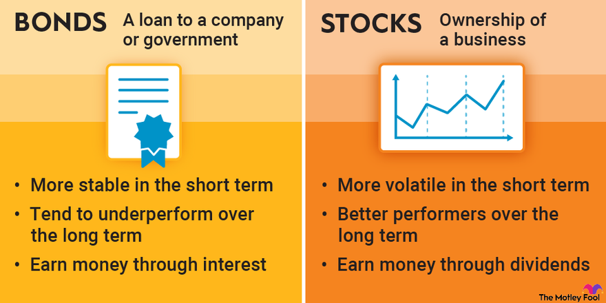

## Table of Contents

## What are stocks and how do they differ from bonds?

Stocks are pieces of ownership in a company. When you buy a stock, you are buying a small part of that company. If the company does well, the value of the stock can go up, and you might make money. But if the company does poorly, the stock price can go down, and you could lose money. Stocks are often seen as riskier investments because their value can change a lot.

Bonds are different because they are like loans that you give to a company or the government. When you buy a bond, you are lending money to the issuer, and they promise to pay you back with interest over time. Bonds are usually seen as safer investments because they provide regular interest payments and the return of your initial investment at the end of the bond's term. However, the potential for big gains is usually lower with bonds compared to stocks.

## What are the basic types of stocks?

There are two main types of stocks: common stocks and preferred stocks. Common stocks are what most people think of when they hear about stocks. If you own common stock, you get to vote on big company decisions and you might get dividends, which are like a share of the company's profits. But, the value of common stock can go up and down a lot, and if the company goes bankrupt, common stockholders are the last to get any money back.

Preferred stocks are a bit different. They usually don't give you voting rights, but they often pay a fixed dividend, which means you get a regular payment. Preferred stockholders get paid before common stockholders if the company goes bankrupt. So, preferred stocks can be less risky than common stocks, but they also might not grow in value as much.

## How do common stocks differ from preferred stocks?

Common stocks and preferred stocks are two types of stocks that you can buy. Common stocks give you the right to vote on big company decisions, like who should be on the board of directors. You might also get dividends, which are payments from the company's profits, but they're not guaranteed. The value of common stocks can change a lot, going up when the company does well and down when it doesn't. If the company goes bankrupt, people who own common stocks are the last ones to get any money back, which makes them riskier.

Preferred stocks work differently. They usually don't let you vote on company decisions, but they often come with a fixed dividend, which means you get a regular payment no matter how the company is doing. This makes preferred stocks a bit safer because you know you'll get your dividend payments. Also, if the company goes bankrupt, preferred stockholders get paid before common stockholders. But, the value of preferred stocks doesn't usually grow as much as common stocks, so you might not make as much money if the company does really well.

## What are the key characteristics of bonds?

Bonds are like loans that you give to a company or the government. When you buy a bond, you are lending them money, and they promise to pay you back with interest over time. This interest is usually paid to you regularly, like every six months or every year. At the end of the bond's term, which can be anywhere from a few years to thirty years or more, you get your original money back. This makes bonds a more predictable investment because you know when and how much you'll get paid.

Bonds are generally seen as safer investments than stocks. This is because they provide a steady income from the interest payments and the return of your initial investment at the end. However, the potential for big gains is usually lower with bonds compared to stocks. If the company or government that issued the bond runs into financial trouble, there's a risk they might not be able to pay you back. But overall, bonds are considered less risky because they have a more stable return.

## How do stocks generate returns for investors compared to bonds?

Stocks generate returns for investors in two main ways. First, if the company does well, the value of the stock can go up. This means you can sell your stock for more money than you paid for it, making a profit. This is called capital appreciation. Second, some companies pay dividends, which are like a share of the company's profits. If you own the stock, you get these payments, which can give you a regular income. But remember, stocks can be risky because their value can go down if the company doesn't do well, and dividends are not guaranteed.

Bonds, on the other hand, generate returns in a more predictable way. When you buy a bond, you are lending money to a company or the government, and they promise to pay you back with interest. This interest is usually paid to you regularly, like every six months or every year, giving you a steady income. At the end of the bond's term, you also get your original money back. Bonds are generally safer than stocks because you know when and how much you'll get paid, but the potential for big gains is usually lower compared to stocks.

## What are growth stocks and how do they differ from value stocks?

Growth stocks are stocks from companies that are expected to grow a lot in the future. These companies usually put their money back into the business to make it bigger instead of paying dividends to shareholders. Because people think these companies will do well, the price of their stock can go up a lot. But, growth stocks can be risky because if the company doesn't grow as expected, the stock price can drop a lot too.

Value stocks are different. They come from companies that people think are not priced right, meaning the stock price is lower than what the company is really worth. These companies might not grow as fast as growth companies, but they can be a good deal because you're buying them for less than they're worth. Value stocks might also pay dividends, which can give you some regular income. The risk with value stocks is that sometimes they're cheap for a reason, like if the company is having problems.

## What are dividend stocks and how do they compare to non-dividend paying stocks?

Dividend stocks are stocks from companies that pay part of their profits to shareholders regularly. These payments are called dividends. People like dividend stocks because they give them a steady income, kind of like getting paid just for owning the stock. Companies that pay dividends are often well-established and stable, so they can be less risky than other stocks. But, the value of dividend stocks can still go up and down, and the dividend payments might change or stop if the company doesn't do well.

Non-dividend paying stocks are stocks from companies that don't give out dividends. Instead, these companies usually use their profits to grow the business or do other things. The main way to make money from non-dividend stocks is by selling them for more than you paid if their value goes up. These stocks can be from newer or faster-growing companies, so they might have more potential for big gains, but they can also be riskier because their value can change a lot. If you're looking for regular income, non-dividend stocks won't give you that, but if you're okay with waiting and hoping the stock price goes up, they could be a good choice.

## How do the risk profiles of stocks and bonds differ?

Stocks are generally riskier than bonds. When you buy a stock, you're buying a piece of a company, and the value of that stock can go up and down a lot depending on how well the company does. If the company does great, the stock price can go up, and you can make a lot of money. But if the company does poorly, the stock price can drop, and you could lose money. Stocks don't promise to pay you back like bonds do, so there's more chance you could lose your investment.

Bonds are usually safer than stocks. When you buy a bond, you're lending money to a company or the government, and they promise to pay you back with interest over time. This means you get regular payments, and at the end of the bond's term, you get your original money back. Bonds are less likely to lose value suddenly, but they also don't usually grow as much as stocks. If the company or government has money problems, there's a small chance they might not pay you back, but overall, bonds are seen as a more stable investment.

## What are blue-chip stocks and how do they differ from penny stocks?

Blue-chip stocks are stocks from big, well-known companies that have been around for a long time and are very stable. These companies are usually leaders in their industries, like big banks or famous tech companies. People like blue-chip stocks because they are seen as safe investments. They might not grow super fast, but they usually pay dividends, which means you get regular payments just for owning the stock. Blue-chip stocks are less likely to lose a lot of value quickly, making them a good choice for people who want to invest without too much risk.

Penny stocks are very different. They are stocks from small companies that don't cost much money to buy, often less than a dollar per share. Because they're cheap, people think they might be a good deal, but penny stocks are really risky. These small companies can have a lot of problems, and their stock prices can go up and down a lot. If you invest in penny stocks, you might make a lot of money if the company does well, but you could also lose all your money if it doesn't. So, penny stocks are for people who are okay with taking big risks.

## How do stock market indices impact the valuation of stocks compared to bond indices?

Stock market indices, like the S&P 500 or the Dow Jones, are like big lists of stocks that show how the overall market is doing. When these indices go up, it usually means that a lot of stocks are doing well, and people might feel good about investing. This can make individual stock prices go up too, because people think the market is strong. But if the indices go down, it can make people nervous, and they might sell their stocks, which can make stock prices drop. So, stock market indices can have a big effect on how much people think stocks are worth.

Bond indices, like the Bloomberg Barclays US Aggregate Bond Index, work a bit differently. They show how a bunch of bonds are doing overall. When bond indices go up, it usually means that bond prices are going up and interest rates might be going down. This can make bonds look more attractive to investors, because they might get a better return on their money. But if bond indices go down, it can mean that bond prices are dropping and interest rates might be going up, which can make bonds less appealing. So, bond indices can affect how much people think bonds are worth, but in a more stable way than stock indices because bonds are usually less risky.

## What role do interest rates play in the valuation of stocks versus bonds?

Interest rates have a big effect on how much stocks are worth. When interest rates go up, it can make borrowing money more expensive for companies. This might slow down their growth and make their profits smaller, which can make their stock prices go down. Also, when interest rates are high, people might want to put their money in things like savings accounts or bonds that give them a good return without as much risk as stocks. This can make fewer people want to buy stocks, which can also push stock prices down. On the other hand, when interest rates are low, borrowing is cheaper for companies, which can help them grow and make more money. This can make their stock prices go up because more people want to invest in them.

Interest rates also affect how much bonds are worth, but in a different way. When interest rates go up, new bonds that are issued will have higher interest payments to match the new rates. This makes the old bonds, which have lower interest payments, less attractive to investors. So, the prices of those old bonds might go down. When interest rates go down, the opposite happens. New bonds will have lower interest payments, making the old bonds with higher interest payments more valuable, so their prices might go up. Because bonds are seen as safer than stocks, changes in interest rates can make people move their money between stocks and bonds, which can affect the prices of both.

## How do the tax implications of investing in stocks differ from those of investing in bonds?

When you invest in stocks, you have to think about taxes on the money you make. If you sell a stock for more than you paid for it, you have a capital gain, and you'll have to pay taxes on that. The tax rate depends on how long you held the stock. If you held it for more than a year, it's a long-term capital gain, and the tax rate is usually lower. If you held it for less than a year, it's a short-term capital gain, and you pay your regular income tax rate, which can be higher. Also, if you get dividends from stocks, those are usually taxed too, but at a special rate that's often lower than your regular income tax rate.

Investing in bonds has different tax rules. The interest you get from bonds is usually taxed as regular income, which means you pay your normal income tax rate on it. But there are some bonds, like municipal bonds, that can be tax-free at the federal level, and sometimes at the state level too. This makes them attractive if you're trying to save on taxes. If you sell a bond for more than you paid for it, you have a capital gain, and the tax rules are the same as for stocks—you pay a lower rate for long-term gains and your regular rate for short-term gains. So, the type of bond and how long you hold it can make a big difference in your taxes.

## What are the strategies for algorithmic trading?

Algorithmic trading has revolutionized financial markets by providing systematic methods for executing trades with precision and speed. A variety of strategies can be employed to optimize trading performance, each tailored to specific market conditions and investor goals. Let's examine some prevalent algorithmic trading strategies, which include trend following, arbitrage, and index fund rebalancing.

### Trend Following

Trend following is a strategy that aims to capitalize on market [momentum](/wiki/momentum) by executing trades based on the direction of market trends. Traders using this strategy rely on technical indicators such as moving averages or the Moving Average Convergence Divergence (MACD) to identify buy or sell signals. The core principle is to "ride the trend" and exit the trade once the trend reverses.

The mathematical expression often used in trend following might involve simple moving averages (SMA). For instance, a common approach could be:

$$
\text{Signal} = \begin{cases} 
\text{Buy, if } SMA_{\text{short-term}} > SMA_{\text{long-term}} \\
\text{Sell, if } SMA_{\text{short-term}} < SMA_{\text{long-term}} 
\end{cases}
$$

### Arbitrage

Arbitrage strategies seek to exploit price discrepancies across different markets or securities. A simple example is "[statistical arbitrage](/wiki/statistical-arbitrage)," which involves simultaneously buying and selling related assets to profit from price differences. High-frequency trading is often used in arbitrage due to the need for rapid execution.

Consider a scenario in currency pairs:

```python
# Pseudo-code for a simple triangular arbitrage strategy
currencies = ['USD', 'EUR', 'GBP']
rates = {'USD/EUR': 0.9, 'EUR/GBP': 0.8, 'GBP/USD': 1.4}

# Check for arbitrage opportunity
triangular_arbitrage_opportunity = rates['USD/EUR'] * rates['EUR/GBP'] * rates['GBP/USD']

if triangular_arbitrage_opportunity > 1:
    print("Arbitrage opportunity exists!")
else:
    print("No arbitrage opportunity.")
```

### Index Fund Rebalancing

Index fund rebalancing involves the periodic realignment of the component weights in an investment portfolio to match a specified target index. Algorithmic trading can automate this process, efficiently buying or selling assets to maintain the desired asset allocation. For example, if an index fund deviates due to market movements, an algorithm can calculate the necessary trades to rebalance the portfolio to its target weights.

Python, with libraries like `pandas` and `numpy`, can facilitate this process:

```python
import pandas as pd

# Assume df is a DataFrame containing the index fund weights
current_weights = {'A': 0.3, 'B': 0.5, 'C': 0.2}
target_weights = {'A': 0.4, 'B': 0.4, 'C': 0.2}

# Calculate the difference
df = pd.DataFrame({'Current': current_weights, 'Target': target_weights})
df['Difference'] = df['Target'] - df['Current']

print(df)
```

### Backtesting Algorithmic Strategies

Backtesting is an essential component of algorithmic trading, offering a way to test strategies on historical data before deploying them in live markets. The process involves simulating a trading strategy over past market conditions to assess its potential performance. Using programming languages like Python, traders can perform backtests with libraries such as `Backtrader` or `QuantConnect`, allowing them to refine their strategies and optimize parameters.

```python
# Example of backtesting a simple strategy using the Backtrader library
import backtrader as bt

class MyStrategy(bt.Strategy):
    def next(self):
        if self.data.close[0] > self.data.close[-1]:
            self.buy(size=1)
        elif self.data.close[0] < self.data.close[-1]:
            self.sell(size=1)

# Setup and run the backtesting engine
cerebro = bt.Cerebro()
cerebro.addstrategy(MyStrategy)
data = bt.feeds.YahooFinanceData(dataname='AAPL', fromdate=datetime(2019, 1, 1), todate=datetime(2020, 1, 1))
cerebro.adddata(data)
cerebro.run()
```

By evaluating the strengths and limitations of these strategies, traders can fine-tune their approaches, ensuring resilience and performance in dynamic market environments.

## References & Further Reading

Investopedia is an invaluable resource for those looking to expand their understanding of investing, covering a broad range of topics including stocks, bonds, and algorithmic trading. Their articles are consistently updated with comprehensive insights into these financial assets, which can help both novice and experienced investors navigate the intricacies of the market.

For those interested in a deeper dive into specific asset classes, 'The Bond Book' by Annette Thau is a highly recommended read. It provides detailed information on various types of bonds, offering strategies and insights that can aid investors in making informed bond investment decisions. This book is particularly useful for understanding the mechanics and benefits of incorporating bonds into an investment portfolio.

In the domain of algorithmic trading, 'Algorithmic Trading: Winning Strategies and Their Rationale' by Ernest P. Chan is an excellent resource. This book covers a wide range of algorithmic trading strategies and provides a rationale for their use, helping readers understand how to implement these strategies effectively.

In addition to these resources, staying updated with financial news websites and journals is crucial. These platforms provide current market analysis and trends that can influence investment decisions. They offer insights into market behavior and economic indicators, helping investors adapt their strategies to prevailing market conditions. By consulting these resources, investors can enhance their market knowledge and develop more sophisticated investment strategies.

