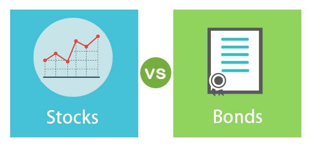

Investing in financial markets can be a daunting task due to the myriad of options available, including stocks, bonds, and more recently, algorithmic trading. Each of these investment types offers distinct characteristics, benefits, and risks that need to be understood before one commits capital. Stocks represent ownership in a company, providing an opportunity for high returns over time, albeit with increased risk and volatility. Bonds, on the other hand, are fixed-income securities that typically provide more stable returns and are considered lower risk compared to stocks. They involve lending money to an issuer, such as a corporation or government, in exchange for regular interest payments and the return of principal upon maturity.

Algorithmic trading is an innovative approach that employs computer programs to execute trades based on pre-set parameters, capitalizing on market inefficiencies and opportunities with precision and speed. This form of trading can facilitate high-frequency trading and remove emotional biases from trading decisions.



This article aims to explore these popular investment types of bonds and stocks, as well as the emerging field of algorithmic trading. We will provide an overview of each investment type, examine their key characteristics, and highlight crucial considerations for investors entering these markets. By understanding these investment opportunities, you can make informed decisions to align with your financial goals and navigate the complexities of the financial markets effectively.

## Table of Contents

## Understanding Bonds as an Investment

Bonds are a type of fixed-income security that provide a reliable means for investors to receive regular interest payments, known as coupon payments, in return for loaning their capital to the bond issuer. These issuers can range from corporations to government entities, and each type of bond carries distinct characteristics and roles in an investment portfolio.

One of the primary reasons investors consider bonds is their reputation for being safer than stocks. This perceived safety is due to the predictable income streams bonds offer, along with their generally lower volatility compared to stocks. The bond market can act as a stabilizing force in a diversified investment portfolio, providing consistent returns even during periods of economic uncertainty.

### Types of Bonds
Understanding the different types of bonds is essential for evaluating their roles within a portfolio. Key categories include:

1. **Government Bonds**: These are issued by national governments and are often considered the safest type of bond investment. In the United States, Treasury bonds, notes, and bills fall under this category. Due to their low risk, government bonds typically offer lower yields compared to corporate bonds.

2. **Municipal Bonds**: Issued by local or state governments, these bonds fund public projects such as infrastructure development. One distinct advantage of municipal bonds is their tax efficiency, as the interest earned is often exempt from federal and sometimes state taxes.

3. **Corporate Bonds**: Issued by companies, corporate bonds generally have higher yields than government bonds, reflecting the increased risk associated with corporate issuers. They are further classified based on credit ratings: investment-grade bonds are considered safer, while high-yield or "junk" bonds carry higher risk for potentially greater returns.

### Advantages of Bond Investments
Bonds are attractive for several reasons:

- **Predictable Income**: The fixed interest payments provide a reliable income stream, appealing especially to retirees or those seeking steady cash flow.
- **Portfolio Diversification**: Bonds often move inversely to stocks, providing a hedge against stock market volatility.
- **Capital Preservation**: By holding bonds until maturity, investors are typically assured of recovering the bond's face value.

### Risks Associated with Bonds
Despite their advantages, bond investments come with risks:

- **Interest Rate Risk**: Bond prices inversely correlate with interest rates. When rates rise, existing bond prices fall, impacting those looking to sell before maturity.
- **Credit Risk**: The issuer might default on payments. This risk is higher with corporate bonds, particularly those with lower credit ratings.
- **Inflation Risk**: Inflation can erode the purchasing power of the fixed interest payments over time, particularly relevant for long-term bonds.

By understanding the intricacies of bonds and their inherent risks and returns, investors can better align their investments with their financial objectives, ensuring a balanced approach to their portfolio strategy. 

For further exploration of bond markets and strategies, readers can refer to resources such as Investopedia for definitions and concepts, or [books](/wiki/algo-trading-books) like "The Bond Book" by Annette Thau, which provides an in-depth look at investing in bonds.

## Exploring Stocks as an Investment

Stocks, often referred to as equities, represent fractional ownership in a company and come with the potential for high returns over long periods. This ownership allows investors to partake in the company's profits through dividends and appreciation in share price. However, as equities are tied to company performance and broader market conditions, they inherently [carry](/wiki/carry-trading) higher risks compared to bonds.

### Types of Stocks: Common and Preferred

There are two main types of stocks: common and preferred. Common stocks entitle shareholders to voting rights, allowing them to influence corporate decisions such as electing the board of directors. Additionally, common stockholders benefit from dividends, which can fluctuate based on the company's profits. However, in the event of a liquidation, common stockholders are paid after creditors and preferred stockholders.

Preferred stocks, on the other hand, usually do not carry voting rights but offer a fixed dividend, leading to a steadier income stream. They have a higher claim on assets than common stocks in case of liquidation, offering an additional layer of security over common stocks.

### Comparing Stocks to Bonds

Stocks and bonds are fundamental components of any investment portfolio, each with distinct characteristics regarding risk, return, and market behavior. The primary difference lies in their nature: stocks signify ownership, whereas bonds represent a loan made to the issuer.

#### Risk and Return

Stocks are known for their potential to deliver high returns, often outperforming bonds over longer investment horizons. The historical average annual return of the U.S. stock market, as represented by the S&P 500 index, has been approximately 7-10% after adjusting for inflation. However, this higher return comes with increased risk, as stock prices can be highly volatile and are subject to larger fluctuations due to economic changes, market sentiment, and corporate performance.

In contrast, bonds generally offer lower returns but with reduced [volatility](/wiki/volatility-trading-strategies). Investors receive regular interest payments, providing a predictable income stream. The trade-off involves less potential for capital appreciation, which can be ideal for risk-averse investors or those seeking stable income.

#### Market Behavior

The market behavior of stocks is closely linked to the performance of the issuing company and broader economic conditions. Stocks are traded on exchanges, and their prices fluctuate based on supply and demand dynamics, investor sentiment, corporate earnings, and macroeconomic indicators. This [liquidity](/wiki/liquidity-risk-premium) allows for easy transferability of ownership but can also lead to significant price swings.

Bonds, especially those from stable governments or corporations, tend to react more predictably to changes in interest rates. When interest rates rise, existing bonds usually decrease in price, and when rates fall, bond prices typically increase. This inverse relationship with interest rates adds a layer of complexity in comparing bonds to stocks, which are affected by a myriad of other factors.

### Benefits and Drawbacks of Investing in Stocks

Investing in stocks offers numerous benefits, including the potential for significant capital gains and dividends. Stocks also provide an opportunity for investors to participate actively in the growth and success of companies, potentially leading to substantial wealth accumulation.

However, stock investments come with drawbacks, primarily linked to their volatility and susceptibility to market fluctuations. Market downturns can lead to substantial short-term losses, necessitating a long-term perspective to weather periods of volatility. In addition, stocks are influenced by both systemic risks, affecting entire markets or sectors, and company-specific risks, tied to individual corporate performance.

In conclusion, stocks offer a compelling investment avenue for those willing to accept higher risk for the chance of higher returns. By understanding the intricacies of stocks and their behavior relative to bonds, investors can better assess their suitability within a diversified investment strategy.

## Investment Strategies: Balancing Bonds and Stocks

Balancing a portfolio with a mix of stocks and bonds is a cornerstone strategy for achieving growth and stability in investments. The optimal allocation between these asset classes hinges on several key factors: your risk tolerance, investment horizon, and financial goals.

**Risk Tolerance and Investment Horizon**

Risk tolerance refers to an investor's capacity to endure market volatility. Generally, investors with high-risk tolerance may prefer a larger allocation of stocks due to their potential for higher returns. Those adverse to risk might favor bonds for their stability and consistent income streams. The investment horizon, or the time frame in which an investor plans to hold an investment before taking the money out, also plays a crucial role. Longer horizons typically allow for a higher stock allocation, as there is more time to recover from possible market downturns.

**Forming Balanced Portfolios**

A balanced portfolio is tailored to meet individual financial objectives while minimizing risk. Consider the following strategies to attain a balance between stocks and bonds:

1. **Bond Laddering**: This strategy involves purchasing bonds with different maturity dates, reducing interest rate risk. As bonds mature, the proceeds are reinvested into new bonds to maintain the ladder. This approach provides a steady income stream and the flexibility to capitalize on varying interest rates.

2. **Growth Investing**: Growth investing focuses on acquiring shares in companies anticipated to grow at an above-average rate compared to other firms. This involves a higher stock allocation, aiming for capital appreciation rather than immediate income. It suits those with a longer investment horizon willing to accept more risk for potentially higher returns.

3. **Value Investing**: This strategy involves selecting undervalued stocks with strong fundamentals. Investors adopting this approach look for stocks trading for less than their intrinsic values and often balance them with bonds to offset potential losses during periods of market correction.

**Using Bonds to Hedge Against Volatility**

Bonds can act as a hedge against stock market volatility due to their lower sensitivity to market fluctuations. They provide a more predictable income and can reduce the portfolio's overall risk. For example, government bonds often serve as a safe haven during stock market turbulence. By allocating a portion of the portfolio to bonds, investors can diversify their risk and stabilize returns.

In summary, balancing stocks and bonds efficiently requires a careful assessment of personal risk preferences and financial goals. By employing techniques such as bond laddering, and strategies like growth and value investing, investors can construct a well-rounded portfolio that aligns with their financial ambitions while managing risk meticulously.

 to Algorithmic Trading

Algorithmic trading, commonly referred to as algo trading, is an avant-garde approach that leverages computer programs to execute trades in financial markets. These programs, guided by predefined criteria, work by identifying market opportunities and executing trades at speeds and frequencies that are impossible for a human trader.

At its core, [algorithmic trading](/wiki/algorithmic-trading) depends on intricate algorithms that analyze market variables, such as price, timing, and [volume](/wiki/volume-trading-strategy), to execute trades that maximize profits or minimize trading costs. The key advantage lies in its ability to conduct rapid execution of trades, capitalizing on minute price discrepancies that often last for only a fraction of a second. Additionally, this removes emotional decision-making from the trading process, leading to potentially more rational and objective financial outcomes.

### How Algorithms Work

Algorithmic trading algorithms operate based on mathematical models and data analysis techniques. They often employ strategies such as [arbitrage](/wiki/arbitrage), where the algorithm identifies price differences between markets and executes simultaneous buy and sell transactions to profit from these discrepancies. Another common strategy includes [trend following](/wiki/trend-following), where algorithms detect and capitalize on market patterns to time entry and [exit](/wiki/exit-strategy) points efficiently.

Here's a simplified example of a trend-following strategy implemented in Python:

```python
import numpy as np
import pandas as pd

# Generate a sample price series
np.random.seed(42)
prices = pd.Series(np.random.randn(100).cumsum() + 50)

# Calculate moving averages
short_window = 40
long_window = 100

signals = pd.DataFrame(index=prices.index)
signals['price'] = prices
signals['short_mavg'] = prices.rolling(window=short_window, min_periods=1).mean()
signals['long_mavg'] = prices.rolling(window=long_window, min_periods=1).mean()

# Generate buy/sell signals
signals['signal'] = 0.0
signals['signal'][short_window:] = np.where(signals['short_mavg'][short_window:] 
                                            > signals['long_mavg'][short_window:], 1.0, 0.0)   
signals['positions'] = signals['signal'].diff()

print(signals.tail())
```

### Advantages and Drawbacks

The primary advantage of algorithmic trading is its speed and accuracy. Algorithms can process massive amounts of market data in real-time and execute trades across multiple markets and instruments more efficiently than a human trader. Additionally, they eliminate human errors and emotional biases, leading to consistent execution of trades.

However, algorithmic trading is not without its challenges. The complexity of the algorithms and reliance on technological infrastructure can lead to significant risks if not properly managed. For instance, software glitches can result in unintended trades and substantial financial losses. Furthermore, the success of these systems depends heavily on the quality of the input data and the rigor of back-testing before deployment.

### Technical Requirements and Skills

To engage actively in algorithmic trading, several technical requirements and skills are essential. Firstly, a solid understanding of programming languages like Python, R, or C++ is crucial for developing and implementing trading algorithms. Knowledge in statistical analysis and quantitative modeling is also beneficial, enabling traders to interpret market data and optimize algorithm efficiency. Additionally, a robust technological infrastructure, including high-speed internet and reliable trading platforms, is essential to ensure seamless execution of trades.

In conclusion, while algorithmic trading offers numerous advantages in terms of speed and efficiency, it necessitates a thorough understanding of financial markets and technology. Acquiring relevant programming skills and maintaining meticulous attention to data quality and algorithm validation can help traders harness the potential of algorithmic trading effectively.

## Strategies for Algorithmic Trading

Algorithmic trading has revolutionized financial markets by providing systematic methods for executing trades with precision and speed. A variety of strategies can be employed to optimize trading performance, each tailored to specific market conditions and investor goals. Let's examine some prevalent algorithmic trading strategies, which include trend following, arbitrage, and index fund rebalancing.

### Trend Following

Trend following is a strategy that aims to capitalize on market [momentum](/wiki/momentum) by executing trades based on the direction of market trends. Traders using this strategy rely on technical indicators such as moving averages or the Moving Average Convergence Divergence (MACD) to identify buy or sell signals. The core principle is to "ride the trend" and exit the trade once the trend reverses.

The mathematical expression often used in trend following might involve simple moving averages (SMA). For instance, a common approach could be:

$$
\text{Signal} = \begin{cases} 
\text{Buy, if } SMA_{\text{short-term}} > SMA_{\text{long-term}} \\
\text{Sell, if } SMA_{\text{short-term}} < SMA_{\text{long-term}} 
\end{cases}
$$

### Arbitrage

Arbitrage strategies seek to exploit price discrepancies across different markets or securities. A simple example is "[statistical arbitrage](/wiki/statistical-arbitrage)," which involves simultaneously buying and selling related assets to profit from price differences. High-frequency trading is often used in arbitrage due to the need for rapid execution.

Consider a scenario in currency pairs:

```python
# Pseudo-code for a simple triangular arbitrage strategy
currencies = ['USD', 'EUR', 'GBP']
rates = {'USD/EUR': 0.9, 'EUR/GBP': 0.8, 'GBP/USD': 1.4}

# Check for arbitrage opportunity
triangular_arbitrage_opportunity = rates['USD/EUR'] * rates['EUR/GBP'] * rates['GBP/USD']

if triangular_arbitrage_opportunity > 1:
    print("Arbitrage opportunity exists!")
else:
    print("No arbitrage opportunity.")
```

### Index Fund Rebalancing

Index fund rebalancing involves the periodic realignment of the component weights in an investment portfolio to match a specified target index. Algorithmic trading can automate this process, efficiently buying or selling assets to maintain the desired asset allocation. For example, if an index fund deviates due to market movements, an algorithm can calculate the necessary trades to rebalance the portfolio to its target weights.

Python, with libraries like `pandas` and `numpy`, can facilitate this process:

```python
import pandas as pd

# Assume df is a DataFrame containing the index fund weights
current_weights = {'A': 0.3, 'B': 0.5, 'C': 0.2}
target_weights = {'A': 0.4, 'B': 0.4, 'C': 0.2}

# Calculate the difference
df = pd.DataFrame({'Current': current_weights, 'Target': target_weights})
df['Difference'] = df['Target'] - df['Current']

print(df)
```

### Backtesting Algorithmic Strategies

Backtesting is an essential component of algorithmic trading, offering a way to test strategies on historical data before deploying them in live markets. The process involves simulating a trading strategy over past market conditions to assess its potential performance. Using programming languages like Python, traders can perform backtests with libraries such as `Backtrader` or `QuantConnect`, allowing them to refine their strategies and optimize parameters.

```python
# Example of backtesting a simple strategy using the Backtrader library
import backtrader as bt

class MyStrategy(bt.Strategy):
    def next(self):
        if self.data.close[0] > self.data.close[-1]:
            self.buy(size=1)
        elif self.data.close[0] < self.data.close[-1]:
            self.sell(size=1)

# Setup and run the backtesting engine
cerebro = bt.Cerebro()
cerebro.addstrategy(MyStrategy)
data = bt.feeds.YahooFinanceData(dataname='AAPL', fromdate=datetime(2019, 1, 1), todate=datetime(2020, 1, 1))
cerebro.adddata(data)
cerebro.run()
```

By evaluating the strengths and limitations of these strategies, traders can fine-tune their approaches, ensuring resilience and performance in dynamic market environments.

## Conclusion

Bonds and stocks have long been cornerstones of investment, offering diverse opportunities for investors to tailor their portfolios according to specific financial objectives. Bonds provide stability and predictable income streams, primarily due to their nature as fixed-income securities. Investors often turn to bonds when seeking lower-risk options that can safeguard capital while generating consistent returns. Stocks, on the other hand, offer the potential for significant capital appreciation. As equity instruments, they facilitate ownership in a company and bring along the possibility of dividends, albeit with higher volatility and risk than bonds.

Algorithmic trading introduces a modernity to investment strategy with its capacity for systematic, high-speed trading devoid of emotional bias. By utilizing sophisticated algorithms, traders can execute orders with precision and agility, potentially capitalizing on fleeting market conditions that manual trading might miss. The efficiency and increased accuracy that come with algorithmic methods offer new avenues for profitability in today's rapidly evolving financial landscape.

When selecting between these investment avenues, several factors must be considered, including risk tolerance, investment horizons, and market acumen. Bonds might suit those seeking a more cautious approach, whereas stocks could align with more aggressive, growth-oriented portfolios. Algorithmic trading requires not only an understanding of financial markets but also proficiency in programming and data analysis to harness its full potential.

Understanding these investment types and strategies equips investors with the knowledge to navigate complex financial landscapes and make well-informed decisions tailored to their unique financial goals. By aligning investment choices with individual objectives and market insights, investors can better achieve a balanced and effective portfolio.

## References & Further Reading

Investopedia is an invaluable resource for those looking to expand their understanding of investing, covering a broad range of topics including stocks, bonds, and algorithmic trading. Their articles are consistently updated with comprehensive insights into these financial assets, which can help both novice and experienced investors navigate the intricacies of the market.

For those interested in a deeper dive into specific asset classes, 'The Bond Book' by Annette Thau is a highly recommended read. It provides detailed information on various types of bonds, offering strategies and insights that can aid investors in making informed bond investment decisions. This book is particularly useful for understanding the mechanics and benefits of incorporating bonds into an investment portfolio.

In the domain of algorithmic trading, 'Algorithmic Trading: Winning Strategies and Their Rationale' by Ernest P. Chan is an excellent resource. This book covers a wide range of algorithmic trading strategies and provides a rationale for their use, helping readers understand how to implement these strategies effectively.

In addition to these resources, staying updated with financial news websites and journals is crucial. These platforms provide current market analysis and trends that can influence investment decisions. They offer insights into market behavior and economic indicators, helping investors adapt their strategies to prevailing market conditions. By consulting these resources, investors can enhance their market knowledge and develop more sophisticated investment strategies.