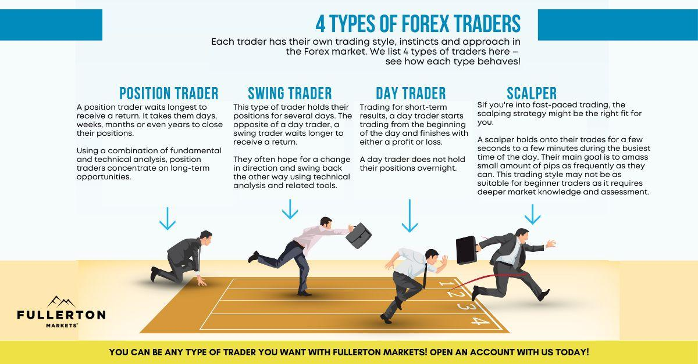

The world of financial trading is both expansive and intricate, necessitating a sophisticated understanding of various techniques and styles tailored to diverse trader profiles. These trading styles vary widely, some focusing on short-term gains and others on long-term investments. Recognizing and understanding these differing approaches is crucial for enhancing investment outcomes and aligning strategies with individual financial goals.

In recent years, algorithmic trading has emerged as a significant development in trading methodologies. By leveraging technological advancements, algorithmic trading introduces new dimensions to traditional trading methods, allowing for enhanced speed and precision. This form of trading employs complex mathematical models and algorithms to enable efficient decision-making, often with minimal human intervention. As a result, traders can execute strategies with greater accuracy and reduced emotional bias.

This article sets out to uncover the various aspects of trading, offering a comprehensive exploration of how different types of traders operate and the strategies they employ. By examining both traditional and modern approaches, we aim to provide insights that can inform traders at all levels, helping them to refine their techniques and optimize their approaches in a rapidly evolving trading landscape.

## Table of Contents

## Understanding Different Trading Styles

Financial trading encompasses a multitude of styles, each characterized by distinct rules and techniques that cater to specific investor preferences and objectives. Among the most prevalent trading styles are day trading, swing trading, and position trading, each of which presents unique opportunities and challenges.

Day trading involves buying and selling financial instruments within a single trading day. Day traders typically capitalize on small price movements in high-liquidity assets and aim to close all positions before the market closes, avoiding overnight risks. This strategy requires a deep understanding of technical analysis, as traders often rely on chart patterns, indicators, and real-time data to make rapid decisions. The primary risk associated with day trading is market volatility, which can lead to significant losses if trades are not executed accurately or if the market moves unexpectedly.

Swing trading extends the holding period beyond a single day, ranging from a few days to several weeks. Swing traders aim to capture short- to medium-term price moves, often influenced by market news or trends. This trading style requires patience and the ability to analyze both technical indicators and fundamental factors that could impact market movements. Swing trading typically involves lower transaction costs compared to day trading, as trades are executed less frequently. However, because positions are held longer, traders must be cautious of overnight risks, including potential market gaps at the opening bell.

Position trading focuses on long-term market trends, with traders maintaining positions for weeks, months, or even years. Position traders are less concerned with short-term market fluctuations and are more focused on the macroeconomic environment, company fundamentals, and long-term price trends. This style suits investors looking for a more passive trading approach, as it involves fewer trades and less frequent monitoring of daily market activities. Yet, it requires a strong conviction in the chosen strategy, as markets can experience prolonged periods of [volatility](/wiki/volatility-trading-strategies) that might affect long-term positions.

Each trading style bears its own risk-to-reward profile, necessitating a trader's alignment with personal risk tolerance, investment goals, and lifestyle preferences. Day trading is ideal for those who prioritize quick executions and are comfortable with frequent trading activities throughout the day. Swing trading offers a balance of active engagement and longer outlook, suitable for those who can dedicate time to monitor markets beyond daily fluctuations. Lastly, position trading aligns with individuals who prefer a more strategic and long-term perspective, requiring patience and stamina to weather market cycles.

Understanding and selecting the appropriate trading style is crucial in aligning one's trading approach with personal objectives and market conditions. The choice of trading style significantly influences the strategies employed, the risk management techniques adopted, and the overall trading experience.

## Types of Traders

Traders can be broadly categorized into several distinct types, each characterized by the strategies they employ and their psychological inclinations.

### Fundamental Traders

Fundamental traders rely on analyzing a company's financial health and broader economic indicators to make trading decisions. They examine elements such as earnings reports, balance sheets, and macroeconomic factors like interest rates and GDP growth. The underlying belief is that an asset's market price will eventually reflect its intrinsic value. Fundamental traders typically have a long-term perspective, as it may take time for market prices to adjust to true value. For instance, if the price-to-earnings ratio (P/E ratio) or discounted cash flow (DCF) analysis of a stock suggests it is undervalued, a fundamental trader might buy it expecting price appreciation over time.

### Noise Traders

Noise traders do not rely on fundamentals or technical analysis but instead make decisions based on short-term market noise. This noise can include rumors, news headlines, and other non-information-based events. Noise trading often involves speculation and can contribute to market inefficiencies and volatility. It relies heavily on the psychology of other market participants rather than any intrinsic value of an asset. Consequently, noise traders often engage in high-frequency trading, capitalizing on quick price fluctuations.

### Sentiment Traders

Sentiment traders analyze the overall mood of the market to inform their trading activities. They use tools such as the put-call ratio, VIX index (volatility index), and sentiment surveys to gauge how bullish or bearish market participants are. Sentiment traders aim to identify turning points in market cycles, either by following the trend ([momentum](/wiki/momentum)-based) or by betting against the crowd (contrarian strategy). For example, if market sentiment is excessively bullish, a sentiment trader might anticipate a reversal, opting to short-sell assets.

### Importance of Identifying Your Trader Type

Understanding and identifying one's trader type is vital for personalizing trading strategies and enhancing decision-making processes. Each type of trader operates under different risk tolerances and time horizons. Adopting a self-aware approach allows traders to align their strategies with their psychological dispositions and financial goals, ultimately increasing the probability of success in the volatile trading environment.

Recognizing these different trader types offers valuable insights into the broader financial ecosystem. Participants can leverage this knowledge to anticipate market trends and develop robust, adaptive trading strategies. By tailoring their approach based on trading type preferences, individuals can optimize their performance in the inherently unpredictable financial markets.

## Algorithmic Trading: The Future of Trading

Algorithmic trading, commonly known as algo trading, refers to the use of computer algorithms to manage trading activities, ensuring that transactions are executed with speed and precision that surpass human capabilities. This approach leverages sophisticated mathematical models and automated systems to determine the timing, price, and quantity of trades. Essentially, algorithms reduce the time and operational inefficiencies typically encountered in human trading by making decisions based on patterns derived from historical data and current market conditions.

To maximize efficiency, algo trading minimizes human intervention by utilizing predefined strategies. These strategies are embedded within the algorithms, enabling them to autonomously perform complex calculations and execute trades accordingly. This minimizes the possibility of human errors such as panic or hesitation, which can negatively impact trading outcomes. Algorithms can process large volumes of data and perform trades in microseconds, executing orders as soon as specific market conditions are met. This speed allows traders to take advantage of fleeting market opportunities, which can lead to significant profits.

The influence of algo trading is particularly pronounced among institutional investors who manage large portfolios. The scalability and efficiency that algorithmic systems provide allow these investors to deploy multiple complex strategies simultaneously, covering multiple markets and instruments. Algorithmic trading has transformed the global trading landscape by introducing higher [liquidity](/wiki/liquidity-risk-premium) and mitigating the bid-ask spread in financial markets, thus making them more efficient.

Nevertheless, [algorithmic trading](/wiki/algorithmic-trading) is not without its challenges. Technical failures pose a significant risk, potentially leading to unintended trading activity that can destabilize markets. For example, a glitch in the code or an unexpected market anomaly can result in erroneous trades that may accumulate substantial losses. Additionally, the market impact of algorithmic trading remains a topic of concern. Large trades executed by algorithms can cause significant price shifts, leading to increased volatility. This is a double-edged sword as volatility can lead to profit opportunities but also increases risk.

Implementing algorithmic trading requires a robust technological infrastructure, including seamless integration with trading platforms and reliable data feeds. Furthermore, continuous monitoring and optimization of trading algorithms are essential to adapt to the rapidly changing market conditions.

Overall, the advent of algorithmic trading represents a pivotal development in trading technology. Its ability to enhance trading efficiency and accuracy is undeniable, yet it requires careful management of the associated technological and market-related challenges. As technology continues to evolve, it is anticipated that algorithmic trading will play an increasingly vital role in the finance industry.

## Advantages and Challenges of Algo Trading

Algorithmic trading, often referred to as algo trading, presents a range of advantages that have made it a widely adopted methodology in financial markets. One significant benefit is speed. By leveraging computer programs, trades can be executed at speeds far beyond human capabilities. This speed allows traders to take advantage of even the smallest price discrepancies that may only exist for fractions of a second. Additionally, algo trading offers precision, ensuring that trades are executed at exact pre-determined conditions, reducing the likelihood of human errors associated with manual trading processes.

Another notable advantage is the ability to trade around the clock. Unlike human traders constrained by physical limitations, algorithms can operate continuously, extending trading opportunities across global markets and time zones. Moreover, algo trading minimizes emotional biases. Human traders often make decisions based on emotions such as fear or greed, which can lead to suboptimal trades. By relying on predefined strategies, algorithms can maintain objectivity, sticking strictly to logical rules devoid of emotional interference.

However, algo trading is not without its challenges. A primary concern is the risk of technical glitches. Even minor software bugs or hardware failures can result in significant financial losses or unintended market impacts. This necessitates rigorous testing and validation of trading algorithms before deployment. Furthermore, algorithmic trading requires significant infrastructure investment, including robust computing resources and reliable data feeds, which can be a barrier for smaller trading firms or individual traders.

To address these challenges, continuous monitoring and optimization of trading algorithms are crucial. This involves not only real-time supervision to detect and rectify any emergent issues but also regular updates and optimizations to adapt to changing market conditions. As market dynamics evolve, algorithms might require recalibration to maintain their effectiveness and relevance, ensuring that they continue to deliver optimal performance without adverse impacts.

In summary, while algorithmic trading offers substantial benefits like speed, precision, continuous operation, and emotional neutrality, it also demands careful consideration of technical and infrastructural challenges. Successful algo trading requires a balanced approach that integrates robust technological solutions with diligent oversight and adaptability.

## Selecting the Right Trading Style and Strategy

Choosing the right trading style and strategy is crucial for success in the financial markets. This choice should be informed by several key factors, including personal goals, risk tolerance, and available resources. By aligning these factors with a suitable trading approach, traders can enhance their performance and achieve their investment objectives.

### Personal Goals and Risk Tolerance

Personal goals play a significant role in determining the most appropriate trading style. Some traders may aim for short-term profits and opt for [day trading](/wiki/day-trading-spy) or swing trading, while others may prefer a long-term approach, such as position trading. Each style involves a different time commitment and skill set, which should align with a trader's lifestyle and financial goals.

Risk tolerance is another critical [factor](/wiki/factor-investing). Traders with a high risk tolerance may engage in more aggressive strategies like day trading, which seeks to capitalize on short-term price movements but involves higher volatility. Conversely, traders with lower risk tolerance might choose position trading, which focuses on longer-term trends and generally involves fewer trades. Understanding one's comfort level with market fluctuations can help in selecting a strategy that minimizes stress and enhances focus on rational decision-making.

### Understanding Strengths and Weaknesses

A thorough understanding of various trading strategies' strengths and weaknesses can lead to more informed decisions. For instance, day trading requires the ability to act quickly and the willingness to spend considerable time monitoring market movements. It offers rapid returns but demands significant effort and commitment. Swing trading, on the other hand, involves holding positions for several days to take advantage of market swings. It offers a balance between the high-frequency nature of day trading and the long-term commitment of position trading.

Different strategies also have distinct requirements in terms of resources. For example, day trading often requires sophisticated technology and access to real-time market data, as trades are executed swiftly based on small price movements. Meanwhile, position trading could be more suitable for those preferring to analyze macroeconomic factors and hold trades over a prolonged period, thus requiring a different analytical skill set.

### Flexibility and Adaptability

Flexibility and adaptability are essential traits for traders, given that market conditions can change rapidly. Strategies that work well in a volatile market may not be effective in a more stable environment. Traders must be prepared to adjust their methods in response to changing market dynamics. This might involve modifying existing strategies or adopting entirely new approaches as necessary.

Incorporating flexibility into trading plans can also help in managing unexpected events that could impact the market. A trader who remains adaptable to changing market conditions will be better positioned to exploit new opportunities and mitigate potential losses. This requires continuous education and reassessment of market trends, economic indicators, and technological advancements.

By considering personal goals, risk tolerance, and available resources, traders can select a trading style and strategy that is most likely to yield successful outcomes. Understanding the intricacies of various trading strategies, combined with the ability to remain flexible in the face of market changes, ensures that traders are better equipped to achieve long-term viability and success in the financial trading arena.

## Conclusion

The landscape of financial trading is diverse, encompassing myriad styles and strategies that cater to traders with varied objectives and risk appetites. Each style—ranging from day trading to algorithmic trading—offers unique nuances that, when understood, can significantly enhance a trader's ability to effectively navigate market complexities. Algorithmic trading, in particular, signifies a substantial advancement in trading technology; it introduces heightened precision and efficiency but also poses unique challenges such as the risk of technical failures and market impacts.

Selecting the appropriate trading style should be a decision aligned closely with individual goals, aptitudes, and resources. For instance, a trader with a high-risk appetite and technological inclination might find algorithmic trading appealing, whereas a risk-averse individual might prefer more traditional methods like position trading. These decisions are critical to ensuring both short-term engagement and long-term viability in the trading arena.

In conclusion, while the ever-evolving world of trading presents both opportunities and complexities, a deep understanding of the available styles and careful alignment with personal objectives can pave the way for sustained success.

## References & Further Reading

[1]: Bergstra, J., Bardenet, R., Bengio, Y., & Kégl, B. (2011). ["Algorithms for Hyper-Parameter Optimization."](https://dl.acm.org/doi/10.5555/2986459.2986743) Advances in Neural Information Processing Systems 24.

[2]: ["Advances in Financial Machine Learning"](https://www.amazon.com/Advances-Financial-Machine-Learning-Marcos/dp/1119482089) by Marcos Lopez de Prado

[3]: ["Evidence-Based Technical Analysis: Applying the Scientific Method and Statistical Inference to Trading Signals"](https://www.amazon.com/Evidence-Based-Technical-Analysis-Scientific-Statistical/dp/0470008741) by David Aronson

[4]: ["Machine Learning for Algorithmic Trading"](https://github.com/stefan-jansen/machine-learning-for-trading) by Stefan Jansen

[5]: ["Quantitative Trading: How to Build Your Own Algorithmic Trading Business"](https://www.amazon.com/Quantitative-Trading-Build-Algorithmic-Business/dp/1119800064) by Ernest P. Chan