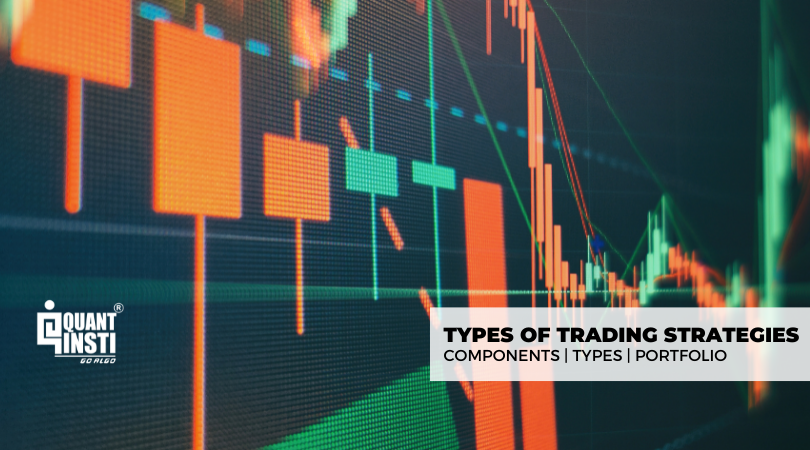

Algorithmic trading has fundamentally transformed the landscape of the financial markets, serving as a cornerstone for executing trades with unparalleled speed and precision. Often referred to as 'algo trading,' this method employs complex computer algorithms to make informed trading decisions by analyzing extensive datasets and executing orders at velocities that are far beyond human capability. The sophistication of these systems allows traders to operate on vast amounts of data, capitalizing on market opportunities that may elude manual trading.

The efficiency brought by algorithmic trading systems has made them an indispensable tool for traders looking to harness real-time market data and execute trades with minimal latency. This systematic approach not only reduces the impact of human emotions on trading decisions but also enables extensive back-testing of trading strategies under diverse market conditions. Consequently, traders can optimize their strategies to maximize profitability and minimize risks.



Understanding the various algorithmic trading strategies is critical to navigating this complex domain effectively. Each strategy offers unique opportunities and challenges, requiring traders to possess a solid understanding of market dynamics and technological capabilities. This article provides an exploration of different algo trading strategies, examining their roles and implications for traders seeking to leverage them for enhanced trading outcomes. Through this, traders can better align their strategic objectives with the appropriate trading techniques, thereby optimizing their performance in the dynamic environment of financial markets.

## Table of Contents

## Overview of Algorithmic Trading

Algorithmic trading is the application of computer algorithms to automate and streamline trading strategies based on specific criteria. These algorithms analyse market data in real-time and execute trades according to pre-established rules, which minimizes the need for human intervention. This approach often leads to faster and more precise trade execution compared to manual trading.

By leveraging computer algorithms, traders can effectively handle and process massive volumes of data, which would be impractical for human traders to process manually. This capability is crucial in identifying trading signals and executing transactions at the optimal moment. Additionally, algorithmic trading significantly reduces the influence of human emotions, such as fear and greed, which can often lead to suboptimal trading decisions. By sticking rigorously to predefined strategies, trades are executed based on logic and data rather than emotional impulses.

Another significant benefit of algorithmic trading is the ability to back-test trading strategies extensively. Traders can apply historical data to a proposed algorithm to assess its performance and potential profitability before deploying it in live markets. This testing process helps identify strengths and weaknesses in the strategy, allowing for adjustments and refinements that improve performance and risk management.

In summary, [algorithmic trading](/wiki/algorithmic-trading) enhances trading efficiency by automating decision-making processes, delivering fast and precise trade execution, and providing robust tools for data management and strategy evaluation.

## Trend-Following Strategies

Trend-following strategies are designed to capitalize on the [momentum](/wiki/momentum) of stock prices by entering trades when trends are identified and holding positions until the trend direction changes. The core principle behind these strategies is that prices tend to move in trends, which can be upward, downward, or sideways, over varying periods.

### Common Indicators Used

1. **Moving Averages**: Among the most frequently used tools in trend-following strategies, moving averages help smooth out price data by creating a constantly updated average price. There are different types of moving averages, such as the Simple Moving Average (SMA) and the Exponential Moving Average (EMA). The SMA is calculated by taking the arithmetic mean of a given set of prices over a specific number of periods. Conversely, the EMA gives more weight to recent prices, making it more responsive to new information.

   Formula for Simple Moving Average (SMA):
$$
   \text{SMA} = \frac{\sum_{i=1}^{n} P_i}{n}

$$

   where $P_i$ represents the price at period $i$, and $n$ is the total number of periods.

   Formula for Exponential Moving Average (EMA):
$$
   \text{EMA} = P_t \times \left( \frac{2}{n+1} \right) + \text{EMA}_{t-1} \times \left(1 - \frac{2}{n+1}\right)

$$

   where $P_t$ is the price at time $t$, and $\text{EMA}_{t-1}$ is the EMA of the previous period.

2. **Momentum Indicators**: These indicators, such as the Relative Strength Index (RSI) and Moving Average Convergence Divergence (MACD), help assess the strength of a trend. The RSI measures the speed and change of price movements, oscillating between zero and 100, and is typically used to identify overbought or oversold conditions. The MACD, on the other hand, is calculated by subtracting the 26-period EMA from the 12-period EMA and is often accompanied by a signal line to detect buy or sell signals.

   Python code to compute RSI:
   ```python
   import pandas as pd

   def calculate_rsi(data, period=14):
       delta = data.diff()
       gain = (delta.where(delta > 0, 0)).rolling(window=period).mean()
       loss = (-delta.where(delta < 0, 0)).rolling(window=period).mean()
       rs = gain / loss
       rsi = 100 - (100 / (1 + rs))
       return rsi
   ```

### Popularity Among Algorithmic Traders

Trend-following strategies are popular among algorithmic traders due to their simplicity and effectiveness, particularly in trending markets. They do not require predicting market directions; instead, they focus on capturing gains through established trends. The ability to automate these strategies using algorithms enhances their appeal, as it allows for rapid processing of data and execution of trades with minimal human intervention.

Despite their advantages, trend-following strategies also have limitations. In highly volatile or sideways-moving markets, these strategies can generate false signals, leading to potential losses. Hence, traders may combine trend-following strategies with other methods to improve their overall trading performance and risk management.

## Mean Reversion Strategies

Mean reversion strategies are grounded in the hypothesis that asset prices and other financial metrics will eventually return to their historical averages. This concept is pivotal to various [quantitative trading](/wiki/quantitative-trading) models and is based on the statistical phenomenon where extreme prices are followed by corrections toward the mean. Traders utilizing mean reversion strategies typically buy an asset when its price falls significantly below its historical average and sell when it rises above.

Key tools in implementing mean reversion strategies include Bollinger Bands and the Relative Strength Index (RSI). 

**Bollinger Bands** consist of three lines: a simple moving average (SMA) and two standard deviations away from the SMA, forming the bands. These bands expand and contract based on market volatility. When the price moves outside the bands, it is considered a statistically significant movement, indicating potential reversion. The mathematical representation of Bollinger Bands is as follows:

- Middle Band = SMA(n)
- Upper Band = SMA(n) + k * σ
- Lower Band = SMA(n) - k * σ

Where $n$ is the number of periods, $k$ is a constant (usually set to 2), and $σ$ is the standard deviation.

**Relative Strength Index (RSI)**, on the other hand, measures the speed and change of price movements. It is a momentum oscillator that ranges from 0 to 100. Traditional interpretations consider an asset overbought when the RSI is above 70 and oversold when below 30, signaling potential mean reversion. The RSI is calculated using the formula:

$$
RSI = 100 - \frac{100}{1 + RS}
$$

Where $RS$ is the average of n-days’ up closes divided by the average of n-days’ down closes.

Python can be utilized for implementing mean reversion strategies, leveraging libraries such as `pandas` and `numpy` for data manipulation and `matplotlib` for visualization:

```python
import pandas as pd
import numpy as np
import matplotlib.pyplot as plt

# Sample data loading
data = pd.read_csv('historical_prices.csv')  # Replace with actual data file
data['SMA'] = data['Close'].rolling(window=20).mean()
data['StdDev'] = data['Close'].rolling(window=20).std()
data['Upper'] = data['SMA'] + (data['StdDev'] * 2)
data['Lower'] = data['SMA'] - (data['StdDev'] * 2)

# Calculate RSI
delta = data['Close'].diff()
gain = (delta.where(delta > 0, 0)).rolling(window=14).mean()
loss = (-delta.where(delta < 0, 0)).rolling(window=14).mean()
rs = gain / loss
data['RSI'] = 100 - (100 / (1 + rs))

# Plotting
plt.figure(figsize=(14,6))
plt.plot(data['Close'], label='Close Price')
plt.plot(data['Upper'], label='Upper Band')
plt.plot(data['Lower'], label='Lower Band')
plt.fill_between(data.index, data['Lower'], data['Upper'], color='grey', alpha=0.1)
plt.title('Mean Reversion Strategy')
plt.legend()
plt.show()
```

Through this approach, traders hedge against the unpredictability of financial markets by relying on the statistical return of prices to their means. However, it is crucial for traders to conduct extensive [backtesting](/wiki/backtesting) and remain aware of the limitations, as market conditions and external factors can greatly influence the effectiveness of mean reversion strategies.

## Arbitrage Strategies

Arbitrage is a fundamental strategy in algorithmic trading, exploiting price discrepancies for the same asset across various markets or platforms. This approach is grounded in the market's tendency toward price equilibrium, where inefficiencies are temporary and can be profited from by trading at different prices across platforms.

Statistical [arbitrage](/wiki/arbitrage) and pairs trading are two prevalent forms of arbitrate strategies. Statistical arbitrage involves the employment of statistical models to identify pricing inefficiencies. This strategy generally requires sophisticated algorithms capable of handling vast amounts of data to pinpoint minute discrepancies that typically escape the notice of manual traders. Pairs trading, a subset of [statistical arbitrage](/wiki/statistical-arbitrage), relies on the historical correlation between two securities. When the price ratio of the two securities diverges from its historical mean, an opportunity arises to buy the undervalued security and sell the overvalued one, anticipating a return to the mean.

Arbitrage strategies necessitate high-speed execution due to the transient nature of price discrepancies. The competition in identifying and acting on these opportunities is intense, requiring the use of automated systems and low-latency infrastructures to execute trades almost instantaneously. High-frequency trading ([HFT](/wiki/high-frequency-trading-strategies)) is often integral to the successful implementation of arbitrage strategies, as it permits the rapid assessment and execution required to capitalize on fleeting opportunities.

Python is commonly used for implementing arbitrage strategies due to its extensive library support and ease of integrating with real-time data feeds and trading systems. An example pseudocode for a simple pairs trading strategy might look like this:

```python
import numpy as np

def calculate_spread(asset1_prices, asset2_prices):
    return np.array(asset1_prices) - np.array(asset2_prices)

def mean_reversion_strategy(asset1, asset2, historical_mean, threshold=0.01):
    spread = calculate_spread(asset1['prices'], asset2['prices'])
    current_spread = spread[-1]

    if current_spread > historical_mean + threshold:
        return "Sell Asset1, Buy Asset2"
    elif current_spread < historical_mean - threshold:
        return "Buy Asset1, Sell Asset2"
    else:
        return "Hold"

# Example usage
asset1 = {'prices': [100, 102, 101, 105]}
asset2 = {'prices': [99, 98, 97, 100]}
historical_mean = np.mean(calculate_spread(asset1['prices'], asset2['prices']))

decision = mean_reversion_strategy(asset1, asset2, historical_mean)
print(decision)
```

The success of arbitrage strategies is not immune to challenges. Transaction costs, [liquidity](/wiki/liquidity-risk-premium) constraints, and regulatory barriers can erode the potential profits from arbitrage opportunities. Moreover, as more traders deploy similar algorithms, the effectiveness of arbitrage strategies may diminish due to increased market efficiency and compression of profit margins. Thus, continuous innovation, robust infrastructure, and strategic foresight are essential for maintaining competitiveness in using arbitrage strategies within algorithmic trading.

## Event-based Strategies

Event-based strategies in algorithmic trading capitalize on market opportunities created by specific events such as corporate earnings announcements, economic releases, or geopolitical occurrences. These strategies rely heavily on the rapid analysis and execution capabilities of algorithms to predict and act on the probable impact of such events on asset prices.

Traders develop algorithms that scan multiple sources of information to assess market conditions quickly when an event occurs. This could involve analyzing historical price data, news sentiment, social media analytics, and other relevant datasets. For instance, an algorithm might be programmed to consider the impact of a quarterly earnings report on a stock by analyzing not only the report itself but also market sentiment surrounding it, using natural language processing (NLP) techniques.

The primary advantage of event-based strategies is their ability to execute trades at a speed unattainable by human traders. Timely execution is critical, as market reactions to events can occur within milliseconds. Algorithms are tasked with not only identifying trading opportunities but also assessing risk and determining the optimal size and timing of trades. 

For example, an algorithm designed to trade during economic news releases might look like this in Python:

```python
import pandas as pd
import numpy as np

def trade_on_news(event_data, historical_data):
    event_impact = np.mean(event_data) - np.mean(historical_data)
    trade_signal = 'buy' if event_impact > threshold else 'sell'
    return trade_signal

event_data = pd.Series([data_from_event])
historical_data = pd.Series([historical_price_data])
threshold = 0.05  # This can be adjusted based on risk tolerance

trade_signal = trade_on_news(event_data, historical_data)
print(f"Trade signal generated: {trade_signal}")
```

This example illustrates a simplistic model that compares current event data against historical data to generate a trade signal. In practice, sophisticated models may incorporate [machine learning](/wiki/machine-learning) to improve predictive accuracy.

The success of event-based strategies hinges on access to real-time data and the ability to execute trades with minimal delay. Infrastructural investments in low-latency networks and co-location services near financial exchanges are typical among firms employing these strategies, ensuring that their algorithms can react as quickly as possible to market movements. 

While event-based strategies offer significant potential for profit, they also pose risks, particularly if predictions of event impacts are inaccurate or if unexpected [volatility](/wiki/volatility-trading-strategies) escalates trading costs. Consequently, effective risk management and strategy refinement are essential components of successful event-based trading frameworks.

## Machine Learning-Based Strategies

Machine learning models are increasingly pivotal in algorithmic trading, providing the capability to recognize complex patterns and conduct predictive analytics with higher precision. These models utilize vast datasets to analyze and adapt to market conditions.

Supervised learning, a fundamental approach in machine learning for trading, involves using labeled historical data to train models to predict future market behaviors. Common applications include predicting stock prices, identifying buy or sell signals, and optimizing trading strategies. Techniques such as linear regression, decision trees, and neural networks are often employed. For example, a trader might use a [neural network](/wiki/neural-network) to predict stock prices using features like historical price data, trading [volume](/wiki/volume-trading-strategy), and macroeconomic indicators.

Unsupervised learning, on the other hand, seeks to identify hidden patterns or groupings in data without pre-existing labels. This approach is particularly useful in clustering similar trading instruments, identifying market regimes, or detecting anomalies. Techniques like k-means clustering and principal component analysis (PCA) are prevalent. An example in trading might involve using k-means to cluster stocks with similar trading patterns, aiding in portfolio diversification or risk management.

Reinforcement learning (RL) is a more advanced approach tailored for environments where decision-making is sequential, and actions influence future rewards. In trading, RL can model the trading agent as a learner that seeks to maximize its cumulative reward by interacting with the market environment. The Q-learning algorithm is commonly used, where the trader develops a policy to decide the best action to take under specific conditions:

$$
Q(s, a) \leftarrow Q(s, a) + \alpha \left[ r + \gamma \cdot \max_{a'} Q(s', a') - Q(s, a) \right]
$$

In this equation, $Q(s, a)$ is the quality of action $a$ in state $s$; $\alpha$ is the learning rate; $r$ represents the reward; and $\gamma$ is the discount [factor](/wiki/factor-investing) for future rewards.

These learning techniques are enhanced by the use of languages such as Python, which boasts libraries like TensorFlow and PyTorch for building and training machine learning models. A basic example in Python for implementing a linear regression model using the `scikit-learn` library could look like this:

```python
from sklearn.model_selection import train_test_split
from sklearn.linear_model import LinearRegression
import numpy as np

# Assuming 'data' is a pandas DataFrame with historical market data
X = data[['feature1', 'feature2', 'feature3']]  # Features
y = data['target']  # Target variable, e.g., future price

X_train, X_test, y_train, y_test = train_test_split(X, y, test_size=0.2, random_state=42)

model = LinearRegression()
model.fit(X_train, y_train)

predictions = model.predict(X_test)
```

Adopting machine learning in algorithmic trading enables traders to effectively respond to ever-changing market dynamics, leveraging historical data to fine-tune trading strategies and improve decision-making processes.

## Combining Strategies into a Portfolio

Combining multiple trading strategies into a single portfolio is a widely used approach in algorithmic trading to enhance diversification and manage risk more effectively. A diversified portfolio allows traders to distribute risk across various strategies, reducing the impact of adverse performance in any single strategy. This can lead to more consistent returns over time.

Allocation of capital within a diversified strategy portfolio typically depends on anticipated market conditions and the historical performance of the strategies involved. Traders might use different allocation methods, such as equal weighting, where each strategy receives the same capital allocation, or risk parity, where strategies are weighted according to their risk levels.

For instance, consider a portfolio composed of three distinct strategies: a trend-following strategy, a mean reversion strategy, and an arbitrage strategy. Each strategy has different performance characteristics and risk profiles. Through diversification, the trader can potentially reduce the overall volatility of the portfolio. The performance of a diversified strategy portfolio, $R_p$, can be mathematically expressed as:

$$
R_p = w_1 \cdot R_1 + w_2 \cdot R_2 + w_3 \cdot R_3
$$

where $w_1, w_2,$ and $w_3$ are the weights assigned to each strategy, and $R_1, R_2,$ and $R_3$ are the returns from each strategy.

In practice, backtesting and simulation are crucial to determining the optimal allocation and evaluating how combinations of strategies interact under different market scenarios. Historical data is analyzed to assess how the performance of individual strategies contributes to the overall portfolio performance.

By integrating a diverse set of strategies, traders can better cope with different market environments. For example, a trend-following strategy might perform well during extended directional market movements, while an arbitrage strategy could capitalize on price discrepancies in various platforms or markets. Combining these strategies allows the portfolio to adapt to changing market conditions, providing stabilization when one strategy underperforms.

Ultimately, constructing a portfolio that leverages multiple algorithmic trading strategies is about balance. By understanding the correlation between different strategies and intelligently distributing capital, traders can construct a robust framework that can withstand short-term volatility and aim for long-term success.

## Risks and Common Challenges in Algo Trading

Algorithmic trading, while offering numerous benefits, is fraught with several risks and challenges that traders need to manage effectively. One of the primary challenges is overfitting, where a trading model is excessively tailored to historical data, capturing noise rather than underlying market patterns. Overfitted models perform well on past data but often fail in live trading, as they lack the ability to generalize to unseen market conditions.

Data dependencies present another significant challenge. Algorithmic traders rely on vast datasets for analysis and strategy development. The accuracy and reliability of these data sources directly impact trading performance. Inaccurate or delayed data can lead to suboptimal trade executions, resulting in financial losses. Ensuring data integrity, therefore, becomes essential for any algorithmic strategy.

Latency issues are a critical concern, especially in high-frequency trading (HFT), where even microsecond delays can impact profitability. The time taken to receive data, process it, and execute trades needs to be minimized. This requires sophisticated technological infrastructure, including low-latency networks and optimized algorithms, to maintain competitive edge in fast-moving markets. 

Regulatory compliance is another significant challenge that traders face. Algorithmic trading is subject to stringent regulations aimed at preventing market manipulation and ensuring market stability. Traders must ensure their strategies comply with regulatory standards and may need to implement mechanisms to monitor compliance continuously.

Market risk, inherent due to market volatility, can adversely affect algorithmic trading strategies. While diversification can mitigate some risks, unexpected market events can still lead to substantial losses. Traders need robust risk management frameworks to identify, assess, and mitigate potential risks.

Ongoing monitoring and adjustment of trading strategies are crucial in adapting to dynamic market conditions. Markets continually evolve, influenced by economic factors, technological advancements, and regulatory changes. To achieve sustained success, traders must regularly evaluate the performance of their strategies, making necessary adjustments to align with current market dynamics. This continuous adaptation helps in maintaining the relevance and effectiveness of the algorithmic trading strategy.

## Choosing the Right Trading Strategy

Choosing the right trading strategy in algorithmic trading is a complex decision, influenced by various factors unique to each trader. The selection process should begin with clearly defining one's trading objectives, risk tolerance, and knowledge of the market. Traders must decide whether their focus is on long-term investment growth, short-term profit maximization, or maintaining capital preservation.

A critical step in this process is conducting thorough research and analysis to align the chosen strategy with market conditions and individual goals. This involves evaluating historical data to understand how a strategy might perform and identifying any inherent risks or weaknesses.

Backtesting is essential for validating the strategy's effectiveness. By simulating the strategy across historical price data, traders can assess its performance in various market scenarios. This step helps identify potential pitfalls and allows for refinement before committing capital in live trading.

For instance, in Python, traders can utilize libraries such as `pandas` and `numpy` for data manipulation and `Backtrader` or `Zipline` for backtesting. An example Python code snippet for a simple moving average crossover strategy backtest could look like this:

```python
import backtrader as bt

class SmaCross(bt.SignalStrategy):
    def __init__(self):
        sma1 = bt.ind.SMA(period=10)   # Shorter period
        sma2 = bt.ind.SMA(period=30)   # Longer period
        self.signal_add(bt.SIGNAL_LONG, sma1 > sma2)
        self.signal_add(bt.SIGNAL_SHORT, sma1 < sma2)

cerebro = bt.Cerebro()
cerebro.add_strategy(SmaCross)
data = bt.feeds.YahooFinanceData(dataname='AAPL', fromdate=datetime(2020, 1, 1), todate=datetime(2022, 1, 1))
cerebro.adddata(data)
cerebro.run()
cerebro.plot()
```

Education and continuous learning are fundamental components for refining trading strategies. Engaging with experienced mentors, participating in forums, and keeping abreast of new developments can provide fresh perspectives and insights. Books, online courses, and seminars also serve as vital resources to deepen understanding and adaptability in algorithmic trading.

Finally, engaging with the broader trading community through online forums, seminars, and networking can provide valuable insights and feedback from peers facing similar challenges. This collective wisdom can guide traders in refining their strategies and staying aligned with the dynamic nature of financial markets.

Selecting the right trading strategy is an ongoing process, necessitating adaptation and learning as markets evolve. By thoroughly researching, testing, and remaining engaged with educational resources and the trading community, traders set a solid foundation for making informed decisions in algorithmic trading.

## Conclusion

Successfully navigating the complex world of algorithmic trading requires a thorough understanding of various strategies and continuous adaptation to new technologies and market changes. The dynamic nature of financial markets necessitates that traders be prepared to refine their strategies in response to both technological advancements and evolving market conditions.

Algorithmic trading offers immense potential for enhancing trading efficiency and profitability. By automating the trading process, traders can execute large numbers of transactions with speed and precision, leveraging data analysis to inform decision-making. This capability allows traders to operate in a manner that is less influenced by human emotions, leading to more consistent and objective trading outcomes. The ability to back-test strategies extensively also provides a significant advantage, enabling traders to hone their approaches before deploying them in live markets.

By leveraging a blend of strategies tailored to individual goals and market conditions, traders can optimize their performance and achieve their trading objectives. Diversification across different algorithmic strategies can help mitigate risks associated with any single approach. This strategic amalgamation allows traders to capitalize on various market scenarios, enhancing the robustness of their trading portfolios.

Success in algorithmic trading hinges not only on strategy selection but also on continuous learning and adaptation. Traders are encouraged to engage actively with the trading community, participate in educational opportunities, and remain open to integrating innovative technologies and techniques into their trading systems. By doing so, they increase their chances of achieving sustained profitability and resilience in an ever-changing trading landscape.

## References & Further Reading

[1]: Bergstra, J., Bardenet, R., Bengio, Y., & Kégl, B. (2011). ["Algorithms for Hyper-Parameter Optimization."](https://papers.nips.cc/paper/4443-algorithms-for-hyper-parameter-optimization) Advances in Neural Information Processing Systems 24.

[2]: ["Advances in Financial Machine Learning"](https://resources.caih.jhu.edu/textbooks/Resources/_pdfs/Advances_In_Financial_Machine_Learning.pdf) by Marcos Lopez de Prado

[3]: ["Evidence-Based Technical Analysis: Applying the Scientific Method and Statistical Inference to Trading Signals"](https://www.amazon.com/Evidence-Based-Technical-Analysis-Scientific-Statistical/dp/0470008741) by David Aronson

[4]: ["Machine Learning for Algorithmic Trading"](https://github.com/stefan-jansen/machine-learning-for-trading) by Stefan Jansen

[5]: ["Quantitative Trading: How to Build Your Own Algorithmic Trading Business"](https://books.google.com/books/about/Quantitative_Trading.html?id=j70yEAAAQBAJ) by Ernest P. Chan