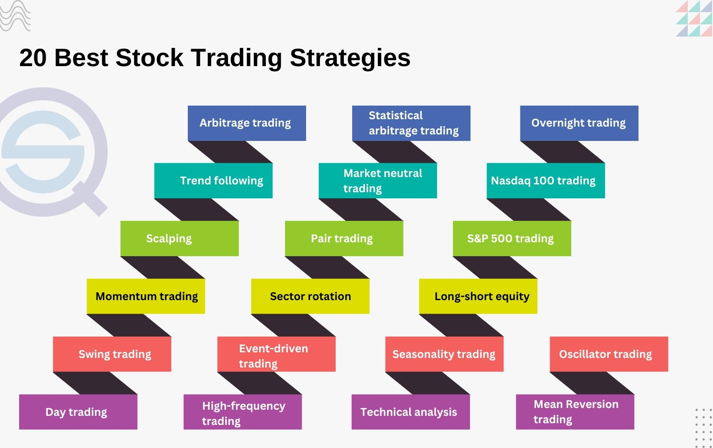

## Table of Contents

## What is a trading strategy?

A trading strategy is a set of rules that a trader uses to decide when to buy and sell assets like stocks, currencies, or commodities. It helps traders make decisions based on careful planning rather than guessing or following their feelings. A good trading strategy can help traders make more money and lose less by setting clear goals and managing risks.

There are many different types of trading strategies. Some are based on looking at charts and patterns, while others use math formulas or economic news. Traders often choose a strategy that fits their goals, how much risk they are willing to take, and how much time they can spend trading. It's important for traders to test their strategy with pretend money first to see if it works before using real money.

## What are the basic types of trading strategies for beginners?

For beginners, some basic trading strategies include trend following and breakout trading. Trend following means watching the market to see if prices are generally going up or down over time. If prices are going up, you buy and hold onto the asset until the trend seems to change. If prices are going down, you might sell or avoid buying. It's like riding a wave; you want to stay on as long as the wave is moving in your favor. Breakout trading is when you watch for prices to move outside of a usual range. If a price breaks out above its normal range, you might buy, thinking it will keep going up. If it breaks below, you might sell, expecting it to keep falling.

Another simple strategy for beginners is range trading. This involves identifying a price range where an asset tends to move back and forth without breaking out. You buy near the bottom of the range and sell near the top, making small profits each time the price moves within this range. It's like playing a game where you try to catch the price at the right moments. All these strategies help beginners by giving them clear rules to follow, making trading less confusing and more structured.

## How does a trend-following strategy work?

A trend-following strategy is like following a path that the market is making. You look at the price of something, like a stock or a currency, over time. If you see that the price is going up more often than it's going down, that's called an uptrend. In an uptrend, you buy the asset and keep it, hoping the price will keep going up. If the price is going down more often, that's a downtrend. In a downtrend, you might sell the asset or not buy it, thinking the price will keep falling. The key is to spot the trend early and stay with it until it changes.

To use a trend-following strategy, you need to watch the market closely. You can use tools like moving averages, which smooth out price changes over time, to help you see the trend more clearly. For example, if the price of a stock stays above its moving average, that can be a sign of an uptrend. When the trend seems to be changing, like if the price starts to dip below the moving average, it might be time to sell or get ready to look for a new trend. This strategy works well because markets often keep moving in the same direction for a while, giving you time to make money if you follow the trend correctly.

## What is a mean reversion strategy and how is it implemented?

A mean reversion strategy is based on the idea that prices will eventually return to their average after moving away from it. Imagine a rubber band: when you stretch it, it wants to go back to its normal shape. Prices in the market can be like that rubber band. If a stock's price goes way up or way down, a mean reversion trader believes it will come back to a more normal level. This strategy is about finding times when prices are too high or too low and betting that they will move back to the middle.

To use a mean reversion strategy, you need to figure out what the normal price of an asset is. You can do this by looking at the average price over a certain time, like the last 20 days or 50 days. When the price goes far above this average, you might sell, expecting it to come back down. When it goes far below, you might buy, hoping it will go back up. You have to be patient and watch the market closely because it can take time for prices to revert to the mean. It's important to set clear rules for when to buy and sell, and to test your strategy first to make sure it works before using real money.

## Can you explain breakout trading strategies?

Breakout trading is a strategy where you look for prices to move outside of a usual range. Imagine a box where the price of a stock usually stays. If the price suddenly jumps out of the top of the box, that's a [breakout](/wiki/breakout-trading). When you see this happen, you might buy the stock because you think the price will keep going up. On the other hand, if the price falls out of the bottom of the box, that's also a breakout. Then, you might sell or short the stock, expecting the price to keep going down.

To use breakout trading, you need to find these boxes, or ranges, where the price usually stays. You can draw lines on a chart to show where the top and bottom of the range are. When the price moves past these lines, that's your signal to act. It's important to be quick because breakouts can happen fast. Also, you need to be careful because sometimes the price might break out but then go back into the range. To manage this, set clear rules for when to buy or sell, and always use stop-loss orders to limit your losses if the breakout doesn't work out.

## What are momentum trading strategies and how do they differ from trend-following?

Momentum trading is about catching a fast-moving train. You look for stocks or other assets that are moving quickly in one direction, either up or down. If a stock's price is going up fast, you buy it, hoping it will keep going up for a bit longer. If it's going down fast, you might sell it or short it, expecting it to keep falling. Momentum traders use tools like the Relative Strength Index (RSI) to see how fast prices are moving. They jump in when they see a big move and try to get out before the move stops.

Momentum trading and trend-following are similar because they both try to make money from the way prices are moving. But they are different in how they do it. Trend-following is about finding a long-term direction, like a slow, steady climb or fall, and sticking with it for a while. Momentum trading is more about quick, short-term moves. Trend-followers might hold onto a stock for weeks or months, while momentum traders might only hold it for a few days or even hours. So, trend-following is like sailing with the wind, while momentum trading is like surfing a big wave.

## How do range trading strategies function in the market?

Range trading is like playing a game where you try to catch the price of a stock or other asset at the right moments. You look at the price and see that it goes up and down but stays between two points, like a ball bouncing in a box. When the price gets close to the bottom of the box, you buy it because you think it will bounce back up. When it gets close to the top, you sell it because you think it will come back down. It's all about timing your buys and sells to make small profits each time the price moves within this range.

To make range trading work, you need to find these boxes or ranges where the price stays. You can draw lines on a chart to show where the top and bottom of the range are. Once you have these lines, you wait for the price to hit them. When it touches the bottom line, you buy, and when it touches the top line, you sell. It's important to be patient and watch the market closely because the price can stay in the range for a while. Also, always use stop-loss orders to protect yourself in case the price suddenly breaks out of the range.

## What are arbitrage strategies and what skills are needed to execute them?

Arbitrage strategies are about finding and using small price differences between markets. Imagine you can buy something in one place for a low price and sell it in another place for a higher price at the same time. That's [arbitrage](/wiki/arbitrage). Traders look for these price differences, which can happen because of different information or speed of trading in different markets. They buy the asset where it's cheaper and sell it where it's more expensive, making a profit from the difference. This can happen with stocks, currencies, or even cryptocurrencies.

To do arbitrage well, you need to be quick and good with numbers. You have to spot these price differences fast because they usually don't last long. Being able to use computers and trading software helps a lot because these tools can find and act on these differences faster than a person can. Also, knowing a lot about different markets and how they work is important. You need to understand why these price differences happen and how to use them to make money without taking too much risk.

## Can you describe algorithmic trading strategies and their advantages?

Algorithmic trading strategies use computers to make trading decisions based on rules set by the trader. These rules can be about things like price, time, or how much the market is moving. For example, a simple rule might be to buy a stock if its price goes above a certain number, or to sell it if it drops below another number. These strategies can be set up to trade on their own, without needing a person to watch the market all the time. This means they can trade very quickly and can handle a lot of information at once, which is something humans can't do as well.

The big advantage of [algorithmic trading](/wiki/algorithmic-trading) is that it can be very fast and accurate. Because computers can look at lots of data and make decisions in a split second, they can find and use small opportunities in the market that people might miss. This can help make more money and lose less. Also, algorithmic trading can help take emotions out of trading. People can get scared or excited and make bad choices, but a computer just follows the rules. This can lead to more steady and reliable trading results over time.

## What are high-frequency trading strategies and what infrastructure is required?

High-frequency trading ([HFT](/wiki/high-frequency-trading-strategies)) is a type of algorithmic trading where computers buy and sell things very quickly, often in just a few seconds or less. The goal is to make small profits from tiny changes in prices. HFT traders use special software that can spot these small changes and act on them faster than other traders. They might trade thousands of times a day, making a little bit of money each time, but it adds up because they do it so often.

To do high-frequency trading, you need special computers and fast internet connections. These computers need to be close to the places where trading happens, like stock exchanges, so they can get information and send orders as quickly as possible. This is called being near the "data center." You also need to have a lot of money to start because HFT can be expensive to set up. It's not something you can do from your home computer; it needs a big setup to work right.

## How do options trading strategies like straddles and strangles work?

A straddle is an options trading strategy where you buy both a call option and a put option at the same time for the same stock and with the same expiration date and strike price. The idea is to make money if the stock price moves a lot in either direction. If the stock price goes way up, the call option becomes valuable and you can sell it for a profit. If the stock price goes way down, the put option becomes valuable, and you can sell that for a profit. You use a straddle when you think the stock will move a lot but you're not sure which way it will go.

A strangle is similar to a straddle, but instead of buying options at the same strike price, you buy them at different strike prices. You buy a call option with a higher strike price and a put option with a lower strike price. Like a straddle, you use a strangle when you think the stock will move a lot, but you're not sure which way. The big difference is that because the options are at different strike prices, a strangle is usually cheaper to set up than a straddle. However, the stock needs to move even more for you to make money because of the different strike prices.

## What are some advanced trading strategies used by expert traders?

Expert traders often use advanced strategies like pairs trading, which involves finding two related stocks and betting that their price difference will go back to normal. Imagine you have two stocks from the same industry, like two car companies. If one stock goes up a lot more than the other, you might think this won't last. So, you sell the stock that went up and buy the one that didn't. When their prices come back closer together, you make money. This strategy needs a good understanding of how different stocks move together and can be tricky to get right.

Another advanced strategy is [statistical arbitrage](/wiki/statistical-arbitrage), which is a bit like pairs trading but uses more math and computer power. Traders look at lots of stocks and find small price differences they can use to make money. They use computers to find these differences fast and trade on them before they go away. This strategy needs a lot of data and quick computers, so it's not something you can do at home. It's all about using math to find and use tiny chances in the market that most people can't see.

Some expert traders also use [market making](/wiki/market-making), where they buy and sell the same stock at the same time, making a small profit on each trade. They help keep the market running smoothly by always being ready to buy or sell. This strategy needs a lot of money and good relationships with the stock exchange, so it's not for everyone. It's about being in the middle of the action and making money from the small differences between buying and selling prices.

## What are Trend-Following Strategies?

Trend-following strategies are designed to capitalize on the [momentum](/wiki/momentum) of stock prices by entering trades when trends are identified and holding positions until the trend direction changes. The core principle behind these strategies is that prices tend to move in trends, which can be upward, downward, or sideways, over varying periods.

### Common Indicators Used

1. **Moving Averages**: Among the most frequently used tools in trend-following strategies, moving averages help smooth out price data by creating a constantly updated average price. There are different types of moving averages, such as the Simple Moving Average (SMA) and the Exponential Moving Average (EMA). The SMA is calculated by taking the arithmetic mean of a given set of prices over a specific number of periods. Conversely, the EMA gives more weight to recent prices, making it more responsive to new information.

   Formula for Simple Moving Average (SMA):
$$
   \text{SMA} = \frac{\sum_{i=1}^{n} P_i}{n}

$$

   where $P_i$ represents the price at period $i$, and $n$ is the total number of periods.

   Formula for Exponential Moving Average (EMA):
$$
   \text{EMA} = P_t \times \left( \frac{2}{n+1} \right) + \text{EMA}_{t-1} \times \left(1 - \frac{2}{n+1}\right)

$$

   where $P_t$ is the price at time $t$, and $\text{EMA}_{t-1}$ is the EMA of the previous period.

2. **Momentum Indicators**: These indicators, such as the Relative Strength Index (RSI) and Moving Average Convergence Divergence (MACD), help assess the strength of a trend. The RSI measures the speed and change of price movements, oscillating between zero and 100, and is typically used to identify overbought or oversold conditions. The MACD, on the other hand, is calculated by subtracting the 26-period EMA from the 12-period EMA and is often accompanied by a signal line to detect buy or sell signals.

   Python code to compute RSI:
   ```python
   import pandas as pd

   def calculate_rsi(data, period=14):
       delta = data.diff()
       gain = (delta.where(delta > 0, 0)).rolling(window=period).mean()
       loss = (-delta.where(delta < 0, 0)).rolling(window=period).mean()
       rs = gain / loss
       rsi = 100 - (100 / (1 + rs))
       return rsi
   ```

### Popularity Among Algorithmic Traders

Trend-following strategies are popular among algorithmic traders due to their simplicity and effectiveness, particularly in trending markets. They do not require predicting market directions; instead, they focus on capturing gains through established trends. The ability to automate these strategies using algorithms enhances their appeal, as it allows for rapid processing of data and execution of trades with minimal human intervention.

Despite their advantages, trend-following strategies also have limitations. In highly volatile or sideways-moving markets, these strategies can generate false signals, leading to potential losses. Hence, traders may combine trend-following strategies with other methods to improve their overall trading performance and risk management.

## What are Mean Reversion Strategies?

Mean reversion strategies are grounded in the hypothesis that asset prices and other financial metrics will eventually return to their historical averages. This concept is pivotal to various [quantitative trading](/wiki/quantitative-trading) models and is based on the statistical phenomenon where extreme prices are followed by corrections toward the mean. Traders utilizing mean reversion strategies typically buy an asset when its price falls significantly below its historical average and sell when it rises above.

Key tools in implementing mean reversion strategies include Bollinger Bands and the Relative Strength Index (RSI). 

**Bollinger Bands** consist of three lines: a simple moving average (SMA) and two standard deviations away from the SMA, forming the bands. These bands expand and contract based on market volatility. When the price moves outside the bands, it is considered a statistically significant movement, indicating potential reversion. The mathematical representation of Bollinger Bands is as follows:

- Middle Band = SMA(n)
- Upper Band = SMA(n) + k * σ
- Lower Band = SMA(n) - k * σ

Where $n$ is the number of periods, $k$ is a constant (usually set to 2), and $σ$ is the standard deviation.

**Relative Strength Index (RSI)**, on the other hand, measures the speed and change of price movements. It is a momentum oscillator that ranges from 0 to 100. Traditional interpretations consider an asset overbought when the RSI is above 70 and oversold when below 30, signaling potential mean reversion. The RSI is calculated using the formula:

$$
RSI = 100 - \frac{100}{1 + RS}
$$

Where $RS$ is the average of n-days’ up closes divided by the average of n-days’ down closes.

Python can be utilized for implementing mean reversion strategies, leveraging libraries such as `pandas` and `numpy` for data manipulation and `matplotlib` for visualization:

```python
import pandas as pd
import numpy as np
import matplotlib.pyplot as plt

# Sample data loading
data = pd.read_csv('historical_prices.csv')  # Replace with actual data file
data['SMA'] = data['Close'].rolling(window=20).mean()
data['StdDev'] = data['Close'].rolling(window=20).std()
data['Upper'] = data['SMA'] + (data['StdDev'] * 2)
data['Lower'] = data['SMA'] - (data['StdDev'] * 2)

# Calculate RSI
delta = data['Close'].diff()
gain = (delta.where(delta > 0, 0)).rolling(window=14).mean()
loss = (-delta.where(delta < 0, 0)).rolling(window=14).mean()
rs = gain / loss
data['RSI'] = 100 - (100 / (1 + rs))

# Plotting
plt.figure(figsize=(14,6))
plt.plot(data['Close'], label='Close Price')
plt.plot(data['Upper'], label='Upper Band')
plt.plot(data['Lower'], label='Lower Band')
plt.fill_between(data.index, data['Lower'], data['Upper'], color='grey', alpha=0.1)
plt.title('Mean Reversion Strategy')
plt.legend()
plt.show()
```

Through this approach, traders hedge against the unpredictability of financial markets by relying on the statistical return of prices to their means. However, it is crucial for traders to conduct extensive [backtesting](/wiki/backtesting) and remain aware of the limitations, as market conditions and external factors can greatly influence the effectiveness of mean reversion strategies.

## What are Machine Learning-Based Strategies?

Machine learning models are increasingly pivotal in algorithmic trading, providing the capability to recognize complex patterns and conduct predictive analytics with higher precision. These models utilize vast datasets to analyze and adapt to market conditions.

Supervised learning, a fundamental approach in [machine learning](/wiki/machine-learning) for trading, involves using labeled historical data to train models to predict future market behaviors. Common applications include predicting stock prices, identifying buy or sell signals, and optimizing trading strategies. Techniques such as linear regression, decision trees, and neural networks are often employed. For example, a trader might use a [neural network](/wiki/neural-network) to predict stock prices using features like historical price data, trading [volume](/wiki/volume-trading-strategy), and macroeconomic indicators.

Unsupervised learning, on the other hand, seeks to identify hidden patterns or groupings in data without pre-existing labels. This approach is particularly useful in clustering similar trading instruments, identifying market regimes, or detecting anomalies. Techniques like k-means clustering and principal component analysis (PCA) are prevalent. An example in trading might involve using k-means to cluster stocks with similar trading patterns, aiding in portfolio diversification or risk management.

Reinforcement learning (RL) is a more advanced approach tailored for environments where decision-making is sequential, and actions influence future rewards. In trading, RL can model the trading agent as a learner that seeks to maximize its cumulative reward by interacting with the market environment. The Q-learning algorithm is commonly used, where the trader develops a policy to decide the best action to take under specific conditions:

$$
Q(s, a) \leftarrow Q(s, a) + \alpha \left[ r + \gamma \cdot \max_{a'} Q(s', a') - Q(s, a) \right]
$$

In this equation, $Q(s, a)$ is the quality of action $a$ in state $s$; $\alpha$ is the learning rate; $r$ represents the reward; and $\gamma$ is the discount [factor](/wiki/factor-investing) for future rewards.

These learning techniques are enhanced by the use of languages such as Python, which boasts libraries like TensorFlow and PyTorch for building and training machine learning models. A basic example in Python for implementing a linear regression model using the `scikit-learn` library could look like this:

```python
from sklearn.model_selection import train_test_split
from sklearn.linear_model import LinearRegression
import numpy as np

# Assuming 'data' is a pandas DataFrame with historical market data
X = data[['feature1', 'feature2', 'feature3']]  # Features
y = data['target']  # Target variable, e.g., future price

X_train, X_test, y_train, y_test = train_test_split(X, y, test_size=0.2, random_state=42)

model = LinearRegression()
model.fit(X_train, y_train)

predictions = model.predict(X_test)
```

Adopting machine learning in algorithmic trading enables traders to effectively respond to ever-changing market dynamics, leveraging historical data to fine-tune trading strategies and improve decision-making processes.

## How can strategies be combined into a portfolio?

Combining multiple trading strategies into a single portfolio is a widely used approach in algorithmic trading to enhance diversification and manage risk more effectively. A diversified portfolio allows traders to distribute risk across various strategies, reducing the impact of adverse performance in any single strategy. This can lead to more consistent returns over time.

Allocation of capital within a diversified strategy portfolio typically depends on anticipated market conditions and the historical performance of the strategies involved. Traders might use different allocation methods, such as equal weighting, where each strategy receives the same capital allocation, or risk parity, where strategies are weighted according to their risk levels.

For instance, consider a portfolio composed of three distinct strategies: a trend-following strategy, a mean reversion strategy, and an arbitrage strategy. Each strategy has different performance characteristics and risk profiles. Through diversification, the trader can potentially reduce the overall [volatility](/wiki/volatility-trading-strategies) of the portfolio. The performance of a diversified strategy portfolio, $R_p$, can be mathematically expressed as:

$$
R_p = w_1 \cdot R_1 + w_2 \cdot R_2 + w_3 \cdot R_3
$$

where $w_1, w_2,$ and $w_3$ are the weights assigned to each strategy, and $R_1, R_2,$ and $R_3$ are the returns from each strategy.

In practice, backtesting and simulation are crucial to determining the optimal allocation and evaluating how combinations of strategies interact under different market scenarios. Historical data is analyzed to assess how the performance of individual strategies contributes to the overall portfolio performance.

By integrating a diverse set of strategies, traders can better cope with different market environments. For example, a trend-following strategy might perform well during extended directional market movements, while an arbitrage strategy could capitalize on price discrepancies in various platforms or markets. Combining these strategies allows the portfolio to adapt to changing market conditions, providing stabilization when one strategy underperforms.

Ultimately, constructing a portfolio that leverages multiple algorithmic trading strategies is about balance. By understanding the correlation between different strategies and intelligently distributing capital, traders can construct a robust framework that can withstand short-term volatility and aim for long-term success.

## References & Further Reading

[1]: Bergstra, J., Bardenet, R., Bengio, Y., & Kégl, B. (2011). ["Algorithms for Hyper-Parameter Optimization."](https://papers.nips.cc/paper/4443-algorithms-for-hyper-parameter-optimization) Advances in Neural Information Processing Systems 24.

[2]: ["Advances in Financial Machine Learning"](https://resources.caih.jhu.edu/textbooks/Resources/_pdfs/Advances_In_Financial_Machine_Learning.pdf) by Marcos Lopez de Prado

[3]: ["Evidence-Based Technical Analysis: Applying the Scientific Method and Statistical Inference to Trading Signals"](https://www.amazon.com/Evidence-Based-Technical-Analysis-Scientific-Statistical/dp/0470008741) by David Aronson

[4]: ["Machine Learning for Algorithmic Trading"](https://github.com/stefan-jansen/machine-learning-for-trading) by Stefan Jansen

[5]: ["Quantitative Trading: How to Build Your Own Algorithmic Trading Business"](https://books.google.com/books/about/Quantitative_Trading.html?id=j70yEAAAQBAJ) by Ernest P. Chan