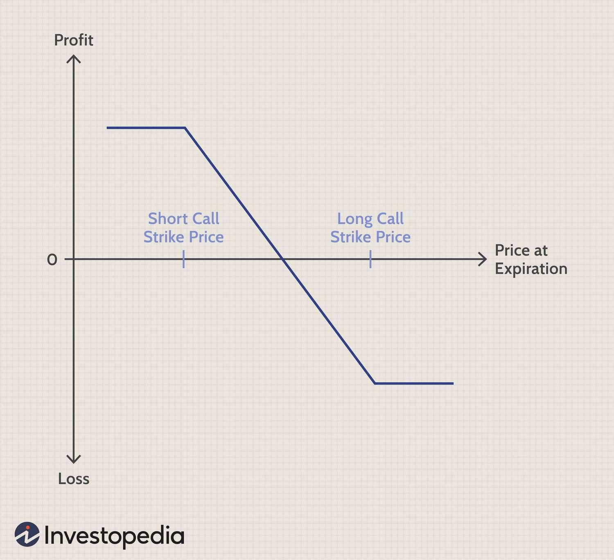

## Table of Contents

## What is a vertical option spread?

A vertical option spread is a trading strategy where you buy and sell options of the same type (either calls or puts) and the same expiration date, but with different strike prices. This strategy is called "vertical" because the strike prices are on the vertical axis of an option chain. The goal is to make money from the difference in the price changes of the two options.

For example, if you think a stock's price will go up a little, you might buy a call option with a lower strike price and sell a call option with a higher strike price. This is called a bull call spread. If the stock price goes up as expected, the option you bought will increase in value more than the option you sold, and you can make a profit. The risk is limited because the most you can lose is the cost of setting up the spread.

## What are the basic types of vertical option spreads?

There are two main types of vertical option spreads: call spreads and put spreads. Call spreads involve using call options, which give you the right to buy a stock at a certain price. Put spreads use put options, which give you the right to sell a stock at a certain price. Both types can be set up to make money if you think the stock price will go up or down.

For call spreads, if you think the stock price will go up, you can buy a call option with a lower strike price and sell a call option with a higher strike price. This is called a bull call spread. If you think the stock price will go down, you can buy a call option with a higher strike price and sell a call option with a lower strike price. This is called a bear call spread. For put spreads, if you think the stock price will go down, you can buy a put option with a higher strike price and sell a put option with a lower strike price. This is called a bear put spread. If you think the stock price will go up, you can buy a put option with a lower strike price and sell a put option with a higher strike price. This is called a bull put spread.

These strategies help you manage risk because the most you can lose is the cost of setting up the spread. They also limit your potential profit, but they can be a good way to trade if you have a specific view on how a stock's price will move.

## How does a bull call spread work?

A bull call spread is a way to make money if you think a stock's price will go up a bit. You buy a call option with a lower strike price and sell a call option with a higher strike price. Both options have the same expiration date. The call option you buy gives you the right to buy the stock at the lower price, and the call option you sell means someone else can buy the stock from you at the higher price if they want to. The cost to set up this spread is the price you pay for the call you buy minus the money you get from selling the other call.

If the stock price goes up, but not too high, you can make a profit. The call option you bought will be worth more because you can buy the stock at a lower price than it's trading at. The call option you sold might also be worth more, but you keep the money you got from selling it, which helps reduce your cost. The most you can lose is the money you spent to set up the spread. The most you can make is the difference between the two strike prices minus the cost of the spread. It's a good strategy if you think the stock will go up a bit, but you want to limit your risk.

## How does a bear put spread work?

A bear put spread is a way to make money if you think a stock's price will go down a bit. You buy a put option with a higher strike price and sell a put option with a lower strike price. Both options have the same expiration date. The put option you buy gives you the right to sell the stock at the higher price, and the put option you sell means someone else can sell the stock to you at the lower price if they want to. The cost to set up this spread is the price you pay for the put you buy minus the money you get from selling the other put.

If the stock price goes down, but not too low, you can make a profit. The put option you bought will be worth more because you can sell the stock at a higher price than it's trading at. The put option you sold might also be worth more, but you keep the money you got from selling it, which helps reduce your cost. The most you can lose is the money you spent to set up the spread. The most you can make is the difference between the two strike prices minus the cost of the spread. It's a good strategy if you think the stock will go down a bit, but you want to limit your risk.

## What are the key differences between a bull call spread and a bear put spread?

A bull call spread is used when you think a stock's price will go up a little. You buy a call option with a lower strike price and sell a call option with a higher strike price. Both options have the same expiration date. This means you have the right to buy the stock at the lower price, but someone else can buy it from you at the higher price if they want to. If the stock price goes up but not too high, you can make a profit. The most you can lose is the money you spent to set up the spread.

A bear put spread is used when you think a stock's price will go down a little. You buy a put option with a higher strike price and sell a put option with a lower strike price. Both options also have the same expiration date. This means you have the right to sell the stock at the higher price, but someone else can sell it to you at the lower price if they want to. If the stock price goes down but not too low, you can make a profit. The most you can lose is the money you spent to set up the spread.

The main difference between a bull call spread and a bear put spread is the direction you think the stock price will move. A bull call spread is for when you think the price will go up, and a bear put spread is for when you think the price will go down. Both strategies help you limit your risk because the most you can lose is what you paid to set up the spread.

## What is a bull put spread and how is it used?

A bull put spread is a way to make money if you think a stock's price will go up a little or stay the same. You do this by selling a put option with a higher strike price and buying a put option with a lower strike price. Both options have the same expiration date. The put option you sell means someone else can sell the stock to you at the higher price if they want to. The put option you buy gives you the right to sell the stock at the lower price. You get money from selling the put with the higher strike price, and you use some of that money to buy the put with the lower strike price. The money you keep is your profit if the stock price stays above the higher strike price.

If the stock price stays above the higher strike price until the options expire, the put you sold will not be used, and you keep the money you got from selling it. The put you bought will also be worthless, but you already spent less on it than you got from selling the other put. The most you can make is the money you got from setting up the spread. The most you can lose is the difference between the two strike prices minus the money you got from setting up the spread. This strategy is good if you think the stock will go up a little or stay the same, but you want to limit your risk.

## What is a bear call spread and how is it implemented?

A bear call spread is a way to make money if you think a stock's price will go down a little. You do this by selling a call option with a lower strike price and buying a call option with a higher strike price. Both options have the same expiration date. The call option you sell means someone else can buy the stock from you at the lower price if they want to. The call option you buy gives you the right to buy the stock at the higher price. You get money from selling the call with the lower strike price, and you use some of that money to buy the call with the higher strike price. The money you keep is your profit if the stock price stays below the lower strike price.

If the stock price stays below the lower strike price until the options expire, the call you sold will not be used, and you keep the money you got from selling it. The call you bought will also be worthless, but you already spent less on it than you got from selling the other call. The most you can make is the money you got from setting up the spread. The most you can lose is the difference between the two strike prices minus the money you got from setting up the spread. This strategy is good if you think the stock will go down a little, but you want to limit your risk.

## How do risk and reward profiles differ among various vertical spreads?

The risk and reward profiles of vertical spreads depend on which type you use. A bull call spread and a bull put spread are used when you think the stock price will go up a bit. In a bull call spread, you buy a call option with a lower strike price and sell a call with a higher strike price. The most you can lose is the money you spent to set up the spread, and the most you can make is the difference between the two strike prices minus the cost of the spread. In a bull put spread, you sell a put option with a higher strike price and buy a put with a lower strike price. The most you can lose is the difference between the two strike prices minus the money you got from setting up the spread, and the most you can make is the money you got from setting up the spread.

A bear put spread and a bear call spread are used when you think the stock price will go down a bit. In a bear put spread, you buy a put option with a higher strike price and sell a put with a lower strike price. The most you can lose is the money you spent to set up the spread, and the most you can make is the difference between the two strike prices minus the cost of the spread. In a bear call spread, you sell a call option with a lower strike price and buy a call with a higher strike price. The most you can lose is the difference between the two strike prices minus the money you got from setting up the spread, and the most you can make is the money you got from setting up the spread. Each type of vertical spread helps you limit your risk, but they also limit how much you can make.

## What are the considerations for choosing strike prices in vertical spreads?

When you're choosing strike prices for vertical spreads, you need to think about what you believe will happen to the stock price. If you're doing a bull call spread or a bull put spread because you think the stock will go up a bit, you should pick strike prices that will make you money if the stock goes up as you expect. For a bull call spread, the lower strike price should be close to where the stock is now, and the higher strike price should be where you think the stock might go. For a bull put spread, the higher strike price should be above where the stock is now, and the lower strike price should be where you think the stock won't go.

If you're doing a bear put spread or a bear call spread because you think the stock will go down a bit, you need to pick strike prices that will make you money if the stock goes down as you expect. For a bear put spread, the higher strike price should be close to where the stock is now, and the lower strike price should be where you think the stock might go. For a bear call spread, the lower strike price should be below where the stock is now, and the higher strike price should be where you think the stock won't go. No matter which type of spread you choose, the difference between the strike prices and the cost of setting up the spread will affect how much you can make or lose.

## How does the expiration date affect the strategy of vertical spreads?

The expiration date is really important when you're setting up vertical spreads because it affects how much time you have for the stock price to move in the direction you want. If you pick a short expiration date, there's less time for the stock price to move, so the options will be cheaper. But this also means there's more risk because if the stock price doesn't move enough in the time you have, you might lose money. On the other hand, if you pick a longer expiration date, the options will be more expensive, but you have more time for the stock price to move in your favor, which can be good if you're not sure when the stock price will change.

Choosing the right expiration date depends on what you think will happen to the stock price and how sure you are about it. If you think the stock price will move quickly, a shorter expiration date might be better because you can make money faster. But if you think the stock price will take longer to move, or if you're not sure when it will happen, a longer expiration date might be a safer choice. Either way, the expiration date you choose will affect how much you spend to set up the spread and how much risk you're taking on.

## What are advanced strategies involving vertical spreads, such as the iron condor?

An advanced strategy that uses vertical spreads is the iron condor. An iron condor is a way to make money if you think a stock's price will stay in a certain range. You do this by setting up two vertical spreads at the same time. You sell a call spread and a put spread. The call spread means you sell a call option with a lower strike price and buy a call with a higher strike price. The put spread means you sell a put option with a higher strike price and buy a put with a lower strike price. All four options have the same expiration date. If the stock price stays between the strike prices of the options you sold, you can keep the money you got from setting up the spreads. The most you can lose is the difference between the strike prices of the options you bought and sold, minus the money you got from setting up the spreads.

Another advanced strategy is the butterfly spread, which also uses vertical spreads. A butterfly spread is a way to make money if you think a stock's price will stay close to a certain price. You set up this spread by buying a call option with a lower strike price, selling two call options with a middle strike price, and buying a call option with a higher strike price. All the options have the same expiration date. If the stock price is at the middle strike price when the options expire, you can make the most money. The most you can lose is the money you spent to set up the spread. Butterfly spreads can be set up with put options too, and they work the same way. These advanced strategies help you make money in different ways, but they also have their own risks and rewards.

## How can one adjust vertical spreads in response to market movements?

If the market moves in a way you didn't expect, you can adjust your vertical spreads to try to make or lose less money. If you have a bull call spread and the stock price goes down instead of up, you might want to close the spread early to lose less money. You can do this by selling the call you bought and buying back the call you sold. If the stock price goes up a lot, you might want to close the spread to lock in your profit. You can also roll the spread, which means you close the current spread and open a new one with different strike prices or a different expiration date. This can help you keep making money if you think the stock will keep moving in the same direction.

Another way to adjust vertical spreads is by adding more options to your position. For example, if you have a bear put spread and the stock price goes up instead of down, you can buy more put options with a higher strike price to protect your position. This is called legging into a new spread. You can also adjust the spread by changing the ratio of the options you buy and sell. For example, if you have a bull call spread and the stock price goes up a lot, you can sell more calls with a higher strike price to make more money if the stock keeps going up. Adjusting your vertical spreads can help you manage risk and make the most of the market movements, but it's important to understand how each change will affect your position.

## What are Option Spreads and Vertical Spreads and how are they explained?

Option spreads represent strategic approaches in options trading that involve buying and selling multiple options contracts simultaneously to achieve a desired risk-reward profile. They are employed primarily to manage risk, enhance returns, or exploit market expectations with a limited risk exposure.

### Vertical Spreads Explained

Vertical spreads are a type of option spread that involves buying and selling options of the same class (calls or puts), same expiration date, but with different strike prices. They are categorized into two main types: bull call spreads and bear put spreads.

1. **Bull Call Spread**: This strategy is used when a trader anticipates a moderate rise in the price of the underlying asset. It involves buying a call option with a lower strike price and selling another call option with a higher strike price. The maximum profit is the difference between the strike prices minus the cost of the spread, while the maximum loss is limited to the initial premium paid for the spread.

    **Example**: Consider a stock trading at $50. A trader could execute a bull call spread by buying a call option with a $50 strike price for $3, and selling a call option with a $55 strike price for $1. The net cost is $2 ($3 - $1), which is the maximum potential loss. If the stock price at expiration is $55 or higher, the maximum profit would be $3 ($5 - $2).
$$
   \text{Maximum Profit} = \text{difference between strikes} - \text{net cost} = 5 - 2 = \$3

$$
$$
   \text{Maximum Loss} = \text{net cost} = \$2

$$

2. **Bear Put Spread**: This strategy anticipates a moderate decline in the price of the underlying. It consists of buying a put option with a higher strike price and selling another put option with a lower strike price. The maximum profit and loss are calculated similarly to the bull call spread.

    **Example**: For a stock trading at $50, a bear put spread can be initiated by buying a put with a $55 strike price for $4, and selling a put with a $50 strike price for $2. The net cost here is $2, which represents the maximum loss. If the stock price drops to $50 or below at expiration, the profit is $3.
$$
   \text{Maximum Profit} = (\text{higher strike} - \text{lower strike}) - \text{net cost} = 5 - 2 = \$3

$$
$$
   \text{Maximum Loss} = \text{net cost} = \$2

$$

### Debit vs Credit Spreads

Vertical spreads can also be distinguished by their financial flow; these are known as debit and credit spreads.

- **Debit Spreads**: These involve an outflow of funds, as the premium paid for the purchased option exceeds the premium received from the sold option. Bull call spreads and bear put spreads are typically structured as debit spreads because they involve a net premium payment.

- **Credit Spreads**: Conversely, credit spreads involve an inflow of funds, as the premium received from the option sold is greater than the premium paid for the option purchased. An example would be selling a call option with a lower strike and buying another with a higher strike in a credit call spread.

### Application of Vertical Spreads in Various Market Conditions

Vertical spreads are versatile and can adapt to different market conditions:

- **Neutral to Bullish Market**: Employing a bull call spread capitalizes on a moderate upward move in the asset price, limiting risk compared to straight call option buying.

- **Neutral to Bearish Market**: A bear put spread benefits from a moderate downward move, again limiting risk compared to outright put purchases.

By using vertical spreads, traders benefit from flexibility in managing risk and potential returns, making them a fundamental strategy in options trading portfolios. They allow traders to focus on price ranges or movements within defined parameters, providing more predictable outcomes in various market scenarios.

## References & Further Reading

[1]: Natenberg, S. (1994). ["Option Volatility and Pricing: Advanced Trading Strategies and Techniques"](https://www.amazon.com/Option-Volatility-Pricing-Strategies-Techniques/dp/0071818774). McGraw-Hill.

[2]: Hull, J. C. (2017). ["Options, Futures, and Other Derivatives"](https://www.semanticscholar.org/paper/Options%2C-Futures%2C-and-Other-Derivatives-Hull/89bdee500c8623864fc9eb7a471546aa713acc44). Pearson.

[3]: Lopez de Prado, M. (2018). ["Advances in Financial Machine Learning"](https://www.amazon.com/Advances-Financial-Machine-Learning-Marcos/dp/1119482089). Wiley.

[4]: Jansen, S. (2020). ["Machine Learning for Algorithmic Trading, Second Edition"](https://www.amazon.com/Machine-Learning-Algorithmic-Trading-alternative-ebook/dp/B08D9SP6MB). Packt Publishing.

[5]: Chan, E. P. (2008). ["Quantitative Trading: How to Build Your Own Algorithmic Trading Business"](https://github.com/ftvision/quant_trading_echan_book). Wiley.