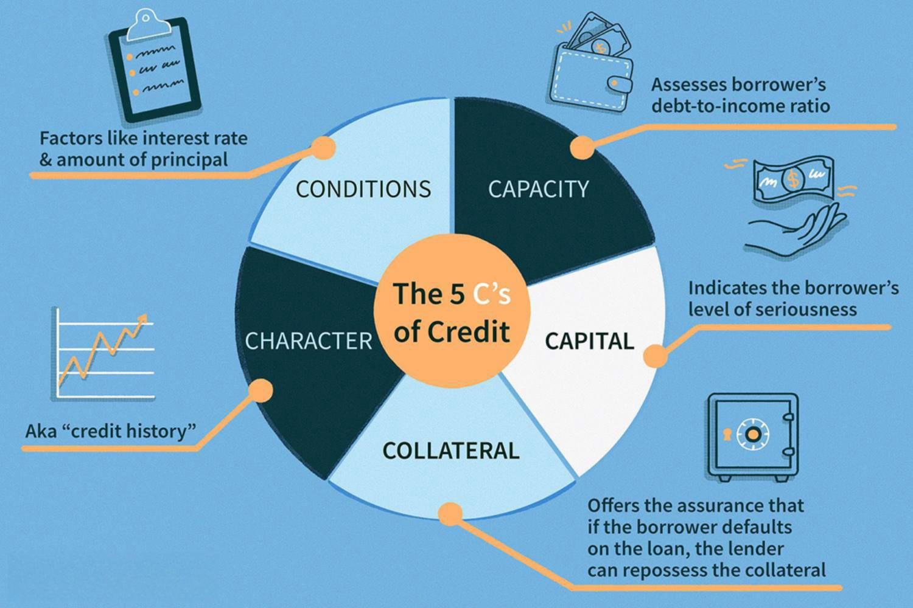

In recent years, financial technology has fundamentally transformed the landscape of financial markets, reshaping how we engage with money, investments, and global economic systems. At the forefront of this transformation is tZero, a pioneering entity in the realm of blockchain technology, which has introduced groundbreaking advancements within financial markets. By merging blockchain with financial technology, tZero is leading efforts to enhance trading platforms, significantly boosting transparency and operational efficiency.

A critical component of this advancement is algorithmic trading, often referred to as algo trading, which is gaining widespread traction. This method utilizes sophisticated algorithms to execute trades rapidly and accurately, outpacing traditional trading methods. The integration of technology in trading not only accelerates decision-making but also reduces the risk of human error, thus optimizing the trading process.



As financial technologies evolve, so do the regulatory frameworks designed to govern them. These frameworks are being reshaped to ensure the secure and reliable implementation of new technologies. Regulation remains crucial in fostering a safe environment where innovation can thrive without compromising market stability. This article examines the relationship between tZero, regulatory considerations for blockchain, and the evolving landscape of algorithmic trading, assessing both the potential transformations and the challenges that lie ahead for the future of financial technology.

## Table of Contents

## Understanding Financial Technology and Blockchain

Financial technology, commonly referred to as FinTech, represents a transformative integration of technology within the financial services sector. This integration aims to enhance the efficiency, convenience, and overall delivery of financial services to consumers and institutions. FinTech covers a broad spectrum of applications, from digital payments and online lending platforms to more complex financial management solutions like robo-advisors.

At the core of many FinTech innovations lies blockchain technology. Blockchain, described as a distributed ledger, records transactions across multiple computers to ensure data is not altered retroactively. Each block in the blockchain contains a cryptographic hash of the previous block, a timestamp, and transaction data, forming a secure and transparent chain of records. This inherent security and transparency have contributed to blockchain's reputation as a game-changing technology in financial markets. The decentralization of data helps mitigate risks of fraud and provides a clear audit trail, vital for maintaining trust and integrity in financial transactions.

tZero is a notable example of a company leveraging the synergy between FinTech and blockchain. Firmly positioned at the forefront of this technological convergence, tZero is driving significant innovations in trading and financial exchanges. By integrating blockchain technology into its platform, tZero aims to revolutionize traditional trading frameworks. Blockchain's ability to eliminate intermediaries reduces transaction costs and creates an immutable transaction record, which is crucial for auditing and security.

Moreover, blockchain’s applicability extends far beyond [cryptocurrency](/wiki/cryptocurrency), gradually becoming a staple in various financial applications. Its ability to securely record and verify transactions without centralized control makes it suitable for a multitude of uses, including but not limited to supply chain finance, identity verification, and smart contracts.

In summary, the combination of blockchain and FinTech allows for a more efficient, transparent, and cost-effective financial ecosystem. The shift towards digital transactions underpinned by blockchain's security features continues to enhance user trust. As financial institutions increasingly adopt blockchain technology, they are poised to unlock new efficiencies and business models, showcasing blockchain's potential across diverse applications beyond the realm of cryptocurrencies.

## The Role of tZero in Blockchain Innovation

tZero has positioned itself as a pivotal entity in the development and application of blockchain technology, specifically within the capital markets. The company's mission to revolutionize traditional trading systems involves leveraging blockchain to provide enhanced transparency and efficiency. Unlike conventional trading platforms, which often suffer from latency and inefficiencies, tZero employs a blockchain infrastructure that allows for the real-time settlement of trades. This capability not only reduces the associated risks and durations of traditional trading processes but also enhances trust and security through an immutable ledger of transactions.

A key aspect of tZero's strategy involves forging strategic partnerships and collaborations with various financial institutions. These alliances underscore the expanding ecosystem of blockchain adoption within financial services and highlight tZero's commitment to integrating blockchain solutions across various market applications. By working alongside established institutions, tZero is paving the way for blockchain's deeper integration and acceptance in mainstream finance.

Moreover, tZero remains at the forefront of regulatory engagement. Recognizing the importance of regulatory compliance and the necessity of a robust legal framework, the company actively participates in discussions that aim to shape how blockchain technology is regulated in the financial sector. This proactive stance not only positions tZero as a leader in technological innovation but also as an influential voice in forging regulatory guidelines that could dictate the operational standards of blockchain technology in finance for upcoming generations. Through these efforts, tZero is contributing to the creation of a secure, efficient, and transparent financial ecosystem.

## Algorithmic Trading: Revolutionizing the Financial Markets

Algorithmic trading employs computer algorithms to automate the process of trading financial securities based on pre-defined parameters. This method drastically improves the efficiency and speed of trading operations, offering distinct advantages over traditional manual trading. Institutional traders widely adopt this approach due to its capability to process large volumes of trades almost instantaneously, thereby minimizing market impact and preserving confidentiality.

The combination of [algorithmic trading](/wiki/algorithmic-trading) with blockchain technology, particularly on platforms like tZero, offers a modern approach to trading by enhancing security and transparency. Blockchain provides a decentralized ledger system that ensures each transaction's integrity, while algorithmic trading leverages this infrastructure to execute trades seamlessly. This synergy promises a new standard in trading, increasing trust and reducing the opportunities for fraud.

The benefits of algorithmic trading are manifold. It minimizes human error, reduces transaction costs, and enables traders to back-test strategies using historical data. Back-testing involves simulating how a trading strategy would have performed in the past, thereby providing insights into its potential success. This practice enhances decision-making and strategy refinement by allowing traders to optimize their models before actual deployment.

Algorithmic trading also incorporates various strategies, including high-frequency trading ([HFT](/wiki/high-frequency-trading-strategies)), [market making](/wiki/market-making), and statistical [arbitrage](/wiki/arbitrage). Each strategy utilizes complex mathematical models and real-time data analysis. Python, widely used for developing such strategies, offers libraries like NumPy and pandas for data manipulation, and [backtrader](/wiki/backtrader) for back-testing trading strategies. Here's a simple example of an algorithmic trading strategy using Python:

```python
import pandas as pd
import numpy as np
from backtrader import Strategy, Cerebro

class SimpleMovingAverageStrategy(Strategy):
    params = (('period', 14),)

    def __init__(self):
        self.sma = pd.Series(self.data.close).rolling(window=self.params.period).mean()

    def next(self):
        if self.data.close[-1] > self.sma[-1]:
            self.buy()
        elif self.data.close[-1] < self.sma[-1]:
            self.sell()

cerebro = Cerebro()
cerebro.addstrategy(SimpleMovingAverageStrategy)
cerebro.run()
```

This strategy involves using the Simple Moving Average (SMA) to make trading decisions—buy when the stock price rises above the average and sell when it falls below. Such implementations highlight algorithmic trading's potential for precision and efficiency.

As technology advances, trading algorithms continue to evolve, offering greater opportunities and presenting new complexities. Artificial Intelligence and Machine Learning are increasingly incorporated into trading models, allowing for the development of predictive algorithms that not only react to current market conditions but attempt to forecast future trends. This advancement presents both opportunities for enhanced predictive power and challenges in managing increased model complexity and data requirements.

In conclusion, algorithmic trading significantly impacts financial markets by automating and refining trading operations. The integration of blockchain technology further enhances these systems' efficiency and security, making it a critical area of focus for modern financial institutions.

## Regulatory Landscape for Blockchain and Algo Trading

Regulation is essential for the growth and widespread acceptance of blockchain technologies and algorithmic trading within the financial sector. Various regulatory bodies worldwide, such as the U.S. Securities and Exchange Commission (SEC) and the European Securities and Markets Authority (ESMA), are actively developing frameworks to ensure the safe integration of these technologies into traditional financial systems. The complexity of blockchain, with its decentralized and often pseudonymous nature, poses several regulatory challenges. 

For blockchain, key issues include ensuring identity verification and implementing effective anti-money laundering (AML) measures to prevent illicit activities. The unique characteristics of blockchain, such as its immutability and distributed nature, require innovative approaches to regulation that balance security with flexibility. Regulators are also focusing on ensuring market integrity, which involves maintaining fair and orderly markets and preventing fraud and manipulation. 

tZero has taken a proactive role in engaging with regulators to develop trading solutions that are both secure and compliant. By leveraging blockchain technology, tZero aims to enhance transparency and reduce the risk of fraud while simultaneously adhering to regulatory standards. This involves regular dialogue with regulators to understand their concerns and adapt technological solutions to meet regulatory requirements.

Algorithmic trading further complicates the regulatory landscape, as it requires oversight to prevent systemic risks associated with high-frequency trading and market manipulation. Regulatory bodies seek to implement measures that ensure algorithms are tested for compliance and fairness. This includes mandating specific controls for oversight and risk management to avoid unintended market disruptions. 

By aligning regulatory agendas with technological advancements, regulators, companies, and other stakeholders can foster innovation while ensuring market stability. This collaborative approach can help develop robust frameworks that support the growth of blockchain and algorithmic trading, ultimately leading to a more secure and efficient financial system.

## Challenges and Opportunities

The integration of financial technology and blockchain into the existing financial systems offers both challenges and opportunities for the sector. One significant challenge lies in managing technological risks and cybersecurity threats. As these technologies advance, they become targets for cyberattacks, necessitating robust security protocols and continuous monitoring to protect sensitive financial data.

Integrating these new technologies into legacy systems presents additional complexity. Traditional financial infrastructures are often outdated and lack the flexibility needed to support advanced technologies like blockchain. This integration necessitates substantial investments in both infrastructure and training to ensure that existing systems can effectively interact with new digital processes. Financial institutions must be prepared to allocate resources not only for technology upgrades but also to equip their workforce with the necessary skills to operate these modernized systems.

However, the opportunities presented by financial technology and blockchain are manifold. One of the most significant advantages is the enhanced transparency and efficiency within financial markets. By providing immutable ledgers and real-time transaction capabilities, blockchain technology reduces the need for intermediaries, thereby lowering transaction costs and increasing the speed of financial operations. This transparency also fosters trust among market participants, potentially leading to the creation of new revenue streams as more users opt to engage with these technologies.

tZero has effectively demonstrated the potential of blockchain in creating innovative trading solutions. By leveraging blockchain, tZero promotes new market structures that offer greater efficiency and reliability compared to traditional trading systems. This approach not only enhances the functionality of existing markets but also opens up possibilities for entirely new types of financial products and services.

As the financial markets evolve, staying informed and adaptable to these technological changes is crucial for maintaining a competitive edge. Companies and investors who embrace these innovations can capitalize on the systemic improvements they offer. Adapting to emerging technologies can facilitate enhanced market performance and generate substantial competitive advantages, leading to sustained growth and success in an increasingly digital financial landscape.

## Conclusion

The convergence of financial technology, blockchain, and algorithmic trading is driving a transformative shift in financial services, leading to a modernized and innovative industry landscape. At the forefront of blockchain innovation, tZero is capitalizing on its vast potential to revolutionize trading and capital markets by leveraging distributed ledger technology for enhanced transparency, efficiency, and trust among market participants.

Successfully deploying these advanced technologies requires meticulous navigation of the evolving regulatory landscape. Adapting to regulatory requirements is crucial to mitigate risks associated with blockchain and algorithmic trading, ensuring compliance, security, and market integrity while fostering innovation. Regulatory bodies worldwide are increasingly recognizing the importance of establishing clear frameworks that support technological advancements without compromising safety.

As the financial sector continues to evolve, market participants face both challenges and opportunities. The complexities of integrating cutting-edge technologies into traditional systems present obstacles that necessitate strategic investments in infrastructure and skill development. However, the opportunities arising from enhanced operational efficiency, reduced transaction costs, and increased market accessibility are immense. By strategically managing these challenges, stakeholders can harness the full potential of these innovations.

By embracing the advancements offered by financial technology, blockchain, and algorithmic trading, the financial sector is poised to achieve unprecedented levels of efficiency, security, and inclusivity. This transformative period signals a future where financial markets operate with greater transparency and robustness, ultimately benefiting institutions and investors worldwide. The ongoing evolution calls for a proactive approach, where staying informed and adaptable will define success in an increasingly competitive and technologically driven financial environment.

## References & Further Reading

[1]: Lopez de Prado, M. (2018). ["Advances in Financial Machine Learning."](https://www.amazon.com/Advances-Financial-Machine-Learning-Marcos/dp/1119482089) John Wiley & Sons.

[2]: Aronson, D. R. (2006). ["Evidence-Based Technical Analysis: Applying the Scientific Method and Statistical Inference to Trading Signals."](https://www.amazon.com/Evidence-Based-Technical-Analysis-Scientific-Statistical/dp/0470008741) John Wiley & Sons.

[3]: Jansen, S. (2018). ["Machine Learning for Algorithmic Trading."](https://github.com/stefan-jansen/machine-learning-for-trading) Packt Publishing.

[4]: Chan, E. P. (2009). ["Quantitative Trading: How to Build Your Own Algorithmic Trading Business."](https://github.com/ftvision/quant_trading_echan_book) John Wiley & Sons.

[5]: Narang, R. (2009). ["Inside the Black Box: The Simple Truth About Quantitative Trading."](https://onlinelibrary.wiley.com/doi/book/10.1002/9781118267738) John Wiley & Sons.

[6]: Tapscott, D., & Tapscott, A. (2018). ["Blockchain Revolution: How the Technology Behind Bitcoin and Other Cryptocurrencies is Changing the World."](https://archive.org/details/blockchainrevolu0000taps) Portfolio.

[7]: Rosenthal, B. (2018). ["Regulation of Cryptocurrency And Blockchain Technologies: National and International Perspectives."](https://link.springer.com/book/10.1007/978-3-031-21812-5) IELR International Enforcement Law Reporter.