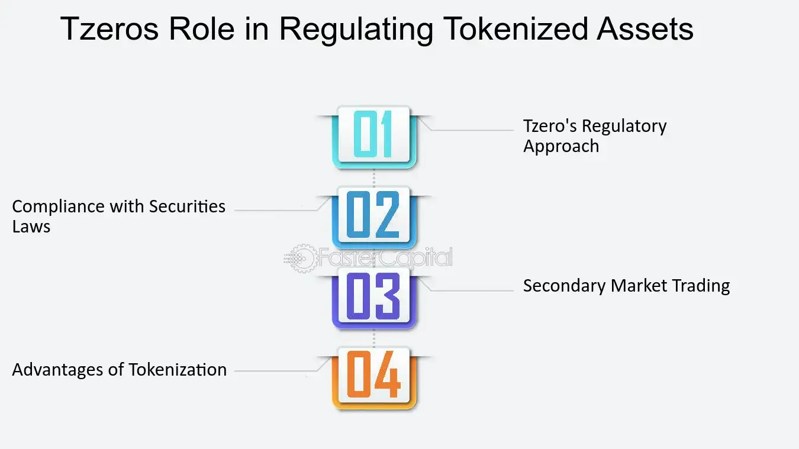

## Table of Contents

## What is tZero and what is its primary function?

tZero is a company that focuses on making trading easier and safer, especially for things like stocks and other financial products. They use technology to help people buy and sell these items without needing to go through traditional ways, which can be slow and complicated. Their main goal is to make the whole process faster and more secure, so people can trust that their trades are done correctly and quickly.

The primary function of tZero is to provide a platform where people can trade securities, like stocks, in a more efficient way. They use something called blockchain technology, which is like a digital ledger that keeps track of all transactions in a very secure way. This helps to make sure that all trades are recorded accurately and can't be changed or messed with, which builds trust in the system. By using this technology, tZero aims to make trading simpler and more reliable for everyone involved.

## How does tZero differ from traditional stock exchanges?

tZero is different from traditional stock exchanges because it uses new technology to make trading easier and faster. Traditional stock exchanges, like the New York Stock Exchange, have been around for a long time and use old systems that can be slow and complicated. tZero, on the other hand, uses blockchain technology, which is like a digital record book that keeps everything safe and quick. This means that when you trade on tZero, you don't have to wait as long for your trades to go through, and you can feel more secure about them.

Another big difference is that tZero aims to make trading more accessible to everyone. Traditional stock exchanges often have a lot of rules and requirements that can make it hard for regular people to trade. tZero wants to change that by making it simpler for anyone to buy and sell stocks and other financial products. They do this by using technology to cut out the middle steps that can slow things down and make them more expensive. So, with tZero, more people can get involved in trading without needing to know all the complicated details of how traditional stock exchanges work.

## What was the motivation behind the creation of tZero?

The main reason for creating tZero was to make trading easier and safer for everyone. The people who started tZero saw that traditional stock exchanges were often slow and hard to use. They wanted to change that by using new technology to make trading faster and more secure. They believed that by using something called blockchain, they could create a system where people could trust that their trades were done correctly and quickly.

Another big motivation was to make trading more accessible. The founders of tZero thought that too many rules and complicated steps kept regular people from being able to trade easily. They wanted to build a platform where anyone could buy and sell stocks without needing to understand all the complex details of traditional stock exchanges. By making trading simpler and more open to everyone, tZero aimed to help more people get involved in the financial markets.

## Can you provide a brief history of tZero's development and key milestones?

tZero was started in 2014 by a company called Overstock.com. They wanted to use new technology to make trading easier and safer. In 2016, tZero got a lot of attention when they announced they were going to use blockchain technology. This is a special kind of digital record-keeping that makes trading faster and more secure. They also started working with other companies to help build their platform.

In 2017, tZero did something called an ICO, which stands for Initial Coin Offering. This is a way to raise money by selling digital tokens. They raised a lot of money to keep building their platform. By 2018, tZero launched a trading app that let people buy and sell stocks and other financial products. They kept working to make their platform better and more user-friendly. Over the years, tZero has grown and made partnerships with other companies to keep improving their services.

## Who are the founders and key figures involved in tZero?

tZero was started by Patrick Byrne, who is also the founder of Overstock.com. Patrick wanted to use new technology to make trading easier and safer for everyone. He saw that traditional stock exchanges were slow and hard to use, so he decided to create tZero to change that. Patrick has been a big part of guiding tZero and making sure it stays true to its goals.

Another important person at tZero is Joe Cammarata, who is the CEO. Joe has been working to make tZero's platform better and more user-friendly. He helps lead the company and works with other people to keep improving the way tZero works. Together, Patrick and Joe have been key in making tZero what it is today.

## What are the main technological features that tZero uses to facilitate trading?

tZero uses blockchain technology to make trading faster and more secure. Blockchain is like a digital record book that keeps track of all trades in a way that can't be changed or messed with. This means that when you trade on tZero, you can trust that your trades are recorded correctly and quickly. It also helps to cut out the middle steps that can slow things down and make them more expensive.

Another important feature is tZero's trading app, which makes it easy for people to buy and sell stocks and other financial products. The app is designed to be simple to use, so anyone can start trading without needing to know all the complicated details of traditional stock exchanges. By using this technology, tZero aims to make trading more accessible to everyone and help more people get involved in the financial markets.

## How does tZero ensure the security and integrity of transactions?

tZero uses blockchain technology to keep transactions safe and honest. Blockchain is like a digital record book that keeps track of all trades in a way that can't be changed or messed with. This means that when you trade on tZero, you can trust that your trades are recorded correctly and quickly. It's like having a super secure diary that everyone can see but no one can change.

Another way tZero makes sure transactions are secure is by using smart contracts. These are like special rules that automatically check and make sure everything in a trade is done right. If something doesn't match the rules, the trade won't happen. This helps to stop mistakes and cheating, making the whole trading process more trustworthy.

## What regulatory challenges has tZero faced, and how have they been addressed?

tZero has faced some challenges with rules and laws because they use new technology to trade. When they started, they had to make sure they followed all the rules set by the government and other groups that watch over trading. This was hard because blockchain and other new ways of trading were not common, and the rules were not always clear. tZero had to work with these groups to make sure they were doing everything right and to help make new rules that fit their way of trading.

To deal with these challenges, tZero talked a lot with the people who make the rules. They explained how their technology works and why it's safe and good for trading. They also made changes to their platform to follow the rules better. Over time, tZero has been able to work with regulators to find ways to keep trading safe and fair while still using their new technology. This has helped them grow and keep doing what they set out to do.

## How does tZero comply with existing financial regulations in different jurisdictions?

tZero works hard to follow the rules in different places where they do business. They know that each country has its own laws about trading and using new technology like blockchain. So, tZero talks a lot with the people who make these rules to make sure they are doing everything right. They change their platform to fit the rules in each place, which can be a lot of work but helps them stay out of trouble and keep trading safe for everyone.

To make sure they follow the rules, tZero also hires experts who know a lot about the laws in different countries. These experts help tZero understand what they need to do to stay legal. By working closely with these experts and the people who make the rules, tZero can keep using their new technology while still following the law. This way, they can help more people trade without breaking any rules.

## What impact has tZero had on the financial industry, particularly in terms of market efficiency and accessibility?

tZero has made a big difference in the financial world by making trading faster and easier. They use a special technology called blockchain, which is like a digital record book that keeps everything safe and quick. This means that when people trade on tZero, they don't have to wait as long for their trades to go through. It's like going from a slow, old computer to a fast, new one. This has helped make the whole market work better because trades can happen more quickly and with less chance of mistakes.

tZero has also made trading more open to everyone. Before, trading on big stock exchanges could be hard because there were a lot of rules and steps that made it complicated. tZero wanted to change that by making it simpler for anyone to buy and sell stocks. They built a platform that is easy to use, so even people who don't know a lot about trading can get started. This has helped more people join the financial markets and feel like they can be part of it too.

## What are the future plans and potential developments for tZero?

tZero wants to keep making trading easier and safer for everyone. They plan to add more things you can trade on their platform, like different kinds of stocks and other financial products. They also want to use even newer technology to make trading even faster and more secure. This could mean working with other companies to build new tools and features that help people trade better.

Another big plan for tZero is to grow in more places around the world. They want to make sure their platform works well in different countries and follows all the rules there. This means they will keep talking to the people who make the rules and change their platform to fit what each country needs. By doing this, tZero hopes to help even more people trade and be part of the financial markets, no matter where they live.

## How does tZero's approach to tokenization and blockchain technology compare to other platforms in the industry?

tZero uses blockchain technology to make trading easier and safer. They turn things like stocks into digital tokens, which are like special pieces of code that represent the stocks. This makes it easier to trade them quickly and securely. Other platforms in the industry also use blockchain and tokenization, but tZero focuses a lot on making sure everything is very safe and follows the rules. They work closely with the people who make the rules to make sure they are doing everything right.

Compared to other platforms, tZero tries to make trading simpler for everyone. They have a user-friendly app that anyone can use, even if they don't know a lot about trading. Some other platforms might be more complicated or focused on different kinds of trading. tZero wants to help more people get involved in the financial markets by making it easy and safe to trade. They keep working to improve their technology and add new things you can trade, which sets them apart from others in the industry.

## References & Further Reading

[1]: Lopez de Prado, M. (2018). ["Advances in Financial Machine Learning."](https://www.amazon.com/Advances-Financial-Machine-Learning-Marcos/dp/1119482089) John Wiley & Sons.

[2]: Aronson, D. R. (2006). ["Evidence-Based Technical Analysis: Applying the Scientific Method and Statistical Inference to Trading Signals."](https://www.amazon.com/Evidence-Based-Technical-Analysis-Scientific-Statistical/dp/0470008741) John Wiley & Sons.

[3]: Jansen, S. (2018). ["Machine Learning for Algorithmic Trading."](https://github.com/stefan-jansen/machine-learning-for-trading) Packt Publishing.

[4]: Chan, E. P. (2009). ["Quantitative Trading: How to Build Your Own Algorithmic Trading Business."](https://github.com/ftvision/quant_trading_echan_book) John Wiley & Sons.

[5]: Narang, R. (2009). ["Inside the Black Box: The Simple Truth About Quantitative Trading."](https://onlinelibrary.wiley.com/doi/book/10.1002/9781118267738) John Wiley & Sons.

[6]: Tapscott, D., & Tapscott, A. (2018). ["Blockchain Revolution: How the Technology Behind Bitcoin and Other Cryptocurrencies is Changing the World."](https://archive.org/details/blockchainrevolu0000taps) Portfolio.

[7]: Rosenthal, B. (2018). ["Regulation of Cryptocurrency And Blockchain Technologies: National and International Perspectives."](https://link.springer.com/book/10.1007/978-3-031-21812-5) IELR International Enforcement Law Reporter.