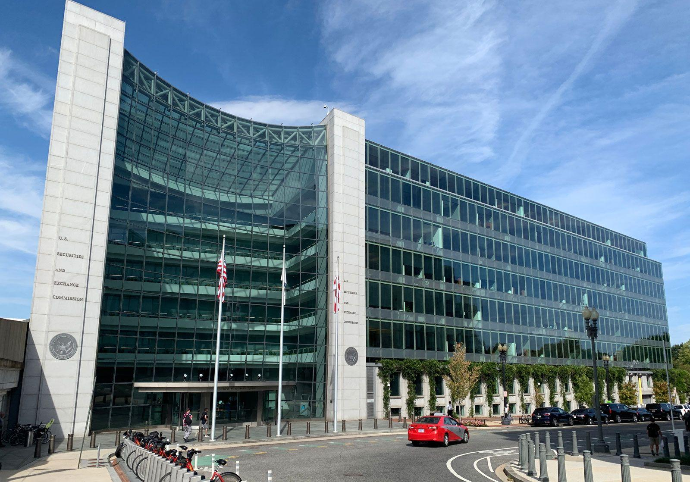

The U.S. Securities and Exchange Commission (SEC) functions as the primary regulator of securities markets in the United States. Its mission is to safeguard investors, ensure that markets are fair, orderly, and efficient, and assist in capital formation. Central to the SEC's regulatory mandate is the oversight of trading practices, particularly with the rise of algorithmic trading methodologies that leverage automation and predefined instructions to execute trades.

Algorithmic trading, commonly referred to as algo trading or automated trading, involves the utilization of computers to follow a set of instructions or an algorithm for placing trades. It is a method designed to benefit from market conditions and execute transactions at speeds and frequencies beyond human capabilities. While offering enhanced market efficiency and liquidity, algorithmic trading also brings complexities, especially given the rapid pace of technological developments that characterize modern financial markets.

In this detailed examination, the focus is on the SEC's critical regulatory framework and its role in maintaining the integrity of these increasingly automated markets. The challenges and opportunities posed by algorithmic trading are unique, requiring innovative regulatory responses to adapt to fast-changing environments.

The SEC's responsibilities in regulating algorithmic trading are pivotal, ensuring that advancements in technology do not compromise market fairness or stability. This involves not only monitoring and adapting regulatory frameworks but also addressing the evolving landscape of trading activities driven by algorithms, which play an integral role in today's financial systems. As technology continues to evolve, the balance between harnessing these advancements for market efficiency and safeguarding against potential risks remains a core focus for the SEC.

## Table of Contents

## The Regulatory Role of the SEC

The U.S. Securities and Exchange Commission (SEC) was established in 1934, following the stock market crash of 1929 and the subsequent Great Depression. Its foundational purpose is to regulate the securities markets and provide protection to investors. The SEC is mandated to promote stable and efficient markets, enforce securities laws, and ensure transparency and fairness across the financial landscape.

The SEC's regulatory purview encompasses a wide array of significant market participants, including broker-dealers, investment advisors, and exchanges. These entities play a crucial role in the functioning of the financial markets, and the SEC ensures they operate within a framework that promotes integrity and reliability. One of the key responsibilities of the SEC involves overseeing the accurate and timely disclosure of corporate information. This function is critical in providing investors with the necessary data to make informed decisions. The SEC enforces compliance with these disclosure requirements through a robust system of monitoring and enforcement actions against fraudulent activities.

The Division of Trading and Markets is a pivotal arm of the SEC, responsible for the development and implementation of regulations governing the trading sector. This division is essential in creating rules that address various trading practices, including those related to [algorithmic trading](/wiki/algorithmic-trading), which involves using complex algorithms and high-speed data processing to execute trades. The Division of Trading and Markets works to ensure that the trading environment remains fair and impartial, protecting both individual and institutional investors from practices that could undermine market stability.

By enforcing regulations that address trading activities, corporate disclosures, and anti-fraud measures, the SEC maintains its mission to promote investor confidence and market integrity. Through these regulatory efforts, the SEC plays a continuous role in shaping an environment conducive to fair and efficient capital markets in the United States.

## Understanding Algorithmic Trading

Algorithmic trading, often referred to as algo trading or automated trading, employs computer algorithms to execute trading processes. These algorithms are essentially a set of rules or instructions programmed to perform specific tasks, such as executing trades based on predefined criteria like price movements, timing, and market trends, allowing traders to execute complex trading strategies with minimal human intervention.

The primary advantage of algorithmic trading lies in its ability to process large volumes of data and execute trades at speeds and frequencies unattainable by humans. This rapid execution is made possible through advanced computational power and network connectivity, enabling trades to be completed in milliseconds — a time frame commonly characterized as high-frequency trading ([HFT](/wiki/high-frequency-trading-strategies)). This capability significantly enhances market efficiency by enabling more precise pricing and increasing [liquidity](/wiki/liquidity-risk-premium) in the markets.

However, the acceleration and automation introduced by algorithmic trading also present several risks. The speed and complexity of these trades can contribute to market [volatility](/wiki/volatility-trading-strategies) and increase the likelihood of systemic failures. For instance, during the "Flash Crash" of May 6, 2010, the Dow Jones Industrial Average plunged about 1,000 points — nearly 9% — within minutes, primarily driven by automated trading algorithms. Such events highlight the potential for algorithms to exacerbate price movements, leading to abrupt and severe market disruptions.

To address these concerns, robust regulatory frameworks have become indispensable. Effective oversight involves not only the monitoring of algorithms' performance but also the establishment of stringent compliance and risk management protocols. Regulators require firms employing algorithmic trading to conduct thorough testing of trading software and implement supervisory procedures designed to prevent errant trades and system malfunctions.

Moreover, continuous monitoring and adjustment of algorithms to adapt to market conditions are vital to managing the inherent risks. This includes using risk management tools such as circuit breakers, which automatically halt trading if a stock's price experiences an extreme fluctuation within a short period. These measures are crucial for maintaining market stability and protecting investors from the adverse effects of rapid, automated trading.

In conclusion, while algorithmic trading brings measurable efficiencies and advancements to financial markets, it also introduces unique challenges. Balancing these benefits with proper oversight and regulation is crucial to ensuring that algorithmic trading contributes positively to market function without compromising integrity and stability.

## SEC Regulations on Algorithmic Trading

The regulatory framework for algorithmic trading operated by the U.S. Securities and Exchange Commission (SEC) is meticulously crafted to ensure the protection of market participants while promoting fair trading practices. A significant aspect of this framework is the requirement, in collaboration with the Financial Industry Regulatory Authority (FINRA), for firms engaged in algorithmic trading to establish robust supervisory systems. These systems are designed to oversee the deployment and functioning of trading algorithms, ensuring compliance with applicable regulations and mitigating potential risks associated with automated trading activities.

A cornerstone of these regulations is the stipulation that firms must perform comprehensive software testing. This involves rigorous testing of trading algorithms to identify and rectify any issues before they are deployed in live markets. The testing protocols ensure that algorithms behave as expected under various market conditions, minimizing the risk of unintended trades or market disruptions. Furthermore, risk management frameworks are mandated to be integrated into the trading systems. These frameworks are designed to monitor and control the financial risks associated with algorithmic trading, such as market volatility, liquidity risks, and counterparty risks.

Regular compliance checks are another critical component of the SEC's regulatory framework. These checks are aimed at ensuring that trading activities adhere to established rules and regulations. Compliance staff are tasked with conducting these assessments, requiring firms to maintain clear communication channels between their compliance teams and personnel involved in the development and execution of algorithmic trading strategies. This collaboration facilitates timely identification and resolution of compliance issues and ensures that all trading activities are aligned with regulatory standards.

Moreover, continuous assessments of both algorithms and market strategies are required to adapt to evolving risks. As market conditions fluctuate and new risks emerge, it is imperative that trading algorithms are reassessed and updated accordingly. This dynamic approach to algorithm management enables firms to remain agile and responsive to changes in the trading environment, thereby maintaining the integrity and efficiency of market operations.

In conclusion, the SEC's regulatory framework for algorithmic trading is structured to safeguard market participants by requiring rigorous software testing, robust risk management, regular compliance checks, and continuous strategy assessments. These measures ensure that trading activities are conducted in a manner that is fair, transparent, and resilient to the rapid changes inherent in today's financial markets.

## Challenges in Regulating Algorithmic Trading

Algorithmic trading, while offering unmatched speed and efficiency, also presents unique regulatory challenges due to its inherent complexity and rapid execution capabilities. One significant issue is the increased risk of market manipulation tactics, such as spoofing and layering. Spoofing involves placing large orders with the intent to cancel before execution, misleading the market about supply and demand. Layering is a similar tactic, where traders place multiple orders at various price levels to create a false impression of market activity. Both practices can disrupt market integrity and disadvantage other market participants.

The dynamic nature of technology in trading requires the SEC to continually update and refine its regulatory framework. Advancements in algorithmic strategies and the introduction of new technologies necessitate that regulations evolve swiftly to remain effective. This not only includes adapting existing rules but also developing new regulations that can anticipate and mitigate potential risks introduced by emerging innovations.

Cross-border trading further complicates regulatory oversight as different countries have diverse regulatory standards. This variation can lead to challenges in enforcing consistent practices across international trading platforms. The SEC, therefore, must engage in ongoing dialogue and collaboration with global regulatory bodies to harmonize regulations and ensure a cohesive approach to monitoring and controlling algorithmic trading activities.

Comprehensive market surveillance is vital to detect and address suspicious trading activities promptly. Advanced analytic tools and increased transparency can aid regulators in identifying manipulative practices. By fostering international cooperation and leveraging technological advancements, regulators can better align their strategies and enhance their ability to oversee rapidly evolving financial markets.

## The Future of Algorithmic Trading and Regulation

With the advancements in [machine learning](/wiki/machine-learning) and [artificial intelligence](/wiki/ai-artificial-intelligence), the landscape of algorithmic trading is expected to witness remarkable transformations. These technologies can process vast datasets more efficiently than traditional algorithms, leading to more sophisticated trading strategies and potentially greater profits. However, this evolution also brings additional challenges for regulators like the U.S. Securities and Exchange Commission (SEC), which is tasked with ensuring that financial markets remain equitable and transparent.

The SEC is actively working to enhance its regulatory framework to tackle these emerging challenges. Adapting to technological progress is essential to strike an appropriate balance between fostering innovation in trading technology and maintaining robust market integrity. This involves updating existing rules and potentially drafting new regulations to manage potential risks that accompany novel trading strategies driven by advanced technologies.

A proactive regulatory approach is crucial. This involves continuous monitoring and analysis of technological trends in financial markets, ensuring that new regulations are not only responsive to current conditions but also anticipatory of future developments. For instance, regulators could implement real-time data analytics tools to monitor trading activities and detect irregular patterns that may indicate manipulative behavior.

Engagement with industry participants and stakeholders is a key component of developing effective regulatory policies. The SEC acknowledges the importance of collaborating with market participants, including technology firms, trading entities, and academic institutions. These collaborations help the SEC understand practical challenges and opportunities within algorithmic trading, fostering a regulatory environment that is informed and practical.

As markets evolve, so must the strategies and tools employed by regulators. An ongoing assessment and refinement of regulatory methodologies are essential to maintain fairness, transparency, and efficiency. This includes investing in regulatory technologies (RegTech) that can automate compliance processes, analyze market data, and provide insights into trading behaviors. For example, machine learning algorithms could be used to enhance the SEC's surveillance capabilities, offering more predictive insights into potential market abuses.

In conclusion, the future of algorithmic trading will be shaped by the interplay between cutting-edge technologies and sophisticated regulatory frameworks. The SEC's commitment to adaptation and proactive regulation will be pivotal in ensuring that algorithmic trading continues to contribute positively to the U.S. financial markets.

## Conclusion

Algorithmic trading has become an integral part of today's financial markets, providing both significant advantages and inherent risks. These automated trading systems increase market liquidity and enable rapid execution of trades, contributing to enhanced market efficiency. However, the complex nature of algorithmic trading, capable of executing high-frequency transactions, also presents challenges, such as heightened market volatility and potential systemic risks.

The U.S. Securities and Exchange Commission (SEC) plays a crucial role in regulating algorithmic trading to protect market integrity and safeguard investors. Through its comprehensive regulatory framework, the SEC seeks to maintain transparent and fair trading practices. This is achieved by enforcing rules that require algorithmic trading firms to implement rigorous supervisory systems, perform consistent software testing, manage risks effectively, and undergo regular compliance checks.

As technology evolves, regulatory frameworks must also adapt to the advancements in algorithmic trading, particularly with the emergence of machine learning and artificial intelligence. These new technologies promise to make algorithmic strategies increasingly sophisticated, necessitating a proactive and flexible regulatory approach.

The SEC continues to prioritize market oversight and effective collaboration with industry participants to ensure that algorithmic trading fosters market development rather than instability. By doing so, the potential benefits of algorithmic trading can be maximized, driving greater efficiency and innovation within U.S. financial markets. With diligent regulation and industry cooperation, the SEC is positioned to support a stable and progressive market environment.

## References & Further Reading

[1]: Aldridge, I. (2013). ["High-Frequency Trading: A Practical Guide to Algorithmic Strategies and Trading Systems"](https://www.amazon.com/High-Frequency-Trading-Practical-Algorithmic-Strategies/dp/1118343506). Wiley.

[2]: Patterson, S. (2013). ["Dark Pools: High-Speed Traders, A.I. Bandits, and the Threat to the Global Financial System."](https://dl.acm.org/doi/10.5555/2385786) Crown Business.

[3]: Kissell, R. (2014). ["The Science of Algorithmic Trading and Portfolio Management"](https://www.sciencedirect.com/book/9780124016897/the-science-of-algorithmic-trading-and-portfolio-management). Academic Press.

[4]: Securities and Exchange Commission. ["SEC Rulemaking"](https://www.sec.gov/rules-regulations/rulemaking-activity). U.S. Securities and Exchange Commission.

[5]: Financial Industry Regulatory Authority (FINRA). ["Algorithmic Trading Compliance"](https://www.finra.org/rules-guidance/key-topics/algorithmic-trading). FINRA.

[6]: Biais, B., Foucault, T., & Moinas, S. (2015). ["Equilibrium Fast Trading"](https://www.sciencedirect.com/science/article/pii/S0304405X15000288). Review of Financial Studies, 28(7), 1899–1935.

[7]: Lewis, M. (2014). ["Flash Boys: A Wall Street Revolt"](https://en.wikipedia.org/wiki/Flash_Boys). W. W. Norton & Company.