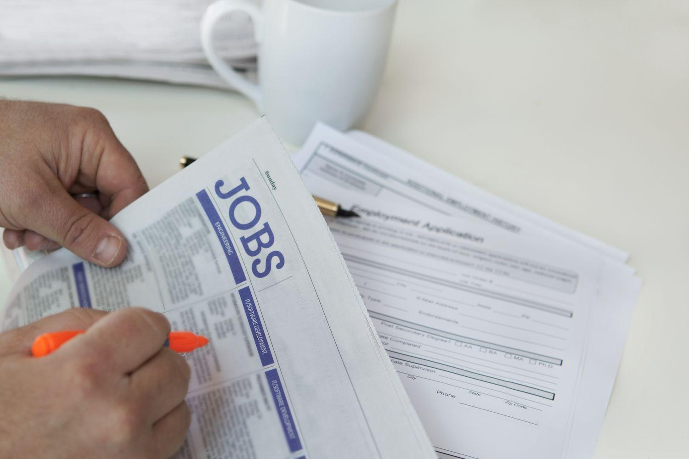

## Table of Contents

## What is the U-6 unemployment rate?

The U-6 unemployment rate is a broader measure of unemployment in the United States. It includes not only people who are jobless and actively looking for work, but also those who are working part-time because they cannot find full-time jobs, and people who are marginally attached to the labor force. These are people who want to work and have looked for a job in the past year but are not currently looking.

The U-6 rate gives a more complete picture of unemployment than the more commonly reported U-3 rate, which only counts those who are jobless and actively seeking employment. For example, if someone is working part-time but wants a full-time job, they are counted in the U-6 rate but not in the U-3 rate. This makes the U-6 rate a useful tool for understanding the true extent of unemployment and underemployment in the economy.

## How does the U-6 unemployment rate differ from the U-3 rate?

The U-6 unemployment rate and the U-3 rate are two different ways to measure unemployment in the United States. The U-3 rate is the official unemployment rate that you often hear about in the news. It counts people who are out of work and actively looking for a job. If you're not looking for a job, you're not counted in the U-3 rate, even if you want to work.

The U-6 rate, on the other hand, is a broader measure. It includes everyone counted in the U-3 rate, but it also adds in people who are working part-time but want full-time work, and people who want a job but have given up looking because they think no jobs are available. This makes the U-6 rate higher than the U-3 rate because it includes more people who are struggling to find the work they want.

So, the main difference is that the U-6 rate gives a fuller picture of unemployment and underemployment. While the U-3 rate focuses only on those actively seeking work, the U-6 rate includes those who are underemployed or have stopped looking for work but still want a job. This makes the U-6 rate a more comprehensive measure of the labor market's health.

## What groups of people are included in the U-6 unemployment rate?

The U-6 unemployment rate includes a wider group of people than the U-3 rate. It counts all the people who are out of work and looking for a job, just like the U-3 rate. But it also includes people who are working part-time even though they want a full-time job. These people are called underemployed because they are not working as much as they want to.

In addition to the underemployed, the U-6 rate also includes people who want to work but have stopped looking for a job. These people are called marginally attached to the labor force. They might have looked for a job in the past year but got discouraged and stopped looking. The U-6 rate counts them because even though they're not looking right now, they still want to work. This makes the U-6 rate a better way to see how many people are struggling to find the work they want.

## Why is the U-6 rate considered a more comprehensive measure of unemployment?

The U-6 rate is considered a more comprehensive measure of unemployment because it includes more people who are having trouble finding work. It counts everyone who is out of work and looking for a job, just like the U-3 rate. But it also includes people who are working part-time even though they want a full-time job. These people are called underemployed because they are not working as much as they want to.

On top of that, the U-6 rate also counts people who want to work but have stopped looking for a job. These people are called marginally attached to the labor force. They might have looked for a job in the past year but got discouraged and stopped looking. By including these groups, the U-6 rate gives a better picture of how many people are struggling to find the work they want, making it a more complete measure of unemployment.

## How is the U-6 unemployment rate calculated?

The U-6 unemployment rate is calculated by adding up different groups of people who are having trouble finding work. It starts with the people who are out of work and looking for a job, which is the same group counted in the U-3 rate. But then it adds people who are working part-time even though they want a full-time job. These people are called underemployed because they are not working as much as they want to.

The U-6 rate also includes people who want to work but have stopped looking for a job. These people are called marginally attached to the labor force. They might have looked for a job in the past year but got discouraged and stopped looking. By counting all these groups, the U-6 rate gives a fuller picture of how many people are struggling to find the work they want.

## What are the main factors that influence the U-6 unemployment rate?

The U-6 unemployment rate can go up or down because of many things. One big thing is the overall health of the economy. When the economy is doing well, businesses hire more people and it's easier to find a job. This can make the U-6 rate go down. But if the economy is not doing well, businesses might not hire as much or might even lay off workers, which can make the U-6 rate go up.

Another [factor](/wiki/factor-investing) is the number of people who are working part-time but want full-time jobs. If a lot of people can only find part-time work even though they want to work more, the U-6 rate will be higher. Also, the number of people who have stopped looking for work but still want a job can affect the U-6 rate. If more people get discouraged and stop looking, even though they want to work, the U-6 rate will go up.

## Can you provide historical data showing trends in the U-6 unemployment rate?

Looking back at history, the U-6 unemployment rate has gone up and down a lot. During good times for the economy, like in the late 1990s and the mid-2000s, the U-6 rate was pretty low. For example, in 2000, it was around 7%. But when the economy had big problems, like during the Great Recession in 2008 and 2009, the U-6 rate went way up. It hit a high of almost 17% in 2010. This shows how the U-6 rate can be a good way to see how the economy is doing.

After the Great Recession, the U-6 rate started to come down slowly. By 2015, it was back down to around 10%, and it kept getting better. In the years before the COVID-19 pandemic, the U-6 rate was around 7% to 8%. But when the pandemic hit in 2020, the U-6 rate jumped up again, going over 20% at one point. Since then, it has been coming down, but it's still a good idea to keep an eye on it to see how the job market is doing.

## How does the U-6 rate correlate with economic cycles?

The U-6 unemployment rate goes up and down with the ups and downs of the economy. When the economy is doing well, businesses are making money and they hire more people. This means more people can find jobs, so the U-6 rate goes down. For example, in the late 1990s and mid-2000s, when the economy was strong, the U-6 rate was low, around 7%.

But when the economy has big problems, like during the Great Recession in 2008 and 2009, businesses stop hiring or even let people go. This makes it harder for people to find work, so the U-6 rate goes up. During the Great Recession, the U-6 rate hit almost 17%. The same thing happened when the COVID-19 pandemic hit in 2020, causing the U-6 rate to spike over 20% as many people lost their jobs or could only find part-time work.

## What are the limitations of using the U-6 unemployment rate as an economic indicator?

The U-6 unemployment rate is a good way to see how many people are having trouble finding work, but it has some problems. One problem is that it can be hard to tell if someone is really underemployed or if they just want to work part-time. If someone says they want a full-time job but they're happy with part-time work, they might still be counted in the U-6 rate. This can make the rate seem higher than it really is.

Another problem is that the U-6 rate doesn't tell us everything about the economy. It's just one number, and there are other things that can affect how well the economy is doing. For example, the U-6 rate doesn't show if people are [earning](/wiki/earning-announcement) enough money or if prices are going up. So, while the U-6 rate is useful, it's important to look at other numbers too to get a full picture of the economy.

## How do different countries measure unemployment similarly to the U-6 rate?

Different countries have their own ways to measure unemployment, but some use a method similar to the U-6 rate in the United States. For example, the European Union uses a measure called the "broad unemployment rate" which includes people who are out of work and looking for a job, people who are working part-time but want full-time work, and people who have given up looking for a job but still want to work. This is a lot like the U-6 rate because it tries to show a fuller picture of how many people are having trouble finding the work they want.

In Australia, they use a measure called the "underemployment rate" which counts people who are working part-time but want more hours, along with people who are out of work and looking for a job. This is similar to the U-6 rate because it includes people who are not working as much as they want to. By looking at these different measures, we can see that countries around the world are trying to understand unemployment in a more complete way, just like the U-6 rate does in the United States.

## What policy implications arise from focusing on the U-6 unemployment rate?

When policymakers focus on the U-6 unemployment rate, it can change how they make decisions about jobs and the economy. The U-6 rate shows not just people who are out of work and looking for a job, but also people who are working part-time but want full-time work, and people who have given up looking for a job. This means that policies might need to help not just the unemployed, but also people who are underemployed or discouraged. For example, they might create programs to help part-time workers find full-time jobs, or offer job training to people who have stopped looking for work.

Focusing on the U-6 rate can also lead to different kinds of economic policies. If the U-6 rate is high, it might show that the economy is not doing as well as the U-3 rate suggests. This could lead policymakers to put more money into creating jobs or supporting businesses so they can hire more people. It might also mean they need to help people in other ways, like giving them money to get by while they look for better work. By looking at the U-6 rate, policymakers can get a better idea of what people need and make plans that help more people find the work they want.

## Can you give specific examples of how the U-6 rate has been used in economic analysis or policy-making?

The U-6 rate has been used by economists and policymakers to get a better understanding of the job market. For example, after the Great Recession, many people were working part-time even though they wanted full-time jobs. By looking at the U-6 rate, which was much higher than the U-3 rate, policymakers could see that the job market was not recovering as well as it seemed. This led to policies like the American Recovery and Reinvestment Act of 2009, which aimed to create jobs and help people who were underemployed.

Another example is during the COVID-19 pandemic. When the U-6 rate spiked to over 20%, it showed that many people were struggling to find work or were only able to find part-time jobs. This helped policymakers understand the severity of the economic impact of the pandemic. As a result, they introduced measures like the CARES Act, which provided financial support to people who lost their jobs or were underemployed. By focusing on the U-6 rate, they could make sure their policies were helping a wider group of people who were having trouble in the job market.

## What is the U-6 Unemployment Rate and how can it be understood?

The U-6 unemployment rate is regarded as a comprehensive measure of labor market health by economists. It extends beyond the widely recognized U-3 rate, which only accounts for individuals actively seeking work within the previous four weeks and currently unemployed. In contrast, the U-6 rate includes a more extensive group of underutilized workers, providing a more encompassing view of employment conditions.

The U-6 rate incorporates three main categories:

1. **Unemployed**: Individuals who are jobless, available for work, and actively seeking employment.

2. **Underemployed**: This group consists of part-time workers who desire full-time employment but cannot find such opportunities due to economic reasons. These workers are often in positions that do not fully utilize their skills and competencies, reflecting an inefficiency in labor allocation.

3. **Discouraged Workers and Marginally Attached Workers**: These individuals are not actively searching for work for various reasons, including belief in the lack of available jobs that suit their skills. Marginally attached workers have looked for work at some point in the recent past but not in the four weeks preceding the survey.

The U-6 rate can be mathematically expressed as:

$$
\text{U-6} = \frac{\text{Number of Unemployed} + \text{Number of Underemployed} + \text{Number of Marginally Attached Workers}}{\text{Labor Force} + \text{Marginally Attached Workers}} \times 100
$$

This broader measure of unemployment provides insights into the labor market's capacity to absorb workers and offer suitable job opportunities. Understanding the U-6 composition is crucial, as it reflects not just the inadequacy of job creation but also the quality and accessibility of employment available to different segments of the population. Policymakers and analysts often regard it as the 'real' unemployment rate because it captures hidden labor market weaknesses that the U-3 rate might overlook. By assessing the U-6 rate, stakeholders can gauge the severity of underemployment and hidden unemployment, leading to informed decision-making in crafting economic policies and evaluating labor market strategies.

## References & Further Reading

[1]: ["Understanding U.S. Unemployment Statistics: The Broader U-6 Measure"](https://www.bls.gov/lau/stalt.htm) - Bureau of Labor Statistics.

[2]: ["Advances in Financial Machine Learning"](https://www.amazon.com/Advances-Financial-Machine-Learning-Marcos/dp/1119482089) by Marcos Lopez de Prado

[3]: ["Quantitative Trading: How to Build Your Own Algorithmic Trading Business"](https://github.com/LucindaYa/quant-resources/blob/master/Quantitative%20Trading%20How%20to%20Build%20Your%20Own%20Algorithmic%20Trading%20Business.pdf) by Ernest P. Chan

[4]: Chudik, A., Mohaddes, K., Pesaran, M. H., & Raissi, M. (2016). ["Long-Run Effects in Large Heterogeneous Panel Data Models with Cross-Sectionally Correlated Errors."](https://www.emerald.com/insight/content/doi/10.1108/s0731-905320160000036013/full/html) The Econometrics Journal, 19(2), 205-236.

[5]: ["Labor Market Dynamics with an Application to Corporate Policy" by Tatsuyoshi Okimoto and Kenichi Ueda](https://www.researchgate.net/publication/329167576_Understanding_labour_market_dynamics) - National Bureau of Economic Research.