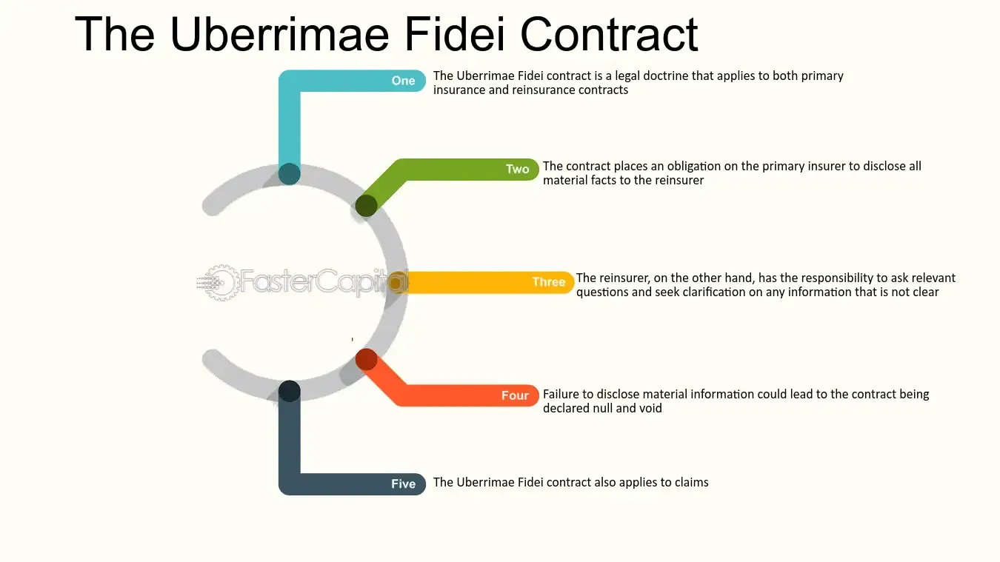

## Table of Contents

## What is an Uberrimae Fidei contract?

An Uberrimae Fidei contract is a type of agreement where both parties must be completely honest and share all important information with each other. This is also known as a contract of utmost good faith. These contracts are often used in insurance, where the person buying insurance must tell the insurance company everything that could affect their decision to provide coverage.

If someone doesn't tell the truth or leaves out important information in an Uberrimae Fidei contract, the contract can be canceled. This is because trust is very important in these agreements. For example, if you're getting car insurance and you don't mention that you've had several accidents before, the insurance company might cancel your policy if they find out later.

## What are the origins of the term 'Uberrimae Fidei'?

The term 'Uberrimae Fidei' comes from Latin, meaning 'utmost good faith.' It was first used in the world of insurance and maritime law. Back in the old days, when people were trading goods across the sea, they needed insurance to protect their ships and cargo. Because the insurance companies couldn't check everything themselves, they had to trust the ship owners to tell the truth about their ships and the risks involved.

Over time, this idea of complete honesty became really important in insurance contracts. If someone didn't tell the truth, the insurance company could refuse to pay out if something went wrong. This principle spread to other types of contracts where trust is super important. Today, 'Uberrimae Fidei' is still used to remind people that they need to be totally honest when making certain kinds of agreements.

## In which types of contracts is the principle of Uberrimae Fidei most commonly applied?

The principle of Uberrimae Fidei, or utmost good faith, is most commonly applied in insurance contracts. When you buy insurance, you need to tell the insurance company everything that could affect their decision to cover you. For example, if you're getting health insurance, you should tell them about any health problems you have. If you don't, and they find out later, they might cancel your policy.

Another area where Uberrimae Fidei is important is in maritime contracts. These are agreements related to ships and the sea. When someone wants to insure a ship or its cargo, they must be completely honest about the ship's condition and the risks involved. This is because the insurance company can't check everything themselves, so they rely on the ship owner to tell the truth.

Uberrimae Fidei can also be found in some other types of contracts where trust is crucial. For instance, in contracts between partners in a business, both sides need to be open and honest about everything that could affect the business. If one partner hides important information, it can harm the business and the other partner.

## Why is utmost good faith important in Uberrimae Fidei contracts?

Utmost good faith is super important in Uberrimae Fidei contracts because these agreements rely on trust. In these contracts, like insurance or maritime deals, one side can't check everything themselves. They have to trust the other side to tell the truth about important stuff. For example, if you're getting car insurance, the insurance company can't know everything about your driving history or the condition of your car. They have to trust you to tell them everything that could affect their decision to insure you.

If someone doesn't tell the truth or leaves out important information in an Uberrimae Fidei contract, it can cause big problems. The contract might be canceled, and the person who wasn't honest could lose out on the benefits they were expecting. For instance, if you don't tell your health insurance company about a past illness and they find out later, they might cancel your policy. This is why being completely honest is so important in these types of contracts.

## What are the consequences of breaching an Uberrimae Fidei contract?

If you break an Uberrimae Fidei contract by not telling the truth or hiding important information, the other side can cancel the contract. This means you could lose the benefits you were supposed to get from the contract. For example, if you don't tell your insurance company about a past accident and they find out later, they might cancel your insurance policy. This can leave you without the protection you need and might make it harder to get insurance in the future.

Breaking an Uberrimae Fidei contract can also lead to legal problems. The other side might take you to court to get money back or to make you pay for any harm caused by your dishonesty. For instance, if a ship owner lies about the condition of their ship to get insurance, and the ship sinks, the insurance company might sue the owner for the money they paid out. This can be expensive and stressful, so it's really important to be honest in these types of contracts.

## Can you provide examples of Uberrimae Fidei contracts?

One example of an Uberrimae Fidei contract is a life insurance policy. When you apply for life insurance, you need to tell the insurance company everything about your health, like any illnesses or risky habits you have. If you don't tell them the truth and they find out later, they might cancel your policy. This means your family won't get the money if something happens to you. Being honest is really important because the insurance company can't check everything about your health themselves.

Another example is a marine insurance contract. When someone wants to insure a ship or the goods on it, they have to be completely honest about the ship's condition and the risks involved. If the ship owner hides something important, like the ship needing repairs, and the ship sinks, the insurance company might not pay out. They could also cancel the insurance and might even take the ship owner to court to get their money back. This shows why telling the truth is so important in these types of contracts.

## How does the duty of disclosure differ in Uberrimae Fidei contracts compared to other contracts?

In Uberrimae Fidei contracts, the duty of disclosure is much stricter than in other types of contracts. This means that you have to tell the other side everything that could affect the contract, even if they don't ask you about it. For example, if you're getting life insurance, you need to tell the insurance company about any health problems you have, even if they don't specifically ask about those problems. This is because these contracts rely on trust and honesty more than other contracts.

In other contracts, the duty of disclosure is usually less strict. You only need to tell the other side about things they ask you about or things that are really important to the contract. For example, if you're selling a car, you might only need to tell the buyer about major problems with the car if they ask you about it. If you don't tell them about a small scratch, it might not be a big deal. But in Uberrimae Fidei contracts, even small details can be important, and you have to share everything.

## What legal remedies are available if an Uberrimae Fidei contract is breached?

If someone breaks an Uberrimae Fidei contract by not telling the truth or hiding important information, the other side can cancel the contract. This means the person who broke the contract could lose the benefits they were supposed to get. For example, if you don't tell your insurance company about a past accident and they find out later, they might cancel your policy. This can leave you without the protection you need and might make it harder to get insurance in the future.

Breaking an Uberrimae Fidei contract can also lead to legal problems. The other side might take you to court to get their money back or to make you pay for any harm caused by your dishonesty. For instance, if a ship owner lies about the condition of their ship to get insurance, and the ship sinks, the insurance company might sue the owner for the money they paid out. This can be expensive and stressful, so it's really important to be honest in these types of contracts.

## How do courts determine if there has been a breach of Uberrimae Fidei?

Courts look at whether someone didn't tell the truth or left out important information when deciding if there's been a breach of an Uberrimae Fidei contract. They check if the person knew about the information and if it was important enough to affect the other side's decision to agree to the contract. For example, if someone getting life insurance doesn't mention a serious illness, the court would see if the person knew about the illness and if it was something the insurance company would want to know.

If the court finds that there was a breach, they consider how serious it was and what effect it had on the contract. They might look at whether the other side would have agreed to the contract if they knew the truth. If the information was really important and the other side wouldn't have agreed to the contract, the court might let them cancel it. This helps make sure that people are honest and fair in these types of agreements.

## What are the differences in the application of Uberrimae Fidei in different jurisdictions?

The way Uberrimae Fidei is used can be different in different countries. In some places, like the United Kingdom, the principle is really important in insurance contracts. The law says that people getting insurance have to tell the insurance company everything that could affect their decision to give insurance. If they don't, the insurance company can cancel the policy. In other countries, like the United States, the rules might be a bit different. Some states have laws that say insurance companies have to ask specific questions, and people only need to answer those questions honestly.

In some countries, Uberrimae Fidei is also used in other types of contracts, like maritime contracts. For example, in Australia, the principle is important for both insurance and maritime agreements. If someone hides important information about a ship, the insurance company can refuse to pay if something goes wrong. But in other places, like Canada, the focus might be more on insurance contracts, and the rules for other types of contracts might not be as strict. So, it's important to know the specific laws in your country when dealing with Uberrimae Fidei contracts.

## How has the concept of Uberrimae Fidei evolved in modern law?

The concept of Uberrimae Fidei, or utmost good faith, has changed a bit over time in modern law. In the past, it was really strict, especially in insurance contracts. People had to tell the insurance company everything, even if they weren't asked about it. But now, some places have made the rules a bit easier. For example, in the UK, a new law called the Insurance Act 2015 says that people only need to tell the insurance company things that a reasonable person would think are important. This makes it a bit fairer and easier for people to understand what they need to share.

Even though the rules have changed in some places, the main idea of Uberrimae Fidei is still the same. It's all about being honest and sharing important information. This is still really important in insurance and some other types of contracts, like maritime agreements. Courts still look at whether someone was honest and if they shared everything they should have. If someone doesn't tell the truth, they could lose their contract and might even have to go to court. So, even though the details might be different in different places, the big idea of being honest and fair is still at the heart of Uberrimae Fidei.

## What are the current debates or criticisms surrounding Uberrimae Fidei contracts?

One big debate about Uberrimae Fidei contracts is whether they're fair to everyone. Some people think that these contracts put too much pressure on the person getting insurance or making the deal. They have to tell everything, even small details, and if they miss something, they could lose their insurance. This can be hard for people who don't know all the rules or who might forget to mention something. Critics say that insurance companies have more power and can cancel policies easily, which might not be fair to the person who needs the insurance.

Another criticism is that the rules for Uberrimae Fidei can be different in different places. This can make it confusing for people who live in one country but buy insurance from another. Some people think that there should be more clear and simple rules that everyone can understand. They want laws to be the same everywhere so that people know what they need to do. This way, everyone can be treated fairly, no matter where they live or where they get their insurance.

## References & Further Reading

[1]: Carter v Boehm (1766), 3 Burr 1905

[2]: Jay, Harris (2014). ["Insurance Law in a Nutshell."](https://www.amazon.com/Insurance-Nutshell-Nutshells-Christopher-French/dp/1636595049) West Academic Publishing.

[3]: Pompian, Michael M. (2012). ["Behavioral Finance and Wealth Management: How to Build Optimal Portfolios That Account for Investor Biases."](https://onlinelibrary.wiley.com/doi/book/10.1002/9781119202400) Wiley.

[4]: Lopez de Prado, Marcos (2018). ["Advances in Financial Machine Learning."](https://www.amazon.com/Advances-Financial-Machine-Learning-Marcos/dp/1119482089) Wiley.

[5]: FCA Guidelines on Algorithmic Trading. [Financial Conduct Authority](https://www.fca.org.uk/publications/multi-firm-reviews/algorithmic-trading-compliance-wholesale-markets). 

[6]: Broyles, JD (2010). ["Understanding The Concept Of Utmost Good Faith, Or Uberrima Fides – Marine Insurance."](https://lawbhoomi.com/principle-of-uberrima-fides-a-legal-doctrine-of-utmost-good-faith-in-insurance-contracts/)

[7]: Woodward, WD (1989). "Rule of Insurance Law and the Principle of Utmost Good Faith." *The Modern Law Review*, 52(4), 537-558.