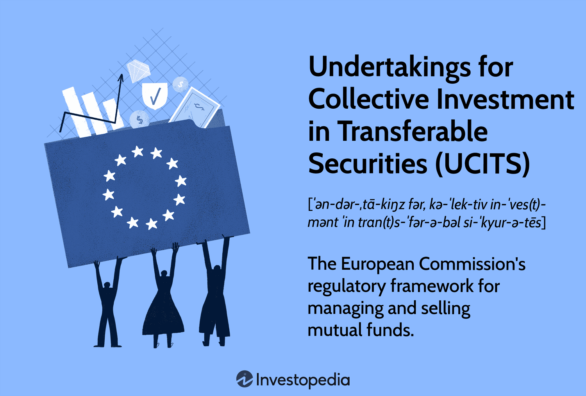

## Table of Contents

## What is UCITS and what does it stand for?

UCITS stands for Undertakings for Collective Investment in Transferable Securities. It is a regulatory framework used in the European Union for investment funds. The main goal of UCITS is to make sure that investment funds are safe and easy to understand for people who want to invest their money.

UCITS funds have strict rules that they must follow. These rules are about how the funds can invest, how they should be managed, and how they need to report information to investors. Because of these rules, UCITS funds are seen as a safe choice for people looking to invest in Europe.

## What is the purpose of UCITS?

The purpose of UCITS is to make sure that investment funds in Europe are safe and easy for people to understand. UCITS stands for Undertakings for Collective Investment in Transferable Securities. It's a set of rules that helps protect people who want to invest their money by making sure the funds follow strict guidelines.

These guidelines cover how the funds can invest their money, how they should be managed, and what information they need to share with investors. By following these rules, UCITS funds are considered a safe choice for people looking to invest in Europe. This helps more people feel confident about putting their money into these funds.

## Who can invest in UCITS funds?

Anyone can invest in UCITS funds. These funds are made for people who want to put their money into something safe and easy to understand. You don't need to be rich or a professional investor to buy into a UCITS fund. They are open to everyone, no matter where you live, as long as you can buy them through a bank or an investment platform.

UCITS funds are popular in Europe because they follow strict rules that protect investors. These rules make sure the funds are managed well and that they tell investors everything they need to know. So, whether you're saving for the future, planning for retirement, or just want to grow your money, UCITS funds can be a good choice for you.

## What types of assets can UCITS funds invest in?

UCITS funds can invest in a lot of different things. They can put money into stocks, which are pieces of companies, and bonds, which are like loans to companies or governments. They can also invest in money market instruments, which are short-term loans, and in other funds that follow the UCITS rules. This means they can spread their money around in many different ways to try and make the best return for investors.

Besides these, UCITS funds can also invest in things like bank deposits and financial derivatives. Derivatives are special kinds of investments that get their value from something else, like the price of a stock or a commodity. But there are strict rules about how much they can invest in these things. The main goal is to keep the investments safe and easy to understand for everyone who puts their money into the fund.

## How are UCITS funds regulated and by whom?

UCITS funds are regulated by the European Union. The rules for UCITS come from a set of laws called the UCITS Directive. This directive makes sure that all UCITS funds follow the same strict rules no matter where they are in Europe. The goal is to protect people who invest their money by making sure the funds are managed well and that they tell investors everything they need to know.

Each country in the European Union has its own group that watches over UCITS funds. These groups make sure the funds follow the rules set by the UCITS Directive. For example, in France, it's the Autorité des Marchés Financiers (AMF), and in Germany, it's the Bundesanstalt für Finanzdienstleistungsaufsicht (BaFin). These groups check that the funds are doing what they're supposed to do and that they're keeping investors safe.

## What are the key differences between UCITS and non-UCITS funds?

UCITS funds and non-UCITS funds are different in how they are regulated and what they can invest in. UCITS funds follow strict rules set by the European Union. These rules are meant to keep the funds safe and easy to understand for people who want to invest their money. UCITS funds can invest in things like stocks, bonds, and money market instruments, but there are limits on how much they can put into riskier investments like derivatives. This makes UCITS funds a safer choice for many people.

Non-UCITS funds, on the other hand, don't have to follow these strict rules. This means they can invest in a wider range of things, including more risky investments. Because they aren't as tightly regulated, non-UCITS funds might be able to offer higher returns, but they also come with more risk. People who invest in non-UCITS funds need to be okay with taking on more risk and should understand that these funds might not be as safe as UCITS funds.

## What are the benefits of investing in UCITS funds?

One big benefit of investing in UCITS funds is that they are safe and easy to understand. UCITS funds follow strict rules set by the European Union, which means they have to be managed well and tell investors everything they need to know. This makes them a good choice for people who want to invest their money without taking on too much risk. Because UCITS funds are so well-regulated, they are seen as a safe place to put your money, which can give you peace of mind.

Another benefit is that UCITS funds can be bought by anyone, no matter where they live. As long as you can buy them through a bank or an investment platform, you can invest in them. This makes it easy for people all over the world to put their money into these funds. Plus, UCITS funds can invest in a lot of different things, like stocks, bonds, and money market instruments, which means they can spread out their investments and try to make the best return for you.

## How does the UCITS framework ensure investor protection?

The UCITS framework ensures investor protection by setting strict rules that all UCITS funds must follow. These rules cover how the funds can invest their money, how they should be managed, and what information they need to share with investors. By having these rules, the framework makes sure that the funds are safe and easy to understand. This helps people feel more confident about putting their money into UCITS funds because they know the funds are being watched closely.

Each country in the European Union has its own group that checks to make sure UCITS funds are following the rules. These groups look at how the funds are doing and make sure they are keeping investors safe. If a fund isn't following the rules, these groups can step in and take action. This means that investors have an extra layer of protection because there are people always watching out for them.

## What are the specific risk management requirements for UCITS funds?

UCITS funds have to follow strict rules to manage risk and keep investors safe. One big rule is that they can't put too much money into one thing. This is called diversification. By spreading their money around, UCITS funds can lower the chance that something bad happens to one investment and hurts the whole fund. They also have to keep an eye on how much risk they are taking. This means they need to check their investments all the time and make sure they are not taking on too much risk.

Another important rule is that UCITS funds have to use something called a risk management process. This process helps them figure out what could go wrong and how to stop it from happening. They have to write down this process and show it to the people who watch over them. This way, everyone knows that the fund is doing its best to manage risk. By following these rules, UCITS funds can make sure they are doing everything they can to protect the money that people invest.

## How do UCITS funds handle liquidity and redemption?

UCITS funds have rules to make sure they can handle liquidity and redemption well. Liquidity means how easily the fund can turn its investments into cash. Redemption is when investors want to take their money out of the fund. UCITS funds have to keep enough cash or easy-to-sell investments so they can give money back to investors when they want it. This helps make sure that people can get their money out without waiting too long.

To manage redemption, UCITS funds have to follow rules about how quickly they can give money back to investors. Usually, they have to pay out within a certain number of days after someone asks to redeem their shares. This time can be different depending on the fund, but it's usually not too long. By having these rules, UCITS funds make sure that investors can get their money back when they need it, which helps keep everyone happy and the fund running smoothly.

## What are the cross-border distribution advantages of UCITS?

One big advantage of UCITS funds is that they can be sold in many different countries in Europe without a lot of extra work. This is because all UCITS funds follow the same rules set by the European Union. So, if a fund is approved in one country, it can be sold in other countries too. This makes it easier for people all over Europe to invest in these funds, no matter where they live.

Another benefit is that UCITS funds are seen as safe and easy to understand. Because they follow strict rules, people in different countries trust them more. This trust helps UCITS funds reach more investors and grow bigger. It also means that fund managers can focus on making the best investments instead of worrying about different rules in each country.

## What recent changes or updates have been made to the UCITS directive?

The UCITS directive has seen some updates to keep up with changes in the financial world. One big change was the UCITS V directive, which came into effect in 2016. This update focused on making sure that the people who manage the funds and the people who keep the money safe are doing their jobs well. It also made the rules about how much managers can be paid clearer, to make sure they are not taking too much risk just to earn more money.

Another important update was the UCITS VI directive, which was proposed in 2021 but is still being worked on. This update aims to make the rules about how funds can use derivatives even stricter. It also wants to make sure that funds are more open about what they are investing in and how they are doing. These changes are meant to keep UCITS funds safe and easy to understand for everyone who wants to invest their money.

## References & Further Reading

[1]: Niamh Moloney (2010). ["EU Securities and Financial Markets Regulation."](https://books.google.com/books/about/EU_Securities_and_Financial_Markets_Regu.html?id=iS4DBQAAQBAJ) Oxford University Press.

[2]: Cesar Molinas and Mauro Petriccione (1995). ["Open Markets Matter: The Benefits of Trade and Investment Liberalisation."](https://archive.org/details/openmarketsmatte00orga) OECD. 

[3]: Karel Lannoo and Dylan Hanley (2009). ["The UCITS Market—Up or Down? An Assessment."](https://www.semanticscholar.org/paper/New-market-conduct-rules-for-financial-Will-bring-Lannoo/339242f892eb962ddf23146ff8952b0cdd2ac294) Centre for European Policy Studies.

[4]: European Commission (2020). ["UCITS—Undertakings for Collective Investment in Transferable Securities."](https://finance.ec.europa.eu/regulation-and-supervision/financial-services-legislation/implementing-and-delegated-acts/undertakings-collective-investment-transferable-securities-directive_en)

[5]: Marcos Lopez de Prado (2018). ["Advances in Financial Machine Learning."](https://www.amazon.com/Advances-Financial-Machine-Learning-Marcos/dp/1119482089) Wiley.

[6]: David Ardia, Keven Bluteau, Leo Taamouti, and Marc S.P. Zhu (2018). ["Regime Changes in Liquidity: The Role of Market Makers in a Firm-Specific Context."](https://www.semanticscholar.org/paper/Climate-Change-Concerns-and-the-Performance-of-vs.-Ardia-Bluteau/cf5708c7987c1b38bc7c5053b9d6094dec57834a) Journal of Finance.

[7]: Laima Dzigiene and Rima Tamosiuniene (2020). ["The European UCITS Market With a Focus on Algorithmic Trading."](https://www.researchgate.net/profile/Rima-Tamosiuniene-3) Mathematics (MDPI).